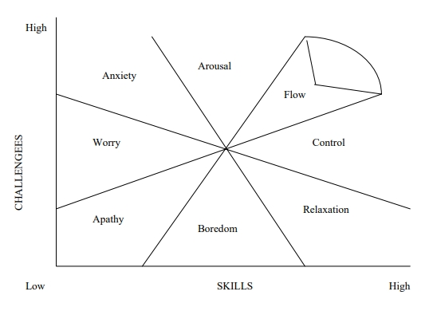

# CHAPTER THREE: Review of Literature

# 第三章：文献综述

> One of the most persistent but elusive ways that people make sense of themselves is to show themselves to themselves through multiple forms: by telling themselves stories; by dramatizing claims in rituals and other collective enactments; by rendering visible actual and desired truths about themselves and the significance of their existence in imaginative and performative productions.
Myerhoff (1986, p.261).
> 

> 人们认识自我的最持久但最难以捉摸的方式之一，就是通过多种形式向自己展示自我：向自己讲述故事；在仪式和其他集体活动中戏剧化地表达诉求；在想象和表演作品中彰显关于自身及其存在意义的实际和期望的真相。
迈尔霍夫（1986 年，第 261 页）。
> 

> Each story spun into other stories, binding us together so that process became community, however brief the time.
Anne Daveson (2001, p.38).
> 

> 每一个故事都会衍生出其他故事，将我们联系在一起，使过程成为社群，无论时间多么短暂。
安妮 达夫森（2001 年，第 38 页）。
> 

Myerhoff evokes the possibilities of ritual performances. Daveson's idea of an ephemeral experience of community is organic to a story-based form like Playback Theatre. As I depict in Chapter Two, Playback Theatre is a hybridised performance ritual that blends personal story and improvised theatre. In this chapter I draw from the literature on performance theory. I look particularly at the way in which liminal activities support experiences of flow for individuals in those performance arenas in which they are expected to participate. I explore the way in which flow is contingent on participants feeling confident with their capacity to join in and equate this to the way in which anxiety can inhibit spontaneity in participants. I consider how the ritual elements of performance can induce communitas. Communitas is presented as an experience of community that is evoked when individuals encounter simultaneous experiences of flow during liminal activities.

迈尔霍夫唤起了仪式表演的可能性。达夫森关于短暂的社群体验的想法与一人一故事剧场这种以故事为基础的形式有机地结合在一起。正如我在第二章中所描述的，一人一故事剧场是一种混合表演仪式，融合了个人故事和即兴戏剧。在本章中，我借鉴了有关表演理论的文献。我特别研究了边缘活动是如何支持个人在他们期望参与的表演舞台上获得心流体验的。我探讨了心流如何取决于参与者对其参与能力的信心，并将其等同于焦虑如何抑制参与者的自发性。我考虑了表演中的仪式元素如何形成"共同体"。共同体是指个人在边缘活动中同时遇到心流体验时所唤起的社群体验。

I discuss the contemporary place of stories with emphasis on the storytelling act and the process of stories being enacted. I present three levels of engagement for audience members who are spectating – as a witness to the storytelling, as a witness to the enactment, and in reflection. Audience response and audience engagement literature has been arranged to shed light on audience experiences in both traditional and nontraditional theatre contexts. The review then considers the place of personal story as a relevant and potent public discourse.

我讨论了故事在当代的地位，重点是讲故事的行为和故事被演绎的过程。我提出了观众参与的三个层次——作为故事讲述的见证者、故事演绎的见证者和故事反思的见证者。我对观众反应和观众参与的文献进行了整理，以揭示观众在传统和非传统戏剧环境中的体验。然后，本综述探讨了个人故事作为一种相关且有效的公共话语的地位。

Ritual performance as an experience of community is discussed through the concepts of communitas; belonging and estrangement; collective experience; and diversity. In this review I argue that the centrality of personal story and the animation of stories through theatrical enactments in the Playback Theatre performance render it an arena for experiences of community. Thus, this literature provides a frame for positioning the Playback Theatre performances that I investigate in this study.

本文通过"共同体"、"归属与疏远"、"集体体验"和"多样性"等概念，讨论了作为社群体验的仪式表演。在这篇综述中，我认为，个人故事的中心地位以及通过戏剧表演将故事生动化，使一人一故事剧场表演成为社群体验的舞台。因此，这些文献为我在本研究中调查的一人一故事剧场表演提供了定位框架。

## 3.1 Performance Theory

## 3.1 演出理论

"It is hard to define 'performance' because the boundaries separating it on the one side from the theatre and on the other side from everyday life are arbitrary" (Schechner, 1988, p.85, Huxley & Witts, 2002). Carlson (1996) proposes that performance has become indefinable due to its "extremely popular" use in a "wide range of activities in the arts, in literature and in the social sciences" (p.1). The, now considerable, body of literature articulating theories of performance is informed by a wide range of disciplines (Carlson, 1996). In this section I begin by presenting some of these positions.

"很难定义'表演'，因为它与剧院和日常生活之间的界限是任意划分的"（Schechner, 1988, p.85, Huxley & Witts, 2002）。卡尔森（1996 年）认为，由于表演在"艺术、文学和社会科学的广泛活动"中的使用"极为普遍"，表演已变得难以界定（第 1 页）。现在，阐述表演理论的大量文献来自广泛的学科（Carlson，1996 年）。在本节中，我将首先介绍其中的一些立场。

Anthropologists have tended to view culture and ritual as performance. Particular emphasis has been given to documenting the performative aspects of cultures and societies, e.g. initiations, tribal celebrations, seasonal festivals (Turner, 1974, 1986, Schechner, 1985, 1988). Sociologists claim that there is theatre in everyday life (see for example, Read, 1993). Goffman (1959) positions social behaviour as performance, theorising that we all perform as part of everyday life. He posits that performance refers to "all the activity of an individual which occurs during a period marked by his continuous presence before a set of observers and which has some influence on the observers" (p.22). In socio-linguistics, language itself has been considered in terms of 'performance' with the performative act being defined as communicative (in a given cultural context). This elaboration similarly situates the potency of the performance in the relationship between the speakers (performers) and listeners (audience) (Hymes, 1975, Kunst, 1986). In the discipline of theatre studies, performance is predominantly conceptualised as art. In a bid to address the differences between traditional theatre and the emerging field of performance, the agency of the performer is named as central. Carlson (1996) suggests that "performance art places the (usually solo) performer's personal contribution in the foreground" (p.54). Therefore, performance potency hinges on the spectacular feats of the performer.

人类学家倾向于将文化和仪式视为表演。人类学家尤其重视记录文化和社会的表演方面，例如社会学家认为，日常生活中就有戏剧（例如，Read, 1993）。社会学家认为，日常生活中存在戏剧（例如，Read，1993 年）。戈夫曼（Goffman，1959 年）将社会行为定位为表演，认为我们都在日常生活中进行表演。他认为，表演指的是"一个人的所有活动，这些活动发生在他持续出现在一组观察者面前并对观察者产生某种影响的时期"（第 22 页）。在社会语言学中，语言本身被视为"表演"，表演行为被定义为（在特定文化背景下的）交际行为。这种阐述同样将表演的效力置于说话者（表演者）和听众（观众）之间的关系中（Hymes, 1975, Kunst, 1986）。在戏剧研究学科中，表演主要被视为艺术。为了解决传统戏剧与新兴表演领域之间的差异，表演者的能动性被视为核心。卡尔森（1996 年）认为，"表演艺术将表演者（通常是单独表演者）的个人贡献放在首位"（第 54 页）。因此，表演的效力取决于表演者的精彩表演。

It is useful to contemplate that performance can be conceptualised in terms of its intention and its origins. Performance can be socio-political (Huxley & Witts, 2002, Holderness, 1992), emancipatory (Boal, 1979) or liberatory (Brook, 1989), poor (Grotowski, 1975), devised (Oddey, 1994) and liminal (Broadhurst, 1999). Political or socio-political performance ranges from works that position the performing body as resistant (Martin, 1990) to works that challenge the dominant paradigm, like the feminist performance works of Merce Cunningham and Pina Bausch (Carlson, 1996, Huxley & Witts, 2002); to performances in which the internal structure of the genre challenges our accepted socio-cultural and political beliefs and systems (Broadhurst, 1999). Emancipatory and liberatory performance can also be socio-political, yet have as a primary purpose a specific intention regarding 'empowering' and 'liberating' audiences, respectively. The "poor" in the performance genre of Grotowski refers to the resources required to create and perform the work, while devised performances may incorporate all the intentions and constraints that have been described so far. Broadhurst (1999) claims that "liminal performance" is a genre in which hybridization is the "quintessential feature" (p.69). The eclectic potential of the Playback Theatre method means that it can draw on any and all of these descriptive labels. The centrality of personal story immediately politicizes the form, as does the participatory process, introducing the possibility of social, cultural and political resistance. Little or no props are used (poor) and coupled with the simple, accessible internal structure it offers a potentially empowering and liberating theatre experience where liminal activity is fostered.

我们不妨思考一下，表演可以从其意图和起源的角度进行概念化。表演可以是社会政治性的（Huxley & Witts, 2002, Holderness, 1992）、解放性的（Boal, 1979）或自由的（Brook, 1989）、贫乏的（Grotowski, 1975）、设计性的（Oddey, 1994）和边缘的（Broadhurst, 1999）。政治或社会政治表演包括将表演身体定位为反抗者的作品（Martin, 1990）、挑战主流范式的作品（如 Merce Cunningham 和 Pina Bausch 的女权主义表演作品）（Carlson, 1996, Huxley & Witts, 2002），以及流派内部结构挑战我们公认的社会文化和政治信仰及体系的表演（Broadhurst, 1999）。解放性和自由性的表演也可以是社会政治性的，但其主要目的是"赋予权力 "和"解放"观众。格罗托夫斯基（Grotowski）表演流派中的"贫乏"指的是创作和表演作品所需的资源，而设计表演则可能包含上述所有意图和限制。布罗德赫斯特（Broadhurst，1999 年）称，"边缘表演"是一种以混合为"典型特征"的表演流派（第 69 页）。一人一故事剧场方法博采众长的潜力意味着它可以借鉴所有这些描述性标签。个人故事的中心地位立即使这种形式政治化，参与过程也是如此，引入了社会、文化和政治反抗的可能性。它很少使用或根本不使用道具（贫乏），再加上简单易懂的内部结构，它提供了一种潜在的赋权和解放性戏剧体验，促进了边缘活动。

Over the years Schechner (1993, 1988, 1985) has proposed a number of models from which to speak about performance from his seminal position in the contemporary field of performance theory. Regardless of the way in which performance is defined, Mock (2000) argues that it is important that the definition states whether the performance is "live" or not.

多年来，Schechner（1993 年、1988 年、1985 年）从其在当代表演理论领域的开创性地位出发，提出了许多关于表演的模式。无论以何种方式定义表演，Mock（2000 年）认为，重要的是定义中要说明表演是否"现场"的。

She claims that intrinsic to a conception of performance is its essential "ephemeral 'presentness' … its 'liveness'" (Mock, 2000, p.2). She writes that a *live* performance is "one which is still happening and still has to happen [and that] includes the potential for change in its every moment of delivery through the dialectical processes which *need* to be experienced" (Mock, 2000, p.3). She is critical of Schechner's multiple attempts at defining performance claiming that "theories of performance that embed ideology into their construction leave themselves open to criticism of being irrational" (p.4). She argues that claims about live performance as "ideologically resistant" are irrelevant and that "it is more useful to suggest that the ontology of live performance somehow provides the *potential for* ideological resistance" (Mock, 2000, p.4, Huxley & Witts, 2002).

她主张，表演概念的内在本质是其"短暂的'在场性'……其'生命力'"（Mock, 2000, p.2）。她写道，*活*的表演是"一种仍在发生、仍需发生的表演，[而且]包括通过*需要*体验的辩证过程，在表演的每一个瞬间都有可能发生变化"（Mock, 2000, p.3）。她对 Schechner 为表演下定义的多种尝试持批评态度，声称"将意识形态嵌入表演理论的构建过程中，会让人批评其不合理"（第 4 页）。她认为，关于现场表演具有"意识形态上的反抗性"的说法无关紧要，"更有用的说法是，现场表演的本体论在某种程度上提供了意识形态上的反抗性*潜力*"（Mock, 2000, p.4, Huxley & Witts, 2002）。

In his critical review of performance theory, Carlson (1996) reports that the performance process "can work within a society … to undermine tradition, to provide a site for exploration of fresh and alternative structures and patterns of behaviour" (p.15). This echoes the claims made about ritual that are discussed in the next section. Turner (1986) positions performance as transformative for performers and spectators. In his work on ritual performance, he asserts that ritualised or symbolic dramatisation of important events in a culture are transformative for the audience (Turner, 1986). Performance is reflective – enabling us to show ourselves to ourselves, and reflexive – "arousing consciousness of ourselves as we see ourselves" (in Guss, 2001, p.158). Schechner (1988) is critical of Turner's conception of performance. He claims that it tends to locate 'the essential drama in conflict and conflict resolution' (p.170).

卡尔森（1996 年）在其对表演理论的批判性评论中指出，表演过程"可以在社会中……破坏传统，为探索新的和替代性的结构和行为模式提供场所"（第 15 页）。这与下一节讨论的有关仪式的说法不谋而合。特纳（Turner，1986 年）认为表演对表演者和观众都具有变革作用。他在关于仪式表演的著作中断言，文化中重要事件的仪式化或象征性戏剧化对观众而言具有变革作用（Turner，1986 年）。表演是反思性的——让我们向自己展示自己，同时也是本能的——"唤起我们看到自己时的自我意识"（Guss, 2001, p.158）。Schechner (1988) 对特纳的表演概念持批评态度。他认为，特纳的概念倾向于将"戏剧的本质定位于冲突和冲突的解决"（第 170 页）。

Schechner differentiates this idea from his own conception of performance as transformative.

Schechner 将这一观点与他自己将表演视为变革的概念区别开来。

He writes:

他写道：

> I locate it (performance) in *transformation* − in how people use theatre as a way to experiment with, act out, and ratify change. Transformation in theatre occurs in three different places; and at three different levels:
1) in the drama − that is, in the story;
2) in the performers − whose special task it is to undergo a temporary rearrangement of their body/mind;
3) in the audience − where changes may either be temporary (entertainment) or permanent (ritual) (italics in original, p.170).
> 

> 我将戏剧（表演）定位为"转变"——人们如何利用戏剧来尝试、演绎和认可变革。戏剧中的变革发生在三个不同的地方和三个不同的层面：
1) 在戏剧中 - 即在故事中；
2) 在表演者中 - 他们的特殊任务是暂时重整自己的身体/心灵；
3) 在观众中 - 变化可能是暂时的（娱乐），也可能是永久的（仪式）（斜体为原文所加，第 170 页）。
> 

Brook (1989) similarly claims the drama as a site of transformation. He suggests it is the unique capacity of theatre to replace a single point of view with many different views. Schechner points to the possibilities of active audience engagement during performance beyond what Carlson claims is "a passive hermeneutic process of decoding" body, gesture, sound. Thus, audiences are 

布鲁克（Brook，1989 年）同样认为戏剧是转变的场所。他认为，戏剧具有以多种不同观点取代单一观点的独特能力。Schechner 指出了观众在表演过程中积极参与的可能性，而不是 Carlson 所称的"被动解读"身体、姿势和声音的过程。因此，观众

> [M]uch more active, entering into a praxis, a context in which meanings are not so much communicated as created, questioned, or negotiated. The "audience" is invited and expected to operate as a co-creator of whatever meanings and experiences the event generates (Carlson, 1996, p.197).
> 

> 更加积极主动，进入一种实践，一种意义与其说是交流，不如说是创造、质疑或协商的环境。"观众"被邀请并被期望作为活动所产生的任何意义和体验的共同创造者（Carlson, 1996, p.197）。
> 

He suggests that this shift from a passive to active audience position coincides with a shift in focus from *pretence* to *presence* in performance. Such performances are resistant to sending "a message about something" (Kirby in Carlson, 1996, p.126) instead they aim to make audiences more conscious. Marranca (in Carlson, 1996) argues that the performative imperative involves heightening audience members awareness so that they were aware of "*being there* in the theatre … and [of] the immediacy of the relationship of the audience to the theatrical event" (p.127).

他认为，观众立场从被动到主动的转变与表演重点从"假装"到"临在"的转变不谋而合。这种表演不愿传递"关于某事的信息"（Kirby in Carlson, 1996, p.126），而是旨在让观众更加清醒。马兰卡（Marranca）（卡尔森著，1996 年）认为，表演的必要性在于提高观众的意识，使他们意识到"在剧场中的*在这里*……以及观众与戏剧事件之间关系的直接性"（第 127 页）。

McKenna (1999) writes of Playback Theatre as transformative; a "place of expanded consciousness … [where] shifts in awareness, artistic involvement, and social reconstruction are attended to" (p.177).

McKenna (1999) 认为一人一故事剧场具有变革性；是"一个扩大意识的地方……[在这里]意识的转变、艺术的参与和社会的重构都受到关注"（第 177 页）。

Brook (1989) claims that the efficacy of theatre is in its "linking of the private and public, the intimate and the crowded, the secret and the open, the vulgar and the magical" (p.40). He suggests that performance can present a site of blurred boundaries where collective experiences of intimate truth are possible, a site of thresholds and convergence. Mason (1992) states that the performance is a site where the

布鲁克（1989 年）声称，戏剧的功效在于它"将私人与公共、私密与人群、秘密与公开、庸俗与神奇联系在一起"（第 40 页）。他认为，表演可以提供一个界限模糊的场所，在这里可以获得亲密真实的集体体验，这是一个门槛和交汇的场所。梅森（1992 年）指出，表演是一个

> [B]orders between entertainment and art, between audience and performer and between the performance itself and the larger social event; have become less defined in recent decades (Mason, 1992, p.3).
> 

> 近几十年来，娱乐与艺术之间、观众与表演者之间以及表演本身与更大范围的社会事件之间的界限已变得越来越模糊（Mason, 1992, p.3）。
> 

Its situated-ness on the margins renders performance a site for dialogue where different voices, different worldviews, different value systems, and different beliefs are brought together.

它所处的边缘位置使表演成为一个对话场所，不同的声音、不同的世界观、不同的价值体系和不同的信仰在这里汇聚一堂。

Conquergood (in Carlson, 1996) claims that performance can be open-ended and resist conclusions while encouraging interrogation. The historical challenges to the moral and social control agendas of theatre and performance by artists has resulted in the development of specific forms that express and enact empowerment and solidarity (Boal, 1979, Holderness, 1992, Martin & Sauter, 1995), or that privilege experimentation and authenticity (Brook, 1968, 1989, Grotowski, 1975). These alternative forms of performance emerge as practitioners seek to return theatre to the people, and resurrect the primacy of it as an instrument of cultural celebration and social transformation. As suggested in the previous chapter, the genesis of Playback Theatre is a similar story. Experimentation in theatre, driven by the aspirations of the inventors, has increased the attention given to the junction between theatre and the social sciences (Carlson, 1996).

Conquergood (in Carlson, 1996) 声称，表演可以是开放式的，在鼓励质疑的同时，也可以抵制结论。历史上，艺术家们对戏剧和表演的道德和社会控制议程提出了挑战，并由此发展出了一些特定的表演形式，这些表演形式表达并实现了赋权和团结（Boal，1979 年；Holderness，1992 年；Martin & Sauter，1995 年），或赋予实验和真实性以特权（Brook，1968 年，1989 年；Grotowski，1975 年）。这些另类表演形式的出现，是由于实践者试图将戏剧还给人民，并使其作为文化庆典和社会变革工具的首要地位得以复活。正如前一章所述，一人一故事剧场的起源也是一个类似的故事。在发明者愿望的推动下，戏剧实验增加了对戏剧与社会科学交界处的关注（Carlson，1996 年）。

Fundamental to this study, is a conception of the performance act that emphasises process over structure, participation over competence, and the dialectics of socio-cultural processes over the logics of cultural and social systems (Turner, 1986, p.21). In effect, most useful to this study, is the conception of performance as a process that contains as a defining characteristic the interaction between the performer and the audience and where insight into human beings and human activity is attained (Carlson, 1996, Goffman, 1959, Hymes, 1975, Schechner, 1985, 1988). The inter-relatedness of performance, theatre and ritual is evident in much of the current writings on public events. The next section presents a critique of public events and suggests that the public performance is a form of ritual event.

对于本研究而言，表演行为的基本概念是强调过程而非结构，强调参与而非能力，强调社会文化过程的辩证法而非文化和社会系统的逻辑（Turner, 1986, p.21）。实际上，对本研究最有用的概念是将表演视为一种过程，其决定性特征是表演者与观众之间的互动，并在此过程中获得对人类和人类活动的洞察力（Carlson，1996 年；Goffman，1959 年；Hymes，1975 年；Schechner，1985 年，1988 年）。表演、戏剧和仪式之间的相互关联在当前许多关于公共活动的著作中都很明显。下一节将对公共活动进行批判，并提出公共表演是仪式活动的一种形式。

## 3.1.1 Public Events

## 3.1.1 公共活动

Public events can provide an avenue for communities to act on their own behalf. They are often one-off episodes where culture is celebrated. Manning (1983) suggests that events that celebrate culture both reverse and violate ordinary reality *and* replicate and uphold it.

公共活动可以为社群提供一个代表自己展现自己的渠道。它们通常是赞颂文化的一次性事件。曼宁（Manning，1983 年）认为，赞颂文化的活动既扭转和违反了普通现实，*又*复制和维护了普通现实。

Handelman (1977) conceives public events as an interaction between play and ritual. The public event embodies the paradox of the play message: let us make believe, and the ritual message: let us believe (Handelman, 1977). Schechner (in Ben Chaim, 1984) compares the belief inherent in the participants of ritual with the suspended belief that is required of the audience at the aesthetic drama event. Aesthetic drama "works to affect a transformation in [the] nonparticipating spectator's consciousness" (Ben Chaim, 1984, p.42). Turner (1990) suggests that the public event could act to ritualise time for participants, support liminal activity and evoke heightened experiences.

Handelman (1977) 认为公共活动是游戏与仪式之间的互动。公共活动具身体现了游戏信息（让我们虚构）和仪式信息（让我们相信）的悖论（Handelman, 1977）。Schechner (in Ben Chaim, 1984) 将仪式参与者固有的信念与美学戏剧活动中要求观众悬置的信念进行了比较。美学戏剧“致力于影响非参与观众的意识转变”（Ben Chaim，1984 年，第 42 页）。特纳（1990 年）认为，公共活动可以使参与者的时间仪式化，支持边缘活动，并唤起高度体验。

During public events, be they ritual, aesthetic drama or play focused, participants engage in dialogue about things they may not usually speak about. In this way there is a reclamation of personal and community power, a claiming of responsibility and the opportunity to present the self. The public event ruptures the borders that Mason (1992) writes about where aspects of old forms converge to make new forms. Ben Chaim (1984) reminds us that "ritual does not exist in a vacuum but requires a social fabric and a deeply held belief system to have effect" (p.42).

在公共活动中，无论是仪式、美学戏剧还是以游戏为重点的活动，参与者都会就他们通常不会谈论的事情展开对话。通过这种方式，个人和社群的力量得以恢复，责任得以承担，自我得以展现。公共活动打破了梅森（1992 年）笔下的边界，旧形式的各个方面汇聚在一起，形成了新的形式。Ben Chaim（1984 年）提醒我们，"仪式并非存在于真空中，而是需要社会结构和根深蒂固的信仰体系才能产生效果"（第 42 页）。

Handelman (1990) differentiates between three types of public events: events that model the lived-in world, events that present the lived-in world, and events that re-present the lived-in world. Handelman elaborates on this three-tier typology suggesting that events that model the lived-in world facilitate change in participants and have direct impact on their social world. Events that present the lived-in world are designed to use and show the obvious symbols and icons of the social world. They depict familiar versions of relevant social realities. Events that re-present the lived-in world promote critical consciousness through the presentations. Handelman claims that these events animate the social world in such a way that participants can compare and contrast the event in "relation to [the] social realities" (p.49).

Handelman (1990)将公共活动分为三类：模拟生活世界的活动、展示生活世界的活动和重新展示生活世界的活动。汉德尔曼对这三层类型进行了阐述，认为模拟生活世界的活动有助于参与者的改变，并对他们的社会世界产生直接影响。呈现生活世界的活动旨在使用和展示社会世界的明显符号和图标。它们描绘了相关社会现实的熟悉版本。重新展示生活世界的活动通过展示促进批判意识。Handelman 声称，这些活动使社会世界生动起来，参与者可以将活动"与社会现实相联系"（第 49 页）。

In his effort to develop theory about public events such as ritual performances, Handelman (1990) suggests that the public performance represents a conscious attempt at making meaningful connections by participants. Informed by his review of the definitions of public events by ethnographers, Handelman states that public events have social value. From such things as providing a reflection of collective understandings and principles of social structure to the possibility of recourse to address or redress social problems, public events meet social needs. This is similar to the way in which O'Toole (2000) speaks of theatre as a social art form in a social context and therefore giving social permission for various (often taboo or unsanctioned) behaviours. The ritual containment of the public event facilitates this 'loosening" of social protocols. Handelman (1990) is critical of many of the definitional accounts of public events because they do not acknowledge that every cultural event can only communicate "a version" of the social order (p.9). He contests claims that "all occasions are constitutive of social order" saying that some "are primarily 'expressive'" (p.10). Significantly, he asserts that "public events are phenomenally valid forms that mediate persons into collective abstractions, by inducing action, knowledge and experience through these selfsame forms" (Handelman, 1990, p.15). In the context of this study, Playback Theatre can be constructed as a public event that facilitates conscious attempts at meaningful connections for participants. The deliberate social purpose of the public Playback Theatre event is evident in Fox's (1999b) description of Playback Theatre as social interaction in a dialectic relationship with art and ritual. The theory of ritual is discussed in the next section.

Handelman（1990 年）努力发展有关仪式表演等公共活动的理论，他认为公共表演代表了参与者有意识地尝试建立有意义的联系。根据他对民族学者对公共活动定义的回顾，Handelman 认为公共活动具有社会价值。从反映社会结构的集体理解和原则，到解决或纠正社会问题的可能性，公共活动满足了社会需求。这与奥图尔（O'Toole，2000 年）所说的戏剧是社会背景下的一种社会艺术形式，因此为各种行为（通常是禁忌或未经许可的行为）提供了社会许可的方式类似。公共活动的仪式性约束促进了这种社会规范的"松动"。Handelman（1990 年）对许多关于公共活动定义的论述持批评态度，因为这些论述并不承认每个文化活动只能传达社会秩序的"一个版本"（第 9 页）。他对"所有场合都构成社会秩序"的说法提出质疑，认为有些场合"主要是'表达性的'"（第 10 页）。重要的是，他断言"公共活动是现象上有效的形式，通过这些形式诱发行动、知识和体验，将人融合到集体抽象之中"（Handelman, 1990, p.15）。在本研究中，"一人一故事剧场"可被视为一种公共活动，它有助于参与者有意识地尝试建立有意义的联系。福克斯（1999b）将一人一故事剧场描述为与艺术和仪式辩证关系中的社会互动，一人一故事剧场公共活动的深思熟虑的社会目的在此可见一斑。仪式理论将在下一节讨论。

## 3.2  Ritual Performance

## 3.2 仪式表演

The study of ritual has progressed adjacent to the study of theatre and performance in the past four decades. It is no surprise that the theories of ritual anthropologists (e.g., Victor Turner) appear in the writings about performance and experimental theatre. Nor is it surprising that the practice experiences of experimental theatre makers (e.g., Brook) are used to illustrate the theory of ritual. This interest in the overlap of ritual and performance has also been nourished by the post-colonial reclamation of indigenous cultural forms by local populations in developing countries (Chinyowa, 2002). I explore the intersection and overlap in ritual and performance in this section to provide concepts to write about the way in which Playback Theatre might straddle the performance/ritual threshold. At times, Playback Theatre appears to be all one, and at other times all the other, and at times in between or neither.

在过去的四十年里，仪式研究与戏剧和表演研究并驾齐驱。仪式人类学家（如维克多-特纳）的理论出现在有关表演和实验戏剧的著作中不足为奇。实验戏剧创作者（如布鲁克）的实践经验被用来说明仪式理论也不足为奇。后殖民时期发展中国家的当地人对本土文化形式的重新认识（Chinyowa, 2002）也滋养了人们对仪式与表演重叠的兴趣。我在本节中探讨仪式与表演的交叉和重叠，为一人一故事剧场跨越表演/仪式门槛提供概念。有时，一人一故事剧场看似完全是一者，有时又有完全是另一者，有时则介于两者之间或两者皆非。

Cabral (2001) argues that rituals take many forms but are premised on a collective experience that is mediated through a patterned, sequenced, theatrical process. Myerhoff (1990) states that ritual performance provides continuity and predictability and "must be reasonably convincing, rhetorically sound, and well-crafted" (p.246). She assets that while ritual events might desire to alter individual belief at the deepest level, this level of alteration is not required. Turner (1969, 1986, 1990) has been a key contributor in the exploration of ritual performance. Early on, he drew on van Gennep's conception of ritual as a process-based structure. Van Gennep's (in Turner, 1969) three-phase schema comprises a separation phase, a transition phase, and a re-entry phase. Carlson argues that fundamental to Turner's preference of van Gennep's three-phases over other frameworks to explain ritual is their derivation. Van Gennep developed the schema with the idea that performance occurs in the context of everyday life, in in-between spaces, rather than the idea implicit in the frameworks of Singer, Hymes, Bauman and Barba that performance is "set apart" (Carlson, 1996, p.20). "This image of performance as a border, or margin, a site of negotiation, has become extremely important in subsequent thinking about such activity" (Carlson, 1996, p.20). The first phase is the pre-liminal or separation phase. Guss (2001) reports this as the "period of separation of participants in time and space from their daily life sphere" (p.161). Participants shift to a more "sacred space and time from profane or secular space and time" (Turner, 1982, p.24). The shift opens a performance space that exists in-between rather than set-apart from ordinary life, a space on the "border, a margin, a site of negotiation" (Carlson, 1996, p.20). Within this, subjects encounter the second phase, the liminal or *transition* phase. Van Gennep referred to this as 'margin' or 'limen' (meaning threshold in Latin). Guss (2001) writes that this phase evokes "ambiguities of meaning which emerge on the margin between structures of the past and the future" (p.161). Turner (1982) claims that "the ritual subjects pass through … a sort of social limbo" in this phase (p.24). He suggests that this liminal space invokes "anti-structure" and facilitates an experience of communitas[14] (p.45). Exiting the liminal phase evokes the third phase, that which van Gennep called *incorporation.* This phase involves the incorporation of the liminal experience. The subject re-aggregates or re-integrates in society (Guss, 2001). They resume their everyday social roles carrying with them the new perspectives they may have from the experience. Guss suggests that this "performative sequencing can effect a transformation of consciousness" (p.161). Cabral (2001) asserts that transformation arises due to the way in which the ritual structure creates a bridge into "situations that would be tense in the real context" (p.56).

Cabral (2001) 认为，仪式有多种形式，但都以集体体验为前提，而集体体验又是通过模式化、有序化的戏剧过程来实现的。Myerhoff（1990 年）指出，仪式表演具有连续性和可预测性，"必须具有合理的说服力、修辞上的合理性和精心的制作"（第 246 页）。她认为，虽然仪式活动可能希望在最深层次上改变个人信仰，但这种改变并不是必须的。特纳（Turner，1969 年、1986 年、1990 年）在仪式表演的探索方面做出了重要贡献。早期，他借鉴了范-根尼普（van Gennep）关于仪式是一种基于过程的结构的概念。范-根尼普（特纳，1969 年）的三阶段模式包括分离阶段、过渡阶段和再进入阶段。卡尔森认为，与其他解释仪式的框架相比，特纳更倾向于使用范-根尼普的三阶段图式，其根本原因在于三阶段图式的衍生。范-根尼普提出这一模式的理念是，表演发生在日常生活的背景中，发生在夹缝空间中，而不是辛格、海姆斯、鲍曼和巴尔巴等人的框架中所隐含的理念，即表演是"分开的"（卡尔森，1996 年，第 20 页）。"表演是边界或边缘，是交织的场所，这一形象在后来关于表演活动的思考中变得极为重要"（Carlson, 1996, p.20）。第一阶段是前边缘或分离阶段。古斯（Guss，2001 年）认为这是"参与者在时间和空间上与日常生活领域分离的时期"（第 161 页）。参与者从 "凡俗或世俗的空间和时间"转移到一个更加"神圣的空间和时间"（特纳，1982 年，第 24 页）。这种转变开辟了一个存在于两者之间而非与普通生活隔绝的表演空间，一个位于"边界、边缘、交织场所"的空间（Carlson, 1996, p.20）。在这一阶段，主体会遇到第二个阶段，即边缘或*过渡*阶段。范-根尼普将其称为"边缘"或 "limen"（拉丁语，意为门槛）。古斯（Guss，2001 年）写道，这一阶段唤起了"在过去和未来结构之间的边缘出现的意义模糊"（第 161 页）。特纳（1982 年）称，在这一阶段，"仪式主体通过……一种社会边缘"（第 24 页）。他认为，这种边缘空间唤起了 “反结构”，并促进了共同体的体验14 （第 45 页）。走出边缘阶段会唤起第三个阶段，即范-根尼普所说的“融入”阶段*。主体重新聚集或重新融入社会（古斯，2001 年）。他们重新扮演日常的社会角色，带着从这段经历中获得的新视角。Guss 认为，这种“表演性定序可以实现意识的转变”（第 161 页）。Cabral (2001) 断言，转变的产生是由于仪式结构为“现实环境中紧张的情境”架起了一座桥梁（第 56 页）。

Schechner (1988) argues a link between ritual and theatre stating that one develops from the other: theatre from ritual and ritual from theatre (p.112). This circularity is inherent in Playback Theatre with the ritual repetition of the invitation to tell juxtaposed with and contained by the rhythmic theatricality of the conductor and the creation and presentation of the enactments. Performance genres are living examples of ritual "in/as action" (Turner, 1986, p.7). In the ritual containment, the representation of the ordinary life in which we are embedded is mirrored in a way that integrates the reflection of consciousness. We are able to see our living context in the interaction between "aesthetic drama processes and sociocultural processes" at a given time and place (Turner, 1988, p.28). Myerhoff (1990) explains that symbol and object become fused in the ritual process. The ritual frame changes the quotidian into a symbolic rather than temporal realm. This yields an in-between time, in an in-between space, where participants move in and out of the "liminal" (Turner, 1969, 1990). In the ritual frame 

Schechner (1988)认为仪式与戏剧之间存在联系，并指出两者相辅相成：戏剧源于仪式，仪式源于戏剧（第 112 页）。这种循环性在一人一故事剧场中是固有的，邀请讲述的仪式重复与领航员的节奏戏剧性以及表演的创造和呈现并列，并包含在其中。表演流派是仪式"在/作为行动"（Turner，1986 年，第 7 页）的活生生的例子。在仪式的蕴含中，我们所处的普通生活的表象以一种融合了意识反思的方式被映射出来。我们能够在特定时间和地点的"审美戏剧过程和社会文化过程"的互动中看到我们的生活环境（Turner，1988 年，第 28 页）。Myerhoff（1990 年）解释说，在仪式过程中，象征与对象融为一体。仪式框架将日常生活转变为象征性而非现实性的领域。这就产生了一种介于时间和空间之间的状态，参与者在"边缘"中进进出出（Turner, 1969, 1990）。在仪式框架中 

> Invisible referents or realities to which ritual symbols point become our experience and the subject may have the sense of glimpsing, or more accurately, *knowing* the essential, accurate patterns of human life, in relation to the natural and cosmic order. … Thus transformation is a multidimensional alteration of the ordinary state of mind, overcoming barriers between thought, action, knowledge, and emotion (Myerhoff, 1990, p.246).
> 

> 仪式符号所指向的无形参照物或现实成为我们的经验，主体可能有一种瞥见的感觉，或者更准确地说，*知道*人类生活与自然和宇宙秩序相关的基本、准确的模式。……因此，转化是对普通心智状态的多维改变，是对思想、行动、知识和情感之间障碍的克服（迈尔霍夫，1990 年，第 246 页）。
> 

14 Communitas is discussed in length later in the chapter.

[14] 本章稍后将详细讨论主体性（Communitas）。

Sennett (1994) argues that ritual is healing and offers a site of resistance. He states that "ritual constitutes the *social* form in which human beings seek to deal with denial as active agents rather that as passive victims" (p.80). This notion of personal and collective agency is embedded in the participatory opportunities in the ritual process. Myerhoff (1990), however, reminds the reader that the experience "cannot be compelled, only invited or sought" (p.246). As people enter the ritual theatre event there is a possibility that they will be transported from "a collection of separate individuals into a group or congregate of participants" (Schechner, 1988, p.142). Bailey (2000) questions the notion of collective experience, suggesting that the phenomenon of people feeling and thinking in the same way, remains the "sum of individual experiences" (p.385). While very much predicated on the notion of performance as a culturally conservative activity in tribal and agrarian societies (Carlson, 1996), Turner's interrogation of the 'liminal' is helpful in examining the potential of the in-between or marginal spaces of the public ritual.

Sennett（1994 年）认为，仪式具有治疗作用，并提供了一个抵抗的场所。他指出，"仪式构成了一种*社会*形式，在这种形式中，人类试图以主动者而非被动受害者的身份来应对否定"（第 80 页）。这种个人和集体能动性的概念蕴含在仪式过程的参与机会中。不过，Myerhoff（1990 年）提醒读者，这种体验"不能强迫，只能邀请或寻求"（第 246 页）。当人们进入仪式剧场活动时，他们有可能从"一个独立个体的集合变成一个群体或参与者的集合"（Schechner，1988 年，第 142 页）。贝利（Bailey，2000 年）对集体体验的概念提出质疑，认为人们以相同的方式感受和思考的现象仍然是"个人经历的总和"（第 385 页）。特纳对"边缘"的质疑在很大程度上是基于表演是部落和农业社会中的一种文化保守活动这一概念（Carlson，1996 年），但它有助于研究公共仪式的中间或边缘空间的潜力。

### 3.2.1 Liminal Activity, Spontaneity and Flow

### 3.2.1 边缘活动、自发性和流动

Turner proposes that liminal activities are anti-structure or in opposition to the structure inherent in normative cultural operations. Carlson draws on Turner to argue that liminal activities "provide a space removed from daily activity for members of a culture to think about how they think in propositions that are not in cultural codes but about them" (Carlson, 1996, p.23). Like Turner, Schechner's (1985) work also examines the way in which performance evokes liminal or marginal spaces in which the everyday activities are elevated. He states that "in all kinds of performances a certain definite threshold is crossed. And if it isn't the performance fails" (p.10). Schechner implicates the audience in the successful performance, and therefore in the likelihood of a collective crossing of the threshold. He claims that the success of a performance is contingent on there being enough audience members to share the space with the performers so that together they can bring it to life through interaction. He reports that "no theatre performance functions detached from its audience" (Schechner, 1985, p.10). In fact, it is this interaction that generates the level of intensity that enables the participants to cross the threshold, and attain a state of flow; "the state where action and awareness merge (Myerhoff, 1990, p.247, Csikszentmihalyi, 1990, 1992, 1997).

特纳提出，边缘活动是反结构的，或者说是与规范性文化运作中固有的结构相对立的。卡尔森借鉴了特纳的观点，认为边缘活动"为出于文化背景中的人提供了一个脱离日常活动的空间，让他们思考如何用不属于文化规范但却与文化规范有关的命题进行思考"（Carlson, 1996, p.23）。与特纳一样，Schechner（1985 年）的著作也研究了表演如何唤起边缘或边缘空间，从而有助于日常活动。他指出："在所有类型的表演中，都会跨越一定的界限。如果没有跨越，表演就失败了"（第 10 页）。Schechner 将观众与成功的表演联系在一起，因此也与集体跨越门槛的可能性联系在一起。他认为，一场表演的成功取决于是否有足够多的观众与表演者共享空间，这样他们才能通过互动将表演变为现实。他指出，"任何戏剧表演都不能脱离观众"（Schechner，1985 年，第 10 页）。事实上，正是这种互动产生的强烈程度使参与者能够跨越门槛，达到心流状态；"行动与意识融合的状态（Myerhoff, 1990, p.247, Csikszentmihalyi, 1990, 1992, 1997）。

Turner (1982) differentiates the experience of flow from the experience of communitas that was discussed earlier. He posits that flow is primarily an individual experience, whereas communitas is between or among individuals. Also, he suggests that communitas is more likely "a matter of grace rather than law" (p.58). Csikszentmihalyi (1992) writes of activities where we experience *flow,* a concept that provides another way in which to speak of the liminal experience. Csikszentmihalyi (1990, 1997) shows that the degree of difficulty of a sporting event must not exceed the level at which it becomes unachievable (too hard) for the individual. He proposes that we desire to feel stretched to the limit and yet simultaneously feel as though we are somehow "master of our own fate". The experience of flow equates to an *optimal experience* and occurs when our "body or mind is stretched to its limits in a voluntary effort to accomplish something difficult and worthwhile" (p.3). Yet it is his reframing of this "sense of mastery" to "a sense of participation" that is perhaps more meaningful in the context of ritual performance (Csikszentmihalyi, 1992, p.4). The sense of feeling that one can succeed in participating adequately in the performance fosters a similar dynamic and could determine whether the participating audience joins in or withdraws, that is, whether they feel included or overlooked. Similar interactive relationships between play, participation and degree of difficulty is documented in the play literature (Carlson, 1996).

特纳（Turner，1982 年）将"心流"体验与前面讨论过的"共同体"体验区分开来。他认为"心流"主要是一种个体体验，而"共同体"则是个体之间的体验。此外，他还认为，共同体更可能是"圣洁而非法律的问题"（第 58 页）。西克森特米哈伊（1992 年）写道，在我们体验*心流*的活动中，这一概念提供了另一种谈论边缘体验的方式。Csikszentmihalyi（1990，1997）指出，体育活动的难度不能超过个人无法达到的水平（太难）。他提出，我们渴望感觉到自己的极限，同时又感觉到自己在某种程度上"掌握着自己的命运"。心流体验等同于*最佳体验*，当我们的"身体或心灵在自愿的努力下达到极限，以完成一些困难而有价值的事情"（第3页）时，就会产生心流体验。然而，他将这种"驾驭感"重新定义为"参与感"，这在仪式表演中或许更有意义（Csikszentmihalyi, 1992, p.4）。一个人能够成功地充分参与演出的感觉会产生类似的动力，并可能决定参与的观众是加入还是退出，也就是说，他们是觉得自己被包容了还是被忽视了。游戏、参与和难度之间类似的互动关系在游戏文献中也有记载（Carlson, 1996）。

By way of explaining flow, Csikszentmihalyi (1992) proposes a simple Cartesian relationship between the two most important dimensions of the experience: the challenge and the skills we possess to meet it. As stated above, flow occurs when the degree of difficulty of the challenge and the skill level of the person are both high, that is, when the person is "fully involved in overcoming a challenge that is just about manageable" (Csikszentmihalyi, 1997, p.30). Either side of this optimum relationship between challenge and skill are the experiences of anxiety or boredom. Anxiety occurs if the challenge exceeds a reasonable gap between current skills or knowledge, and the skills and knowledge required to meet the challenge whereas boredom occurs when the challenge is too low (Csikszentmihalyi, 1992). In his later text, Csikszentmihalyi (1997) extends this to include various other experiences outside of flow, anxiety and boredom (see Figure 3).

为了解释"流动"，西克森特米哈伊（Csikszentmihalyi，1992 年）在体验的两个最重要的维度之间提出了一种简单的笛卡尔关系：挑战和我们应对挑战的技能。如上所述，当挑战的难度和人的技能水平都很高时，也就是当人"全身心地投入到克服一个差不多可以应付的挑战时"，就会产生心流（Csikszentmihalyi, 1997, p.30）。挑战与技能之间的这种最佳关系的两侧是焦虑或无聊的体验。如果挑战超出了现有技能或知识与应对挑战所需的技能和知识之间的合理差距，就会产生焦虑；而如果挑战过低，就会产生厌倦（Csikszentmihalyi, 1992）。在后来的著作中，Csikszentmihalyi（1997 年）将其扩展到包括流动、焦虑和无聊之外的其他各种体验（见图 3）。

Csikszentmihalyi (1997) suggests that between flow and anxiety, arousal occurs, that is, skills may not be immediately sufficient, but there is scope for the person to engage in the challenge. Further, if skills are sufficiently high in a low challenge environment, rather than boredom, the person experiences relaxation. Csikszentmihalyi (1990) nominates activities such as "play, art, pageantry, ritual and sports" as ones that induce flow due to the systematic way "they help participants and spectators achieve an ordered state of mind that is highly enjoyable" (p.72).

Csikszentmihalyi（1997）认为，在心流和焦虑之间，会出现唤醒，也就是说，技能可能无法立即达到足够的水平，但人仍有参与挑战的余地。此外，如果在低挑战的环境中技能足够高，人就不会感到无聊，而是会体验到放松。Csikszentmihalyi（1990 年）认为，"游戏、艺术、庆典、仪式和体育"等活动能够诱发心流，因为这些活动"以系统化的方式帮助参与者和观众达到一种高度享受的有序心理状态"（第 72 页）。

**Figure 3: Flow: The Relationship between Challenge and Skill**

**图 3：心流：挑战与技能之间的关系**

The quality of experience as a function of the relationship between challenges and skills. Optimal experience, or flow, occurs when both variables are high

体验的质量是挑战与技能之间关系的函数。当这两个变量都很高时，就会产生最佳体验或心流。

Csikszentmihalyi (1977, p.31).

A seminal arena for the flow experience is in improvisational theatre. Improv15 teacher, Viola Spolin's (1999) concept of intuition developed to maximise how actors learn, and what actors learn, can be equated with Turner's notion of the liminal. She states that

即兴戏剧是心流体验的一个开创性舞台。即兴戏剧[15]的教师维奥拉斯波林 Viola Spolin（1999 年）提出了直觉概念，以最大限度地改进演员的学习方式和学习内容，这一概念可等同于特纳的"边缘"概念。她指出

> [T]he intuitive can only respond in immediacy – right now. It comes bearing gifts in the moment of spontaneity, the moment when we are freed to relate and act, involving ourselves in the moving, changing world around us (Spolin, 1999, p.4).
> 

> 直觉只能在当下做出反应。它在自发的时刻，也就是我们能够自由地联系和行动的时刻，带着礼物来到我们身边，让我们参与到这个不断运动、不断变化的世界中（Spolin, 1999, p.4）。
> 

She extends this to claim that in the intuitive act, the (full human) intelligence is freed. Sills (1999) suggests that Spolin is an authority on intuition, and has added his ideas to the mix when he explains that intuition is the "direct knowing of something without the conscious use of reasoning" (p.ix). In her actor training, Spolin identifies seven variables that contribute to the likelihood of the performer responding intuitively. The first of these variables are theatre games and physicalisation. In the games the familiarity with the internal logic of the game and the possibility of excitement assists the student actors to extend themselves. In physicalisation the actor is building a familiarity with their own repertoire of physical experiences and working to extend this. The second variable is freedom from the constraints that come with needing approval or when responding to feedback (or others' responses generally) as disapproval. Fear of disapproval can induce in the students a readiness to respond to attack and hinder their playfulness. The group expression variable is linked to the former two with group membership serving to provide an environment for contest and extension while simultaneously providing a space for students to develop resilience and robustness in relation to approval and disapproval. These four variables are significant in that they refer to the self.

她将其引申为，在直觉行为中，（完整的人类）智慧得到了释放。西尔斯（1999 年）认为，Spolin 是直觉方面的权威，并将自己的观点加入其中，他解释说，直觉是"不需要有意识地使用推理就能直接知道的东西"（第 ix 页）。在演员培训中，Spolin 指出了七个变量，它们有助于提高表演者凭直觉做出反应的可能性。其中第一个变量是戏剧游戏和肢体化。在游戏中，对游戏内在逻辑的熟悉和兴奋的可能性有助于学生演员扩展自己。在肢体化过程中，演员要熟悉自己的肢体经验，并努力加以扩展。第二个变量是摆脱束缚，这种束缚来自于对认可的需求或对反馈（或他人的一般反应）的不认可。对不认可的恐惧会诱发学生随时准备回应攻击，阻碍他们的游戏性。小组表达变量与前两个变量相关联，小组成员资格为竞赛和扩展提供了环境，同时也为学生提供了一个空间，使他们在面对认可和不认可时能够培养坚韧不拔的精神。这四个变量的重要意义在于它们都与自我有关。

15 *Improv* is the popular American term for improvisational theatre performance, technique and practice. The Australian equivalent is *Impro*

15 *Improv* 是美国流行的术语，指即兴戏剧表演、技巧和实践。澳大利亚的对应术语是 *Impro*。

The next two variables are the audience and the theatre techniques of the actors. In both these variables, the students must develop understanding: about the role of the audience, and the structure that techniques provide for the improvisor. Finally, Spolin urges acting students to integrate their learning into their daily life (Spolin, 1999, pp.4-17). Essentially, Spolin's coaching directs students toward heightened concentration and focus, so that they find ways to enter the state of flow and to experience their performing work as a liminal activity.

接下来的两个变量是观众和演员的戏剧技巧。在这两个变量中，学生必须理解：观众的作用，以及即兴表演技巧所提供的结构。最后，斯波林敦促学生将所学融入日常生活（斯波林，1999 年，第 4-17 页）。从根本上说，斯波林的指导方法是引导学生提高注意力和专注力，使他们找到进入心流状态的方法，并将表演工作体验为一种边缘活动。

Moreno's (1949 in Karp, 1994) theory of spontaneity is similar to Spolin's conception of intuition, with respect to the idea that it exists in the here-and-now. In his study of the spontaneity-creativity complex, Moreno (in Fox, 1987) posits a simple model that suggests there is a relationship between "the moment, immediate action, spontaneity, and creativity – in contrast to the customary link between spontaneity and automatic response" (p.40). This latter link is derivative of the Latin sponte, meaning "of free will" (p.42). However, unlike the seven aspects of intuition that Spolin articulates, Moreno articulates four forms of spontaneity: "creative, original, dramatic and having adequacy of response"(Karp, 1994, p.53). Drawing on the fourth element, Nolte (2000) explains that spontaneity can be defined as "an adequate response to a new situation or a new response to an old situation" (p.219). The notion of adequacy of response is a key conception of spontaneity integrated into the thinking about Playback Theatre. Previously, I discussed Salas' (1999) explanation of "good enough" Playback Theatre (see Chapter Two, p.15). In the Playback Theatre process, performers and audience alike experience repeated challenges to their spontaneity and thus require a readiness "to respond appropriately to the situation in which they find themselves" (Nolte, 2000, p.219).

莫雷诺（1949 年，卡普，1994 年）的自发性理论与斯波林的直觉概念相似，都认为直觉存在于此时此地。莫雷诺（福克斯，1987 年）在其关于自发性-创造性复合体的研究中提出了一个简单的模型，认为"当下、即时行动、自发性和创造性之间存在着一种关系--与自发性和自动反应之间的习惯联系形成鲜明对比"（第 40 页）。后一种联系源自拉丁语 sponte，意为"自由意志"（第 42 页）。然而，与斯波林阐述的直觉的七个方面不同，莫雷诺阐述了自发性的四种形式："创造性、原创性、戏剧性和反应的充分性"（卡普，1994 年，第 53 页）。诺尔特（Nolte，2000 年）根据第四个要素解释说，自发性可定义为"对新情况的充分反应或对旧情况的新反应"（第 219 页）。充分反应的概念是自发性的一个关键概念，已融入一人一故事剧场的思考中。在此之前，我讨论过 Salas（1999 年）对"足够好的"一人一故事剧场的解释（见第二章，第 15 页）。在一人一故事剧场的过程中，表演者和观众都会经历自发性的反复挑战，因此需要准备好"对他们所处的情境做出适当的回应"（Nolte, 2000, p.219）。

**3.2.2 Liminal Activity and Emotional Engagement**

### 3.2.2 边缘活动与情感参与

Berne (in Carlson, 1996) advocates that "the most rewarding moments of human experience are to be attained in … 'intimacy' or 'spontaneity'" (Carlson, 1996, p.48). Participating in performance, or drama processes in general, is liable to produce feelings of intimacy. Bundy (2003) states that aesthetic engagement should ideally be an experience of intimacy, that is, of connection, animation and heightened awareness. These experiences of "feeling invigorated", "more alive, more alert", and stimulated to "think about questions regarding humanity in a new light" (Bundy, 2003, p.180) reinforce what Turner claims occurs during the liminal (performance) activity.

伯恩（Carlson，1996 年）主张"人类经验中最有价值的时刻是在……'亲密'或'自发性'中获得的"（Carlson，1996 年，第 48 页）。参与表演或一般的戏剧过程容易产生亲密感。Bundy (2003)指出，理想的审美参与应该是一种亲密的体验，即联系、生动和高度的意识。这些"感觉充满活力"、"更有生命力、更警觉"以及被激发"从新的角度思考有关人类的问题"（Bundy, 2003, p.180）的体验强化了特纳所说的在边缘（表演）活动中出现的情况。

Intrinsic to any ritual process are the rules that frame it (Turner, 1982). The same can be said for improvised drama processes (Spolin, 1999, Sills, 1999). Spolin suggests that the ritual frames, or the rules of improvisation, exist to contain the performer and the performance.

任何仪式过程都有其固有的规则（Turner, 1982）。即兴戏剧过程也是如此（Spolin, 1999, Sills, 1999）。斯波林认为，仪式框架或即兴规则的存在是为了约束表演者和表演。

Yet, it is not the rules of manners or acceptable social protocols that offer containment (Spolin, 1999) and inhibit spontaneous self-expression (Johnstone 1981). Rather it is the rules of engagement in the particular activity. It is not that there are rules as such, but that the implicit rules are made known in some way. Establishing a ritual frame serves to announce that a certain set of rules are at play here and *release* participants to act beyond their constrained domestic roles and engage in other ways with themselves, each other and with the social environment (Turner, 1982, Schechner, 1985).

然而，提供约束（Spolin，1999 年）和抑制自发自我表达（Johnstone，1981 年）的并不是礼仪规则或可接受的社会协议，而是参与特定活动的规则。这并不是说有规则本身，而是以某种方式让人们了解隐含的规则。建立仪式框架的作用在于宣布这里有一套特定的规则在起作用，并*释放*参与者，让他们超越受限的家庭角色，以其他方式与自己、彼此以及社会环境互动（特纳，1982 年；谢奇纳，1985 年）。

Turner (1969, 1990) asserts that the potential of this released, shared state is the enabling of liminal activity, i.e., activity that is oppositional to structure and that occurs in a transitional moment. This is perhaps one of the great paradoxes of ritualised activity. Ritual demands a solid structure. This frees participants to dare and to risk as they move toward an experience of flow. In acting freely, the (acceptable social) rules of engagement may be breached, e.g., the disclosure of personal stories in a public forum. The ritual event, therefore, could be seen to promote resistance while seeming to order and control. Where Turner's analysis reveals that ritual processes induce the liminal Schechner's (1993) exploration of the intersections of theatre and anthropology experiments with the ways ritual heightens the theatrical experience. Use of ritual in theatre is linked with notions of maximising spectator engagement within the liminal potential of the performance (Bundy, 2001). It is possible that forms that promote uncertainty and anti-structure will be met with resistance. This is so in theatre forms like Boal's Theatre of the Oppressed. Boal encountered suspicion due to the risks involved in making the theatre that he advocates. The following passage reports his experience:

特纳（1969 年，1990 年）断言，这种释放、共享状态的潜能是促成边缘活动（即与结构相对立的活动）发生在过渡时刻。这或许是仪式化活动的一大悖论。仪式需要一个稳固的结构。这让参与者敢于冒险，向着心流的体验前进。在自由行动的过程中，可能会违反（可接受的社会）参与规则，例如，在公共论坛上披露个人故事。因此，仪式活动在看似秩序和控制的同时，也可以被视为促进反抗。特纳的分析揭示了仪式过程会诱发"边缘"，而谢赫纳（1993 年）对戏剧与人类学交汇点的探索则尝试了仪式如何增强戏剧体验。仪式在戏剧中的使用与最大限度地提高观众在表演的边缘潜能中的参与度的理念相关（Bundy，2001 年）。促进不确定性和反结构的形式可能会遭到抵制。波瓦的"被压迫者剧场"等戏剧形式就是如此。由于在制作他所倡导的戏剧时存在风险，波瓦遭遇了怀疑。下面这段话报告了他的经历：

> I proposed that we go to the streets to make forum theatre, but they (the organisers) would not accept that because you never know what is going to happen. You are [working at] creating a future and they want to reveal a past (Boal, 1994, p.22).
> 

> 我提议我们去街头制作论坛剧场，但他们（组织者）不同意，因为你永远不知道会发生什么。你[致力于]创造未来，而他们想要揭示过去（Boal，1994 年，第 22 页）。
> 

This caution by public officials toward "released" states can also be found within audiences in performance rituals. Johnstone (1981) asserts that childhood conditioning could act to block participants to this release, and thus block their spontaneity, intuition and inhibit flow. Fear of failure, or getting it wrong, attachment to being original and clever, uncertainty about rules and unexpressed or unrealistic expectations inhibit spontaneity and unselfconscious action (Moreno in Karp, 1994). Karp (1994) expands this theory of spontaneity further suggesting that if the task appears too hard, we feel anxious and subsequently lose spontaneity, that is, experience a diminished feeling with respect to our capacity to respond adequately to the (new) situation. This could induce a drop in our capacity for pleasure; an outcome that Csikszentmihalyi (1990) identifies as a loss of flow. Thus, a perceived pressure to perform that evokes the same response as the pressure to perform in real life can hamper entering the liminal state. Karp reports that anything that causes anxiety extinguishes spontaneity. She states that "when anxiety is high, spontaneity is low, and when spontaneity is high, anxiety is low" (Karp, 1994, p.52). Blatner (1988) argues that spontaneity is essentially a freedom from the pressures and manoeuvres that inhibit playfulness. He proposes that play is inhibited by "the fear of making mistakes, the fear of comparisons, excessive competition, or hostile play"(p.162). He suggests that Playback Theatre has the potential to invite play in adults as distinct from inviting performance in adults. Yet for some adults these two actions engender the same cautious response.

公职人员对"释放"状态的这种谨慎态度也可以在表演仪式中的观众身上找到。约翰斯通（Johnstone，1981 年）断言，童年时期的条件反射可能会阻碍参与者获得这种释放，从而阻碍他们的自发性、直觉并抑制流动。对失败或出错的恐惧、对独创性和聪明才智的执着、对规则的不确定性以及未表达或不切实际的期望，都会抑制自发性和无意识的行动（Moreno in Karp, 1994）。卡普（1994 年）进一步扩展了这一自发性理论，认为如果任务看起来太难，我们就会感到焦虑，进而失去自发性，也就是说，我们会感觉到自己对（新）情况做出适当反应的能力减弱了。这可能会导致我们的愉悦感下降；Csikszentmihalyi（1990 年）将这种结果称为心流的丧失。因此，感知到的表演压力与现实生活中的表演压力所引起的反应相同，会阻碍我们进入边缘状态。卡普指出，任何导致焦虑的因素都会破坏自发性。她指出，"当焦虑高时，自发性就低，而当自发性高时，焦虑就低"（Karp, 1994, p.52）。Blatner（1988）认为，自发性本质上是一种摆脱抑制游戏性的压力和操纵的自由。他认为游戏会受到"害怕犯错、害怕比较、过度竞争或敌意游戏"的抑制。(p.162)。他认为，有别于邀请成人来表演，一人一故事剧场有可能邀请成人来游戏。然而，对某些成人来说，这两种行为会引起同样的谨慎反应。

### 3.2.3 Ritual Performance: A non-traditional theatre experience

### 3.2.3 仪式表演：非传统戏剧体验

The Playback Theatre performance, like other ritual performance events, is considered a non-traditional theatre event. Significant to defining the event as nontraditional are things like the placement in nontraditional theatre venues or locations, participation of the audience members, and the emergent nature of the content. Coppieters (in Bennett, 1990) suggests that "audiences attending non-traditional theatre take more of a risk!" (p.97). There is also the likelihood that they are in search of the play experience that theatre and performance promise (Carlson, 1996, Styan, 1975). Participation of audience members in contemporary performance events is not unusual. Bennett (1990) proposes that the audience has become "a tangible active creator of the theatrical event" (p.10). She identifies the emergence of theatre for empowerment as fundamental in consolidating participation as a primary form of audience engagement. Interactive theatre processes (see Boal, 1995) demand the removal of the traditional notion of aesthetic distance. The fourth wall disintegrates into a blurred threshold for both performer and audience. O'Toole and Lepp (2000) assert that audiences have a pivotal role in what happens next. This role is guided by the way the ritualised framing of the process points to specific gaps in the action that invite genuine participation. This has emerged more lately as a trend toward the valuing of the process of performance, rather than the dominant text-based idea of theatre as the product.

一人一故事剧场表演与其他仪式表演活动一样，被视为非传统戏剧活动。将该活动定义为非传统活动的重要因素包括：在非传统戏剧场地或地点的布置、观众的参与以及内容的突发性。Coppieters (in Bennett, 1990) 认为，"观看非传统戏剧的观众需要冒更大的风险！"（第 97 页）。此外，他们还有可能是在寻找戏剧和表演所承诺的戏剧体验（Carlson, 1996, Styan, 1975）。观众参与当代表演活动并不罕见。Bennett (1990) 提出，观众已成为"戏剧活动的实际积极创造者"（第 10 页）。她认为，戏剧赋权的出现是巩固观众参与的主要形式的根本。互动式戏剧过程（见 Boal, 1995 年）要求消除传统的审美距离概念。对于表演者和观众而言，第四堵墙会瓦解为一个模糊的门槛。O'Toole 和 Lepp（2000 年）断言，观众对接下来发生的事情起着举足轻重的作用。这一角色是由过程的仪式化框架所引导的，它指出了行动中的特定空隙，从而邀请真正的参与。近来，这已成为一种趋势，即重视表演的过程，而不是以文本为基础的戏剧产品的主导思想。

Coppieters' research points to a number of ideas about audiences at non-traditional theatre events. He suggests they engage in a meta-process as they participate. In this process they are particularly aware of how the nontraditional event differs from what they expect of traditional theatre. They commonly express embarrassment and ambivalence about becoming a participant and frustration about the lack of familiar cues as to the type of performance. They feel disadvantaged by not knowing what is expected (Coppieters, in Bennett, 1990). Bennett reports that Coppieters formed four general conclusions about aspects of audience perception at nontraditional theatre events:

Coppieters 的研究指出了一些关于非传统戏剧活动中观众的观点。他认为，观众在参与过程中经历了一个元过程。在这一过程中，他们特别意识到非传统活动与他们对传统戏剧的期望有何不同。他们通常对成为参与者表示尴尬和矛盾，并对缺乏熟悉的表演类型线索表示沮丧。他们因不知道预期会发生什么而感到处于不利地位（Coppieters，见 Bennett，1990 年）。贝内特报告说，Coppieters 就观众对非传统戏剧活动的看法得出了四个一般性结论：

- One's attitude toward/perception of/relationship with the rest of the public is an important factor in one's theatrical experience.
- Perceptual processes in the theatre are, among other things, a form of social interaction.
- Inanimate objects can become personified and/or receive such strongly symbolic loading that any anxiety about their fate becomes the crux of people's emotional experience.
- Environmental theatre goes against people experiencing homogeneous group reactions (Coppieters in Bennett, 1990, p.97).
- 一个人对其他公众的态度/看法/关系是影响其戏剧体验的重要因素。
- 剧院中的感知过程是一种社会互动形式。
- 无生命的物体会被人格化和/或被赋予强烈的象征意义，以至于任何对其命运的焦虑都会成为人们情感体验的核心。
- 环境戏剧与人们的同质群体反应背道而驰（Coppieters in Bennett, 1990, p.97）。

Wider reviews of audience perception research sees Bennett (1990) add a further three elements influencing audience perception: the place of the performance; the history of the Company, and audience members' socially formed cultural values and personal ideas. Similarly, the values and beliefs of the Playback Theatre performers influence their perception in a compounded way: first in the listening and interpreting of the story, next, in its embodiment in dramatic form. Bennett (1990) concludes that there is a complex connection "between the actual theatre audience and social systems [and] between the theatre go-er and contemporary culture" (p.98). The influence and relevance of the context in which theatre emerges and is performed are documented in the literature (see Bharucha, 1993, Brook, 1989, Carlson, 1996). The Playback Theatre performance is similarly embedded in and therefore could be expected to similarly reflect the broader social and cultural context.

贝内特（Bennett，1990 年）对观众感知研究进行了更广泛的评论，并补充了影响观众感知的三个因素：演出地点、剧团历史以及观众的社会文化价值观和个人观念。同样，一人一故事剧场表演者的价值观和信仰也以一种复合的方式影响着他们的感知：首先是对故事的聆听和诠释，其次是以戏剧形式体现故事。贝内特（1990 年）总结说，"在实际的戏剧观众与社会制度之间，以及在戏剧观众与当代文化之间"（第 98 页）存在着复杂的联系。戏剧的产生和演出环境的影响和相关性在文献中均有记载（见 Bharucha, 1993 年，Brook, 1989 年，Carlson, 1996 年）。一人一故事剧场的表演也同样蕴含在更广泛的社会和文化背景中，因此可以预期它同样会反映出更广泛的社会和文化背景。

Nontraditional theatre events often provide opportunities for audience members to engage in a productive capacity. The agency of the participant in Playback Theatre extends beyond the reception and production of the traditional performance to include the selection of the "text," through the volunteering of and performance of the stories that are told and enacted. This agency exists both within the individual and within the group. The decision about who tells their story and when they tell it, is as much the responsibility of the audience as it is the conductor. The process is dialectic and calls forth the agency of the conductor as ritual shaman, theatre producer and sociometrist (in the case of performances that are mediated by the values of inclusion and diversity) (Fox, 1994, Good, 1986). Participants' experiences are built moment-by-moment and are composed of the complex intersection of the various elements of the performance: words and sounds – what they say and what they hear, movement and pictures – what they do and what they see, interactions, responses, and reflections. The meaning making process of the participant drives the response. In this way, performance is a site for "public reflexivity", an avenue to processes that are inaccessible in everyday life (Turner, 1982, p.33). For Myerhoff (1990), reflexive awareness is in opposition to the "the attitude of flow" and thus a paradox of ritual processes (p.247, Turner, 1982). She writes:

非传统戏剧活动往往为观众提供了以生产者身份参与其中的机会。参与者在一人一故事剧场中的作用超出了传统演出的接收和制作，还包括"文本"的选择，以及通过自愿讲述和表演所讲述和表演的故事。这种能动性既存在于个人之中，也存在于群体之中。决定由谁讲述自己的故事以及何时讲述，既是领航员的责任，也是观众的责任。这一过程是辩证的，需要作为仪式萨满、戏剧制作人和社会计量学家（在以包容性和多样性价值观为调和的表演中）的领航员发挥能动作用（Fox, 1994, Good, 1986）。参与者的体验是每个当下的整合，由表演中各种元素的复杂交叉组成：语言和声音——他们说什么、听到什么，动作和画面——他们做什么、看到什么，互动、反应和反思。参与者的意义创造过程推动着反应。因此，表演是"公共反思"的场所，是通向日常生活中无法触及的过程的途径（Turner, 1982, p.33）。在迈尔霍夫（1990 年）看来，反思意识与"心流的态度"相对立，因此是仪式过程的悖论（第 247 页，特纳，1982 年）。她写道：

> Many rituals induce reflexive awareness just as they invite the fullest participation and concentration that brings about flow. Rituals' perpetual play with mirrors and masks, with borders and transitions, make self-reflection nearly inevitable, telling the individual what s/he is and is not at once (p.247).
> 

> 许多仪式都会诱发反思意识，就像它们邀请人们最充分地参与和集中注意力，从而带来心流一样。仪式永远都在玩弄镜子和面具，玩弄边界和过渡，这使得自我反思几乎不可避免，同时告诉个体他/她是什么和不是什么（第 247 页）。
> 

Turner (1982) calls this a "flow-break" or an interruption to the experience of flow induced by a retrospective look at memory. He suggests that a distancing from the communal experience occurs when participants move from being to thinking or doing. However, Myerhoff (1990) proposes that participants could have a transcendent experience, which she describes as being in a state of flow while simultaneously being aware.

特纳（Turner，1982 年）将此称为"心流中断"，或因回顾记忆而导致的心流中断体验。他认为，当参与者从"存在"转为"思考"或"行动"时，就会与共同体验拉开距离。然而，Myerhoff（1990 年）提出，参与者可能会有一种超越性的体验，她将这种体验描述为处于心流状态，同时又具有意识。

Reflexivity in the theatre can be a collective or communal experience. Gaylord (in Bennett, 1990) suggests that the collective experience of reflexivity and flow is induced by the ritual frame of theatre, and enables the spectator to become 

剧院中的反思性可以是一种集体或社群体验。盖洛德（Bennett，1990 年）认为，反思性和心流的集体体验是由戏剧的仪式框架引起的，它能使观众变得

> Part of an ad hoc collective consciousness, ready to find meaning and significance in the events taking place on stage. Thus, the theatrical occasion involves a double consciousness for all concerned. The performance takes place on at least two levels of 'reality' simultaneously within at least two frames. The outer frames always embrace both audience and performers. The inner frame demarcates the playing space (Gaylord in Bennett, 1990, p 148).
> 

> 作为临时集体意识的一部分，随时准备从舞台上发生的事件中寻找意义和重要性。因此，对所有相关人员而言，戏剧场合涉及双重意识。演出至少在两个层面的"现实"中同时进行，至少在两个框架内进行。外框架始终包含观众和表演者。内部框架划分了表演空间（Gaylord in Bennett, 1990, p 148）。
> 

The existence of two frames and of the ambiguity induced by the liminal experience is regularly discussed in theatre theory (see Artaud 1958, Grotowski 1968). In the Playback Theatre performance, this dynamic can occur twice, first as spectators (and performers) listen to the storyteller, and second when they listen/perform (performers) or listen/watch (spectators) the enactment. Sound artist, Paul Carter (1992) writes of listening:

戏剧理论中经常讨论两种框架的存在以及边缘体验所引起的模糊性（见 Artaud 1958 年，Grotowski 1968 年）。在一人一故事剧场表演中，这种动态可能会发生两次，第一次是观众（和表演者）聆听故事讲述者的讲述，第二次是他们聆听/表演（表演者角度）或聆听/观看（观众角度）表演。声音艺术家保罗-卡特（Paul Carter，1992 年）在谈到"倾听"时写道：

> Listening, the analysis of hearing, is not a panacea for a culture sick with seeing; but the binaural possibility of hearing "in the round", of experiencing a perceptual reality that enlarges the subject even as it contains and confines him or her, that incorporates both meanings of nature (human and environment) without subjecting one to the other, and accurately symbolises what the eye tends to forget: that the body, and not only the ear, is a trembling flame, a vibrating surface, ruffled water. The body does not photograph the world, but filters it across permeable membranes (p.129).
> 

> 倾听，对听觉的分析，并不是治疗"观看"这一个文化疾病的灵丹妙药；但"圆形"的的双耳听觉的可能性，体验一种知觉现实，它扩大了主体，即使它包含和限制了主体，它包含了自然的两种含义（人类和环境），而不使其中一种受制于另一种，并准确地象征了眼睛往往会忘记的东西：身体，而不仅仅是耳朵，是颤抖的火焰，是振动的表面，是褶皱的水。身体不是在拍摄世界，而是通过可渗透的薄膜过滤世界（第 129 页）。
> 

Carter's words suggest that we listen beyond our ears. Yet, in the Playback Theatre performance, the words spoken by the teller command specific attention. These words and the words the conductor chooses are not merely discourse they are performance. Bharucha (1993) proposes that "[w]ords may not be the realities that they allude to and attempt to embody …[but] they have their own materiality that reflect, however arbitrarily and obliquely, the world we live in" (p.45). The very process of Playback Theatre as a series of stories that are dramatised spontaneously after each telling suggests that 'listening' to the 'words' is a central dimension of participating in the ritual. Somehow, someway, the words of the teller direct what follows in the dramatisation. Indeed, when the stories are translated to stage, the "words" of the teller become text and actors must be mindful of how much they invest the text with their own meaning. The actors' function is to animate the story as theatre. Theatre itself, "is a kind of language" (Fortier, 1997, p.6), in which visuals, action, design, symbols, words, music and sound are framed to communicate something coherent and congruent to an audience (Esslin, 1987). For the Playback Theatre audience there are at least three separate and different performance genres: the first performance involves the telling by an audience member, the second, the shaping by the conductor, and the third involves the dramatisation of the story by the actors. On all occasions, the audience is "receiving" or witnessing the narrative. Therefore, reading the narrative and the enactment demands that the symbols and text make some kind of sense to the receiver.

卡特的话暗示我们要用心倾听。然而，在"一人一故事剧场"的演出中，讲述者所说的话却引起了人们的特别关注。这些话语和领航员选择的话语不仅仅是话语，更是表演。巴鲁查（Bharucha，1993 年）提出，"话语可能并不是它们所暗指和试图体现的现实……[但]它们有自己的物质性，无论如何随意和模糊地反映了我们生活的世界"（第 45 页）。一人一故事剧场作为一系列故事的过程，在每次讲述后都会自发地进行戏剧化，这本身就表明，"倾听""话语"是参与仪式的一个核心层面。在某种程度上，讲述者的话引导着接下来的戏剧表演。事实上，当故事被搬上舞台时，讲述者的"话语"就变成了文本，演员必须注意在文本中注入自己的意义。演员的职能是将故事作为戏剧来演绎。戏剧本身"是一种语言"（Fortier，1997 年，第 6 页），其中的视觉、动作、设计、符号、文字、音乐和声音都是为了向观众传达连贯一致的信息（Esslin，1987 年）。对于一人一故事剧场的观众而言，至少有三种不同的独立表演类型：第一种是由观众讲述，第二种是由领航员塑造，第三种是由演员将故事戏剧化。在所有场合，观众都在"接受"或见证叙事。因此，阅读叙事和表演要求符号和文本对接收者具有某种意义。

The dialectic imperative of theatre demands that the audience 'listen,' and that the performers 'listen', as an interactive dialogue emerges that embodies the collective world-views of the gathering. That is, embedded in both the telling and the enactment are the cultural dynamics of the community (Carlson, 1996). With this in mind, Playback Theatre could be described as a reflection or a mirror of the community and culture in which it is manifest. Unlike the intercultural theatrical experimentation ("borrowing, stealing, exchanging") of Brook, Artaud, Grotowski and Craig (Schechner, 1982, p.19), the Playback Theatre method offers an experience within one's own culture. This makes Playback Theatre both a mirror of the gathered community and a window into the social reality of the broader community. The dramatisations however, are only as accurate as the way in which the actors' knowledge, experiences and diversity matches the knowledge, experiences and diversity of the community. Bharucha (1993) suggests that this is not necessarily the only way of thinking about the actor's role and contribution. In his consideration of the outsider status of Artaud in Norway and the Orient and Brook in India, he writes that Artaud acted as a "catalyst in intimate new relationships between differing groups in the community" (p.63). Meanwhile, Brook, he claims, "captured the flavour of India", an accomplishment Bharucha believes is more valuable than merely presenting the substance of the nation: nothing is "harder in theatre than to represent the flavour of another culture" (p.70).

戏剧的辩证法要求观众"倾听"，表演者也要"倾听"，通过互动对话来体现聚会的集体世界观。也就是说，讲述和表演都蕴含着社群的文化动力（Carlson，1996 年）。有鉴于此，一人一故事剧场可被描述为其所在社群和文化的反射或镜子。与布鲁克（Brook）、阿尔陶（Artaud）、格罗托夫斯基（Grotowski）和克雷格（Craig）的跨文化戏剧实验（"借用、偷窃、交换"）不同（Schechner, 1982, p.19），一人一故事剧场方法提供了一种在自身文化中的体验。这使得一人一故事剧场既是聚集社群的一面镜子，也是了解更广泛社群社会现实的一扇窗。然而，只有当演员的知识、经验和多样性与社群的知识、经验和多样性相匹配时，戏剧表演才是准确的。巴鲁查（Bharucha，1993 年）认为，这不一定是思考演员角色和贡献的唯一方式。他在探讨挪威和东方的阿尔陶以及印度的布鲁克的局外人身份时写道，阿尔陶充当了"社群中不同群体之间亲密的新关系的催化剂"（第 63 页）。与此同时，他认为布鲁克"捕捉到了印度的风情"，巴鲁查认为这一成就比仅仅展现民族的实质更有价值："在戏剧中，最难的莫过于表现另一种文化的风情"（第70页）。

### 3.2.4 Audience Reception, Engagement and Response

### 3.2.4 受众的接受、参与和反应

Earlier in the chapter I introduced the Playback Theatre *performance* as the focus of the study. Drawing on the conception of performance as a process it not only includes the performer and the performative act but also "who is watching the performance, who is reporting on it, and what the social, political and cognitive implications of these other transactions are upon the process" (Carlson, 1996, p.32). Barba (1995) asserts that the "attention, the seeing, the hearing, the mind of the spectator" makes theatre art more than the actor, the space or the text (p.39). Jackson (in Bundy, 2001) describes it as a meeting on metaphoric ground between artists and audience, where the performers' skill and artistry weaves with the individual responses of the audience to realise the aesthetic experience. Just as the actors' lived experiences determine their capacity to animate the stories in a drama, so too is the audience engagement and response limited by their cultural frames. The bringing together of the cultural frame and the fictional frame in theatre means audience members experience a "doubleness" when viewing the drama (Bauman in Carlson, 1996). Carlson reports that: According to Bauman, all performance involves a consciousness of doubleness through which the actual execution of an action is placed in mental comparison with a potential, an ideal, or a remembered original model of action. Normally, this comparison is made by an observer of the action – the theatre public – but the double-consciousness, not the external observation, is what is most central" to audience engagement (Carlson, 1996, p.5).

Boal (1995) uses the term metaxis to propose his idea of a double field of engagement. The state of metaxis occurs when participants belong "completely and simultaneously to two different and autonomous worlds: the image of reality and the reality of the image" (p.43). In engaging in the parallel fiction/reality frames, a tension arises for audience members when the events of the real world are illuminated by the events of the fictional world (O'Toole, 1992).

Participants' responses to this deviation of the fictional from the real lead to an additional layer of engagement. Many of the new participative theatre forms evoke multiple layers of engagement. O'Toole and Lepp (2000) suggest that this is a result of the reconfiguration of the aesthetic space and where participants may become "playwright, director, dramaturg, actor or audience, sometimes several simultaneously" (p.31). It is significant when this multiple consciousness is fundamental to spectators' engagement.

Nicholson and Taylor (1998) suggest that "audiences *interpret* a performance." They state that it is both an individual and collective process that entails audience members "drawing on their cultural understanding of the art form and their personal experiences" (p.122). Soule (1998) states that the collective experience of audience members in this process enhances engagement. It is in this collective witnessing, Brook (1989) urges, that theatre has the potential to replace "a single point of view by a multitude of different visions" (p.11). Brook uses the analogy of the hologram to describe the potency of the collective moment suggesting that a moment of life is captured in performance when the various forces emanating from the audience and the actor converge on a given point at the same time. Bundy (2001) proposes that emotional engagement could lead to changed understanding in audiences. She draws on Dawson to argue that the emotional response exists on a continuum somewhere between "complete sympathetic identification and complete detachment. A vicarious response to the event of drama requires some form of identificatory rapport to occur" (Bundy, 2001, p.54).

Engagement with the drama in this way brings the audience member more fully into the aesthetic frame and creates the potential for new understanding. Bundy states that "if new understanding or awareness is to develop, the mental and emotional energies of the participants or spectators must be engaged" (p.57). This is not engagement for engagement sake, rather, in the manner that Bauman and Boal suggest above, to "bring to living consciousness" the new perspective for the spectator (Bundy, 2001, p.57). Participants' expectation of the experience and their preparedness to enter the fiction influences the level and nature of their engagement and determines whether they have a flow experience16.

16 Flow is discussed earlier in the section.

**3.3** **The Ritual of Storytelling**

The telling of personal story by audience participants is a central element of the Playback Theatre method. Interactive opportunities like this have been commended by narrative scholars as critical avenues through which people make meaning of their lives, and societies make meaning of their cultures (Bruner, 1986, Polkinghorne, 1988). These are identical claims to those made by theatre anthropologists Schechner (1988) and Turner (1986). Narrative scholars argue that enabling such intimate interactions to occur in a public forum paves the way for societal and personal reform through personal stories that hold within them the full social and political story of the era (see Bruner, 1986). Sayre (1989) states that narrative sharing is like ritual. He writes:

[Both] share a concern for audience, the engagement of a community. Narrative could be said to be a *kind* of ritual, an activity designed to unite storyteller and audience in a common cognitive, as opposed to overtly social, dilemma. Both implicitly envision transformation or change to result from our encounter with them (p.17).

Rituals are crucibles of cultural expression and a means by which to explain the specifics of the culture and the people (Schechner, 1985). Stories told in a particular community embody the cultural and social narrative of that group. In the Australian context, ritual performance and storytelling derive from the postcolonial "practice of resistance by indigenous Australians and a politics of difference demanded by non-English speaking migrants" (Johnson with Huggins & Jacobs, 2000, p.157). Embedded in the stories is the reality that colonisation was our history, and even more significant, that it is our present. This is evidenced by the seemingly stalled progress in indigenous autonomy – with ongoing "struggles for even small rights over land, resources and rights" (Johnson with Huggins & Jacobs, p.157) – and the state of affairs in the treatment of and access for refugee and asylum seekers in this country. Kalantzis (2001) urges that we must dare to tell the second story of our history, the story that is much harder to tell because "it is bound up with the problem of how to remember things that you don't want to remember". She claims that "to be true to ourselves, we must struggle to tell both stories as one" (Kalantzis, 2001, p.20). While not yet a postcolonial society, the cultivation of spaces that juxtapose stories from the centre with stories from the margins in the way that Kalantzis urges, nurtures the possibility of Australians meeting each other. Todorov (in Mantovani, 2000) writing about the Balkan wars admits that telling the harder stories contravenes how we are compelled to collectively remember. He posits that: Collective memory in general prefers to conserve two types of past situations:

those in which we were victorious heroes, and those in which we were innocent victims. … The least glorious pages of our past would be the most instructive … not when it serves to nourish resentment but when its bitter taste drives us to transform ourselves (Todorov in Mantovani 2000, p.119).

Burkett (2001) suggests that new approaches must be developed if we are to move toward experiences of community that embrace intercultural meetings. The improvised oral form of Playback Theatre provides a way.

Storytelling is a pre-modern culturally expressive technology. Poet James Cowan speaks about the state or spaces that are evoked in the storytelling traditions and the performance of culture for indigenous Australians as "the wild state". He says:

> The wild state is clearly a part of a poetic and mysterious universe. Our attempts to understand it on an aesthetic level alone are doomed to failure. My nomad friends tell me that their survival rests not on fragile food resources, but on their ability to enter the Dreaming17 whenever they wish. Yet to codify the spirit realm, to chart on a map the contours of the metaphysical land on which they live out their lives, would be to destroy the mystery that for countless millennia they have fought to preserve. Indeed, more than anything, it is the mystery they wish to protect because it signifies to them all the risks they must take in order to retain their primitiveness, their wildness in the natural domain (Cowan, 1991, pp.8-9).
> 

Here Cowan eloquently articulates the intrinsic necessity of the oral, embodied performing culture for indigenous Australians. Theatrical and story-based traditions have been fundamental to claiming and expressing values, history and morality in pre-colonial indigenous communities. All indigenous cultures possess performance genres that are specific to the passage of tradition from generation to generation. Elements of these cultures are more evident in the post-colonial trend of reclamation and reconciliation in the grassroots societies in Africa, the Pacific, Asia and the Americas.

17 Oodgeroo of the Noonuccal Tribe of Minjerribah country (Stradbroke Island) reminds us that Dreamtime is the contemporary name given to "Alcheringa". She says, "Our ancient history is locked in a cultural memory, which in turn is locked in the Alcheringa, or as it has been named (incidentally without our permission), the Dreamtime" (1990, p.108).

This return to indigenous expressive forms parallels a similar search in the West, to the time when the cosmos was a place of belonging (Berman, 1981), and where men and women, as 

> [M]ember[s] of this cosmos [were] not alienated observer[s] but direct participant[s] in its dramas. … [Where] his (sic) personal destiny was bound up with [the] destiny [of the cosmos], and this relationship gave meaning to his life
(p.16).
> 

The post-modern and post-colonial movements have endeavoured to recover what has been lost during modernity's extended story of "progressive disenchantment. … Where everyday life [is translated into a] landscape … of mass administration and violence, [where] jobs are stupefying [and] relationships [are] vapid and transient" (Berman, 1981, p.16-17). Playback Theatre is both a post-modern and post-colonial form. Just as Brecht's work is described as a response to the political and social circumstances of the time, including the extreme events of World War 1 (where German religious and cultural institutions were seen to promote and prolong the war), the Bolshevik revolution and the German rightists' crushing of the Spartakus Revolt (Bryant-Bertail, 1991), so too is Playback Theatre seen as a response to the political and social circumstances of its time. Dauber (1999a) asserts that the union of co-founders Fox and Salas saw two contemporary movements converge. He expresses it thus: 

> [O]n the one hand, the culture of political resistance, as expressed through 'pedagogy of liberation' and the connected fight against the 'cultures of silence'(Freire); on the other, the search for alternatives to the consumer society of mass-produced goods and services, for a simpler, more 'convivial' community-oriented lifestyle (Illich) (Dauber, 1999a, p.70).
> 

I would extend this to include the search for meaningful connection to place (Gunew & Rizvi, 1994) and recognition (Day, 1999) when considering Playback Theatre in contemporary multi-racial, multi-cultural, multi-faith Australian society. Playback Theatre offers a culturally accessible form through which to express these needs in this era of post-colonial reclamation of what can be seen as exotic and deeply embedded indigenous forms. Ancient cultural forms have provided means through which values were expressed and celebrated, something that has been part of everyday life, and yet a source for the new, a source of forms, a source of styles, a source of techniques. Playback Theatre can be a link to this past, and renders the ordinary action, extraordinary, where simple expressions of the everyday point beyond their value in the moment, to imply some existential value. Obiechina (in Chinyowa, 2002) claims that connection to and acknowledgement of such processes brings with it abundance and a source of hope that just *is.*

The Playback Theatre process is story-based and draws on the necessary ritualistic and social elements required for performing culture and thus expressing hope. It facilitates a liminal zone for intercultural meetings in (white) western societies caught in the confusing transition of the dream of a diverse and accessible global world, to the realities of living it. The idea of community as an intercultural meeting is regularly addressed in arts-based practices such as community-based performance rituals and applied theatre projects (see Taylor, 2003). Giroux (1992) advocates that spaces on the "borders" such as those evoked in a ritual performance like Playback Theatre enable a new kind of resistance. That is, a space where we might encounter ourselves and The Other, outside the protocols of everyday life, and in this encounter, see ourselves and our interactions between and with The Other, in a way that is removed, and possibly reflexive. Interestingly, reflexivity can also act to hinder flow and inhibit spontaneity if it is occurring during the liminal activity (Turner, 1982, p.76). Processes such as applied theatre can be used deliberately because of their ability to "activate human consciousness in unique ways" through an aesthetic event (Taylor, 2003, p.3) and hence encourage rather than undermine opportunities for flow experiences in community gatherings.

The next section discusses community-based performance as a site for story-based performance rituals.

**3.4** **The Emergence of Community-Based Performance Events**

> Although the usual anthropological arguments could be dusted off to place the origins of community theatre, as indeed of all theatrical expression, back in pre- colonial and pre-Graeco-Roman times, its more immediate antecedents lie buried in the various forms of counter-cultural, radical, anti- and post-colonial, educational, and liberational theatre of the 1960s and 1970s (van Erven, 2001, p.1).
> 

As reported in Chapter Two, the Playback Theatre method evolved in the 1970s out of the same influences that precipitated other forms of community theatre that van Erven acknowledges above. Van Erven (2001) suggests that while a broad range of performance styles populate community theatre world wide, "it is united … by its emphasis on local, and or personal, stories (rather than pre-written scripts)" (p.2). If thought about in this way, Playback Theatre may be naturally defined as a community-based theatre form.

Similarly fundamental to an understanding of community-based theatre is its marginalisation as art. Kelly (1984) asserts that "the history of community arts is the history of a movement of naïve, but energetic activism" (p.97). Kalantzis & Cope (1994) report that the artistic *place* of community-based events are "classified as being on the margins of excellence, potentially excellent but not yet excellent" (p.16). Such placement, Hawkins (1993) argues, demands that the cultural practice, that is, the performance event, be valued (and thus, evaluated) in light of this. In fact, the peripheral position of community-based performance has become its defining element in recent decades. Van Erven (2001) posits that community-based performance privileges "the sociocultural empowerment of its community participants" (p.3). Thus, it could be claimed that community-based performance is premised on the participation of its audience. Participation such as this can empower audience members. Drawing on Boal, Elam (1996) suggests that spectators are "empowered with the will to struggle in their own lives" after an experience of participatory community theatre (p.32). Indeed, Elam (1996) asserts that the more fervent the participation, the more conscious the empowerment. To this end, Church and Tobias (1992) propose that community-based theatre workers "need an ear, an eye, and a heart – listening and watching and being aware of what's happening around us" as we develop theatre projects (p.54).

Another contemporary manifestation of community-based theatre and performance has emerged as applied theatre (Taylor, 2003). Beyond empowerment and participation, Taylor suggests that applied theatre could help communities to process issues and transform human behaviour. He states that theatre becomes "applied" when

> [T]he art form becomes a transformative agent that places the audience or participants in direct and immediate situations where they can witness, confront, and deconstruct aspects of their own and others' actions (Taylor, 2003, p.xx).
> 

The purposes of applied theatre include: raising awareness, posing alternatives, healing past hurts, challenging contemporary discourses and voicing views from the silent and marginal (Taylor, 2003). Such agendas insinuate a specific intention toward change. However, van Erven (2001) proposes similar claims can be made about other community theatre genres.

Another facet of the community-based performance is the essentially social nature of the experience. In his conception of community, Cohen (in van Erven, 2001) suggests that it is the arena in which people acquire their most fundamental and most substantial experience of social life outside the confines of home. The thinking about community as a social experience and as an experience of engaging with difference is elaborated later in the chapter in the section on Community. The contemporary revival of community is part of a larger, more general tendency toward cultural struggles and conflicts over belonging. A prominent response to this ambiguity is the rise in community public events and ritual performance events like Playback Theatre. Such events facilitate the "immediacy and the intimacy of face-to-face relations" that constitute an experience of community (Cohen in Amit, 2002, p.16), while simultaneously working to bridge difference (Kelly, 1984, van Erven, 2001).

Despite the marginalised position of community-based performance and other community-based theatre and applied theatre forms internationally, Australia has an "enviable" record in terms of the prevalence and position of community-based arts generally (van Erven, 2001, p.251). There continues to be significant growth in the application of theatre in community-based processes in Australia coinciding with this greater awareness of the need for sites of public self-expression and connection (Fotheringham, 1992, Hawkins, 1993, O'Toole and Lepp, 2000). Driven by public funding, community-based arts practice has facilitated a resurgence in popular public events in response to specific social problems and the popularity of certain events like Sydney Gay & Lesbian Mardi Gras, and The Big Day Out (Hawkins, 1993, Kelly, 1984). However, Kelly (1984) cautions that the movement toward funding has resulted in a sector where "everyone is not free to participate fully" (p.44). Festivals and other public events have multiplied to such a degree that there are often two or three running concurrently, or at least serially in Brisbane alone. This social development has served to both 'teach' people how to participate in such events, and also built a hunger for variety, consistency and continuity. To this end it is not just large-scale events that thrive, but smaller, intimate (avante gard) events like the Playback Theatre performance.

Burkett (2003) argues for greater emphasis on those events that position local stories in collective processes due to their potential to enhance the experience of community. She suggests that such events enable people to "open up possibilities for disagreement, debate, contestation, anger and difference" (p.13). Drawing on Hoggett and Miller, Burkett proposes that emotions must be recognised as central rather than peripheral to any work within human communities (Burkett, 2003, p.14). Through such events, the community may once again become a place where individuals' needs for emotional or psychic connection draws them together at a local level (Lash, 1994).

Significant to the value of the community-based performance event is the way in which it accommodates the individual experience *and* the collective experience. Elam (1996) posits that collective reactions do not

> [D]issipate nor negate the individual experience in the theatre; rather they serve to connect the individual reaction to the wider community's experience in the theatre and to the cultural and social developments outside of the theatre (p.29-30).
> 

In earlier work, Kershaw (1992) reports on an experience of audience participation in a theatre event. He found that if a whole audience responds

> [T]o the symbolism of a "possible world," then the potential of performance efficacy is multiplied by more than the audience number. To the extent that the audience is part of a community, then the networks of the community will change, however infinitesimally, in response to changes in the audience members (Kershaw in Elam, 1996, p.30).
> 

Legitimate participation in the community-based theatre event renders it a place where audience members can remedy the legacy of the move from active public life to disconnected and isolated selves. This assumes that the self, who Sennett (1977) argues had a "right to silence in public," and who gains and produces knowledge through observation rather than social intercourse (p.27), wants to participate. This idea of the private self in the public sphere is further explored in the next section.

**3.5** **Community Public Performance as a Site for the Personal**

Earlier, I presented Handelman's (1990) thesis that the public performance acts as a conscious attempt at meaningful connections. Contemporary community theory (see Delanty, 2003, Dempsey, 2002) is preoccupied with constructions of community that enable a reclamation of lost intimacy and personal connection in the public domain. The sustained experience of lost intimacy is one explanation for the resurgence in our efforts to find opportunities to create and experience meaningful connections. This search drives the new era of community where estrangement can be mediated through the act of reaching out (Ahmed, 2000). Community exists in between family and society and offers opportunities for connections with others (see Popple, 1995). Given this, the emergence of new studies trying to restate what constitutes community is not surprising (see Amit, 2002, Delanty, 2003, Hopper, 2003). It implies a desire to overcome the past fragmentation of society implicit in the following passage by Tocqueville:

> Each person withdrawn into himself, behaves as though he is a stranger to the destiny of all the others. His children and his good friends constitute for him the whole of the human species. As for his transactions with his fellow citizens, he may mix among them, but he sees them not; he touches them, but he feels them not; he exists only in himself and for himself alone. And if on these terms there remains in his mind a sense of family, there no longer remains a sense of society
(Tocqueville, in Sennett, 1977, front end).
> 

The purpose of discussing community in the context of this thesis is to differentiate between two discrete notions of community that I wish to draw on. Firstly, the notion that community *exists* in some physical way, shape or form, and secondly, the notion that community is *experienced* as a feeling, even visceral internal state.

**3.5.1 Defining Community**

The literature is unanimous; *community* is a largely contested concept and difficult to define. Many scholars (see for example, Amit, 2002, Bell & Newby, 1971, Dempsey, 2002) claim that this is due to the heavily value-laden nature of the concept. Bell and Newby (1971) propose that it has become the term that encompasses our existential yearning for belonging and self-expression, beyond our private or intimate world. Dempsey (2002) suggests that it is a special something that satisfies our longing for belonging and gives us a sense of social solidarity.

There is an undeniable sense of nostalgia or romance associated with the idea. Mostly, it is used in such a way to suggest that it is "good for you, and its absence is bad" (Dempsey, 2002, p.140), and this, Amit (2002) claims is part of the problem. Amit and Rapport (2002) argue that community no longer convinces as a metaphor. Yet, as reported in Chapter Two, the term has been regularly used when referring to the experience of Playback Theatre for an audience.

One notion of community is that of a physical place or a *specific* group of people. Engagement with community from this perspective tends to mean affiliation with some specific location. Alternatively, it could mean real-time contact with an identifiable group of people through a shared interest or a shared identity. This conception of community does not presuppose that everyone knows everyone else, however, chances are people will not consider each other strangers. This notion of community is relevant to this thesis in that Playback Theatre has been performed in various locations and many of the audiences have come because of their interest in or affiliation with the context. However, it is the second notion of community, though less tangible, that is useful as a way in which to think about audience experiences of Playback Theatre. This is explored below through Turner's (1969) notion of communitas, or community as an interpersonal experience and Amit's (2002) idea of community as momentary or ephemeral. Also relevant is the idea of community as collective action

(Checkoway, 1995) and collective emotional expression (Giddens, 1990), and the possibility of community with a group of strangers (Ahmed, 2000).

**3.5.2 Communitas and Ephemeral Experiences of Community**

The idea of community as somewhat ephemeral and experiential is inherent in the notion of 'communitas', brought to prominence last century in the work of Victor Turner (1969, p.96).

Turner states that he prefers the Latin term "communitas" to "community" in order to differentiate between interpersonal and inter-place connections. In his study of ritual processes, Turner distinguishes between existential or spontaneous communitas, normative communitas, and ideological communitas. Spontaneous communitas is that which happens in the moment and is situated outside the domain of the dominant societal structure. Normative communitas emerges over the course of time when what was once a spontaneous experience of communitas is the subject of social control agendas, and is organised into the fabric of the social system. Ideological communitas is that which is desired, and is "a label one can apply to a variety of utopian models of societies based on existential communitas" (Turner, 1969, p 132). Of interest to this study is this existential or spontaneous communitas, that is, that experience of community which "is always completely unique, and hence socially transient … [and has] something 'magical' about it" (Turner, 1969, pp.137-139).

Turner draws on Buber when he writes that communitas is "spontaneous, immediate, concrete" (p.127). An embodied experience, communitas involves the whole person in relation to others and "arises in instant mutuality, when each person fully experiences the being of the other" (Turner, 1969, p.136). Further to the ephemeral and relational qualities embedded in Turner's notion of communitas is the idea that it embodies resistance, and occurs on the margins. He asserts that there is "no specific social form held to express communitas" (Turner, 1969, p.138). It emerges at the intervening spaces in the social structure or in the absence of social structure and "interrupts and breaks through established patterns" (Veling, 1995, p.12). Veling expands Turner's thinking to assert that the experience of communitas was more likely to:

[R]evitalise and renew our social practices and institutions than experiences of structure and institution. The sources of renewed life and vitality are not likely to be found in structure equivalent to the institutional experience but rather in the antistructural experience of communitas or the quest for it (Veling, 1995, p.12).

While the flow of communitas requires the space available on the margins, it exists only in dynamic relationship with the centre. It is this dialectical tension that prevails. Turner states that we "are released from structure into communitas only to return to structure revitalized by [our] experience of communitas" (Turner, 1969, p.129).

In his critique of examples of "fictive communality" that get presented "as the theoretical model of community," Amit (2002) asserts that "some of the most crucial forms of fellowship, of belonging" arise from incidental unstructured encounters. He states that "these forms of fellowship and belonging are intrinsically contextual and therefore often ephemeral" (Amit,

2002, p.64). Theologian, Veling (1995) articulates the ephemeral nature of community when he speaks about intentional faith communities. He claims that "community is a free blowing spirit, a vital force, ever renewing and always resistant of any effort to capture it, order it or control it" (Veling, 1995, p.12). Such could be said of articulating the individual and collective experiences at Playback Theatre performances. Wild (1981) attempts a definition that captures the ephemeral nature of community. He is against using the word 'community' when referring to "relationships of emotion developed through common experience and emphasising a sense of belonging" (p.39). Rather, he suggests the word 'communion' is better suited, differentiating the two by saying that "community is *given* and communion is *experience*" (p.40). Thus, the experience of community arises from both structured ritual experiences – communitas (Turner, 1969) – and incidental unstructured encounters (Amit, 2002). Regardless of the form it takes, the experience necessarily occurs in the public domain at a point where our private self is engaged, like that space found in community-based performance rituals like Playback Theatre.

The interactive space of communitas is dialogic. Freire (1982) claims that dialogue can not exist without critical thinking. Howard (2003) discusses her experience of facilitating dialogues within/by groups. Citing Buber, she constructs a meaning of dialogue as an exchange among human beings that accomplishes "a true turning to one another in full appreciation of the other, not as an object in a social function but as a genuine being" (p.3). It requires a setting where a group of people can maintain conscious collective mindfulness. Howard's description of the invisible energetic exchanges that occur in group-dialogue reminds one of the heightened ritual environments that Turner describes. She draws on Bohm's analogy of dialogue as superconductivity to state:

[W]hen electrons are cooled to very low temperatures they act more like a coherent whole than as separate parts. They flow around obstacles without colliding with one another, creating no resistance and very high energy (Howard, 2003, p.4).

The dialogic space of theatre positions intuition and emotional mindfulness alongside the conscious or rational mindfulness of Howard's dialogue. This enables theatre to reach beyond the limits of languages and thought in the exchange and incorporate the nonverbal, the physical body, the emotional, and the magical, in the dialogic space (Brook, 1968). Theatre is able to simultaneously privilege points of commonality or universality and enables a unique experience of liberation through the discarding of masks and the revealing of the real substance: "a totality of physical and mental reactions" (Grotowski, 1968, p.204). This idea of theatre is reinforced by narrative theorists who promote personal story as a primary form by which we make meaning of our lives (Bruner, 1986, Polkinghorne, 1988). Hardy (in

Widdershoven, 1993) claims that we exist through the telling of stories for that is how we "remember, anticipate, hope, despair, believe, doubt, plan, revise, criticise, construct, gossip, learn, hate and love" (p.3). Frank (1995) terms this "thinking in stories" (p.61). It is the content of the personal stories told during a performance that constitutes a dialogic process in Playback Theatre (Hosking & Penny, 2003, Hoesch, 1999).

**3.5.3 Community and Diversity**

Earlier in this section I introduce the idea that community exists at some point in between family and society. This idea of community as a space between the public self and the private self is also relevant to the thesis. Wearing (2002) claims that the convergence of the public and private is a paradox of community. She suggests that public occurs outside of the family, which she says is a private space. She draws on Goffman's metaphor of the theatre to speak about the differences between the public and private selves. Goffman (in Wearing 2002) proposes that when we are behaving as our private selves, we are "backstage." Conversely, when we are performing to an audience, that is, when we are in the public domain "using various masks and other props to enhance our performance and to persuade our audience of our credibility and value", we are "frontstage" (p.130). I propose that an experience of community can emerge from the convergence of the public and private, that is, that community is a place and space where people move in and out of their private-public selves. In this way community can be considered a space in-between that can invoke experiences of communitas.

As is discussed earlier in the chapter, performance rituals or ritualised performances offer such a space. The marginal or liminal space that can emerge when our public and private lives converge, a space in which individuals are drawn to act spontaneously, reinventing the primacy of personal agency, a space that is dialogical, reinstating the validity of the private voice in the public domain. The literature suggests (see for example, Ahmed, 2000, Amit & Rapport, 2002, Delanty, 2003) that accidental and spontaneous experiences of community outside formalised gatherings have become less likely. Ahmed (2000) reports that much of this has to do with the contemporary fear of The Other. She alerts us to the fact that preoccupation with others as dangerous impedes our social relationships and opportunities to build connections outside of formalised structures. She also interrogates the way in which the discourse of stranger danger competes with the multiculturalism discourse, the discourse she posits is the dominant community building discourse in contemporary Australia. The use of these discourses to drive social policy, therefore, sees them act against one another. Ahmed (2000) asserts that the 'stranger danger' discourse promotes a community where the stranger is expelled "as the *origin of danger*, whereas the multicultural discourse [operates] by welcoming the stranger as the *origin of difference".* By juxtaposing these two discourses Ahmed illustrates how an essentially colonial discourse like the stranger danger discourse – premised on the idea that another will invade territory and threaten person and property – serves to undermine the promotion of communities of inclusion and diversity (values promoted in the multicultural discourse).

In his analysis of spoiled identity Goffman (1968) similarly argues that The Other is constructed through the reading and rejecting of difference. He states that a reading of difference as deviant is used to justify an increase in social distance between self and the disabled body. Berman (1990) parallels the rise of mirror manufacturing in the modern era with the break down of "Self/Other unity". He suggests, "[n]ation-states, armies, self-portraits, perspectives, the collapse of magic – all these represent an increasing preoccupation with boundaries with sharp Self/Other distinctions" (p49). Simmer-Brown (inCohen, 2003) speaks of the encounter with The Other as an experience of mirroring that induces fear of this Other (p.98). Interestingly, Jakubowicz and Meekosha (2001) suggest that this idea of mirroring one another has become a central feature of theories of difference like multiculturalism and disability theory. They draw on the work of Honneth to state that:

Society is formed through constantly reinforced networks of reciprocal recognition of social presence, and thereby of the right to participate in the defining of social agendas and cultural directions (Jakubowicz & Meekosha, 2001, p.88).

Berman (1990) asserts that "we are defined by what we exclude; the Self/Other game is dialectical" and acts as a reminder (p.186). The potency of the mirror is exploited in theatre where the stage as a mirror is the dominant metaphor. The performance is seen as a

"reciprocal mirroring" where performer and audience create and affirm their identities (Soule, 1998, p.43). The performative moment enables us to witness ourselves in the living and enables insight and connection (Carlson, 1996). Brook (1989) proposes that theatre's unique gift is that it evokes "a multitude" of different perspectives (p.115).

Saunders (2003) examines the way difference influences social distance and community composition and identity through the concept of the foreign in contemporary life. She asserts that the most common meaning of the foreign is "opposition to the nation" and implicates *home* as an opposition to foreignness. This, she claims, enables foreign to be extrapolated to the root issue of *not belonging* and places it on the outside of community. This fear of difference fuels what Bellah, Madsen, Sulivan, Swindler and Tipton (1985) call the culture of separation, and contributes significantly to the widespread estrangement that permeates our lives and our community. Ahmed (2000) argues that estrangement could be the very issue that precipitates a response to the malaise of sameness. She claims that:

The process of estrangement is the condition for the emergence of a contested community, a community which 'makes a place' in the act of reaching out to the

'out-of-place-ness' of [The Other]. The work of such community formation is hence always 'outreach work' (Ahmad & Gupta, 1994: xiii). … The community is reached through reaching across different spaces, toward other bodies, who can also be recognised – and hence fail to be recognised – as out of place, as uncomfortable, or not quite comfortable, in this place (Ahmed, 2000, p.94).

Could it be that estrangement is what is common to us all? Dillon (in Ahmed, 2000) suggests so stating, "the estrangement of human beings … is integral to their condition of being here as the beings that they are" (p.93).

In *The Fall of Public Man,* Sennett (1977) chronicles the way in which the requirement and use of social distance between people has changed in public life from the time of the Roman empire. Once, public life was a male domain, concerned with "face", in which people could expect to be "left alone" (p.27). The public domain was a paradox of visibility and isolation. The city was a "collection of strangers" (p.48), not so much the strangers-as-outsiders idea of Ahmed (2000) rather, strangers-as-unknown. Sennett argues that on the one hand the austere face of the public domain is a product of the structures required to maintain material and emotional order. On the other hand he admits that it fosters immoral behaviour and a lewd and opportunistic closeness mistaken for collective intimacy. This closeness is a product of what Sennett calls the century of personality where self-gratification reigned (the 19th century) and is used to shore up intolerance of difference. Sennett claims that in the proceeding century we became too precious with ourselves and our need for a separate psychic life, withdrawing from the public into the "idealized refuge" of the family (p.20). Bailey (2000) too, is critical of this preoccupation suggesting the "culture of therapy" is derived from a particular kind of "privatism which now has associated organisational and institutional forms in the widely-available practices of 'personal growth', therapy, and couselling" (p.387). This trend underpins what Sennett asserts is the risk of social disintegration and increased self-absorption where we are fragile in ourselves and have trouble feeling and expressing feelings (Sennett, 1977, 1994). In Sennett's idea of society citizens appear to be devoid of autonomy, creativity and spontaneity, essential elements Burkett (2001) recommends for sustainable community.

In light of the complexities articulated above, there is a need for organised experiences of community that facilitate a move beyond estrangement. Delanty (2003) asserts that in the challenge to make community, human beings need experiences that mediate the individualism of a globalised cyber-world, foster resilience and reflexivity, and interrogate the boundaries between self and other. Merry (in Ahmed, 2000) calls for experiences that offer places/spaces where the "failed" community with weak or negative connections can meet neighbours who are otherwise "strangers to each other" (p.36). These are experiences where cultural difference is prized and celebrated, not where fear of crime and feelings of danger predominate. When premised on intercultural citizenship (Allegritti, 2001) experiences of community enables meetings between people. At these meetings we will share our memories and remind ourselves of what Marra James (in Bellah et al. 1985) promotes - that we all belong to "a community of memory" (p.159). I propose that public rituals like Playback Theatre can provide a place for this kind of experience of community, where subjectivity and voice meet the narratives of history. The Playback Theatre experience enables a reaching beyond notions of similarity and unity to propose a model of community, which fosters what Young (in Veling, 1995) calls a politics of difference and a place where we can remember together through stories (Schank in Frank, 1995). In animating our personal and cultural stories, there exists the potential for personal and shared insight and transformation. Sayre (1989) suggests that such moments are powerful and "revolve around the way in which [our stories] become present to us [and] invade our consciousness from the outside" (p.209). These are the same kind of elements

Delanty (2003) urges are constituent of contemporary community. He writes that the contemporary "resurgence of community is one of radical pluralization" (p.191). One manifestation of this multiplicity is through the emergence of personal story as constitutive of identity, and the treatment of personal story as a political and/or public narrative.

**3.6** **Stories**

**3.6.1 Personal Stories and Meaning Making**

Burkett (2001) suggests that an experience of community could equate to "the creation of meaning between people" (p.244). Interactive opportunities for the sharing of personal stories are commended by narrative scholars because they are critical avenues through which people make meaning of their lives, and societies make meaning of their cultures (Bruner, 1986, Frank, 1995, Polkinghorne, 1988). Bruner (1986) argues that enabling such intimate interactions to occur in a public forum, paves the way for societal and personal reform through personal stories that hold within them the full social and political story of the era.

Bruner (1986) claims that stories are imbued with the cultural, social, political and historical and provide a bridge between our sense of self and our sense of other. As discussed earlier, storytelling is imbued with ritual and acts to unite the storyteller and the audience (Sayre, 1989). This thinking about story-based forms has led to an increase in the conscious placement of personal story in public and private places in the past four or five decades. This has been influenced by feminist and other anti-oppressive sub-groups 'claiming' their stories as a way to challenge the hegemony of the privileged perspective of the white middle class heterosexual male. In addition, the act of telling our stories has been promoted as worthwhile, and even in some instances consolidating of our selves (Bruner, 1986). The place of, and the value of the act of telling our personal stories has similarly received attention and thus, the contemporary place of story-based processes has consolidated in recent decades.

The contemporary place of stories has been linked to the postmodern critique of grand narratives and the reclamation of the authority of personal experience. In response to the depersonalised, generalised, unified views of modernity, the post-modern era has facilitated a reclamation of the pre-modern place and importance of story. Frank suggests that the postmodern experience can be thought of as a time when "people's own stories are no longer secondary but have their own primary importance" (Frank, 1995, p.7), where the capacity for telling one's own story has been reclaimed. The post-colonial critique of modernity has also contributed to the recovery of personal stories from obscurity. "Post colonialism in its most generalised form is the demand to speak rather than being spoken for and to represent oneself rather than being represented, or in the worst cases, rather than being effaced entirely" (Frank, 1995, p.13). This sentiment is also inherent in the reclamation of voice and personal story through the rise of second wave feminism and in critical theory. The emergence of these different ways of seeing the world has resulted in stories, the telling of stories and story-based practices and processes again being principal to community and cultural life (Bauman, 1986).

In the critiques of narrative processes, there is a general conclusion that stories help us structure our worlds and make meaning of our lives (Bruner, 1986, Denzin 1989, Frank, 1995, Polkinghorne, 1988). Both in "listening to others and telling our own stories, we become who we are" (Frank, 1995, p.77, Day, 1999). The telling of stories is a link to memory. Schank (in Frank, 1995) explains:

[W]e need to tell someone else a story that describes our experience because the process of creating a story also *creates* the memory structure that will contain the gist of the story for the rest of our lives (p.61).

Frank (1995) suggests that the story is a way of redrawing maps and finding new destinations.

Stories enable us to reflect. Frank draws on Bruner when he proposes that the reflexive opportunity afforded through storytelling enables us to "turn around on the past and alter the present in its light, or alter the past in the light of the present" (in Frank, 1995, p.65).

Mienczakowski (1997) urges that an outward looking orientation is essential during this time in which there is a "preoccupation" with self (p.163). While he acknowledges that it was the postmodern theorists that have enabled us "to understand social life as a cultural plot" (p.166), he claims that this plot authorised certain voices and silenced others. Critical and feminist theorists (Lather, 1991, Razack, 1993) recommend the active application of story-based processes to seek such silenced voices. In so doing there is scope for what McLaren (in Mienczakowski, 1997) calls "*resistance postmodernism"* (p.167). Reinharz (1992) suggests that a critical-contextual approach is essential for such story-based processes. This enables us to face up "to other positions that might challenge and interrogate [our] own location" (Conquergood in Mienczakowski, 1997, p.167). Story-based process might assist us to invest our experiential life with moral significance and in doing so, influence human behaviour (Bauman, 1986, Bruner, 1986). Although, others (Rappaport, 1995, Stacey, 1988) warn that such processes must not undermine the agency of the storyteller, nor distort the purpose of the telling. This position places the act of listening in the centre of the story-based process. This is discussed further in the next section.

**3.6.2 Stories as Experience**

Much of the discussion in narrative, life history and folkloric writings about the form and content of stories revolves around the conceptualisation of *experience*. Shuman (1986) claims that "stories categorise experience" (p.20) and makes the following distinction in the relationship between stories, *experiences* and events. She writes:

Stories, experiences and events are different entities. Roughly, experience is the stream of overlapping activities that make up everyday life. Events, unlike experiences, have potentially identifiable beginnings and endings. Events are a category of experience; stories are constructions of experience. Stories frame experience as events. Stories are one of the forms that transforms experience into bounded units with beginnings and endings, and foci, and events are one kind of bounded unit. A story is a representation of an event segmented into sequentially arranged units (Shuman, 1986, p.20).

In Bruner's (1986) writing the distinction is between *experience*, reality and expression. He states:

A life lived is actually what happens. A life experienced consists of images, feelings, sentiments, desires, thoughts, and meanings known to the person whose life it is. … A life told, a life history, is a narrative, influenced by the cultural conventions of telling, by an audience, and by the social context (Bruner, 1986, p.7).

Drawing on the work of Bruner, Denzin (1989) suggests that:

Persons as selves have experiences, *experience* referring here to the individuals meeting, confronting, passing through, and making sense of events in their lives … experiences may be problematic, routine, or ritual-like. Problematic experiences are also called *epiphanies*, or moments of revelation in a person's life (Denzin, 1989, p.33).

It is likely that the desire to tell a story is somehow fuelled by the original experience. Denzin distinguishes between self-stories and personal experience narratives. He states that "a self story positions the self of the teller centrally in the narrative that is given. It is literally a story of and about self in relation to an experience" (Denzin, 1989, p.43). Whereas a personal experience narrative is a story someone tells "about their personal experience" (Stahl, in

Denzin, 1989, p.43). In an effort to elucidate how these two versions of a story differ, Denzin concludes that:

Personal experience narratives are more likely to be anecdotal, everyday,

commonplace experiences, while self stories involve pivotal, often critical, life experiences. Self stories need not be coherent, linear, accounts. They need not entertain or recreate cherished values and memories of a group, while personal experience narratives do (Stahl, 1977, p.19). Self stories … are often mandated by the group, while personal experience narratives may be told only to another individual (Denzin, 1989, p.44).

Bauman (1986) adds the dimension of point of view to the discussion when he reports that regardless of how we classify the story that is told, it is necessary to make the point that the term "personal experience" implies:

(1) a particular class of reported events, and (2) a particular point of view. That is, the event recounted in these narratives is purportedly one in which the person telling the story was originally personally involved, and the point of view from which the event is recounted is that of the narrator by virtue of his or her participation in that event (Bauman, 1986, p.33-34).

This distinction is pertinent to the Playback Theatre method where the space that opens up has conditions placed upon it, e.g. the audience participant who elects to tell a story, consents to tell a story from their own point of view, and that features themselves. This positions the teller as responsible (and ethical) in their act of telling a story. Drawing on the work of Kierkegaard, Frank reminds us that "[t]he ethical person [is] editor of his life: to tell one's life is to assume responsibility for that life" (Frank, 1995, p.xii). In constructing the storytelling act as an ethical act, Frank extends the potential of telling a story to include the potentiality of any ethical act to engender communion and to engender:

A sphere where the eternal loneliness stops. The ethical man is no longer the beginning and the end of all things, his moods are no longer the measure of the significance of everything that happens in the world. Ethics forces a sense of community upon all men (Frank, 1995, p.153).

The postcolonial critique of resurgence in the telling of personal stories is seen as a way to counteract previous practices that might have contributed to silencing some voices. Feminist scholars have been particularly vocal in advocating ways in which to represent such voices without minimising the teller's authority. Reinharz (1992) concedes that this is a fraught area, with a high potential for re-colonising oppression. Yet, she recommends that we need not silence ourselves to let others be heard and in fact urges that we *use our authority* to help bring other voices forward. Such is the reality in the Playback Theatre method where there are various points at which performers collaborate with the teller to bring their voice forward. One example is in the interview with the conductor, where the conductor actively directs the telling albeit while attempting minimal authorial intrusion18. A second example occurs in the enactment where the actors are responsible for selecting which parts of the story to present and which to edit out (Stacey, 1988). This is the collaboration of the Playback Theatre storying process and moves the act of telling a story into the realm of performance.

Denzin (1989) asserts that all stories are derivation of the larger group, cultural, ideological, and historical context. He states that no story is "an individual production" (Denzin, 1989, p.73). The listener is also implicated. The listener is required "to unpack the relationship

18 The degree of intrusion will depend on the skill and experience of the conductor.

between the incidents described and the interpretation of what actually happened" (Shuman, 1986, p.21). In listening for the other, Frank (1995) states that there could be a mutual moment of witness. Waitzkin (in Frank, 1995) cautions that the listener is prone to interrupt when they become uncomfortable. The interruptions can work to silence the telling or turn stories away from their "truths" (Waitzen in Frank, 1995, p.63). Listening can be hard, yet is also a fundamental moral act (Frank, 1995, Razack, 1993).

Razack (1993) claims that it is the act of listening to the story that embodies the liberatory potential of storytelling. In listening, we can hear beyond dominant hegemonic discourses. She states that storytelling embodies the suppressed knowledge, the knowledge oppositional to established knowledge. The story is "the experience of the world that is not admitted into dominant knowledge paradigms" (Razack,1993, p.55). Thus, the challenge is to hear. This does not mean that any listener has a right to demand those voices to speak. While stories may break silences, they may also encourage listeners to view sociopolitical problems in individualistic terms (Reinharz, 1992).

**3.6.3 Stories in the Community**

The place of personal stories is progressively more prominent in community-based performance projects, boosted through community development and community cultural development projects (Burkett, 2003). Rappaport (2000) argues that this is premised on the belief that "community cannot be a community without a shared narrative" (p.6). Through the 1980s and 1990s significant effort has been invested in articulating what community means in the context of community development practice (see for example, Burkett, 2001, Ife, 1995, Kenny, 1994). Many of these efforts are directed at the need to define sites of practice. In this era of globalisation, scholars and practitioners are seeking to situate themselves in ways that are internationally relevant whilst remaining relevant at a local level. Central to community development practice is a plurality of methods guided by principles of social justice,

interpersonal connections, participation, integrity, creativity and inclusive processes that are aimed at collectively empowering ordinary people (Ife, 1995, Kenny, 1994). Story-based processes are often preferred as a way to enact these principles. Community is similarly a central term in the field of practice popularly known as community cultural development. In many ways, the creative sibling of community development, community cultural development is built on notions of social action, participation, empowerment and inclusion (Hawkes, 2003, Pye, 2003). This practice site is a primary avenue for the maintenance of cultural diversity in Australia (Theophanous, 2001). Community cultural development uses arts practice as a method for facilitating processes. Wiseman (2001) suggests that a primary aim of community cultural development practice is to foster

Cultural democracy, in which all people have a genuine opportunity to be involved in individual and creative activity through which they can express and communicate what is important to them (Wiseman, 2001, p.18).

Daveson (2001) suggests that processes should attend to collective and individual experiences and build active, inclusive and sustainable community practice. Rappaport (1995) argues that much of the work of social change and community development is in the direction of greater personal and collective empowerment. He critiques the use of personal stories as a resource in this context and raises questions about their use. He asks, Who controls these resources? Why are some stories rejected and others valued? Rappaport suggests that if narratives are resources we should be able to see who is controlling them, and who gives them social value otherwise there is a risk of social control, oppression and disenfranchisement. Rappaport claims that *who* tells the stories (that are positively valued) about one's self and one's community reveals how the resources are unevenly distributed and controlled by social values.

Everyone has stories, but some stories actively devalue people and other stories are not recognised as valuable at all. Some stories empower people and other stories disempower people (Rappaport, 1995, p.3).

Rappaport's treatise is highly relevant to the critique of Playback Theatre's application.

Premised on the telling of personal story, the Playback Theatre event has inherent in it the potential for all the risks Rappaport proposes. This renders the Playback Theatre performance a political space, where authorship and entitlement are contentious.

Shuman (1986) discusses authorial rights with respect to personal stories. She likens the control over the use of stories told in everyday life to the copyright authors claim over "manuscripts prepared for publication" (p.1). This position is challenged when juxtaposed with Frank's position of stories being a liberation of multiple voices. He writes:

In stories, the teller not only recovers her voice; she becomes a witness to the conditions that rob others of their voice. … When any person recovers his voice, many people begin to speak through that story (Frank, 1995, p.xii).

Shuman (1986) acknowledges that the preoccupation with "storytelling rights shifts the focus away from the stories themselves toward their use" (p.2). In Playback Theatre the focus shifts between the two with an emerging interest in the way in which stories can be used in specific developmental work in communities.

Frank (1995) proposes that working with story-based processes demands an ethics of voice, where those who have been objects of others' reports in the past, are now empowered to tell their own stories. He states that everyone has the "right to speak their own truth, in [their] own words" (p.23). This postmodern permission is inherent in the Playback Theatre method. The ethical stance is fundamental to the Playback Theatre method. Without it we are at risk of what Kelly (1984) alerts us to, causing further colonisation, further domination, further oppression.

The telling of our stories is more than a reflection of our culture. Bauman (1986) reminds us that storytelling is constitutive of social life. She claims that:

There is not much here – at least not yet– of literariness, or of performance as a special mode of communication, but there is a deep sense of context and of social action that is essential to any conception of literature as social practice (Bauman,

1986, p.113).

While the act of telling stories is in itself empowering, Boje (1991) identifies another level, a meta-level, in which the tellers self-reflexively tell stories about storytelling. The truth of stories is not simply what was experienced, but equally what is experienced in the telling of the story and in its reception (Frank, 1995). This continuation of the processes can be thought of as an additional opportunity for reflexive insight. Mienczakowski (1997) claims that this could move audience participants "towards being visible where previously they were not" (p.170).

Frank (1995) suggests that a useful way to consider how story interacts with everyday life is to imagine that we think *with* stories rather than be preoccupied with thinking *about* stories. He cites Cruickshank when he writes:

To think about a story is to reduce it to content and then analyse that content.

Thinking with stories takes the stories as already complete; there is no going beyond it. … To think with stories is to find it affecting one's own life and to find in that effect a certain truth of one's life (Frank, 1995, p.23).

Applying Frank's conception of the place of story in contemporary life liberates thinking about the Playback Theatre form from a focus on what is told, to an appreciation that there is an interaction and a dialogue through stories.

In this section I have presented the literature on personal story and the way in which it features in contemporary life as a means to make visible those who were once excluded. In this thesis, the prominence of personal story in the public domain is viewed through the ritual performance form of Playback Theatre. The next section is a comprehensive summary of the literature I have presented in this chapter.

**3.7** **Literature Summary**

This chapter has focused on providing a context for this thesis from the perspective of the literature. It presents the way in which performance theory has informed the study. The theory of public events has been included to contextualise the public nature of the Playback Theatre performances that are featured in the study. Using the theory of ritual, I have established that

ritual frameworks support liminal activities, and I have looked with particular emphasis, on the potential of liminal activities to induce flow and other aspects of emotional engagement. I have addressed the theory on nontraditional theatre experiences for spectators and participants as a way to speak about audience positions at the Playback Theatre performance. Storytelling as a ritual has also been discussed.

The historical emergence of community-based public events has been addressed, with this forum depicted as a possible site for experiences of community. The notion of community has been considered. The chapter argues that community can be a physical place and an actual group of people or it can be understood as an experience. Communitas and ephemeral experiences of community have been presented. Community has also been discussed in terms of diversity.

PUBLIC EVENTS

RITUAL PERFORMANCE

A non-traditional theatre experience

STORYTELLING FLOW & COMMUNITAS SPONTANEITY RITUAL

PERSONAL

STORY

COMMUNITY

Place, experience of, diversity

COMMUNITY-BASED PERFORMANCE

**Figure 4: Literature Summary**

Finally, I have introduced literature on personal story and have considered the act of telling a personal story as a form of meaning making. The stories of interest in this thesis are those that recount personal experiences. I have discussed the function of the listener in the storytelling exchange. In the final section I have portrayed the applications and contexts of personal story in community-based practice. I have drawn the various literatures together in a visual summary in Figure 4.

**3.8** **Conceptual Framework & Research Questions**

The final section in this chapter draws together elements of the literature in a statement of the conceptual framework that informs the study. Looking at the interactions, overlaps and gaps in the literature, I propose a rationale for undertaking the study. While the field of inquiry has been re-negotiated throughout the study, the eventual focus is presented below. I accomplish this by stating the research questions and pointing the reader forward to the methodology.

**3.8.1 Conceptual Framework**

The literature reviewed in the previous sections identifies significant overlap in the way performance, ritual, and storytelling are written about and applied. Performance is "live": an in-the-moment experience that is not necessarily ritualised but offers containment of a similar kind to that offered by ritual events. The ritual event insinuates that participants will cross a threshold into a liminal zone and perhaps become compelled in some way or enter a trance state. Schechner (1985) suggests that audience members *must* cross a threshold in performance in order for it to succeed. Perhaps Csikszentmihalyi's notion of the flow experience provides a more likely description of the way in which audience members engage in performance. The ritual and performance dimensions of Playback Theatre interact and build on one another. Performance brings with it the condition of aliveness or immediacy, surprise and risk taking.

The performance facilitates audience members' role as spectator. Ritual contributes containment, structure and some form of predictability through rhythm and repetition. Ritual facilitates the audience members' role as participant. In the performance event and in the ritual event there is a simultaneous experience of reality and suspended or altered reality for participants. The similarities and differences of performance and ritual that are articulated in the theory illuminates a multiplicity or hologram of possibilities for audience engagement in Playback Theatre, and audience members' responses to this.

In Chapter Two I recommend research that explores audience experiences of the one-off community-based Playback Theatre event to address a gap in the current Playback Theatre literature. I also identify that there is limited empirical information about the application of Playback Theatre as a one-off community-based event. As demonstrated in this chapter, performance theory supports a valid place for story-based form like Playback Theatre in the development of connections and the building of bridges across difference in communities. Thinking about individual experiences of flow and the way in which individuals respond in new situations point to various factors that may help or hinder an individual's desire or capacity to participate as a storyteller in Playback Theatre. Theory on ritual and the thinking about ritual performance add the concept of communitas as a possible way to understand collective experience of the community-based Playback Theatre event. Constructions of performance as "doing" and "re-doing" consolidate this, where there exists the possibility of embodying the tension between the form or content from the past and "the inevitable adjustments of an ever-changing present' (Carlson, 1996, p.195). This contributes to an understanding of Playback Theatre as potentially transformative for participants. A similar idea emerged from the writing about ritual with references to reflexivity and critical consciousness that are invoked through the anti-structure of the ritual event. The literature about experiences of community, or community as an experience, claim that the potential to blend elements of cultural self-examination (Carlson, 1996) or conscientisation (Freire, 1972) and promote opportunities for the personal and communal transformation (Schechner, 1985) is essential if an experience of community is to be attained. In this way, community theory provides another platform from which to think about the place of personal story in the ritual performance of Playback Theatre. Fox (1999b) suggests that Playback Theatre is a ''kind of community conversation through stories" (p.120). Engaging in this conversation perhaps equates to an experience of community for audience members. Maybe this experience of community will also express values that promote inclusion and inquiry.

The generic performance, ritual and storytelling literature, as yet, does not include significant reference to the Playback Theatre method when it discusses processes and forms. This reinforces what I have discovered with respect to the limited scholarship about Playback Theatre. It also suggests that what is available has had a limited audience. One aim of this study is to place writing about the Playback Theatre form in the domain of public performance, ritual performance and community-based storytelling.

**3.8.2 A Framework for Thinking about the Playback Theatre Performance**

The experience of the Playback Theatre performance occurs along the temporal continuum of the process including, but not limited to "the show", or the formalised part of the ritual performance. A participant's experience begins prior to the commencement of the show, and continues throughout the show, and after the show. Schechner (1985, p.16) describes a seven-part sequence for the ritual performance: training, workshops, rehearsals, warm-ups,

performance, cool-down, aftermath. Mock (2000) names five stages in her analysis of live performance: conception, development, presentation, reception, and reflection. In Schechner's terms, the Playback Theatre performances that are featured in the study can be understood in terms of five of the seven stages: rehearsals, warm-ups, performance, cool-down and aftermath. However, in reality, the rehearsal phase is the domain of the performers, and the audience warm-up is likely to be less formalised than what Schechner's model suggests.

Mock's terms are perhaps more useful. Applying her schema to the Playback Theatre performance enables a discussion of the dialectic relationship between the preparation, the performance and the post-performance period. The processes of conception and development occur in a dialectic manner in the lead up to the performance. Brook (1989) suggests that warm-up (preparing) "means going toward [the] idea" (p.3). This applies to both players and audience participants in the Playback Theatre performance. In terms of audience engagement, the preliminary or preparatory stage determines what audience members expect from the experience. For the performers, preparation involves physical and emotional warm-up and orientation to the context of the performance, the purpose of the performance and the target audience. The conductor has additional preparatory foci that includes "a conscious, rigorous study of any obstacle and the manner in which to avoid or surmount them" (Brook, 1989, p.7).

Mock's (2000) processes of development and presentation can be simultaneous, and provide scope to think about the performance as dialectic. This enables a consideration of the way in which the Playback Theatre performance develops through the telling of stories by audience members and the dramatisations of these stories by performers. Mock emphasises the idea that the live performance "exists as it is received", that is, that presentation and reception are similarly dialectic (p.2). It is this dialectic of engagement by audience participants that fuels the dynamic nature of the Playback Theatre performance.

*Performances within a Performance*

Playback Theatre can be thought about as a number of performances within the ritual framework. These include the performance proper, the performances of the teller/s and the conductor, and the performances of the theatrical enactment by the actors and the musician. The teller's performance could be in the style that Goffman (1959) and Read (1993) allude to as a presentation of self, or a performance of the everyday. Shuman (1986) also reports that storytelling is a familiar social act. In the Playback Theatre performance, the ritualised atmosphere could lead to a heightening of the teller's performance. This might see them take up a more formalised performative style as they enact their agency as a performer (Carlson, 1996) in both authoring the story text, and holding the performance focus. This can be a compelling element of the overall performance.

At the completion of the narrative telling, the performance focus shifts away from the teller. This transition can again be a compelling part of the ritual rhythm of the performance and is contingent on the skill and experience of the musician particularly. This demi-performance claims multiple dimensions. There is a moment of silence after the conductor introduces the enactment, at this point music swells and fills the stage area to effect a clear transition away from the narrator toward the evocation of scenes in dramatic form and style. The second performance within the performance is initiated. Actors take the stage and draw on the symbols of traditional theatre – the stage, actors, props, and lights – and enact the teller's narrative. In a hybridisation of art and the everyday, citizen actors improvise scenes in response to the audience member's narrative. The audience watches. They already know the end of the story. Where is the theatre in this? How is tension mediated so that the enactment is rendered art? Part of it is in the simultaneity of watching the author – the individual whom brought the story forward – watch themself. Another dimension of the theatre comes from watching the actors create their own reading of the first narrative against a backdrop of the individual audience member's first reading. A third level comes from watching the actors working to produce art. This part of the process is driven by the audience members'

commitment to learning the ritual process and coming to understand the imperfect nature of improvised performance. Finally, there is the move by audience members to suspend belief so that they may engage as spectators at the theatre.

The multiple performances emerge through collaboration between performers and audience, and are contained by the ritual frame. The delineation in Playback Theatre between spectator and performer extends beyond the traditional fourth wall to include performing or participating audience members. This enables the ordinary protocols about the privacy of personal story, the public nature of performance, and the aesthetic expectations of theatre to be seemingly breached in the liminal space. Schechner (1988) asserts that the success of the performance is contingent on a high level of participation. Masterson (2004) claims that all audience members want the performers to succeed. In the Playback Theatre performance, they want the entire show to succeed. Thus, in the 'live' moment, there is collusion by all present to believe in what is happening. While this seems a contradiction to the creation of work with artistic merit, it brings forward a new collective production. This infers, as Myerhoff (1990) suggests, that in the collective action of ritual performance there is enhanced potential for personal and community transformation for audience members.

**3.8.3 Research Questions**

In distilling the literature to frame the inquiry, the focus of the study has emerged. The literature assisted me to consider the roles of the audience in Playback Theatre. Similar to the domains of performance, ritual and storytelling, Playback Theatre offers a simultaneous experience of spectating and participating. The way in which Playback Theatre draws on personal stories and theatrical form within a ritual performance process could be said to expand the potential for engagement in the public event and encourage individual and group agency and responsibility. A hybridised performance form, Playback Theatre combines solo telling performances by spontaneous, self-elected (often-untrained) audience members with improvised theatrical enactments performed by citizen actors19. As stated earlier, the experiences of audience members are the focus of this study. Emerging from the review of the Playback Theatre literature in Chapter Two, I have identified a number of claims that influence the direction of this study. These claims are that Playback Theatre:

19 A citizen actor has training in the forms and philosophy of Playback Theatre, but may have no formal theatre training. They do not derive their income from Playback Theatre and undertake their Playback Theatre practice in the spirit of service. Fox (1994) suggests that Playback Theatre is avocational.

- provides an experience of community;
- is generally a 'good' experience for audience members; and
- is empowering for storytellers.

In considering these claims in light of the development of Playback Theatre theory I have found limited documentation of the experiences and perceptions of audience members.

Similarly, I have found that the one-off Playback Theatre public event featured little in comparison to theory derived from an extended exposure to the Playback Theatre method through a workshop situation, for example. Thus this study sets out to seek audience members' experiences of the one-off public performance event. Situating the study within the domain of my local Playback Theatre Company precipitates an additional defining aspect of the performance genre examined. This is due to the context-specific work of the Brisbane Playback Theatre Company during the research period. Thus, the research focuses on the application of Playback Theatre as a *one-off community-based public event* and is guided by questions that have emerged as the study progressed.

Clarification of the research questions guiding the study has been a dialectical process informed by my experience in data collection and analysis. The question at the centre of this study is:

- What are audience members' experiences of the one-off community-based Playback Theatre performance?

The one-off context based Playback Theatre performance is described in Chapter Two with more detail provided in Appendix 2. The study explores audience members' experiences across a range of different contexts. The exploration is framed by the following sub-questions:

- In what ways do the audience members engage and respond during and after the one-off community-based event?
- In what ways does the Playback Theatre form induce these experiences?

- In what ways is Playback Theatre an experience of community for audience members within the specific context?

This study focus aligns somewhat with the ritual and social dimensions that Dauber's (1999b) framework proposes. However, rather than asking what does it achieve in the ritual dimension, I focus on audience experience of Playback Theatre. His question for the social dimension: *What effect does Playback Theatre have on the audience, the performing Company and on the social context in which it is embedded?* is perhaps wider than the scope of this study, which excludes the experiences of performers. The research aims to frame the practice of Playback Theatre beyond the often self-referential frames that are a feature of the Playback Theatre writing. It adds the voices and perceptions of audience members to the Playback Theatre scholarship, specifically with relation to the one-off context based performance. As an inquiry into audience experience the research process seeks to articulate ways in which people participate in the Playback Theatre ritual, the impact of telling, listening and watching the stories as they unfold. Finally, it determines how the experience of the repetitive embodiment of an ethics of listening beyond words, and of the values of mutual respect, co-operative creativity, acceptance of difference, promotion of personal truth, interest in the other and awe in our human imperfection contributes to an experience of community for participants.