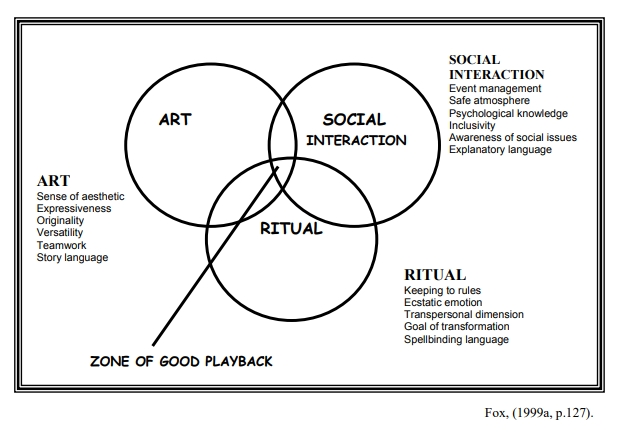

# CHAPTER TWO: Presenting Playback Theatre

# 第二章：一人一故事剧场的呈现

> The story depends on every one of us to come into being. It needs all, needs our remembering, understanding, and creating what we have [experienced] to keep on coming into being.
Trinh (in Somerville 1999, p.111).
故事的诞生有赖于我们每一个人。它需要我们所有人，需要我们记住、理解和创造我们所[经历]的一切，才能继续存在下去。
Trinh（见 Somerville，1999 年，第 111 页）。
> 

> The god of dirt
Came up to me many times and said
So many wise and delectable things, I lay
On the grass listening
To his dog voice,
Crow voice,
Frog voice; *now*,
He said, and *now*,
And never once mentioned *forever*
Mary Oliver (1986, p.50).
污垢之神
他多次走过来对我说
这么多智慧和美味的东西，我躺在
在草地上聆听
敬他的狗声
乌鸦的声音
青蛙的声音；*当下*、
他说，*当下*、
而且从未提及*永远*
玛丽-奥利弗（1986 年，第 50 页）。
> 

Trinh offers the idea that stories depend on *all* of us to bring them alive. In the poem excerpt from *One of Two Things,* Oliver sings of listening – *now* and that somehow this will be enough. In this chapter I introduce Playback Theatre, a ritual performance method where together audiences and performers bring personal stories to life, and where people are required to listen, *now*. In the first section of the chapter I recount the genesis and the development of Playback Theatre and the Playback Theatre movement. In the second section, I draw together a number of voices in the Playback Theatre literature to present an account of the form and its values and purpose/s. This includes an explanation of the central position of personal story in the method. In the third section, I elaborate on the practice of Playback Theatre, with emphasis on its application in the community. Ultimately, I critique Playback Theatre scholarship and research, identifying the gaps in the literature and relate this to the focus of this study.

特林提出的观点是，故事要靠*我们所有人*的努力才能生动起来。在*两件事中的一件（One of Two Things）*的诗歌节选中，奥利弗唱道："倾听--*当下*，不知何故，这就足够了。在本章中，我将介绍一种仪式演出的方法——一人一故事剧场，在这种方法中，观众和表演者一起将个人故事带入生活，人们需要倾听*当下*。在本章的第一部分，我讲述了一人一故事剧场和一人一故事剧场运动的起源和发展。在第二部分中，我汇集了一人一故事剧场文献中的一些观点，对一人一故事剧场的形式及其价值和目的进行了阐述。其中包括解释个人故事在该方法中的核心地位。在第三部分，我阐述了一人一故事剧场的实践，重点是其在社区中的应用。最后，我对一人一故事剧场的学术和研究进行了评论，指出了文献中的不足，并将其与本研究的重点联系起来。

## 2.1 The Development of Playback Theatre

## 2.1 一人一故事剧场的发展

Playback Theatre is an international movement with performing companies in over 20 countries (IPTN, 2001). Emerging in the USA in the mid-1970s, Dauber (1999a) suggests that this distinctive theatre form was responding to a specific cultural need. Salas (1993) states that it was a "response to human need, both individual and social, for the communication and validation of personal experience" (p.1). The idea for the Playback Theatre methodology came from Jonathan Fox (Salas, 1993, Fox, 1994, Fox & Dauber, 1999). Influenced by his own exploration of twentieth century experiential theatre and a fascination with preliterary storytelling and other oral cultural forms, Fox set out to develop a theatre form that espoused values of social justice and valued theatricality – a form that he would want to practice. A chance meeting with the psychodrama method served to crystallise his vision, and the early workings of the Playback Theatre method emerged (Fox, 1999a).

一人一故事剧场是一项国际运动，在 20 多个国家都有演出团体（IPTN，2001 年）。Dauber (1999a) 认为，这种独特的戏剧形式是对特定文化需求的回应。Salas (1993) 指出，它是"对人类需求的回应，包括个人需求和社会需求，以交流和验证个人经历"（第 1 页）。一人一故事剧场方法的创意来自乔纳森-福克斯（Jonathan Fox）（Salas, 1993, Fox, 1994, Fox & Dauber, 1999）。福克斯受到自己对二十世纪体验式戏剧的探索以及对前文字时代口述故事和其他口述文化形式的迷恋的影响，开始着手开发一种崇尚社会正义价值观和重视戏剧性的戏剧形式——一种他希望实践的形式。一次偶然的机会，福克斯接触到了心理剧的方法，这使他的设想更加具体化，于是出现了一人一故事剧场方法的早期工作（Fox, 1999a）。

In the first decade, other people[3] joined Fox and co-founder Jo Salas, in an experiential, experimental development process, where practice and reflection were the basis for developing this hybrid performance form. In Australia and New Zealand, early proponents of the form (including some from the psychodrama movement) pursued equally foundational and experimental practice in dialogue with the US founders. Throughout the second decade, the practice and embryonic theorising of Playback Theatre focused on coming to terms with the application and evaluation of the form within the multiple practice arenas Playback Theatre had infiltrated. Significant to this period was the thinking about what is required to effect *good enough*[4] Playback Theatre (Salas, 1993). This decade heralded the establishment of Playback Theatre Companies in the USA, Australia and New Zealand, with expansion into Europe, the UK and Asia.

在最初的十年中，其他人[3]加入了福克斯和共同创始人乔-萨拉斯的行列，共同经历了一个体验式、实验性的发展过程，实践和反思是发展这种混合表演形式的基础。在澳大利亚和新西兰，这种表演形式的早期支持者（包括一些来自心理剧运动的支持者）在与美国创始人的对话中进行了同样基础性和实验性的实践。在第二个十年中，一人一故事剧场的实践和理论雏形主要集中在如何在一人一故事剧场所渗透的多种实践领域中应用和评估这种形式。对这一时期具有重要意义的是对实现*足够好*[4]的一人一故事剧场所需条件的思考（萨拉斯，1993 年）。这十年间，美国、澳大利亚和新西兰相继成立了一人一故事剧场团，并向欧洲、英国和亚洲扩展。

[3] This group became known as the Original Company (Fox, 1994).

[3] 这支队伍后来被称为"初始剧团"（福克斯，1994 年）。

[4] The notion of *good enough* is informed by Bettelheim's idea of good enough parenting (Salas, 1993, p. 30). In Australian and New Zealand contexts *good enough* has additional meaning drawn from the notion of adequacy fundamental to Moreno's theory of spontaneity (see Karp, 1994).

[4] "足够好"的概念源自贝特尔海姆的"足够好的养育"理念（Salas，1993 年，第 30 页）。在澳大利亚和新西兰的语境中，"足够好"的附加含义来自莫雷诺自发性理论的基本概念"适当性"（见卡普，1994 年）。

The spread of Playback Theatre has been consistent yet contained, with the basic philosophy and methodology transferred through a predominantly oral process, including international gatherings. This approach has served as a form of quality control and risk management. On the eve of the third decade, access to the Playback Theatre method and the international community was advanced through the establishment of a centralised school of instruction and the formation of an international body – the International Playback Theatre Network[5]. These bodies have served to oversee the expansion of the form and to provide regulation (Fox, 1999a). Simultaneously, the first books about Playback Theatre were published[6]. The next section weaves together accounts of the Playback Theatre form, its values and purpose/s.

一人一故事剧场的传播是连贯而有节制的，其基本理念和方法主要通过口头传播，包括国际集会。这种方式起到了质量控制和风险管理的作用。在第三个十年前夕，通过建立一所集中授课的学校和成立一个国际机构——国际一人一故事剧场网络[5]，一人一故事剧场方法和国际社会的接触得到了进一步的推进。这些机构的作用是监督这一形式的扩展并提供规范（Fox, 1999a）。与此同时，第一批有关一人一故事剧场的书籍也出版了[6]。下一部分将对一人一故事剧场的形式、价值观和目的进行阐述。

[5] The International Playback Theatre Network comprises delegates from Playback Theatre Companies from around the world and encourages reflection, discussion and writing about Playback Theatre.

[5] 国际一人一故事剧场网络由世界各地一人一故事剧场剧团的代表组成，鼓励对一人一故事剧场进行反思、讨论和写作。

[6] A Playback Theatre methodological guidebook, *Improvising Real Life,* was published in 1993 (Salas, 1993). Fox's documentation of the theory informing the development of the Playback Theatre methodology, *Acts of Service*, was published in 1994 (Fox, 1994).

[6] 1993 年出版了一人一故事剧场方法的指导手册《即兴真实人生》（*Improvising Real Life*）（Salas，1993 年）。1994 年，福克斯出版了一人一故事剧场方法论的理论文献《服务的表演》（*Acts of Service*）（福克斯，1994 年）。

## 2.2 The Playback Theatre Method

## 2.2 一人一故事剧场法

Jo Salas, music therapist and co-founder of Playback Theatre states that from its earliest inception, the scope and purpose of Playback Theatre has been to 

> Reveal the shapeliness and meaning in any experience, even the ones that are unclear and formless in the telling. [Playback Theatre can] dignify stories with ritual and aesthetic awareness, and link them together so that they form a collective story about a community of people whether the temporary community of a public audience, or a group of people whose lives are connected in an ongoing way. … [Playback Theatre] offers a public arena in which the meaning of individual experience expands to become part of a shared sense of purposeful existence (Salas, 1993, p.22).
> 

音乐治疗师兼一人一故事剧场创始人之一乔-萨拉斯（Jo Salas）说，"一人一故事剧场"从一开始就致力于

> 揭示任何经历的形状和意义，即使是那些在讲述过程中模糊不清的经历。[一人一故事剧场可以]以仪式和审美意识赋予故事以尊严，并将它们联系在一起，从而形成一个关于人群的集体故事，无论是公开招募的观众组成的临时群体，还是以持续方式将生活联系在一起的群体。……[一人一故事剧场]提供了一个公共舞台，在这个舞台上，个人经历的意义得以扩展，成为有坚实的存在的共同意识的一部分（Salas，1993 年，第 22 页）。
> 

Salas' explanation alludes to three defining elements of Playback Theatre: personal story (the content), a ritual aesthetic (the form), and the context. Fox (1994) reports that early Playback Theatre audiences included children in their schools, disabled residents at their group home and friends and family in their neighbourhood. It was the early application in places other than theatres, for people other than conventional theatre audiences that differentiated it from other forms of theatre. That these audiences were situated in specific contexts, e.g., education/school, rehabilitation/group home, community/neighbourhood, has emerged as a defining aspect of the Playback Theatre method. The contemporary terminology for applications of theatre in such contexts is applied theatre (Taylor 2003).

萨拉斯的解释暗指了一人一故事剧场的三个决定性要素：个人故事（内容）、仪式美学（形式）和背景（context）。福克斯（Fox，1994 年）报告说，早期的一人一故事剧场观众包括学校里的儿童、疗养院的残障人士以及社区的亲朋好友。早期的一人一故事剧场在剧场之外的其他地方的应用，为传统剧场观众之外的其他人群服务，使其有别于其他形式的剧场。这些观众处于特定的环境中，如教育/学校、康复/疗养院、社区/邻里，这已成为一人一故事剧场方法的一个决定性方面。在这种情况下应用戏剧的现代术语是“应用戏剧”（泰勒，2003 年）。

Three defining frames of applied theatre forms like Playback Theatre are the content, the form and the context. As suggested above, the context frames the process and provides a gateway through which audience members enter the participatory ritualised frame (the form).

一人一故事剧场等应用戏剧形式的三个决定性框架是内容、形式和背景。如上文所述，背景框定了整个过程，并为观众进入参与性仪式化框架（形式）提供了通道。

The context can act as an initial link among audience members and between audience members and performers. It gives focus, purpose and direction to the performers. Strong identification with the context can contribute to strong engagement in the process, or as Brook (1989) explains, soften up the audience and assist the performers to get the audience "to a state of readiness" (p.127). The second defining aspect is the Playback Theatre form.

背景可以作为观众间以及观众与表演者之间的最初纽带。它为表演者提供了重点、目的和方向。对背景的强烈认同可以促进表演过程中的强烈参与，或者如布鲁克（1989 年）所解释的那样，可以软化观众，帮助表演者让观众"进入准备状态"（第 127 页）。第二个决定性因素是一人一故事剧场的形式。

This is the ritualised process that both drives and is driven by the audience-performer interaction. In Playback Theatre the form consists of conventions of space, performance and content through participation. An illustration of the Playback Theatre spacial conventions appears in Appendix 1. Performance conventions include the performing roles[7]: actor, conductor and musician, and performance forms, for example fluid sculptures and story scenes[8], and styles, which could be unique to the specific ensemble. (For a description of a Playback Theatre performance see Appendix 2). Hosking & Penny (1998) propose an explanation of Playback Theatre as an interactive performance form:

这是一个仪式化的过程，既推动观众与表演者之间的互动，也被观众与表演者之间的互动所推动。在一人一故事剧场中，这种形式包括空间、表演和内容的约定俗成的参与方式。一人一故事剧场空间惯例图示见附录 1。表演惯例包括表演角色[7]：演员、指挥和音乐家，以及表演形式，例如流体雕塑和故事场景[8]，以及风格，这可能是特定剧团独有的。（关于一人一故事剧场表演的描述，见附录 2）。Hosking & Penny（1998 年）将一人一故事剧场解释为一种互动表演形式：

[7] Playback Theatre performing roles are discussed in Chapter 5. For a full description of the performing roles see Chapters 4-6 in *Improvising Real Life* by Jo Salas (1993) & Chapters 9-11 in *Acts of Service* by Jonathan Fox (1994). See also Good (1986) and Hoesch (1999).

[7] 第五章讨论了一人一故事剧场的表演角色。有关表演角色的完整描述，请参阅乔-萨拉斯（Jo Salas）（1993 年）所著的《即兴真实人生》（*Improvising Real Life* ）中的第 4-6 章，以及乔纳森-福克斯（Jonathan Fox）（1994 年）所著的《服务的表演》（*Acts of Service* ）中的第 9-11 章。另见 Good (1986) 和 Hoesch (1999)。

[8] For a full explanation of the technical aspects of the Playback Theatre forms see Chapter 3, *Improvising Real Life* by Jo Salas (1993).

[8] 有关一人一故事剧场形式技术方面的全面解释，请参阅乔-萨拉斯（Jo Salas）（1993 年）所著的《即兴真实人生》（*Improvising Real Life* ）第三章。

> Playback Theatre is spontaneous improvised theatre created through a unique collaboration between performers and audience. Someone tells a story from their life, chooses actors to play the different roles, then watches as their story is immediately recreated and given artistic shape and coherence (Hosking & Penny, 1998, p.10).
>

> Playback Theatre（一人一故事剧场）是通过表演者与观众之间的独特合作创造出的自发的即兴剧场。表演者讲述自己生活中的故事，选择演员扮演不同的角色，然后看着自己的故事被立即重现，并被赋予艺术质感和连贯性（Hosking & Penny, 1998, p.10）。
> 

While stories are mentioned in this description, Salas highlights the centrality of personal story in the theatre that is created during the performance. She writes:

虽然在描述中提到了故事，但 Salas 强调了个人故事在演出的剧场中的核心地位。她写道：

> Audience members … are invited to [tell a story] … guided by the director or "Conductor," [the teller] casts his or her story from the row of actors. The chosen performers, supported by music and lighting, transform the story into a theatrical scene, using boxes and pieces of cloths as props (Salas in Feldhendler, 1994, p.101)[9].
> 

> 观众……被邀请[讲述故事]……在导演或"领航员"的引导下，[讲述者]从一排演员中选出一个演员饰演故事中的自己。被选中的演员在音乐和灯光的衬托下，用箱子和彩布作为道具，将故事变为戏剧场景（Salas in Feldhendler, 1994, p.101）[9]。
> 

[9] The Playback Theatre stage is a simple arrangement of instruments and props, with two chairs placed stage left for the teller and conductor; opposite which is a semi-circle of audience chairs. For an example of the simplicity of the Playback Theatre stage see Appendix 1.

[9] 一人一故事剧场的舞台由简单的乐器和道具组成，舞台左侧摆放着两把椅子，分别供讲述者和领航员使用；对面是半圆形的观众席。有关一人一故事剧场舞台简单的示例，请参见附录 1。

Efforts at describing and defining Playback Theatre have been limited due to the difficulty in capturing the ephemeral vitality of live performance in words. Despite his seminal role in developing Playback Theatre, Fox himself claims that the Playback Theatre process is not simple to describe or understand (Fox, 1999a). One reason for this could be its flexibility.

由于难以用文字描述现场表演瞬间的生命力，描述和定义一人一故事剧场的努力一直很有限。尽管福克斯在一人一故事剧场的发展过程中起到了开创性的作用，但他自己也声称，一人一故事剧场的过程并不容易描述或理解（Fox, 1999a）。原因之一可能是它的灵活性。

Dauber states that "it can be adapted to many different specific needs … [and] spans the conventional categories of theatre, psychology and education"(Dauber, 1999a, p.116). Salas reports that "it can work in virtually any setting, because by its nature it adapts to the needs and concerns of whoever is present" (Salas, 1993, p.1). Practitioners in New Zealand and Australia (Good, 2003, Hosking & Penny, 2002) write about Playback Theatre as a method of inquiry and dialogue.

Dauber 指出，"它可以适应许多不同的具体需求……[并]跨越戏剧、心理学和教育学等传统范畴"（Dauber, 1999a, p.116）。Salas 报告说，"它几乎可以在任何环境下使用，因为就其本质而言，它可以适应任何在场者的需求和关注"（Salas, 1993, p.1）。新西兰和澳大利亚的实践者（Good, 2003, Hosking & Penny, 2002）将一人一故事剧场作为一种探究和对话的方法。

Emerging in more recent writing about Playback Theatre are statements about what the form does *not* do. Most notably the fact that it is not message-driven like other applied theatre forms, for example, Boal's (1979) forum theatre, and popular theatre and theatre for development processes. Rather it is a process that is premised on inquiry. In their report on an application of Playback Theatre in the pacific island country of Kiribas, Hosking & Penny propose that Playback Theatre is:

在最近关于一人一故事剧场的文章中，出现了关于这种戏剧形式*不*做什么的论述。最值得注意的是，它不像其他应用戏剧形式，如波瓦（1979 年）的论坛戏剧、大众剧场（popular theatre）和发展剧场(theatre for development processes)那样以寓意驱动（message-driven）。相反，它是一个以探究为前提的过程。霍斯金和彭尼在其关于在太平洋岛国基里巴斯应用一人一故事剧场的报告中提出，一人一故事剧场是：

A methodology for the exploration of an issue or concern rather than message driven theatre. [Where a group can work toward] a comprehensive understanding and expression of what is occurring and the underlying social values. [It works at] a level under political motivation [and] may be used to stimulate change, to celebrate achievements, to explore questions, to address conflict and at the same time it will always build connections and strengthen ties within the group and in this way enhance the sense of community (Hosking & Penny, 1998, p.10-11).

一种探讨或关切问题的方法，而不是以寓意为导向的剧场。[一个团体可以致力于]全面理解和表达正在发生的事情和潜在的社会价值。[它可以在]政治动机层面上发挥作用[并]可用于激励变革、庆祝成就、探讨问题、解决冲突，与此同时，它将始终在团体内部建立联系和加强纽带，并以这种方式增强团体意识（Hosking & Penny, 1998, p.10-11）。

Claims such as these provide insight into what some practitioners believe Playback Theatre can achieve. Mock (2002) asserts that researching live performance is difficult. Many of the claims made about Playback Theatre have been based on practitioner reflection and reveal the evolution of practitioners' understandings. In documenting these understandings practitioners have articulated their embodied knowledge or praxis. This is a legacy of the experimental development model and the way in which practice reflection has informed Playback Theatre knowledge to date. Embedded in the descriptions of Playback Theatre is practitioners' sense making with regard to the application of Playback Theatre in a particular context and informed by their personal values, biases and assumptions, and further informed by the values intrinsic to the Playback Theatre form. These values include: honouring diversity, listening, respect, communication through stories, artistry, social interaction and community building (IPTN, 2002). While there is a critical imperative in reflective practice many of the descriptions and explanations of the Playback Theatre form appear somewhat like advocacy.

诸如此类的说法让我们了解到一些实践者认为一人一故事剧场能够实现什么。Mock (2002)断言，研究现场表演是困难的。许多关于一人一故事剧场的说法都是基于实践者的反思，揭示了实践者理解的演变。在记录这些理解的过程中，实践者阐述了他们的具身的知识或实践。这是实验性发展模式的遗产，也是迄今为止实践反思为一人一故事剧场知识提供信息的方式。在对一人一故事剧场的描述中，蕴含着实践者对一人一故事剧场在特定环境中的应用的感性认识，并以其个人价值观、偏见和假设为依据，并进一步以一人一故事剧场形式固有的价值观为依据。这些价值观包括：尊重多样性、倾听、尊重、通过故事交流、艺术性、社会互动和社区建设（IPTN，2002 年）。虽然反思性实践具有批判性的必要性，但对一人一故事剧场形式的许多描述和解释似乎有点像宣传。

In recent research, Wright (2003) asserts that the claims made about Playback Theatre in learning and healing applications were probable. That empirical research is only just emerging from the field is discussed later in the chapter.

在最近的研究中，Wright（2003 年）断言，有关一人一故事剧场在学习和治疗方面的应用的说法是可能的。本章稍后将讨论该领域刚刚出现的实证研究。

Fox (1994, 1999a & b) undertook numerous attempts to describe and define Playback Theatre. In the more recent re-presentation of his sense making about Playback Theatre, Fox looks at the interaction between ritual, art and social interaction. This results in a simplified framework from which to teach Playback Theatre. The tri-dimensional model incorporating a ritual, an artistic and a social facet is documented as Figure 1. Fox argues that there is an interactive relationship between the three dimensions where at any time one could be dominant. In a 'good' Playback Theatre performance all three must continually balance over the course of the performance. Much of the tension of working in the dialectical flux of these three dimensions is the domain of the conductor. The actor's preoccupation tends toward the balance between the artistic demands of theatre and the social demands of listening or being present (Salas, 1993) as the storyteller performs. Salas (1999) deems that good Playback Theatre requires empathy and intuition in the interpretative enactment of the story and cautions against Playback Theatre that produces "superficial versions of stories told to therapists" (p30).

福克斯（1994、1999a 和 b）曾多次尝试描述和定义一人一故事剧场。在最近对一人一故事剧场的重新表述中，福克斯着眼于仪式、艺术和社会互动之间的相互作用。这就为一人一故事剧场的教学提供了一个简化的框架。包含仪式、艺术和社会层面三个维度的模型如图 1 所示。福克斯认为，这三个维度之间存在一种互动关系，在任何时候，其中一个维度都可能占据主导地位。在“好的”一人一故事剧场演出中，这三个方面必须在演出过程中不断取得平衡。在这三个维度的辩证变化中，许多紧张的工作都是领航员的领域。演员的首要任务是在演绎故事时，在戏剧的艺术要求与倾听或在场的社会要求之间取得平衡（Salas，1993 年）。Salas（1999）认为，好的一人一故事剧场需要在对故事进行诠释时具有同理心和直觉，并告诫不要让一人一故事剧场滑向“向治疗师讲述的故事的肤浅版本”（第 30 页）。

**Figure 1: Essential Elements of Playback Theatre**

In defining the essential elements of Playback Theatre, Fox gives each – art, ritual and social interaction – a set of qualifiers. Some of the qualifiers in the artistic realm: a sense of aesthetic, teamwork and expressiveness, in the social realm: inclusivity and awareness of social issues, and in the ritual realm: keeping the rules and goal of transformation, are co-operatively enacted by players and audience alike. Fox's model says little about the essential aspect of participation by the audience. This essential interactive basis of the form is perhaps the primary value underpinning the application of Playback Theatre and the thing that most gives relevance to the model Fox proposes (see Figure 1).

在定义一人一故事剧场的基本要素时，福克斯为艺术、仪式和社会互动各赋予了一系列限定词。艺术领域的一些限定条件是：审美意识、团队合作和表现力；社会领域的限定条件是：包容性和对社会问题的认识；仪式领域的限定条件是：遵守规则和转化的目标，这些都是由参与者和观众共同制定的。福克斯的模式很少涉及观众参与的重要方面。这种形式的重要互动基础也许是支持一人一故事剧场应用的首要价值，也是福克斯提出的模式（见图 1）最有意义的地方。

Coalesced with the value of participation, is the central place of personal story in the Playback Theatre form. As mentioned earlier, the intersection of personal story and interactive theatre demands strong containment. This is facilitated through the ritualised process where performances are built around the systematic application of basic theatrical devices, simple staging, and consistent shaping by a conductor who primarily uses repetition (of the invitation to tell a story) to build momentum in the process. The method provides a venue to tell stories.

与参与价值相辅相成的是个人故事在一人一故事剧场形式中的核心地位。如前所述，个人故事与互动戏剧的交汇点要求强烈的克制。这可以通过仪式化的过程来实现，在这一过程中，表演围绕着基础戏剧装置的系统应用、简单的舞台设计以及领航员的持续塑造而展开，领航员主要通过重复（邀请讲述故事）来为这一过程累计势能。这种方法提供了一个讲述故事的场所。

This may be construed as a warm and romantic idea. However, when the word *story* is preceded by the adjective *personal* to yield *personal story* some tension is present in the idea. Add to this the public nature of the telling and you have a form of theatre that is counter-cultural, occupies the margins, and elicits multiple responses. Asha Richard (1999), Germany-based Playback Theatre performer, suggests that such tensions and others arising from the unknown in Playback Theatre are what make it *theatre,* rather than specific artistic criteria. She questions "whether it is artistic theatre, which is not the same as good theatre" (p.115).

这可能被理解为一个温馨浪漫的想法。然而，如果在"故事"一词前加上"个人"这一词语，就会产生"个人故事"这一概念。再加上讲述的公开性，就产生了一种反主流文化、占据边缘、引起多种反应的戏剧形式。来自德国的一人一故事剧场表演者阿莎-理查德（Asha Richard，1999 年）认为，一人一故事剧场中的这种紧张关系和其他未知因素使其成为*戏剧*，而不是特定的艺术标准。她质疑"这个问题关乎它是否是艺术性的戏剧，而艺术性的戏剧不等于好的戏剧"（第 115 页）。

By virtue of its methodological structure and its various practical applications, Playback Theatre is a political form of theatre. The political nature of Playback Theatre is derived from the essential postmodern and anti-oppressive nature of the form. Hoesch (1999) reports that "Stories will not be judged or evaluated. Each carries equal weight. Everyone has the right to the teller's chair. A good conductor will invite silent people" (p.63). Thus, postmodern ideas like: personal stories in public places, a public event with an agenda driven by participants, a theatre experience where the audience provides the text, a public meeting where people have a say without being judged, a community dialogue where marginal voices are actively sought, and entertainment that challenges the dominant social narrative are possible within the Playback Theatre performance. While these ideas are inherent in many of the claims made about Playback Theatre, there is also a belief that Playback Theatre is an *act of service* (Fox, 1994) with "citizen actors[10] hearing and enacting stories of their fellow community members" (Bessko, 2000, p.2). This implies that Playback Theatre is a theatre of listening more than a theatre of telling. Hosking (2001) suggests that people who are interested in new experiences come to Playback Theatre and that it is the "being listened too" that counts (p.7). This expands Salas's (1993, 1999) idea that it is the presence of the performers (with their commitment to listening and being there) that constitutes the worth of the Playback Theatre experience. She states:

由于其方法结构和各种实际应用，一人一故事剧场是一种政治性的戏剧形式。一人一故事剧场的政治性源于其基本的后现代和反压迫性质。Hoesch (1999) 指出："故事不会被评判或评估。每个故事都具有同等分量。每个人都有权坐在讲述者的位置上。好的领航员会邀请沉默的人"（第 63 页）。因此，后现代理念，如：在公共场所讲述个人故事、由参与者推动议程的公共活动、由观众提供文本的戏剧体验、人们有发言权而不被评判的公共会议、积极寻求边缘声音的社群对话以及挑战主流社会叙事的娱乐活动，都可以在一人一故事剧场表演中实现。虽然这些观点是许多关于一人一故事剧场的主张所固有的，但也有人认为一人一故事剧场是一种*服务的表演*（Fox, 1994），"公民演员[10]聆听并演绎社区成员的故事"（Bessko, 2000, p.2）。这意味着，一人一故事剧场相比于讲述的剧场，更像是倾听的剧场。霍斯金（2001 年）认为，对新体验感兴趣的人来到一人一故事剧场，"被倾听"才是最重要的（第 7 页）。这扩展了 Salas（1993 年，1999 年）的观点，即表演者的存在（致力于倾听和在场）才是一人一故事剧场体验的价值所在。她指出：

> What helps most of all is simply the example of performers themselves, ordinary people standing up there willing to try anything, willing to be seen. It is a kind of courage and some audience members are inspired to discover it (the courage) in themselves (Salas, 1999, p.154).
> 

> 最重要的是表演者自身的示范作用，他们是站在台上的普通人，愿意尝试一切，愿意被人看到。这是一种勇气，一些观众受到启发，发现自己身上的这种勇气（Salas，1999 年，第 154 页）。
> 

[10] The citizen actor is intrinsic to the values of Playback Theatre. Fox envisaged an actor who studies and performs Playback Theatre as an avocation, not a career; and who is embedded in an ordinary life in the community in which they live (Salas, 1993). This is made more complex by the artistic stance of the Playback Theatre actor, where they are "present as themselves often relating to the audience between stories in a human way" (Fox, 1999b, p.123).

[10] 公民演员是一人一故事剧场的内在价值。福克斯设想的演员是把学习和表演一人一故事剧场作为一种爱好，而不是职业；他们融入自己所生活的社区的普通生活中（Salas，1993 年）。一人一故事剧场演员的艺术立场使这一点变得更加复杂，他们 "以自己的身份出现，经常以一种人性化的方式在故事之间与观众联系"（Fox, 1999b, p.123）。

And in some small way this describes Playback Theatre: from the simplicity of an ordinary actor "willing to try" to the profoundness of strangers gathered together with a preparedness to listen (Good, 2003), to the complexity of a process contained by a ritual frame where people come out of isolation and see their lives treated as significant (Hosking 2001) and where art evokes beauty so that we may see the truths in the stories of ourselves and others (Fox in Sperling & Fox, 1999).

在某种程度上，这也是对一人一故事剧场的描述：从普通演员"愿意尝试"的简单性，到陌生人聚集在一起准备倾听的深刻性（Good，2003 年），再到仪式框架所包含的过程的复杂性，在这个过程中，人们走出孤独，看到自己的生活被视为重要（Hosking，2001 年），艺术唤起美感，让我们看到自己和他人故事中的真相（Fox，见 Sperling & Fox，1999 年）。

The artistic endeavours of Playback Theatre may see players minimise the more difficult aspects that have been expressed in a story. In fact, the teller too, may have minimised these in the telling. Zánkay (1999) asserts that for Playback Theatre to succeed it must "show the dynamics of the contravening forces in the story" (p.192). In failing to do so the unexpressed aspects of the story are brought to stage in the next story; and again until there has been adequate listening and an accurate animation of the *intensity* of the experience expressed in the story. In his improvisational practice, theatre experimenter, Peter Brook (1989) found that performance such as this was "exceptionally difficult" and required the actor to accomplish "precise technique". He writes:

通过一人一故事剧场的艺术创作，表演者可能会将故事中较难表达的部分最小化。事实上，讲述者在讲述过程中也可能将这些困难最小化。Zánkay（1999）断言，要使一人一故事剧场获得成功，必须"展现故事中相互冲突的力量的动态"（第 192 页）。如果做不到这一点，故事中未表达的方面就会在下一个故事中被搬上舞台；直到有了充分的倾听和对故事中所表达的体验的*强度*的准确动态为止。戏剧实验家彼得-布鲁克（Peter Brook，1989 年）在他的即兴表演实践中发现，这样的表演"异常困难"，需要演员掌握"精确的技巧"。他写道：

> [Improvised performance] required specific training and also a great generosity and a capacity for humour. Genuine improvisation, leading up to a real encounter with the audience, only occurs when the spectators feel that they are loved and respected by the actors (Brook, 1989, p.112).
> 

> [即兴表演]需要专门的训练，还需要慷慨大方和对幽默感的包容。只有当观众感觉到他们受到演员的喜爱和尊重时，才会出现真正的即兴表演，从而与观众真正相遇（布鲁克，1989 年，第 112 页）。
> 

In the mutuality of the Playback Theatre process, where audiences and performers co-create theatre through the dynamic and collaborative vulnerability of performance such real encounters are possible. Through his growing understanding of the particular intimacy that improvised performance demands, Brook recommends that "improvised theatre must go to where people live", to their local neighbourhoods and communities (Brook, 1989, p.112). The next section explores the work of Playback Theatre as community performance.、

在一人一故事剧场的相互过程中，观众和表演者在表演的动态和协作的脆弱性之上共创，才能真正地相遇。布鲁克对即兴表演所要求的特殊亲密关系的理解不断加深，因此他建议"即兴戏剧必须到人们生活的地方去"，到他们当地的街区和社区去（布鲁克，1989 年，第 112 页）。下一节将探讨作为社区表演的一人一故事剧场的工作。

## 2.3 Playback Theatre as Community Performance

## 2.3 作为社区表演的一人一故事剧场

Playback Theatre has been described as a public avenue for celebrating difference and making connections (Salas, 1993). A sense of connections, in addition to belonging and security, has emerged as fundamental to experiences of community in recent scholarship (see Ahmed, 2000, Popple, 1995). Amit (2002) asserts that embracing and celebrating difference is a contemporary purpose of community-based practices. While a popular application of the Playback Theatre method is in a workshop format, in this study, it is the Playback Theatre performance that features. Specifically, it is the one-off community-based event. The placement of Playback Theatre as a performance enables it to maximise the elements of public ritual intrinsic to oral traditions. Fox (1994) states that:

一人一故事剧场被描述为赞美差异和建立连接的公共途径（Salas, 1993）。除了归属感和安全感之外，连接感也成为近期学术研究中社区体验的基本要素（见 Ahmed, 2000, Popple, 1995）。Amit (2002) 认为，拥抱和赞美差异是当代社区实践的目的。虽然一人一故事剧场方法的流行应用是以工作坊的形式，但在本研究中，一人一故事剧场表演才是其特色。具体来说，它是一次性的社群活动。将一人一故事剧场作为一种表演，使其能够最大限度地利用口述传统固有的公共仪式元素。福克斯（1994 年）指出：

> [T]he idea of performance is so important in the oral tradition. For each moment presents a new challenge, to be met with the heightened creativity we associate with a moment on stage (p.92).
> 

> 表演的概念在口述传统中非常重要。因为每一个时刻都是一个新的挑战，都需要我们以与舞台时刻连接着的高度创造力来应对（第 92 页）。
> 

In performance the 'unexpected' can arise from the formalised, predictable structure. This can capture audiences and carry them along to the surprise they experience as they listen to the stories or witness the immediacy of the enactment. The open – yet contained – space of the stage beckons the individual and ritualises time (Hosking, 2001). The liberty to invent stimulates imagination and play and elevates the imperfect-ness in the theatre of the playback performance to the level of art. Such improvised performance can be somewhat taboo in a culture that discourages experiences of the unknown and the *public* presentation of something that is likely to oscillate between success and failure as an art product (Fox, 1994). This flirting with the margins of art and culture bring a certain tension to the Playback Theatre form. Yet, over the years, Playback Theatre has found application in multiple contexts. These are discussed next.

在表演中，"意料之外的东西"可以从正式的、可预测的结构中产生。这可以吸引观众，让他们在聆听故事或目睹演绎的即时性时体验到惊喜。舞台上开放而又封闭的空间召唤着个人，并使时间仪式化（Hosking，2001 年）。发明的自由激发了想象力和游戏性，并将一人一故事剧场表演中的不完美提升到了艺术的高度。在一种不鼓励体验未知、不鼓励将不确定成败与否的东西作为艺术品*公开*展示的文化中，这种即兴表演可能有些禁忌（福克斯，1994 年）。这种在艺术和文化边缘的游走为一人一故事剧场形式带来了某种张力。然而，多年来，一人一故事剧场已被应用于多种场合。下文将讨论这些情况。

The expansion of Playback Theatre across the world occurred simultaneously with the expansion of Playback Theatre into multiple practice sites. Much of this had to do with the diversity, experience and values of people practicing Playback Theatre. Fox (1999a) summarises these contexts into six categories. These were community-based theatre, education, social services, ritual, organisational development and therapy. These six practice sites are explained below.

随着一人一故事剧场在世界各地的发展，一人一故事剧场也同时扩展到多个实践场所。这在很大程度上与实践者的多样性、经验和价值观有关。福克斯（1999a）将这些背景归纳为六类。它们是社群剧场、教育、社会服务、仪式、组织发展和治疗。下文将对这六个实践场所进行说明。

The Playback Theatre community-based theatre event has often been referred to as a theatre of neighbours. Fox (1999a) suggests that many Playback Theatre Companies conduct open or public performances at regular intervals, in a 'home' theatre, throughout the year. The application of Playback Theatre in education is as both a process instrument providing opportunities for children to express their feelings and see them validated, and has also found application in improving literacy, developing emotional intelligence and building confidence and self-esteem. In the social services sector Playback Theatre has been successfully integrated into practice frameworks as a process that builds cohesion through listening to each others' stories, highlights differences and similarities, and teaches listening and communication skills. The process and structure of Playback Theatre render it a ritual event in all applications. Playback Theatre has also found specific ritual application, for example, to open or close conferences or to mark special anniversaries like births and deaths. The reflective function of Playback Theatre has led to it finding relevance in organisational development. It has assisted organisational groups to honour and integrate emotional and spiritual processes like restructures and can ritualise aspects of working life to raise consciousness, grieve, celebrate or effect closure. A popular and consistent application of Playback Theatre has been in the therapeutic domain. Drama and music therapists see value in the way it validates personal stories, while psychodrama practitioners have used it for role training (Fox, 1999a, pp.13-14). The specific Playback Theatre application that features in this study is the one-off community-based performance.

以社群为基础的一人一故事剧场通常被称为"邻居剧场"。福克斯（1999a）指出，许多一人一故事剧场团全年定期在"自家"剧场进行公开或公众演出。一人一故事剧场在教育领域的应用，既是一种过程工具，为儿童提供表达情感的机会，并使他们的情感得到验证，同时也被应用于提高识字率、开发情商、建立自信和自尊。在社会服务领域，一人一故事剧场已被成功纳入实践框架，通过倾听彼此的故事来建立凝聚力，突出异同点，并传授倾听和沟通技巧。一人一故事剧场的流程和结构使其成为所有应用中的仪式性活动。一人一故事剧场还在一些特定的仪式中得到应用，例如，在会议开幕或闭幕时，或在纪念出生和死亡等特殊纪念日时。一人一故事剧场的反思功能使其在组织发展中找到了相关性。它帮助组织团体尊重并整合情感和精神过程，如重组，并能将工作生活的各个方面仪式化，以提升意识、哀悼、庆祝或结束。一人一故事剧场在治疗领域的应用一直很受欢迎。戏剧和音乐治疗师认为，一人一故事剧场验证个人故事的方式很有价值，而心理剧实践者则将其用于角色训练（Fox, 1999a, pp.13-14）。本研究中一人一故事剧场的具体应用是一次性社区表演。

There is a tendency in the Playback Theatre literature to refer to audiences at a specific event as "the community" (see for example, Fox, 1999b, p.116). Salas (1993) writes that Playback Theatre is "community building" (p.1). She suggests that the Playback Theatre performance links stories into "a collective story about a community of people" (p.22). The theory underpinning the thinking about the audience in this way is drawn from sociodrama theory. Sociodrama has been defined as "a deep action method dealing with intergroup relations and collective ideologies" (Fox, 1987, p.18). It is based on:

在一人一故事剧场文献中，有一种将特定活动中的观众称为"社群"的倾向（参见 Fox, 1999b, p.116）。Salas (1993) 写道，一人一故事剧场就是"社群建设"（第 1 页）。她认为，一人一故事剧场表演将故事串联成"一个关于一群人的集体故事"（第 22 页）。以这种方式思考观众问题所依据的理论来自社会剧理论。社会剧被定义为"一种处理群体间关系和集体意识形态的深度行动方法"（Fox，1987 年，第 18 页）。它的基础是：

> [The] tacit assumption that the group formed by an audience is already organized by the social and cultural roles which in some degree all the carriers of the culture share … It is therefore incidental who the individuals are, or of whom the group is composed, or how large their number is (Fox, 1987, p.18).
> 

> 默认的假设是，受众组成的群体已经由社会和文化角色组织起来，在某种程度上，文化的所有载体都共享这些角色……因此，个人是谁，群体由谁组成，人数有多少，都是无关紧要的（福克斯，1987 年，第 18 页）。
> 

In this way, the audience at the Playback Theatre performance is seen to represent the community from which it is drawn. Used in conjunction with sociometry – an observational and operational method that explores the "inside social structure of a group of people at a particular time" (Fox, 1987, p.24) – a sociodramatic approach assists the conductor to relate to the group as part of a broader context. In this study it is the idea that those who gather at the performance experience a "sense of community" (Salas, 1993, p.33) or share an experience of community that is of interest. This idea of community as an experience equates to Lash's (1994) conception of community as one that seeks shared meanings.

这样一来，一人一故事剧场演出的观众就被视为代表了其所来自的社区。社会计量学是一种观察和操作方法，用于探索"特定时间一群人的内部社会结构"（Fox, 1987, p.24）。在本研究中，人们感兴趣的是那些聚集在演出现场的人所体验到的"群体感"（Salas, 1993, p.33）或共享的群体体验。这种将社区视为一种体验的观点等同于 Lash（1994 年）将社区视为一种寻求共同意义的概念。

In his examination of non-scripted, pre-literary and oral theatre traditions Fox (1994) identifies a key element of the Playback Theatre experience as its capacity to be both communal and intimate. It is communal in that it has the capacity to connect people through common themes in stories about the neighbourhood and community in which they live, through familiar issues in individual stories, and through the humanity demonstrated both in the stories and in people's attempts at participating. Yet it is intimate as it enables the audience to share personal stories, to experience being listened to and heard, and in some cases experience transformation in witnessing the enactment of their story. Salas (1999) claims that the Playback Theatre performance meets the needs of the individual and the group. Drawing on the sociodramatic idea of the audience outlined above, Good (2003) proposes that Playback Theatre can act as a mirror for the community. I am more inclined to think of it as a window with the one-off Playback Theatre performance revealing a snapshot of the current interests and concerns of the particular community, through the personal stories of the audience.

福克斯（Fox，1994 年）在对非剧本、前文学和口述戏剧传统的研究中指出，一人一故事剧场体验的一个关键因素是它既具有公共性又具有亲密性。它的公共性在于，它能够通过故事中关于人们所生活的邻里和社区的共同主题，通过个人故事中熟悉的问题，以及通过故事中和人们尝试参与时表现出的人性，将人们联系在一起。然而，它又是亲密的，因为它使观众能够分享个人故事，体验被聆听和被听到，在某些情况下，还能在目睹自己的故事被演绎的过程中体验转变。Salas (1999) 声称，一人一故事剧场表演满足了个人和群体的需要。古德（Good，2003 年）根据上述关于观众的社会戏剧思想，提出一人一故事剧场可以作为社区的一面镜子。我更倾向于将其视为一扇窗，通过观众的个人故事，一次性的一人一故事剧场表演可以揭示特定社区当前的关注和关切。

The 'text' of the Playback Theatre performance, i.e., what gets revealed, shared and discussed, is comprised of what people are prepared to tell. The idea is that the audience members who share stories give an account of a real experience. These stories told from the perspective of the teller constitute the truth from their worldview. Hosking (2001) and others (see for example, Hoesch, 1999) demand that the teller's chair be immune from judgement by performers and audience alike. This makes Playback Theatre unlike Boal's Theatre of the Oppressed where audience members are encouraged to assess actions made by different characters in the story and offer solutions toward overcoming oppression. The improvised nature of the Playback Theatre event means that at any given time anyone can tell a story.

一人一故事剧场表演的"文本"，即揭示、分享和讨论的内容，由人们准备好要讲述的内容组成。我们的想法是，分享故事的观众讲述真实的经历。这些从讲述者的角度讲述的故事构成了他们世界观中的真相。霍斯金（Hosking，2001 年）和其他人（例如，见 Hoesch，1999 年）要求讲述者的椅子不受表演者和观众的评判。这使得一人一故事剧场与波瓦的"被压迫者剧场"不同，后者鼓励观众评估故事中不同角色的行为，并提出克服压迫的解决方案。一人一故事剧场活动的即兴性质意味着在任何时候，任何人都可以讲述一个故事。

As proposed above, the text of the Playback Theatre performance comes from the audience.As such, Playback Theatre can be conceived as a series of storytelling performances interspersed with a series of dramatic enactments, within a ritual framework. Each time a teller comes to the stage they are presenting themselves, performing in the way that Goffman (1959) suggests that we do everyday, enacting a familiar and recognisable social practice (Bauman, 1986). With little adjustment, this performance can be elevated to a more theatrical style, but is always enacted in the company of the conductor. This makes the storytelling performance a duet, with the conductor facilitating the teller's performance while simultaneously working to produce and shape the storytelling in the context of the complete performance. The conductor is also in relationship with the ensemble and the audience throughout the storytelling performance. The performance is multi-layered with the teller in "major" during the telling. Major[11] then shifts to the stage where the actors and musician animate the story in an improvised theatrical interpretation. The Playback Theatre performers are required to:

如上所述，一人一故事剧场表演的文本来自观众。因此，"一人一故事剧场"可被视为在仪式框架内穿插一系列戏剧表演的讲故事表演。每次讲述者走上台时，他们都在代表自己，以戈夫曼（Goffman，1959 年）认为我们每天都在做的方式进行表演，演绎一种熟悉且可识别的社会实践（鲍曼，1986 年）。只需稍加调整，这种表演就能升华为更具戏剧性的风格，但始终是在领航员的陪伴下进行的。这使得讲故事表演成为一种二重奏，领航员在为讲述者的表演提供便利的同时，也致力于在完整表演的背景下制作和塑造故事。在整个讲故事表演过程中，领航员还与剧团和观众保持连接。表演是多层次的，讲述者在讲述过程中处于"主要"位置。然后，这一"主要"位置会[11]转移到舞台上，演员和乐师在舞台上即兴演绎故事。这要求一人一故事剧场的表演者：

[11] Major is an improvisational concept that denotes where the audience attention is at any given moment. I have seen it used in performance analysis of dance; and I am familiar with its use in the dance composition/improvisation technique, Viewpoints, devised by Anne Bogart (for more on Bogart's work see Bogart (2001) and Dixon & Smith (1995)).

[11] "主要"是一个即兴概念，表示观众在任何特定时刻的注意力所在。我曾在舞蹈表演分析中见过这个概念；我还熟悉安妮-博格特（Anne Bogart）设计的舞蹈创作/即兴技巧"视点"（Viewpoints）中对它的使用（关于博格特作品的更多信息，请参阅 Bogart (2001) 和 Dixon & Smith (1995)）。

> [F]ulfil the very essence of theatre's intention: to convey human experience by enacting it in distilled form; to embody narrative and meaning in the realm of space and time (Salas, 1999, p.18).
> 

> 实现戏剧的本质意图：通过以凝练的形式表达人的经验；在空间和时间层面体现叙事和意义（Salas，1999 年，第 18 页）。
> 

At the completion of the enactment the actors on stage freeze, holding the final scene, and transfer their gaze to the teller. The gaze of the spectator is again directed to the teller. And so it shifts: back and forward between the audience and the stage, between the individual and the group, and between the tellers and the players. As the teller returns to the group the audience is in major as they recompose themselves and orient to the idea of the next teller. The conductor subtly caresses these shifts throughout the performance.

表演结束时，舞台上的演员定格，保持着最后的场景，并将目光转移到讲述者身上。观众的目光再次投向讲述者。就这样，目光在观众与舞台之间、个人与群体之间、讲述者与演员之间来回转移。当讲述者回到人群中时，观众重新整理自己的情绪，并将注意力集中到下一位讲述者身上。在整场演出中，领航员巧妙地控制着这些变化。

There is a good deal of interest in the effect of Playback Theatre on the audience participant who tells a personal story. This individual speaks aloud from the group either seated amongst them or on stage alongside the conductor. As suggested above, both sites of telling require the audience participant to assume a more direct performative role in the event. They step out, into the private/public threshold, bringing with them the content that forms the basis of the next dramatic display. While this transition and subsequent participation in the performance is somewhat central to the Playback Theatre method, it is in no way unique in storytelling theatre traditions.

一人一故事剧场对讲述个人故事的观众参与者的影响颇受关注。他们或坐在观众中间，或在舞台上与领航员一起大声讲述故事。如上所述，这两种讲述方式都要求观众在活动中扮演更直接的表演角色。他们走出私人/公共的门槛，带来构成下一个戏剧展示基础的内容。虽然这种过渡和随后的参与表演在某种程度上是一人一故事剧场方法的核心，但它在讲故事的戏剧传统中绝非独一无二。

In other narrative contexts (see for example, Bruner, 1986, Sayre, 1989) the storytelling participants are positioned as empowered or liberated, and as witnesses for the group. In Playback Theatre there can be a tendency to position the storytelling participant as vulnerable (see for example, Nash & Rowe 2002). Thinking about the teller in this way can have the effect of skewing the teller's performance toward a therapeutic frame. I am inclined toward a conception of the telling participants as risk-takers. That is not to say the act of telling will not render the teller vulnerable. In fact, like many performative roles vulnerability is central, for it is in the individual's capacity to take risks that we see their truth and their humanity. When they move to tell, they embark on a journey into the unknown possibilities of the performance. In this performance the conductor accompanies them. Penny (2002) asserts that if, in the enactment, the actors match the risks taken by the teller a primary condition for advancing the ritual will be met. He states, "For the actor to advance and deepen the ritual they need a performance courage that matches specifically the courage the teller summoned to tell" (p.7). Experimental theatre technician, Peter Brook (1989) writes about the primacy of risking as an improviser. He asserts that taking "total" risks as a performer enables the ensemble to be influenced by the presence of the people, the context, the pace, and even the time of day (p.118).

在其他叙事语境中（例如，见 Bruner, 1986 年，Sayre, 1989 年），讲故事的参与者被定位为获得权力或解放的人，以及群体的见证人。而在一人一故事剧场中，讲故事的参与者往往被定位为弱势群体（参见纳什和罗，2002 年）。以这种方式思考讲述者可能会使讲述者的表演偏向治疗框架。我倾向于将讲述参与者视为风险承担者。这并不是说讲述行为不会使讲述者变得脆弱。事实上，与许多表演性角色一样，脆弱性是核心，因为正是在个人承担风险的能力中，我们才能看到他们的真实和人性。当他们开始讲述时，就踏上了一段未知的表演之旅。在这场表演中，领航员陪伴着他们。佩妮（Penny，2002 年）断言，如果在表演中，演员与讲述者所冒的风险相匹配，那么就满足了推进仪式的首要条件。他说："演员要推进和深化仪式，就需要有与讲述者讲述时所鼓起的勇气相匹配的表演勇气"（第 7 页）。实验戏剧大师彼得-布鲁克（Peter Brook，1989 年）写道，作为即兴表演者，冒险是最重要的。他断言，作为表演者，"完全"冒险能使剧团受到在场人员、背景、节奏甚至时间的影响（第 118 页）。

In this section I have discussed the notion of Playback Theatre as a community performance ritual. This was achieved through a consideration of the way in which Playback Theatre interacts with the audience as community and in communal ways in a performance context. The notion of performance and the place of story generally, are explored in greater detail in the next chapter. Next, I present a description of the emergence of Playback Theatre scholarship and research.

在本节中，我讨论了一人一故事剧场作为一种社群表演仪式的概念。这是通过考虑一人一故事剧场作为社群与观众互动的方式以及在演出背景下的社群方式来实现的。下一章将更详细地探讨表演的概念和故事的地位。接下来，我将介绍一人一故事剧场学术研究的兴起。

## 2.4 Playback Theatre Scholarship and Research 

## 2.4 一人一故事剧场学术研究 

Published works on Playback Theatre include the early works of Fox (1994) and Salas (1983, 1992, 1993, 1994) on the application of Playback Theatre, the artistic elements of Playback Theatre, and good enough Playback Theatre. While these works are necessarily advocating the fit of Playback Theatre to the contemporary world, they make sound attempts to present a thoughtful and critical gaze. In his book *Acts of Service*, Fox presents a comprehensive explanation of the conception of Playback Theatre. Based on his own reflective practice, *Acts of Service* reveals Fox's sense making processes drawing on literary theory, ritual and cultural theory, psychodramatic theory and the history and theory of preliterary theatre. He attempts to document what is required of the specific roles inherent in the form: actor, director, conductor and ensemble. Fox documents the place of language and form in non-scripted theatre and includes his conclusions about how the improvisational process has a contribution to make in educational and social spheres in society. As discussed earlier in the chapter, these have not been isolated reflections but have arisen from an experimental ensemble, where he has been influenced by others, and by the processes that unfolded as they prepared, enacted and cooled down from their performances. Salas' contribution, *Improvising Real Life: Personal story & Playback Theatre*, published a year earlier but developed simultaneously (Dauber, 1999a) is structured like a Playback Theatre handbook. It provides a practical guide to doing Playback Theatre from how a performance could unfold, to the conventional Playback Theatre forms and many applications.

已出版的有关一人一故事剧场的著作包括福克斯（1994 年）和萨拉斯（1983 年、1992 年、1993 年、1994 年）关于一人一故事剧场的应用、一人一故事剧场的艺术元素和足够好的一人一故事剧场的早期作品。虽然这些作品必然是在主张一人一故事剧场与当代世界的契合，但它们在提出一种深思熟虑的批判性目光方面做出了合理的尝试。福克斯在其著作《服务的表演》（*Acts of Service*）中全面阐释了一人一故事剧场的概念。基于自身的反思实践，《服务的表演》一书揭示了福克斯从文学理论、仪式和文化理论、心理剧理论以及前文本戏剧的历史和理论中汲取灵感的过程。他试图记录这种形式对演员、导演、领航员和剧团等特定角色的要求。福克斯记录了语言和形式在无剧本戏剧中的地位，并总结了即兴创作过程在社会教育和社会领域中的贡献。正如本章前面所讨论的，这些并不是孤立的思考，而是产生于一个实验性的剧团，在这个剧团中，他受到了其他人的影响，也受到了他们在准备、表演和从表演中冷静下来的过程中展开的影响。萨拉斯的作品《即兴真实人生：个人故事与一人一故事剧场》（*Improvising Real Life：Personal story & Playback Theatre*》是在一年前出版的，但与此同时也在发展（Dauber, 1999a），其结构就像一本一人一故事剧场手册。它提供了一本关于如何进行一人一故事剧场表演的实用指南，从表演如何展开，到传统的一人一故事剧场形式和许多应用。

These two texts articulate the ways that Playback Theatre diverges from other oral theatre traditions, from theatre as art or theatre as entertainment, and from psychodrama and various other action methods that have informed Fox and Salas in their formative years (Dauber, 1999a). The two volumes also act like entry texts to the method yet do not stand alone.

这两本书阐明了一人一故事剧场与其他口述戏剧传统、与作为艺术的戏剧或作为娱乐的戏剧、与心理剧和其他各种行动方法的不同之处，而福克斯和萨拉斯在他们成长的岁月中正是从这些不同之处获得灵感的（Dauber, 1999a）。这两卷书也是该方法的入门文本，但并不是独立存在的。

Practice-driven writings proliferate and contribute equally to the early sense making, theory building and documentation of the Playback Theatre process, its values and vision, its diverse application, and potential outcomes. There is also writing about artistic style, artistic excellence and the aesthetics of Playback Theatre.

以实践为导向的著作层出不穷，它们同样促进了对一人一故事剧场过程、其价值和愿景、其多样化应用和潜在成果的早期认识、理论建设和记录。此外，还有关于艺术风格、艺术卓越性和一人一故事剧场美学的著作。

The International Playback Theatre Network publishes a quarterly newsletter, *Interplay*, and convenes biennial international conferences – both providing much needed forums for dialogue and critique. Since its inception, the *Interplay* newsletter has featured practice reflections, theory and concept development based on anecdotal evidence, and performance analysis writings[12]. The publication of the eclectic volume, *Gathering Voices* (Fox & Dauber, 1999), a collection of essays presented at the inaugural Playback Theatre symposium in Kassel, Germany is the most recent contribution to the Playback Theatre writing. A milestone in the movement, Fox (1999a) states that the Kassel Symposium has acknowledged that the early period of experimentation is complete, and has signaled a move toward inviting more rigorous and critical research. Significant, in terms of providing a critical gaze to the mix, is the chapter by Dauber himself. *Tracing the Songlines* (Dauber, 1999a) documents a history of the evolution of Playback Theatre by way of considering biographical information about the founders, Fox & Salas, and examining the inferences therein.

国际一人一故事剧场网络（IPTN）出版季度简报《*Interplay*》，并召开两年一次的国际会议——两者都为对话和评论提供了亟需的论坛。自创办以来，*Interplay* 简报一直以实践反思、基于见证轶事的理论和概念发展以及表演分析文章为特色[12]。在德国卡塞尔举行的首届一人一故事剧场研讨会上发表的文选《收集声音》（*Gathering Voices*）（福克斯和道博，1999 年）的出版是对一人一故事剧场写作的最新贡献。作为这一运动的里程碑，福克斯（1999a）指出，卡塞尔研讨会承认早期的实验阶段已经结束，并预示着将邀请更严格的批判性研究。就提供一种批判性的视角而言，道伯自己撰写的一章具有重要意义。*Tracing the Songlines* (Dauber, 1999a)通过对创始人福克斯和萨拉斯的传记资料进行考量，并对其中的推论进行研究，记录了一人一故事剧场的发展史。

[12] *Interplay* publishes a variety of articles reflecting on Playback Theatre in specific contexts. Some examples of these contexts include: organisations (Hofman, 1997); prisons (Bett, 2000, Southard 2000); housing estates (Murphy, 2001); disability (Day, 1998); mental health (Muckley, 1998); youth (Wynter, 1998); refugee groups (Robb, 2002); and in indigenous communities (Cox, 1996). There is also discussion of the form from various practice frameworks, for example, from a therapeutic perspective (Nash & Rowe 2001, Tselikas 2001, Salas 2000); and in development and social change: (Mills, 1999, Hosking & Fox, 2002).

[12] *Interplay* 发表了各种文章，对特定环境下的一人一故事剧场进行反思。其中的一些例子包括：组织（Hofman, 1997）；监狱（Bett, 2000, Southard 2000）；住宅区（Murphy, 2001）；残疾（Day, 1998）；心理健康（Muckley, 1998）；青年（Wynter, 1998）；难民团体（Robb, 2002）；以及土著社群（Cox, 1996）。还有人从不同的实践框架来讨论这种形式，例如，从治疗的角度（Nash & Rowe 2001, Tselikas 2001, Salas 2000）；以及在发展和社会变革中（Mills, 1999, Hosking & Fox, 2002）。

More recently, there have been papers presented at academic conferences (generally not refereed) and student essays emerging from The School of Playback Theatre's Leadership Module. Conference paper topics have included the application of Playback Theatre in education & training by US academic, Linda Park-Fuller, and Australians, Deborah Pearson and Tarquam McKenna (see Park-Fuller, 1997a, Pearson, 1997, McKenna, 1993). McKenna and Park-Fuller have also published on Playback Theatre as a research method (McKenna, 1999, Park-Fuller, 1997b). An archive of available Playback Theatre writings is currently underway to enable access to these and others papers written about Playback Theatre (see for example Bett, 1999). Specially authored reports on work done with the support of government funding or non-government aid funding have included Hosking & Penny (1998, 1999).

最近，在学术会议上提交的论文（一般未经评审）和学生论文在一人一故事剧场学校的领导力模块中出现。会议论文主题包括美国学者琳达-帕克-富勒（Linda Park-Fuller）和澳大利亚学者德博拉-皮尔森（Deborah Pearson）和塔尔夸姆-麦肯纳（Tarquam McKenna）关于一人一故事剧场在教育和培训中的应用（见帕克-富勒，1997a；皮尔森，1997；麦肯纳，1993）。麦肯纳和 Park-Fuller 还发表了关于作为研究方法的一人一故事剧场的文章（McKenna, 1999, Park-Fuller, 1997b）。目前正在建立 Playback Theatre 著作档案库，以便查阅这些著作和其他有关 Playback Theatre 的论文（参见 Bett, 1999）。关于在政府资助或非政府援助资金支持下所做工作的专门报告包括 Hosking & Penny (1998, 1999)。

These works represent the documentation of the body of knowledge about the form and practice of Playback Theatre. There is considerable scope for more formal research to be undertaken, a task already underway through the completion of this study, and the imminent completion of further dissertations[13]. Further, the completion of this thesis coincides with the recent launch of a Playback Theatre journal.

这些作品代表了有关一人一故事剧场的形式和实践的知识体系。通过完成本研究以及即将完成的更多论文[13]，这项任务已经在进行之中。此外，本论文的完成恰逢最近 Playback Theatre 杂志的发行。

[13] Over the course of the research I have learned that there are dissertations underway or near completion. These are by Fe Day in New Zealand (The Application of Playback Theatre in Public Health Education), Nick Rowe in England (*Personal Stories in Public Places*) and Markus Hühn in Germany (title/topic unknown).

[13] 在研究过程中，我了解到有一些论文正在撰写或即将完成。这些论文的作者分别是新西兰的费-戴（The Application of Playback Theatre in Public Health Education）、英国的尼克-罗（Nick Rowe）（*Personal Stories in Public Places*）和德国的马库斯-胡恩（Markus Hühn）（题目/主题不明）。

Given its rapid development and worldwide expansion, there has been little empirical research undertaken on Playback Theatre. Heinrich Dauber, university professor and Playback Theatre practitioner, contemplates what Playback Theatre research might look like composing what he calls a "(tentative) definition." He writes that Playback Theatre is both an **individual** as well as a **collective** experience, which on the one hand can only be understood from a **subjective perspective** – i.e., through (individual and collective) self-reflection, and on the other hand can be described from an **objective perspective** as an objective experience of a theatre performance in a particular social context (bold in original, p.159).

鉴于一人一故事剧场的快速发展和全球扩张，有关一人一故事剧场的实证研究一直很少。海因里希-道博（Heinrich Dauber）是一位大学教授，同时也是一人一故事剧场的实践者，他思考了一人一故事剧场研究可能是什么样的，并给出了他认为的"（暂定）定义"。他写道，一人一故事剧场既是一种**个人**体验，也是一种**集体**体验，一方面只能从**主观角度**——即通过（个人和集体）自我反思——来理解，另一方面可以从**客观角度**——描述为在特定社会背景下对戏剧表演的客观体验（原文加粗部分，第 159 页）。

This provides another way of thinking about the dimensions of Playback Theatre elucidating the content dimension in addition to those of art, social, and ritual nominated earlier in Fox's model (see Figure 1). Dauber offers a qualification of each dimension (see Figure 2) by means of defining the perspective informing each and proposing congruent questions for research. In his critique, Dauber proposes four possible research foci: the storyteller's experiences, the artistic endeavours of the form, the aesthetic of the ritual performance, and/or the socio-political context. Drawing from the earlier discussion about Playback Theatre as an unconventional and applied theatre approach, the research could focus on the content, the form and/or the context. This study recognises the interaction of these three dimensions as integral to an experience of Playback Theatre.

这为一人一故事剧场的维度提供了另一种思考方式，除了福克斯模型中前面提到的艺术、社会和仪式维度（见图 1），还阐明了内容维度。道伯对每个维度进行了限定（见图 2），界定了每个维度的研究视角，并提出了一致的研究问题。在他的评论中，道伯提出了四个可能的研究重点：讲述者的经历、形式的艺术努力、仪式表演的美学和/或社会政治背景。根据早先关于一人一故事剧场作为一种非传统的应用戏剧方法的讨论，研究可以侧重于内容、形式和/或背景。本研究认为，这三个方面的互动是体验一人一故事剧场不可或缺的一部分。

**Figure 2: Four Dimensions for Research**

**图 2：研究的四个维度**

| **DIMENSION** | **RESEARCH QUESTION** |
| --- | --- |
| Content dimension – individually subjective perspective | What does Playback Theatre achieve, or how does it work from the perspective of the storyteller? |
| Artistic dimension – individually objective dimension | What makes a performance artistically effective? |
| Ritualistic dimension – collectively subjective dimension | What does Playback Theatre achieve or how does it work in regard to the ritual interaction between the storyteller, conductor, players and audience? |
| Social dimension – collectively objective dimension | What effect does Playback Theatre have on the audience, the performing Company and on the social context in which it is embedded? |

| **维度** | **研究问题** |
| --- | --- |
| 内容维度 – 个人主观视角 | 从讲述者的角度看，一人一故事剧场实现了什么，或它是如何运作的？ |
| 艺术层面 - 个人的客观层面 | 怎样才能使表演具有艺术效果？ |
| 仪式维度 - 集体主观维度 | 一人一故事剧场在讲述者、领航员、演员和观众之间的仪式性互动方面有何成就或如何运作？ |
| 社会维度 - 集体客观维度 | 一人一故事剧场对观众、演出团体以及其所处的社会环境有何影响？ |

(Dauber, 1999b, pp.159-162).

The four spheres Dauber names are also mutually interactive. The Playback Theatre performance is layered and complex for audience members. Bharucha (1993) asserts that researching any performance demands a consideration of the contexts in which it occurs. The complexities of researching a Playback Theatre performance occur on multiple levels. As Dauber states, the pluralistic nature of Playback Theatre makes the task of researching effectiveness difficult (Dauber, 1999b, p.161). This study does not set out to measure effectiveness, rather it investigates the Playback Theatre performance through the experiences of the audience.

道博命名的四个层面也是相互影响的。对观众而言，一人一故事剧场的表演是多层次的、复杂的。Bharucha (1993)断言，研究任何表演都需要考虑其发生的背景。研究一人一故事剧场表演的复杂性体现在多个层面。正如 Dauber 所说，一人一故事剧场的多元性使得研究其有效性变得困难重重（Dauber, 1999b, p.161）。本研究并不打算衡量其有效性，而是通过观众的体验来研究一人一故事剧场表演。

## 2.5 Summary

## 2.5 小结

This chapter has charted the development of Playback Theatre from the early experimentation by The Original Company in upstate New York, USA, through the international expansion and the establishment of various elements of regulation, to the emergence of a more critical phase in which research such as this thesis now features. I have presented the philosophical underpinnings and integral values of the form and sketched the practice applications that have emerged. The dimensions of the Playback Theatre method have been acknowledged in relation to general applied theatre methods and the specific aspects identified in Playback Theatre theory - art, ritual and social interaction. An exploration of the many applications of Playback Theatre has assisted me to articulate the complex nature of the interactive purposes of this hybrid form in the community arena.

本章描述了一人一故事剧场的发展历程，从美国纽约州北部初始剧团的早期实验，到国际扩张和各种监管要素的建立，再到现在本论文等研究工作所处的更为关键的阶段。我介绍了这种形式的哲学基础和整体价值，并勾勒了已经出现的实践应用。一人一故事剧场方法的各个层面已在一般应用剧场方法和一人一故事剧场理论所确定的具体方面——艺术、仪式和社会互动——中得到确认。对"一人一故事剧场"多种应用的探索有助于我阐明这种混合形式在社群舞台上的互动目的的复杂性。

The final section discusses Playback Theatre scholarship and research with particular emphasis on the multiple levels at which Playback Theatre operates and the complexities of researching performance. The chapter argues that theory and knowledge about Playback Theatre has ostensibly been developed through practitioner reflection in the tradition of an oral culture. In undertaking this study, I aim to extend the knowledge and scope of understanding about Playback Theatre within the academic domain.

最后一节讨论了一人一故事剧场的学术和研究，特别强调了一人一故事剧场运作的多个层面以及研究表演的复杂性。本章认为，有关一人一故事剧场的理论和知识表面上是通过实践者在口述文化传统中的反思而发展起来的。在进行这项研究时，我的目标是在学术领域扩展有关一人一故事剧场的知识和理解范围。