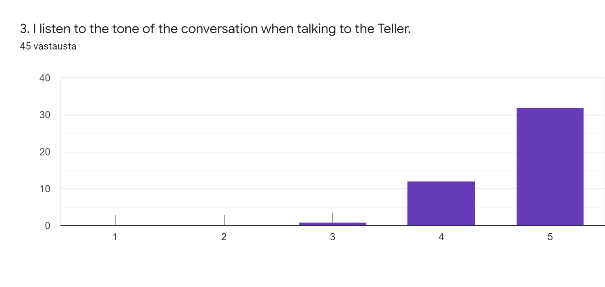
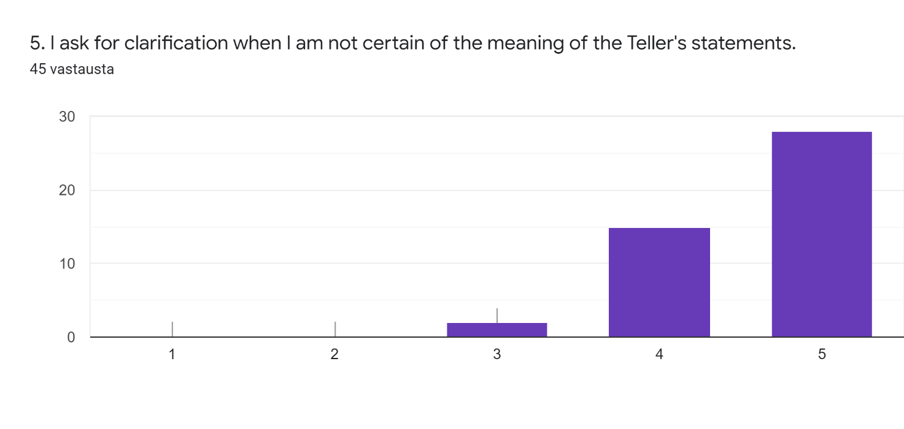
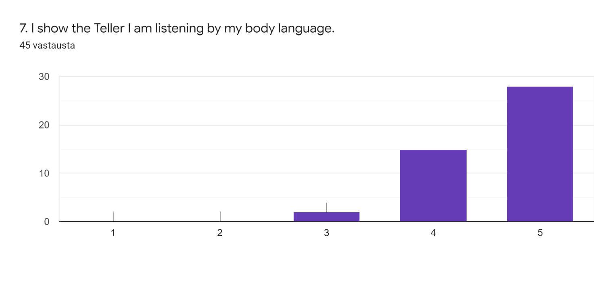
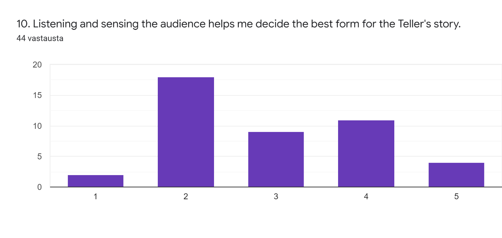
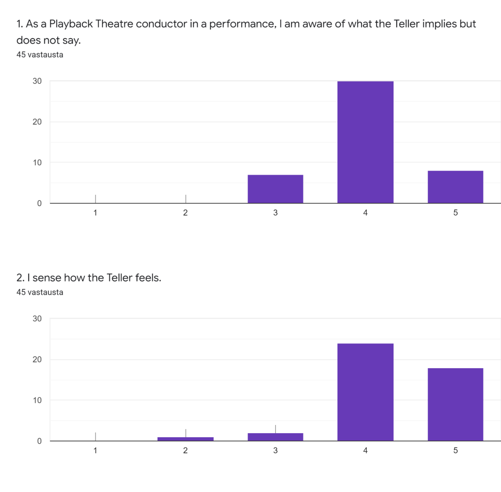
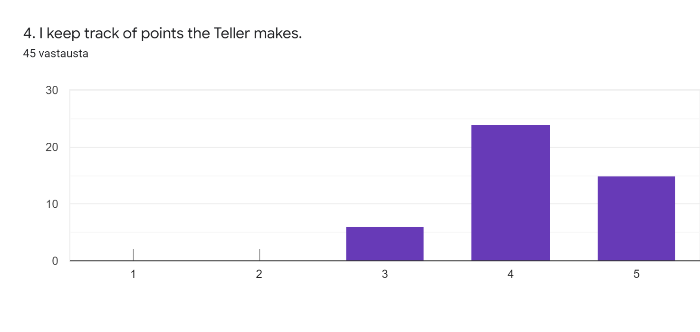
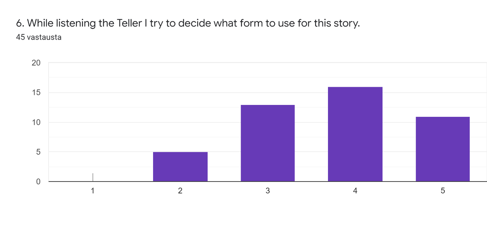
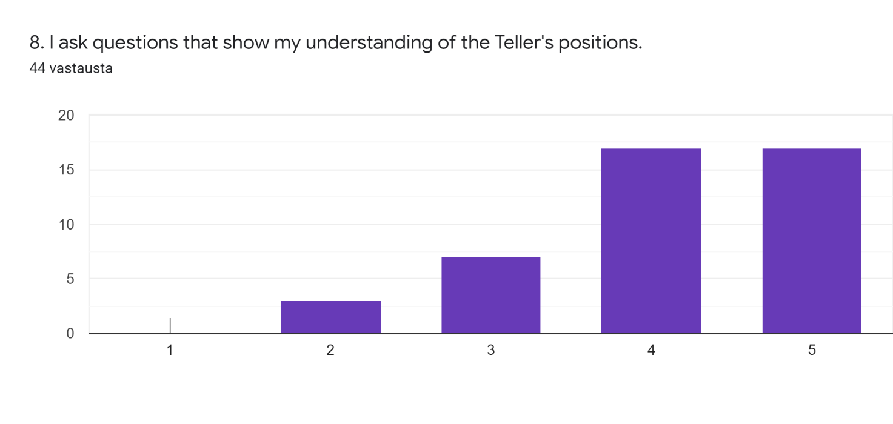
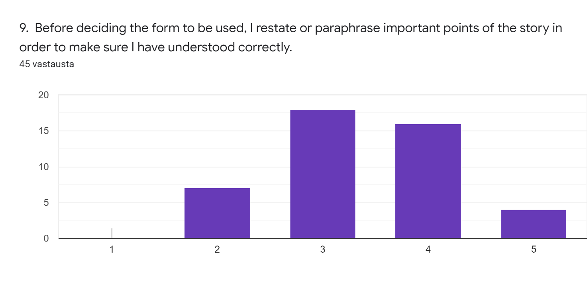

# THE ART OF LISTENING IN PLAYBACK THEATRE: Conductor’s perspective

Satu Prittinen

TTO 2018-2020

# Introduction

I see Playback Theatre is an art form with almost endless possibilities. Created with the audience and based on improvisation, it is crucial to have the structure and routines as a way of making the audience have some sense of predictability in the face of the unexpected events unfolding before them. Actors and conductor use different forms on stage to find and portray the essence of the story, also referred to as the heart of the story. (Pitkänen, PTC-studies, March 2019; Rahmel, PTC- studies, May 2019.) It can be referred to as a humble form of art, seeking to offer voice to all members of society, especially the ones silenced or ignored (Fox, H., 2007).

None of this is possible without one key element; listening. Listening can be viewed as simply sensing the audio waves one receives, but in order to understand those one must process them and finally the conductor and the actors do their best to respond by playing back the story they heard. This requires the listening to be both active and empathetic.

In this thesis I will explore the art of listening in Playback Theatre from the conductor’sperspective, mirrored against the theory of active empathetic listening (AEL), which includes three aspects: sensing, processing and responding (Drollinger, Comer &Warrington, 2006).

I wish to provide some answers to the questions about possible emphasises on different aspects of active empathetic listening and ways that the conductors describe their listening in the performance situations.

This has been done through a questionnaire with ten (10) 1-5 scale questions built or borrowed from the questionnaire of Active Empathetic Listening (Drollinger, Comer & Warrington 2006), covering the three aspects mentioned above. In addition to these there were two (2) open questions asking the describe aspects of listening in own words and to choose the most important of them. Posted on in a closed group on a social media platform for one (1) week in May 2020, the questionnaire received 45 responses.

# 1. Listening in the Playback Theatre

Playback Theatre was created by Jonathan Fox, Jo Salas and their company in 1975 (Rowe, 2007, p.12; Salas, 20.5.2011 TedTalk). Starting from an idea of offering a new kind of art to the communities and willingness to explore the unknown. It has spread to over 60 countries and continues to build understanding, empathy, dialog and change in various contexts. (Salas, 20.5.2011, TedTalk.)

In a nutshell the concept consists of an audience member sharing a real-life story about their own life. This person is called the “teller” and while telling they sit next to a Playback Theatre conductor at one (often left) side of the stage. On stage there are usually four (4) actors and at least one (1) musician. The conductor discusses with the teller, collecting the essential information about the story being told. Once finished, the conductor chooses a form (a structure) to be used for this story and says, “*Let’s watch*”, indicating to the actors and musician to begin their performance. Actors and musician work together to play the story back in an artistic form. (Rowe, 2007, p. 12; Salas, 20.5.2011, TedTalk; Salas & al., 2013.)

It is important for the conductor to listen to the teller and protect them from telling too much, in other words keeping in mind that the situation is also a live performance. Playback Theatre seeks to offer a safe space for different groups of people being heard, especially those that might be silenced or left out from the public discussions in the communities. (Rahmel, PTC-studies, September 2019 & May 2020, Pitkänen, PTC-studies, November 2019.) Everyone should be offered a chance to be heard without judgement or prejudice. However, this does not mean that Playback Theatre could be used as a mean to express insulting, belittling or harmful thoughts towards some individuals or groups of people. In case this happens, the conductor must stop the story from being presented on stage. These ethical frames built to ensure everyone can feel accepted and included, can sometimes create the illusion that Playback Theatre is political, which it is not (Rahmel, PTC- studies, May 2020.)

As described above listening is an essential part of Playback Theatre. There are many levels and layers of listening taking place simultaneously during a Playback Theatre performance. The audience listens to each other telling stories, conductor facilitating those and actors and musician performing them. The musician can be described as playing the emotional current of the story

(Salas, 20.5.2011, TedTalk). The listening must be deep and focused, attuned to the teller (Ng & Graydon, 2016).

## 1.1Previous studies

Playback theatre is built on the notion of the power of being heard. I would suspect it is quite common to have similar experience as Virginia Reed Murphy when first seeing one’s own story played back on stage with sincerity and emotion, as if it was the own story of those performing it. Describing feeling a deep connection, sensing the “*I am, because you are*”- phrase coming to life.

She felt that a simple act of listening with empathy can be life-giving. (Murphy, 6.3.2019, TedTalk.)

In its close to 50 years of existence Playback Theatre has also faced criticism and questioning. It has been seen too much like therapy and too process oriented as well as too artistic, depending on the viewpoint of the criticiser. (Salas, 20.5.2020, TedTalk.) Despite of this, it has kept going and growing providing numerous people around the world a chance of being heard and seeing their story transformed to art on stage.

There have been studies on Playback Theatre too, some Theses, many project or case based have been presented in scientific articles or books. I can only scratch the surface here but will try to present some of them. The two founders of Playback Theatre Jonathan Fox and Jo Salas have written and edited some books about Playback Theatre.

Jo Salas has written several books on her experiences with Playback Theatre, probably most famous being “*Improvising real life*- *personal story in Playback Theatre”* (1999). In *Improvising real life* Jo Salas describes the practice and the philosophy of Playback Theatre. Together with Heinrich Dauber, Jonathan Fox edited an essay collection called *“Gathering voices- essays on Playback Theatre”* in 1999. Jonathan Fox has recently written “*Beyond theatre- a memoir of playback theatre”* (2015) in which he explains the events and thoughts behind the vision that became Playback Theatre. He has also been writing a theory called *Narrative reticulation* based on his previous essaysand the thoughts of some members of the global Playback Theatre community. This has not yet been published but is available for educational use as a working paper. (Fox, 2016.)

Studies of Playback Theatre have covered for example using Playback Theatre to address bullying at schools (Salas, J., 2005), exploring the accountability and aesthetics when used among refugees (Dennis, 2008), enhancing communication among medical students (Salas, R. & al., 2013).

Playback Theatre as a method of intercultural dialog ( Feldhendler, 2007) and stories in PT as cultural production and an ethics of listening (Dennis, 2007). It has been used as a form of cultural resistance in the occupied Palestine (Rivers, 2015) and exploring empathy within Playback Theatre (Ng & Graydon, 2016).

As notable from these examples most of the studies on Playback Theatre have not focused on listening but more on the different contexts where Playback Theatre can be used in. Dennis (2007) comes closest to listening, looking at Playback Theatre as a community-based art form continuing the long tradition of coming together for storytelling. He sees Playback Theatre as a way of promoting ethical listening and anti-oppressive practices. I think listening is such an essential and irreplaceable part of Playback Theatre that focusing solely on that in a study has not been relevant or inviting. I find it interesting because of this. Listening is always present but can be taken for granted and overlooked when reflecting a Playback Theatre performance, because there are so many aspects to be considered as a conductor, which I will present now.

## 1.2The multifaced role of the conductor

During a Playback Theatre performance, the conductor must focus on multiple things simultaneously and yet appear to be very focused only on the teller while they are telling their story.

This is not an easy task and requires practice and understanding. It is very important that the performing group and the audience sense they can trust the conductor to have control of the situation and be open to any unexpected events. In order to succeed in this the conductor must be fully present in the situation and avoid being too self-critical (Rahmel, PTC-studies, January 2020).

Fox’s (2016) *Narrative reticulation* is built on four main categories or aspects; story, spontaneity, atmosphere and guidance. Story includes memorizing, order and a sense of aesthetic. Spontaneity refers to being present to events of the situation, ability to cooperate and Genuity or acting as oneself. Atmosphere covers being a human in front of other humans, being inviting and inclusive toward to audience, oneness between the audience and the performers and shamanistic energy. Guidance is built from the rituals, skills of protecting both the teller and the audience, knowledge of the ethical viewpoints, ensuring diversity in tellers, ways of choosing the next teller and conveying the sense of control to the audience. These are not hierarchical to each other but rather overlapping and intertwined together. All are necessary and important.

When exploring different Playback Theatre groups, Fox (2016) was able to detect that the difference between the groups establihing a true connection with the audience and those who did not succeed in this, came down to having a clear red thread in the performance. Thus, one important factor of the multifacedness of the conductor’s role is the ability to successfully combine these different aspects and create a sense of coherence in the stories, which are impossible to predict.

I think narrative reticulation provides an idea of the multifaced role of the conductor. During our studies Rahmel and Pitkänen also presented this Jo Salas’ idea of the seven different aspects of a Playback Theatre conductor. They are *master of ceremony, entertainer, performer, diplomat, therapist, clown* and *shaman*. These link quite closely to the aspects of narrative reticulation presented above. Master of ceremony keeps order and atmosphere; entertainer offers a piece of oneself to the stage in a personal way. Performer needs to be present; diplomat values all stories and seeks to empower diversity in stories. Therapist does not mean Playback Theatre would be therapy, rather it refers to the ethics that the conductor should always consider, often in the form of protecting the teller and audience from too exposing too much and the way a possibly traumatic story is played back. Clown enables the flow of different emotions and the importance of humour in a performance. Shaman is considered to be a spiritual guide. (Rahmel, TTO-studies, January 2019, from Salas, 1999.)

Both the multiple roles and the different aspects of Playback Theatre conductor and the previous studies are built on listening, an active, empathetic listening that can offer a profound sense of being seen and heard to the teller, as described by Virginia Reed Murphy (2019) above.

# 2. The Active Empathetic Listening (AEL) in Playback Theatre

I discovered the theory of active empathetic listening quite recently. I had already decided to explore listening from the perspective of the conductor in my thesis. Listening is often divided to three (3) dimensions in different models and theories. In the model of Active Empathetic Listening, which was developed by Comer and Drollinger in 1999, these dimensions are *sensing, processing* and *responding*. (Drollinger, Comer & Warrington, 2006.)

As my primary source for this I will use the article by Drollinger, Comer and Warrington (2006), which focuses on the interaction between customers and sales personnel. The article covers three separate studies through which it tries to provide validation to the scale and questions used in AEL.

Drollinger, Comer & Warrington (2006) wished to find ways of distinguishing the effective and ineffective listening among sales personnel.

This is by no means the goal of this thesis. I only wish to explore the listening in Playback Theatre context through these aspects. I think in Playback Theatre ineffective or superficial listening is notan option, the listening must be active and empathetic always. Empathy needs attuning to the feelings of someone else and attentive listening (Ng & Graydon, 2016). I will now present the three (3) dimensions, here referred to as aspects, as explained by Drollinger, Comer and Warrington (2006) combined to the context of Playback Theatre performance.

## a. Sensing

Sensing is the first and most basic of these aspects, as can be concluded by the name of this, it includes the concrete action of hearing the words. Also, non-verbal messages and things referred to but not expressed verbally are included under sensing in AEL. (Drollinger, Comer & Warrington, 2006.) In Playback Theatre performance listening as sensing takes place especially between the conductor, actors, musician and the teller. All performers pay close attention to the words being said, the body language and the in-between-the lines hints provided by the teller. During the telling of a longer story the conductor sits next to the teller and often is the person teller focuses on when telling the story.

## b. Processing

Processing covers the cognitive operations of the listener, which happen mostly simultaneously with sensing. It has four functions, (1) understanding the meaning, (2) interpreting the underlying implications, (3) evaluating the importance of the cues and (4) remembering the message by updating material in memory. (Drollinger, Comer, Warrington, 2006.)

In the context of Playback Theatre, the conductor (and other performers) seek to follow these steps when listening a story. It is important to understand what the teller means, interpreting and evaluating the cues given and lastly to constantly pile the information to their memory to be used when playing the story back. This aspect includes also the questions, statements and comments of the conductor during the telling of the story. With these the conductor ensures correctunderstanding, encourages to tell more if necessary or also gently and respectfully guides the teller to conclude their story if it seems to be becoming too wide or long. The conductor makes sure the actors and the musician have enough material to work with when playing the story back to the teller.

## c. Responding

The last of the three aspects is responding, which means that the listener offers signals to the talker that they have been heard and understood. These can be either verbal or non-verbal. Listener often encourages the speaker to continue speaking, if interrupted for a question. If no clarification isneeded this can be as simple as nodding the head or offering short verbal prompts. (Drollinger, Comer & Warrington, 2006.)

Responding in Playback Theatre starts when the teller has finished telling their story. The conductor has a big responsibility already here in building trust and making the teller feel heard and also choosing the form to be used in playing back the story. Here the conductor must consider the viewpoints of the performing group, the audience and the teller. The point is not to simply act out the story as it has been told, but to respectfully and avoiding too much interpretation seek to provide the essentials of the story in slightly modified form. It is important that the teller recognises the story but ideally also sees something they did not explicitly tell.

The conductor has a crucial role in making this possible as sometimes choosing less than ideal form for the story can restrict the potential of the actors and musician. In my experience giving too much liberty to beginner level actors and musician can result in prolonged and non-coherent stories on stage. Thus, it is important that the conductor knows the performing group and offers them challenges and possibilities based on their skills. The conductor enables the group to shine and succeed.

Should something unwanted to happen during a performance it is important that the conductor can openly acknowledge their failure in choosing a form for the story. It is always possible for the teller to comment the played back story and to tell, if something did not match their telling or ifsomething important was left out. If needed the conductor can offer the chance of a redo, which can be important for both the teller and the performing group. I suspect this can happen more often when the conductor does not have a long experience. Yet I also think that one can never be ready as a Playback Theatre conductor (or any performer) and admitting own missteps builds respect and trust.

# 3. Questions and analysis

In order to collect answers from Playback Theatre conductors around the world I created a short questionnaire using Google forms. The questionnaire included ten (10) questions with a Likert-scale from 1 to 5. The value 1 represented never and value 5 always. Google forms did not allow naming the values in between, but they more or less represented 2 rarely, 3 sometimes and 4 often. Of course, I cannot be sure these are the labels used in the minds of the people responding to the questionnaire.

I posted the link to the questionnaire on the Facebook page of a closed group called *Playback Theatre around the world* with a short description of its use (Attachment 1). The questionnaire (Attachment 2) was posted on 24th of May 2020 and it was open for answers until 31st of May 2020.

The limited time was chosen mainly because of the length of this thesis as I wanted to include all the answers to my analysis and would not have been able to do so with a large data.

For my research questions I chose two (2) questions. The first seeking to cover the scale questions and the second the open questions.

Questions

1. Which aspects of Active Empathetic Listening are emphasized in the answers from Playback Theatre conductors?
2. How do the conductors themselves describe their listening and the most important aspect of it?

In the original AEL questionnaire there are 21 statements. For sensing and processing there are eight (8) for each aspect and five (5) for responding. As I took these quite far from their original context of sales personnel and their customers, I only choose some of the statements, some I modified and one I created myself loosely based on the original questions. In my questionnaire for the Playback Theatre conductors there were ten (10) questions with the scale from 1-5. Of those three (3) focused on sensing, three (3) on processing, three (3) on responding and one (1) own which combined sensing, processing and responding.

In analysing the answers, I started by looking at the charts provided automatically by forms I used. In searching the emphasis, I was looking at the questions that had most answers on the values 4 and 5, meaning often and always. I arranged the answers based on the most agreed on when calculating together the percentage of answers in those two values. In presenting these results I will use the aspects of sensing, processing and responding.

# 4. Results

## 4.1 Results on the emphasized aspects of listening by Playback Theatre conductors

Here are the results for the research question 1, collected from the questions with a scale. Results are presented through the aspects of listening from the AEL. I will present only some of the charts here, all of them can be found in the Attachment 3.

*Sensing*

Sensing was covered in the first three (3) questions of the questionnaire. These were about being aware of what is implied but not said (Q1), sensing how the Teller feels (Q2) and listening to the tone of the conversation when talking to the Teller (Q3). Sensing from these perspectives showed to be often taking place among the responders. None of these received any answers for the value 1, indicating never and only sensing how the Teller feels (Q2) received one (1) answer to value 2.

Question 3 (*I listen to the tone of the conversation when talking to the Teller)* received the highest percentage (97,8%) of values 4 and 5 both in the sensing subsection and the overall comparison of all the ten questions. Sensing the Teller’s feelings (Q2) had 93,3 % of answers on values 4 and 5, placing 3rd on the overall comparison As a Playback Theatre conductor being aware of what the Teller implies but does not say also received high percentage of values 4 and 5, totalling to 84,5% and 5th overall placing.

Sensing seemed to take place often in these forms during a Playback Theatre performance. Empathetic listening in AEL, ethical listening and deep and active listening are all present in these (Drollinger & al., 2006; Dennis, 2006; Murphy, 2019). Paying attention to both the words being said and the non-verbal messages was important to the effective listeners in Drollinger & al. (2006) studies. This seems to happen a lot among the Playback Theatre conductors, who answered the questionnaire.

*Figure 1 Q3 Highest agreement on sensing and in overall comparison*

These seem logical because sensing the tone of the conversation and the Teller’s feelings are important factors guiding the conductor during the discussion with the Teller. To my short experience with Playback Theatre some of the greatest successes of playing the story back have taken place when the Teller discovers something on the stage, they were not verbalizing but still recognize. I think the power of Playback Theatre stems from this kind of moments, sometimes happening to the Teller and sometimes to a member of the audience reflecting their own experiences against those presented at the stage. These are moments of exploring the unknown (Salas, 20.5.2011, TedTalk), building empathy (Ng & Graydon, 2016), Genuity and spontaneity, being open, present and authentically oneself (Fox, 2016) and being deeply moved as a teller (Murphy, 6.3.2019 TedTalk).

*Processing*

The following three questions were about processing. Question 4 about keeping track of the points the Teller makes, question 5 asking for clarification when not sure of the Teller’s meaning and question 6 about deciding the form to be used while listening the Teller.

Asking for clarification when not sure of the meaning of the Teller’s statements (Q5) was very common among the Playback Theatre conductors who responded to the questionnaire. 95,5 % of them gave values 4 or 5, an shared 2nd place in overall comparison. Keeping track of the Teller’s points (Q4) was almost as common, 86,6 % of the responses had either value 4 or 5, 4th in overallcomparison. Deciding the form while listening to the Teller was not nearly as common, receiving only 60% of the answers to values 4 or 5, placing 7th on overall comparison.

*Figure 2 Q5 Highest agreement on processing, shared 2nd in overall comparison*

Ensuring correct understanding of the Teller’s statements cannot be overlooked as this would most likely result in playing back something that the Teller does not recognize. Therefore, the high agreement on this among the Playback Theatre conductor’s makes sense. In the overall comparison this was in a shared second place, when comparing the percentage of answers given to values 4 or 5.

Keeping track of the Teller’s points implies to active and concentrated listening and the goal of doing justice to the story when choosing a form and giving it to the actors and musician. As presented by Drollinger & al. (2006) processing is about understanding the meaning and interpreting the implications, which were shown to be important in the sensing section.

The clear drop on the commonness of deciding the form to be used while listening to the Teller (Q6) can be because of several factors. Value 3 received 28,9% of the responses in this and value 2 11,1%. The most obvious answer could be that deep and active listening often means clearly focusing on one thing, in this case the Teller’s story. Also, it is necessary to listen the full story before deciding the form to be used. The story must be remembered by constant updating

(Drollinger, Comer & Warrington, 2006). In narrative reticulation’s story category Fox (2016) refers to memorizing, order and aesthetics, which are all necessary to choosing a form. The answers indicate that thinking about the form takes place sometimes during the Teller’s story, but not as often as some of the other aspects of listening covered here.

*Responding*

Responding was the aspect behind questions 7, 8 and 9. Showing listening to the Teller by body language (Q7), asking questions to show understanding of Teller’s positions (Q8) and restating important points of the story to ensure correct understanding before choosing the form (Q9).

Expressing one’s listening through body language was very common among responders, values 4 or 5 were given by 95.5% of them, shared 2nd place in overall. Asking questions to show understanding only had 77,2% on values 4 and 5, on 6th place in overall comparison. The least common form of responding based on these three questions was restating or paraphrasing important points of the story before deciding the form (Q9), values 4 or 5 given by 44,5% of the responders, placing 8th in overall comparison.

Body language (Q7) was on shared second place of the overall comparison based on the percentage on values 4 and 5 combined. In Playback Theatre the uninterrupted listening is important in delivering the sense of being heard and seeking to understand instead of assuming. Expressing with body language that the conductor is listening allows the Teller to continue telling their story and probably feeling safe to do so. Showing understanding by asking questions was used quite often too. Body language as a response was the most important for the responders. The importance of body language was also noted in the study of Drolliinger & al. (2006).

*Figure 3 Q7 Highest agreement on responding, shared 2nd in overall comparison*

Restating or paraphrasing the important points (Q9) before deciding the form got value 3 from 40% of the responders. This could be because there is not only one way of conducting a Playback Theatre performance nor are the Tellers alike, so this most likely depends on the situation and could indicate to the Teller that they were not listened to or understood before this. Maybe because of this this is not an often-used way of responding to a Teller’s story.

As a conductor the need for this could probably be prevented by using good questions along the discussion with the Teller and also by trusting the listening of the performing group. I would assume this is necessary if the Teller has ended up telling a lot and on different topics or about something very personal and vulnerable. This falls into Fox’s (2016) narrative reticulation’s guidance, which includes the rituals and protection of the teller, the audience and the ethicality of the performance. This is most clearly evident in the responding by choosing the form.

Question 10 was my own creation, which combined sensing, processing and responding. “*Listening and sensing the audience helps me decide the best form for the Teller’s story.”* This was clearly the question receiving least values 4 and 5, only 34,1% of the responders. It placed last, 9th on the overall comparison of agreement in the responses. Value 3 was given by 20,5% and value 2 by 40,9% of the responders.

*Figure 4 Question 10 Least agreement among the responders*

In retrospect the most obvious reason for this is probably that in the question/statement I have placed the audience in front of the Teller, as if listening to the audience instead of the Teller would assist in choosing the best form. As will be presented below, holding the Teller front and centre wasimportant for many these Playback Theatre conductors. Multitasking, sensing and considering the audience was mentioned too and is also important but does not surpass the Teller. Another possible explanation for this is that the statement also implies that somehow the audience would offer the best form to the conductor, if they only pay close attention. Quite the opposite, the conductor makes the decision to the best of their abilities bearing in mind the audience and the previous stories of that performance. They do not always find the best possible form in the short time span they have available, but most definitely they all try their best at doing honour to the story trusted for them.

4.2 Aspects of AEL emphasized in the answers of PT conductors

The overall comparison mentioned above show quite nice division between the three aspects of listening, the first three are all from different aspects. However when combining the percentage of the three questions of each three aspects of listening (sensing, processing and responding), sensing receives the highest average percentage of 91,86% on values 4 or 5. Processing follows with 80,7% average on values 4 or 5, and responding on 72,4% average on values 4 or 5.

This might be because as described earlier, sensing is not an option, it must take place in Playback Theatre. As must processing and responding, but to divide them into these small pieces probably does not do them justice and they also offer more flexibility and space for diversity than the questions under the subsection of sensing.

Because of this diversity I included also the open questions offering responders the chance to describe different aspects of listening in their own words and also to choose one aspect that the conductors would consider to be the most important.

## 4.2.1 Conductors own descriptions of listening

The analysis of the open questions was done as a content analysis. Instead of mirroring the results against some classes, I created own classes for them based on what I found in the data. First, I read the answers through a couple of times. Then I made mind maps collecting different expressions used in the answers. From those I combined similar answers and created classes. In classifying the data, I used different colours for each class, underlining the words and expressions belonging to that class. Finally, I collected all the different answers of each class. All of the answers to open questions can be found in Attachment 4.

For the question 11, which requested to use own words in describing the different aspects of listening in a Playback Theatre performance, I received 43 answers. All responses received a running number to distinguish them from each other, in front of this number there is capital R,referring to “respondent”. The classes I formed of those answers were *reflecting (a), deep and active listening (b), multitasking (c) and focus on teller (d).* I present them in this order, which is based on the number of answers classified to each category. I classified the answers based on the first information offered in them. There were only few answers that fit neatly under one category, most had at least two categories included in them. When presenting quotes from the answers I will indicate the parts, which were not classified under that category.

*a. Reflecting*

The category reflecting included 13 answers starting with reflection or comment about the conductor’s work. Some offered a sort of a guideline like in answers (R26, R36 and R38).

> *“This job needs practise and the more you do it the better you will get. I hope :)*”(R26) (underlined categorized as a comment, excluded from the categories.)
> 

> *“I have to listen to how the story connects not only to the teller, but also to stories that came before it, or perhaps feelings that others in the audience wish to express.”* (R36) (underlined categorized as multitasking)
> 

> *“Ohjaajan tulee yhtälailla kuunnella kertojaa, **yleisöä ja esiintyjiä.”*** (R38) (underlined categorized to focus on the teller, bolded as multitasking)(trans. The conductor should equally listen to the teller, audience and the performers)
> 

Some answers were more in more simple forms, stating the important aspects of listening as a Playback Theatre conductor, like R41 and R42. One responder (R43) criticized the entire usage of the aspects, stating that listening with the heart is what they try to do.

> *“Sensitive, Open, Aware.”* (R41)
> 

> *“for me in one word is to be present as a conductor* “(R42)
> 

> *“I try to listen with my heart - what do you mean by aspects?”* (R43) (underlined marked as comment, outside of the categories)
> 

In these answers there were indicators of Genuity from narrative reticulation (Fox, 2016) and diplomat from the theory of seven roles of a Playback Theatre conductor (Salas, 1999). Diplomat means understanding conductor’s key role in offering diversity and value to stories being told. From the AEL theory (Drollinger, Comer & Warrington, 2006) these answers are closest to processing, handling and seeking to understand the information one receives. I think these answers signal the responsibility for the different aspects of listening. Although one responder (R43) clearly found thisunnecessary to chop the listening to smaller pieces. I agree that it is artificial and might not offer any additional value to the importance of listening. However I feel that pausing to reflect the complexity of not only listening but all the different aspects affecting it in a Playback Theatre performance can be beneficial.

*b. Deep and active listening*

In this category there were 12 answers, which began with something I classified under deep and active listening. As can be detected from the name of this category, this included all the three categories of AEL (Drollinger, Comer and Warrington, 2006). Non-verbal messages were mentioned in many, like in answer by R2. This was sometimes taken even further like in the answer R10, which adds listening with all of them to the active listening.

*Non verbal language is as or even more important as verbal.* (R2)

*Escucha activa, con todo mi ser, con empatía y sin querer agregar nada o refutar nada**, entrando en el mundo y tratando de ver con los ojos del narrador*** (R10)

(underlined part in multitasking, bolded under focusing on the teller) [own trans. active listening, with all of me, with empathy and without wanting to add anything or repeal anything, entering the world and trying to see it with the eyes of the teller.]

*It's a combination of active, emphatic listening and artistic listening* (R34) (underlined part in reflecting)

*I listen to the body language and also what is not said and then the actual words...(*R40)

These terms could have been used in the answers anyway, but now the number of them in answers might have been affected by the name of the questionnaire and my thesis. Being fully present as in spontaneity of the narrative reticulation theory (Fox, 2016) can also be seen in these answers. From the seven roles of conductor (Salas, 1999) performer comes closest, as being present and aware of the upcoming performance.

It is easy to see the connection between the scale-questions presented above and this section. The importance of the non-verbal language and the implications offered by the teller. Also, empathy and the interest to understand are present.

*c. Multitasking*

In this category there were 10 answers. They were often quite long. Answers in the category of multitasking included several aspects of listening, curiosity and seeking to understand. Also considering the audience’s perspective was present in some of these answers. In multitasking allthree aspects of AEL (sensing, processing and responding) were present. From the narrative reticulation theory (Fox, 2016) building the atmosphere comes closest and of the seven different roles of a conductor the master of ceremony (Salas, 1999). Also finding the red line of the story (Fox, 2016), among the different aspects and unfolding events was mentioned.

> *“One must listen to the feelings, the story, the red line of the story, the warmth of the audience, the security of the whole crowd, actors and musicians feelings and awareness. It is really a quite of a puzzle and because it happens all in just a moment, you quite seldom get to think these aspects afterwords. This is why one should always check in a performance situation and also afterword (with the group): did I hear correctly?”* (R7)
> 

> *“The info, the feelings, the dreaming behind the story, the impact of the story/ teller on the overall atmosphere of the performance, the storyline connecting this story to the ones already told, choosing the form, recap the story if needed.* “(R12)
(underlined part coded to reflection)
> 

> *“Listen to the dialogue and interrelations between different stories”* (R37)
> 

As can be seen in these examples from the answers in this category, they describe the complexity of conductor’s tasks during a performance. As mentioned in the answer of R7, this is quite the puzzle in the short timeline available. Ensuring the atmosphere, being impacted by the story and even the dreaming taking place behind the story (R12). The interrelations between stories (R37) can also refer to the role of diplomat from seven roles of the conductor giving value to all stories (Salas, 1999), ensuring the diversity of the stories being told and guidance (Fox, 2016) in enabling diversity of the tellers.

*d. Focus on the teller*

There were 8 answers starting with the focus on the teller. These answers gave center stage to the teller, sometimes only focusing on the teller, like in answers R1 and R2. Sometimes they included also elements of other categories like in answers R23 and R32. Making the teller feel at ease, seeing themselves a facilitator, giving space for them and feeling their mood.

> *“I try to help the teller feel comfortable and supported while telling the story.* “(R1)
> 

> *“Listening as being channel, listening as facilitating”* (R3)
> 

> *“it is a special art to listen the heart of the story with a great respect to the the teller”* (R15)
> 

> *“Provide a space for the teller to show their inner self to the audience and the member of our Playback Company* “(R23) (underlined part categorized in multitasking)
> 

> *“To feel de mood of the narrator and to go deep with the essence”* (R32) (underlined part categorized in heart of the story)
> 

R15 answer is compact but it includes two very important points to listening, respecting the teller and a challenge requiring skills; seeking to hear the heart of the story being told.

Of the aspects in AEL answers in focusing on the teller category come closest to processing and responding. Especially processing in collecting the important points of the story. The descriptions are also about guidance in narrative reticulation (Fox, 2016), telling especially about the protection of the teller and maintaining the rituals, also atmosphere is present in the answers. Diplomat ensuring diversity in stories and therapist as protecting the Teller connect from the seven roles of the conductor (Salas, 1999). The importance of finding the essence in the story, the red thread of the story and eventually of the performance (Fox, 2016).

*Final notes of these results*

Since many of the answers contained parts of different categories, I created a system of dividing them into different categories, which was based on the beginning of the answer. This was not very clear cut and if the answer began with a comment or a side note, I used the first category followed by that. Each question only belongs to one (1) category, although it might contain parts of several others too. This proved to be quite an interesting approach with this question, since the question was open, and it would have been possible to start with anything. I think this could indicate something about the most important or at least the easiest to remember factors of their listening as a Playback Theatre conductor.

## 4.2.2 Most important aspect of listening

The final question of my questionnaire was number 12, which asked to name the most important aspect of listening in Playback Theatre performance. There were 43 answers to this question. Since the question was about the most important aspect, these answers were significantly easier to categorize than those of question 11. Still some answers contained several aspects, which I find telling of the complexity and the multiple levels of Playback Theatre conductor’s work.

I formed five (5) categories based on the answers. They were *active listening and presence (a), empathy (b), openness and curiosity (c1), sense of dramaturgy (c2) and being sincere and respectful (c3).* Categories a and b both received a bit more than ten (10) answers. All of the rest categories had five (5) answers each, which is why I have named them all with the letter c and a running number. In addition to these there was one (1) answer which was more of a comment than an answer (R43), which I decided to leave outside of these categories.

Q12 in the questionnaire was “*What do You consider to be the most important aspect of listening in a Playback Theatre performance*?” With these answers I seek to answer the last part of my research question 2: How do the conductors themselves describe their listening and the most important aspect of it?

*a. Active listening and presence*

In this category there were 14 answers, all choosing listening or presence as the most important aspect of listening. The answers about listening included the teller, like in R16 and R17, but also the importance of being present and listening to oneself (R17 & R21). In the AEL answers in this category fall into sensing and processing (Drollinger, Comer & Warrington, 2006).

> *“A listening that communicates the safety to the teller and also a listening which is able to take the audience along with the story”* (R16)
> 

> *“Being present to myself and to the teller so I can really hear while holding the needs of the audience and the team.”* (R17)
> 

> *“Listening to myself. There's a lot more I could say, but there is no space, and you only asked for one important aspect.”* (R21) (underlined marked as a comment)
> 

Listening was also described from the perspective of balancing and making decisions when to comment and when to remain silent (R18). Reference to leadership skills speaks again about the responsibility the conductor holds towards the teller, performers and the audience.

> *“Active listening - showing you are listening and trying to balance between being scilence and nutral to ask questions and lead, in other words showing dominance leadership skills“(*R18)
> 

> *“Deep Listening, Compassionate Listening, Listening to help the teller empty his/her heart*.” (R41)
> 

The importance of being present belongs also to Fox’s (2016) spontaneity in narrative reticulation and Salas’ (1999) performer in the seven roles of the Playback Theatre conductor. Listening also needs to be compassionate and deep (R41), which bring us to the other main category of this question, empathy.

*b. Empathy*

Already at first glimpse of the answers to this question, the frequency of empathy was easy to notice. There were 13 answers in this category, and it is noteworthy that many of them were short, some only single word- answers like R19. Empathy is so central, that it seemed to be sufficient to refer without any clarification or explanation. Partly this can also be about being loyal to the question, which asked the responders to name only one aspect. Sensing is the aspect of AEL (Drollinger, Comer & Warrington, 2006), I would connect to this category.

> *“Empathy”* (R19)
> 

> *“Empathy and acceptance, as well as a sense of dramaturgy. It is really hard to decide between those.”* (R6) (underlined in sense of dramaturgy)
> 

> *“Tellers feel safe to share”* (R23)
> 

> *“Empathy/Compassion, Sensibility, Charme and Humor”* (R28)
> 

Protecting the teller and the audience requires empathy, as in the atmosphere of narrative reticulation (Fox, 2016). Building empathy and understanding (Salas, 20.5.2011, TedTalk) and the power it has to the teller (Murphy, 6.3.2019, TedTalk) support the notion that empathy is an important part of Playback Theatre conductor’s work. Both the therapist and diplomat from the seven roles of conductor also support the need of empathy, protecting the teller from oversharing while empowering diversity on stage (Salas, 1999).

*c.1 Openness and curiosity*

In this category there were 5 answers. In AEL openness to anything offered in the discussion is about sensing (Drollinger, Comer & Warrington, 2006). Fox’s (2016) Spontaneity and Salas’ (1999) clown also include the importance of being open to different events and feelings taking place in the performance.

> *“One must be open to all the feelings around: my own; tellers, audiences', actors. These feelings can be used as a map to the listening.:)”* (R7)
> 

> *“Openness”* (R37)
> 

> *“be open to every thing the teller bring be curious never forget "who how where when and why(but why not always) “(*R42)
> 

Taking different perspectives, expressing curiosity and receiving the feeling in the performance (R7 & R42). Also, here some answers only had only one word. I think this category links closely to both empathy and active listening. In R42 it is also reminded, perhaps because of the knowledge that I am only beginning my journey as a Playback Theatre conductor, that it is important to take care of the structure and not merely to receive everything as it is offered. This links closely to Story in narrative reticulation (Fox, 2016) and to the next category of answers.

*c.2 Sense of dramaturgy*

Having a sense of dramaturgy is about maintaining the structures, rituals and keeping in mind that the story is soon taken to the stage (Fox, 2016). This category had also 5 answers. In order to do this, one needs to process and respond adequately to what is being told (Drollinger, Comer & Warrington, 2006). Keeping track of the important points and making sure everything runs smoothly is the job of the master of ceremony (Salas, 1999).

> “*The combination of " heart of the story" and the systemic/ socialogical poatterns”*(R20)
> 

> *“The turning point. Where there comes a change in the story, and the essence of that change can bring the teller and the audience to a deeper understanding”* (R27) (underlined marked as empathy)
> 

> *“The important aspect is the essence of the story. Why is it that this story wants to be told? What needs to be express”* (R33)
> 

The answers reflect the theory presented above. As in the answers to question 11, they lift up the importance to find the heart of the story, the essential part of it (R20, R33), some refer to a turning point (R27). These are almost like descriptions of detectives at work, they keep constantly in mind the upcoming performance and seek to find the essence for the actors and the musician to work with.

*c.3 Being sincere and respectful*

The last category of question 12 is about sincerity and respect. Both much needed in the Playback Theatre performance. There were 5 answers in this category. Sensing (Drollinger, Comer &

Warrington, 2006), Genuity (Fox, 2016) and diplomat and entertainer (Salas, 1999) connect with this category. Sensing is about actively listening, Genuity is about being authentic self, entertainer offers a piece of oneself to the stage and diplomat respects and values diversity in the stories.

> “*Being sincere.”* (R3)
> 

> *“to be with the tellers and audience and find the common humanity.”* (R30)
> 

> *“Listening without prejudice, and listening with all my senses, because not everything is expressed in words”* (R36)
> 

These answers reflect all those elements. Relying on the different senses, again the importance of non-verbal communication is raised in R36’s answer. Simply just being sincere in R3 and the element of a global interconnectedness in the form of our humanity in R30. Linking closely to Fox’s (2016) description in atmosphere, being a human in front of other humans.

*Final notes on this question*

The answer left out of these categories was R43. The responder, most likely already expressing the listening with heart, and questioning about the aspects of listening in question 11, was clearly frustrated in the answer to the last question. I am grateful for this commentary answer as it provokes questions. If the questions about aspects in listening seemed irrelevant to this responder, why go through the trouble of answering the entire questionnaire, including the open questions. There were 45 answers in total to the scale questions but only 43 to the open questions, so 2 responders did not answer them. Perhaps this responder saw these text fields as a place for offering feedback to me, rather than forms of collecting information on the requested topics.

> *“Listening is listening!!!! There are no „aspects“!”* (R43)
> 

# 5. Conclusions

In the overall comparison it was clear that sensing was the aspect emphasized in the answers of the Playback Theatre conductors, at least in the form of most agreed upon in the relation to these questions. In questions about sensing the average percentage of answers to values 4 or 5 was 91,86%. In processing the same was 80,7% and in responding 72,4%.

Of those listening to the tone of the conversation was the most important (97,8% of responders gave either value 4 or 5). Although some of the questions about processing and responding did not produce wide agreement, some of them did. In processing asking for clarification when needed reached as wide agreement as showing listening by one’s body language in responding, both 95,5% on values 4 and 5.

The agreement was lowest on the question 10, which tried to combine all three aspects, stating that listening and sensing the audience helps to decide the best form for the Teller’s story, only 34,1% on values 4 or 5. The other question with less than half (44,5%) of the answers on the values 4 and 5, was also about choosing the form (Q9), if one restated important points before deciding the form.

As I already concluded earlier, I think these questions imply that listening to the tone of the conversation, making sure of correct understanding and both using and reading the body language are so crucial elements or aspects in the Playback Theatre that they take place often regardless of the conductor on the stage. However, this is not the case in choosing the form or ways of responding to the story being told. I would say in these the personality of the conductor is more present. I do not mean that listening or using body language would be free of the conductor’s personality, rather that they are more universal in sensing than in the following parts.

Processing and responding can vary based on the country, culture or even more specific context of the performance, as all the performances reflect the audience, they are cocreated with. I think you can also see the style of the conductor, their natural rhythm of doing things in processing and responding. Experience is important factor too. An experienced Playback Theatre conductor can probably trust their intuition more, fully focus on the story when it’s being told and decide the form on the spot when the story is finished without any explicit sign of hesitation or uncertainty. This might not be the case with the beginning conductor, as they might fear not being able to come up with a good form in the short time available at the end of the story and thus consider the form to be used already during the teller’s story.

The open questions offered a chance to describe important aspects of listening in own words and to choose the most important aspect of them. In the answers reflecting, deep listening and multitasking were important. Constantly reflecting one’s work as a conductor, seeking to improve and the consideration of many different events and processes simultaneously were presented. Focusing on the teller and finding the heart of the story is only possible when fully present and engaged to the situation. I think these answers demonstrated the never-ending path of a Playback Theatre conductor with multi-tasking and balancing not to overlook any of these elements.

The most important aspects of listening in their own words were most frequently deep and active listening and empathy. These were followed by sense of dramaturgy, openness and curiosity, sincerity and respect. As a community based form from the start, Playback Theatre has been seeking to understand (Salas, 20.5.2011, TedTalk), listen without prejudice while keeping both the audience and the teller safe (Fox, 2016) and treating everyone with respect and empathy (Rahmel, PTC-studies, September, 2018). It was interesting how unanimous the answers were given the fact that they came from around world.

I mirrored all the answers to AEL (Drollinger, Comer & Warrington, 2006), narrative reticulation (Fox, 2016) and seven roles of PT conductor (Salas, 1999) and was able to find connection to these in the both the scale and the open answers.

# 6. Discussion

Writing this thesis has been an interesting journey, which suiting to the exceptional spring and summer it was done in, got delayed several times. Once I was able to focus on it more fully, it kept expanding longer than I had anticipated. That being said, I think it was important that I was able to use all the answers received through the questionnaire. In retrospect I might have used fewer of them. Exploring the answers has been thought-provoking and I feel I have learnt a lot. I am deeply grateful to all of the Playback Theatre conductors that took the time to answer my questionnaire. Receiving 45 answers in one week speaks volumes about the general attitude of the global Playback Theatre community, which I feel privileged to belong to.

I discovered Playback Theatre quite late. I had done amateur theatre for about half of my life in different groups and attended some improvisational events. As a result of several consequences I stumbled to a webpage about Playback Theatre conductor studies. I was immediately fascinated by the form, which seemed to enable combining my love of theatre, being present and listening thestories of others. It was equally powerful experience to first witness something dear to me heard accurately and presented on stage.

I grew up reading books whenever possible, both fiction and non-fiction. I also had the privilege of often listening to my grandparents’ stories about the events in their lives. Taking the perspective of someone else and momentarily looking at the world through their lenses is important and valuable to me.

To this background it seemed that listening was the right focus for my thesis. Although I realized that only after hearing someone else in our small training group choosing it. He planned to focus on the actor’s perspective and did not mind me focusing on the conductor’s.

Finland is a country of small population with smallish but active Playback Theatre community. Because it might be difficult to receive a reasonable amount of answers only from Finnish Playback Theatre conductors, I decided to write my questionnaire and my thesis in English. This decision provided me an opportunity to include the global aspect and possibly different views of the global Playback Theatre community reachable via a social media platform.

One thing I was struggling with since the beginning of this thesis was the in-betweenness of it. It was not supposed to be an academic thesis nor merely pondering and reflecting own thoughts around the subject. As it is visible in the structure and headlines of this work, I was unable to let go of the familiar structure, but I tried to include more of my own voice and emphasize the analysis, results and conclusions.

*Limitations*

When looking at my conclusions it is important to remember the obvious limitations of it. The questionnaire was shares via a social media platform in a closed Playback Theatre group and only open for a week for answers. It was written in English with specific and multiple terms, which might limit someone’s possibility to either understand the questions or to answer them at all. What I found to be delightful was the fact that some replies to the open questions were written in other languages than English. Instead of not answering at all because of limitations to express oneself in English the participants answered in the language they felt most comfortable with. Especially those answering in Finnish could be sure I would understand their answers. The answers in other languages than Finnish or English were quite short. So, in retrospect I could have written that answering in different languages to open questions is possible, maybe presenting the languages I am able to understand and the possibilities of current technology for translating a few sentences.

One limitation is also the number of answers, in order to make a more sophisticated conclusions I would have needed more data. That being said, I think that even with multiple times more data it would not be wise or necessary to try to reach a strong conclusion about the listening from the perspective of a Playback Theatre conductor. I had anyway guided the answers by using mostly the Likert- scale questions with statements only slightly modified from the original questionnaire of active empathetic listening. Also, to my understanding the very essence of Playback Theatre is multivoicedness, which I think applies to both the tellers, actors and the conductor. There isn’t only way to a successful listening in Playback Theatre or ways of expressing the understanding, respect and empathy when listening.

What I hope this thesis can provide to Playback Theatre conductors, actors and musicians is a glimpse of one way of exploring the multifacedness and the demanding but often rewarding balancing of listening taking place when the conductor listens during a performance.

# References

Dennis, R. (2007). Your Story, My Story, Our Story: Playback Theatre, Cultural Production, and an Ethics of Listening. *Storytelling, Self, Society, 3*(3), p. 183. doi:10.1080/15505340701505727

Dennis, R. (2008). Refugee performance: Aesthetic representation and accountability in playback theatre. *Research in Drama Education: The Journal of Applied Theatre and Performance: PERFORMANCE AND ASYLUM: EMBODIMENT, ETHICS, 13*(2), pp. 211-215.doi:10.1080/13569780802054901

Feldhendler, D. (2007). Playback theatre: A method for intercultural dialogue. *Daniel, Scenario*, (2).

Fox, H. (2007). Playback theatre: Inciting dialogue and building community through personal story. *The Drama Review*, *51*(4), 89-105.

Fox, J., & Dauber, H. (Eds.). (1999). *Gathering voices: essays on playback theatre*. Tusitala.

Fox, J. (2016, unpublished.) Narrative Reticulation: An explanatory theory for Playback Theatre. Source: Rinat Shahaf-Barzilay. Narrative Reticulation workshop at the Mediterranean Gathering 2018, workshop material

Fox, J. (2015). *Beyond theatre: A playback theatre memoir*. Tusitala Publishing.

Murphy, 6.3.2019, TedTalk. https://www.youtube.com/watch?v=DJm6zT97FxM Virginia Reed Murphy: Playback Theatre: Prescription for peace TedTalk 6.3.2019

Ng, H. C. & Graydon, C. (2016). In search of empathy in Playback Theatre: A preliminary study. *Person-Centered & Experiential Psychotherapies, 15*(2), pp. 126-141.doi:10.1080/14779757.2016.1172252

Pitkänen, J. Playback Theatre conductor studies in 2018-2020.

Rahmel, P. Playback Theatre conductor studies in 2018-2020.

Rivers, B. (2015). Narrative power: Playback Theatre as cultural resistance in Occupied

Palestine. *Research in Drama Education: The Journal of Applied Theatre and Performance, 20*(2), pp. 155-172. doi:10.1080/13569783.2015.1022144

Rowe, N. (2007). *Playing the other: Dramatizing personal narratives in playback theatre*. Jessica Kingsley Publishers.

Salas, J. (1999). *Improvising real life: Personal story in playback theatre* (3rd ed.). New Paltz (NY): Tusitala Publishing.

Salas, J. (2005). Using Theater to Address Bullying. *Educational Leadership, 63*(1), p. 78.

Salas, 20.5.2011 TedTalk https://www.youtube.com/watch?v=R-UtiROCm6E Jo Salas: Everyone has a story TedTalk 20.5.2011

Salas, R., Steele, K., Lin, A., Loe, C., Gauna, L. & Jafar-Nejad, P. (2013). Playback Theatre as a tool to enhance communication in medical education. *Medical Education Online, 18*(1), .doi:10.3402/meo.v18i0.22622

# Attachments

**ATTACHMENT 1**

Description of the questionnaire and its purpose posted on Facebook page of Playback Theatre around the world on 24th of May 2020.

Dear Playback Theatre conductor,

I am finishing my two years Playback theatre conductor’s studies in Finland under the supervision of the organizers and educators of this program Mrs. Päivi Rahmel and Mr. Jori Pitkänen.

As my thesis for these studies I wish to explore the different aspects of listening from the perspective of Playback Theatre conductor during a performance.

If You can spare about 5-10 minutes of Your time to answer my short questionnaire, it would be greatly appreciated. All answers will be dealt anonymously. The questionnaire includes 12 questions. There are statements modified from the questionnaire of Active Empathetic Listening by Drollinger, Comer & Warrington (2006) and two open questions regarding listening.

Here is the link to the Questionnaire.https://docs.google.com/forms/d/e/1FAIpQLSdn4x_S1bM1L3ynSHa9-ZDDQSMeEBjbzJpabdGZGz7osv-yiA/viewform?vc=0&c=0&w=1

In this thesis I am only able to explore a limited amount of answers, so **this questionnaire will only be available until 31st of May 2020.** All answers sent prior to that date will be included in the analysis in my thesis.

If You wish to have more information about this, please contact me via email prittinensatu@gmail.com.

Best regards,

Satu Prittinen

**ATTACHMENT 2**

**The questionnaire Form**

The Art of listening in Playback Theatre

Short questionnaire for the Thesis of my Playback Theatre conductor studies. All questions are related to Playback Theatre conductor's perspective in a performance.

1. As a Playback Theatre conductor in a performance, I am aware of what the Tellerimplies but does not say.

Never

Always

2. I sense how the Teller feels.

Never

Always

3. I listen to the tone of the conversation when talking to the Teller.

Never

Always

4. I keep track of points the Teller makes.

Never

Always

5. I ask for clarification when I am not certain of the meaning of the Teller's statements.

Never

Always

6. While listening the Teller I try to decide what form to use for this story.

Never

Always

7. I show the Teller I am listening by my body language.

Never

Always

8. I ask questions that show my understanding of the Teller's positions.

Never

Always

9. Before deciding the form to be used, I restate or paraphrase important points of thestory in order to make sure I have understood correctly.

Never

Always

10. Listening and sensing the audience helps me decide the best form for the Teller'sstory.

Never

Always

11. In Your own words how would You describe the different aspects of listening as

Playback Theatre conductor in a performance situation?

Oma vastauksesi

12. What do You consider to be the most important aspect of listening in a Playback

Theatre performance?

Oma vastauksesi

Lähetä

**ATTACHMENT 3**

**Responses to questions 1-10.**

**Attachment 4**

**Responses to questions 11 and 12**

11. In Your own words how would You describe the different aspects of listening as

Playback Theatre conductor in a performance situation?43 vastausta

I try to help the teller feel comfortable and supported while telling the story. (R1)

Non verbal language is as or even more important as verbal. (R2)

Listening as being channel, listening as facilitating (R3)

I would borrow a phrase-not sure who said it, maybe Jo Salas or Hanbah Fox-but i like the idea of listening with ones whole body, noting ones own physical and emotional responses to what is being shared. (R4)

All aspects of listening are important though the teller is my primary source of information. Listening is not just the words used by the teller, it is also awareness of intonation, facial and bodyexpressions and pauses. Everything the teller is offering needs to be listened to. (R5)

Many of theme were already in this questionnaire. Trying to listen to the story, trying to understand what it means to the teller and also the larger audience, understanding the different layers of the story and what the heart of the story is, but also letting the teller know that their story is heard and accepted. It is also important to guide the teller in telling the story, listen to their way of telling and helping them either tell more or guide what they could tell about. (R6)

One must listen to the feelings, the story, the red line of the story, the warmth of the audience, the security of the whole crowd, actors and musicians feelings and awareness. It is really a quite of a puzzle and because it happens all in just a moment, you quite seldom get to think these aspects afterwords. This is why one should always check in a performance situation and also afterword (with the group): did I heard correctly? (R7)

Creating a safe and welcoming space with the audience and for tellers to come forward and speak trusting that they will be heard; listening with an open heart and mind; asking concise questions; expressing empathy as needed; listening for enough; letting the story land; bringing out/making accessible what the actors need in emotion, context and scope of the story; revealing the form to the actors as soon as it’s clear; keeping the intake focused; breathing and breathing with the teller; being relaxed and generous with your listening. (R8)i consider different levels of listening to be aware off. Listen to me related to te story, my team, the teller, the rest of the audience and the social listening that implies: where we are; country, city, community, neighborhood, latest general and/or specific news of the place. Multitsking in the listening. keep balance between all the different voices. listen to the whole performance. (R9) Escucha activa, con todo mi ser, con empatía y sin querer agregar nada o refutar nada, entrando en el mundo y tratando de ver con los ojos del narrador (R10)

Deep understanding, curious listening, interest to know someone's feelings, state, situation, encourage them to share what they feel comfortable to, keep the storyteller safe, be aware of the upcoming performance. (R11)

The info, the feelings, the dreaming behind the story, the impact of the story/ teller on the overall atmosphere of the performance, the storyline connecting this story to the ones already told, choosing the form, recap the story if needed. (R12)

The listening is not only what the teller says, but also importantly at what is not said. I try to understand is this a story that a metaphor for another story? What is the face of the story, but alsowhat are the deeper "echos" (Jo Salas) of the story? In offering a title, I might try to bring that out.

(R13)

As well as listening to understand, we are listening for the artistic construction of the story - the structure (beginning, middle, end) and the form it lends itself to (R14)it is a special art to listen the heart of the story with a great respect to the the teller (R15)

One would be to look at the social implications of the sharing. The motivation behind the sharing. To sense any closing or opening through body and the words used. Look at things they add last moment. To listen for transformation in the stories. (R16)

As a conductor I'm trying to hear what is right at the heart and what it is that the teller really wants to tell. Rather than ask questions I am trying to make statements that indicate I have heard. I am also listening in a way that mirrors what the audience is hearing so I can judge when it is enough for the audience. It is also listening physically again so the teller knows they are heard. (R17)

Multi tasking. Listening in multiple deep ways to allot of things in the same time. Its a realy deep and active listening (R18)intutitive (R19)

I listen at differtent levels: the development of the story, the heart of the story, the eventually transformation in the story and the social patterns or Sytemic order in the story (R20)

I found it difficult to answer many of your questions by picking a number, because they are complex questions! Maybe you needed a bigger text field for comments :) (R21)

Empatic listening, strukturede listening, finding the different moments or platforms (scenes) in the story (R22)

Provide a space for the teller to show their inner self to the audience and the member of our Playback Company (R23)listen to look of gestures, tone, body attitude. (R24)to get attuned and to let myself connected to the teller, to myself, to the audience, to the team and navigating by practicing to change the focus between one of these and the whole too (R25) This job needs practise and the more you do it the better you will get. I hope :) (R26)

I listen to the room, the audience, the actors include musician. The teller is a part of it all.

(Sometimes I sense it is important to bring the tellers story more in to the room, so they feel safe, it takes me to a point where my listening is more holistic than personal (R27)

The audience, you have to get a feel for your audience, 'listen to the general mood', during the beginning phase and with the sociometry you get a chance to 'listen' to everybody, as well at the beginning, when tellers give only short insights/feelings, when sitting beside the teller most important is to listen, sense and protect. Listening with all senses to the teller, the audience and the performers! (R28)

Listening with my full being, trusting the moment and the process and not judging myself (R29) conductor - connection the energy, conducting the orchestra, preventing the lightning strike. (R30) Listen to yourself, your feeling and intuition, listen to the teller and listening to collective identification (R31)

To feel de mood of the narrator and to go deep with the essence (R32)

I listen to the teller, but also with the knowledge that I am a holder of the story and responsible for it becoming a live performance. So i need to think of it in theatrical terms as well, as the audience needs to be engaged in the story, and the actors need to have connection too. So in a sense, the listening as conductor requires you to listen as an audience member, listen as an actor, to ensure that I have allowed the space for the teller to express what they wanted to express (R33)

It's a combination of active, emphatic listening and artistic listening (R34)

For me the conductor should be a deep listener, should be open, should be able to listen to the room and everything that is happening inside and outside it. The conductor should be able to listen to the teller, to actors, musicians, lights, audience and everything else. The conductor should listen with all senses and more. (R35)

I have to listen to how the story connects not only to the teller, but also to stories that came before it, or perhaps feelings that others in the audience wish to express. (R36)

Listen to the dialogue and interrelations between different stories (R37)

Ohjaajan tulee yhtälailla kuunnella kertojaa, yleisöä ja esiintyjiä. (R38)

1. Listening for a story that actors can work with. 2. Listening for characters, images, feelings & narrative. 3. Listening for how the story fits in the performance. 4. Watching tine, volume, way of speaking. 5. Listening for what is not said. (R39)

I listen to the body language and also what is not said and then the actual words...(R40)

Sensitive, Open, Aware. (R41)for me in one word is to be present as a conductor (R42)

I try to listen with m heart - what do you mean by aspects? (R43)

12. What do You consider to be the most important aspect of listening in a Playback

Theatre performance?43 vastausta

I try to slow down my own thoughts so that I can understand the story better. I want to find out why the teller is telling this story in this moment. I use my curiosity and enthusiasm when listening (R1) Trying to get storylanguage from a teller, not only feelings. (R2)

Being sincere. (R3)

Presence and authentic curiousity (R4)

Being fully present with the teller. Avoiding judgement, either of the story or my own listening.

Listening for the deeper, unspoken feelings. Focusing on the teller's needs. (R5)

Empathy and acceptance, as well as a sense of dramaturgy. It is really hard to decide between those. (R6)

One must be open to all the feelings around: my own; tellers, audiences', actors. These feelings can be used as a map to the listening :) (R7)

Being with people in authentic connection so they have the experience that they matter, their story matter and their listening matters. (R8)to be relax, be aware, practice, knowledge of the forms, the arc of the performance, keep the trust and safe space. i think this are some of them that came up to my mind, so maybe are the most important for me at this moment. No prejudice, being emphatic and listen with care. (R9)

La empatía (R10)

Clear understanding and realisation of the needs of the teller and the heart of the story. (R11) Active listening, notice my feelings, be spontaneous, avoid being a smartass, respect the stoytellers boundaries, have humor (R12)

Witnessing and allowing the teller space for vulnerability and connection. (R13)

Empathy AND Questions that help shape the story (R14)listening to the feeling what is not verbally sounded in the performance environment (R15)

A listening that communicates the safety to the teller and also a listening which is able to take the audience along with the story (R16)

Being present to myself and to the teller so I can really hear while holding the needs of the audience and the team. (R17)

Active listening - showing you are listening and trying to balance between being scilence and nutral to ask questions and lead, in other words showing dominance leadership skills (R18)

Empathy (R19)

The combination of " heart of the story" and the systemic/ socialogical poatterns (R20)

Listening to myself. There's a lot more I could say, but there is no space, and you only asked for one important aspect...(R21)

Feeling the teller and at the same time have your head clear (R22)

Tellers feel safe to share (R23)

Listening to the topics that people talk about during the show. (R24)

How to serve ad guide us? (R25)

Making the teller at ease so that he/she feels relaxed and will share willingly. And asking the "rights" questions so that the sometimes hidden meaning of the story can be explored. (R26)

The turning point. Where there comes a change in the story, and the essence of that change can bring the teller and the audience to a deeper understanding (R27)

Empathy/Compassion, Sensibility, Charme and Humor (R28)

Bring in the here and now .. and mindful of the emerging thread (R29)to be with the tellers and audience and find the common humanity. (R30)to be present and not to try to understand everything with the mind (R31)

The empaty (R32)

The important aspect is the essence of the story. Why is it that this story wants to be told? What needs to be expressed? (R33)

Empathy (R34)

For me there is no one important aspect, conducting is about listening deeply and be aware of everything else at the same time. Conducting is juggling many skills at the same time, one of them is Listening. Yet, if I have to choose, I choose "Openness" aspect. (R35)

Listening without prejudice, and listening with all my senses, because not everything is expressed in words (R36)

Openness (R37)

Kysy, älä Oleta (R38)

Compassionate curiosity. (R39)

Working to hear the essence of the story above the facts (R40)

Deep Listening, Compassionate Listening, Listening to help the teller empty his/her heart. (R41) be open to every thing the teller bring be curious never forget "who how where when and why(but why not always)" (R42)

Listening is listening!!!! There are no „aspects“! (R43)