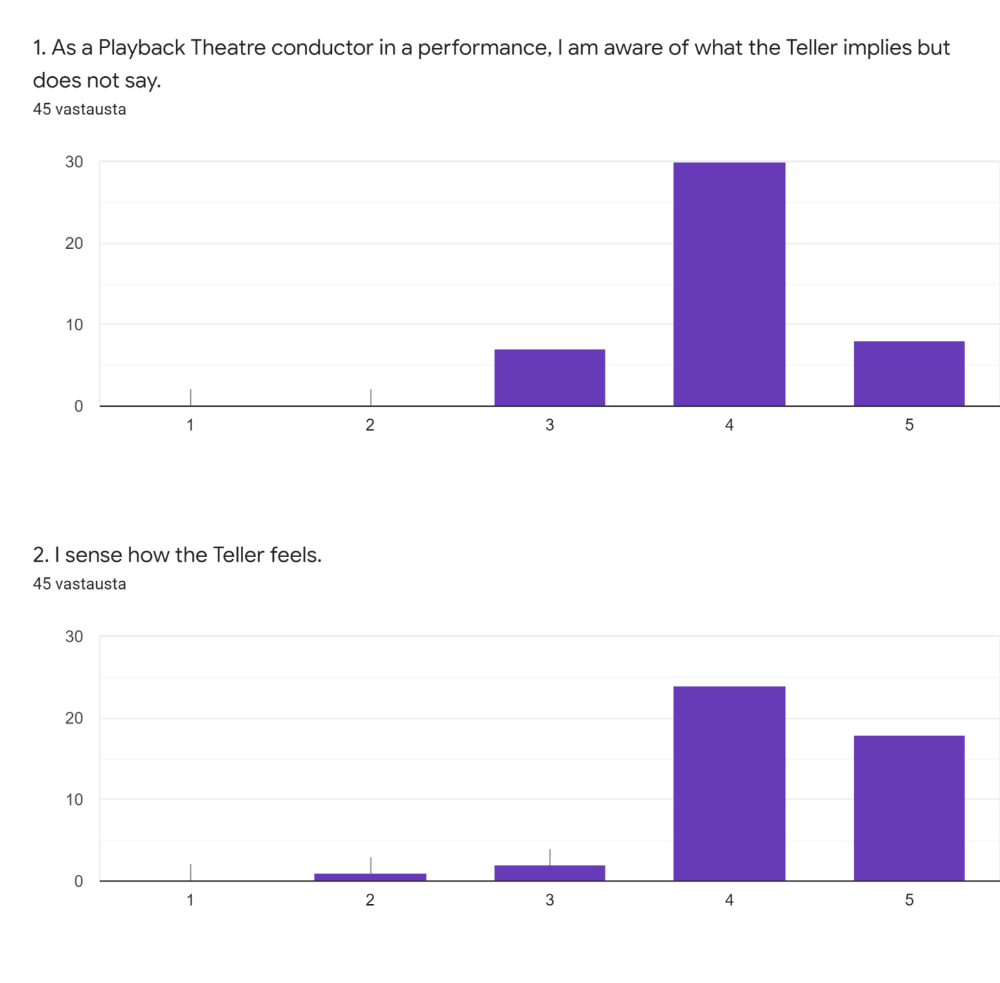

# THE ART OF LISTENING IN PLAYBACK THEATRE: Conductor’s perspective 一人一故事剧场中的倾听艺术：领航员视角

Satu Prittinen

TTO 2018-2020

# Introduction 简介

I see Playback Theatre is an art form with almost endless possibilities. Created with the audience and based on improvisation, it is crucial to have the structure and routines as a way of making the audience have some sense of predictability in the face of the unexpected events unfolding before them. Actors and conductor use different forms on stage to find and portray the essence of the story, also referred to as the heart of the story. (Pitkänen, PTC-studies, March 2019; Rahmel, PTC- studies, May 2019.) It can be referred to as a humble form of art, seeking to offer voice to all members of society, especially the ones silenced or ignored (Fox, H., 2007).

在我看来，一人一故事剧场是一种几乎具有无限可能性的艺术形式。它与观众共同创作，以即兴表演为基础，关键是要有一定的结构和固定流程，使观众在面对眼前的突发事件时有一定的可预见性。演员和领航员在舞台上使用不同的形式来寻找和描绘故事的本质，也被称为故事的核心。（Pitkänen, PTC-studies, March 2019; Rahmel, PTC-studies, May 2019.）它可以被称为一种谦逊的艺术形式，旨在为所有社会成员，尤其是那些被压制或被忽视的人发出声音（Fox, H., 2007）。

None of this is possible without one key element; listening. Listening can be viewed as simply sensing the audio waves one receives, but in order to understand those one must process them and finally the conductor and the actors do their best to respond by playing back the story they heard. This requires the listening to be both active and empathetic.

没有倾听这一关键要素，这一切都不可能实现。倾听可以被视为简单地感知所接收到的声波，但为了理解这些声波，必须对其进行处理，最后领航员和演员通过演绎他们所听到的故事来尽力做出回应。这就要求倾听既要积极主动，又要感同身受。

In this thesis I will explore the art of listening in Playback Theatre from the conductor’sperspective, mirrored against the theory of active empathetic listening (AEL), which includes three aspects: sensing, processing and responding (Drollinger, Comer & Warrington, 2006).

在这篇论文中，我将从领航员的角度探讨一人一故事剧场中的倾听艺术，并以积极共情的倾听（AEL）理论为镜像，该理论包括三个方面：感知、处理和回应（Drollinger, Comer & Warrington, 2006）。

I wish to provide some answers to the questions about possible emphasises on different aspects of active empathetic listening and ways that the conductors describe their listening in the performance situations.

我希望就积极共情的倾听可能强调的不同方面，以及领航员描述他们在演出情境中倾听的方式等问题提供一些答案。

This has been done through a questionnaire with ten (10) 1-5 scale questions built or borrowed from the questionnaire of Active Empathetic Listening (Drollinger, Comer & Warrington 2006), covering the three aspects mentioned above. In addition to these there were two (2) open questions asking the describe aspects of listening in own words and to choose the most important of them. Posted on in a closed group on a social media platform for one (1) week in May 2020, the questionnaire received 45 responses.

为此，我从积极共情的倾听问卷（Drollinger, Comer & Warrington 2006）中借鉴了十个 1-5 级的问题，涵盖了上述三个方面。除此之外，还有两（2）个开放式问题，要求用自己的话描述倾听的各个方面，并选择其中最重要的方面。该问卷于 2020 年 5 月在社交媒体平台的一个封闭群组中发布了一（1）周，共收到 45 份回复。

# 1. Listening in the Playback Theatre 一人一故事剧场中倾听

Playback Theatre was created by Jonathan Fox, Jo Salas and their company in 1975 (Rowe, 2007, p.12; Salas, 20.5.2011 TedTalk). Starting from an idea of offering a new kind of art to the communities and willingness to explore the unknown. It has spread to over 60 countries and continues to build understanding, empathy, dialog and change in various contexts. (Salas, 20.5.2011, TedTalk.)

一人一故事剧场由乔纳森-福克斯（Jonathan Fox）、乔-萨拉斯（Jo Salas）和他们的剧团于 1975 年创立（Rowe, 2007, p.12; Salas, 20.5.2011 TedTalk）。他们的初衷是为社群提供一种新的艺术，并愿意探索未知世界。它已传播到 60 多个国家，并继续在各种背景下建立理解、共鸣、对话和变革。（Salas, 20.5.2011, TedTalk.）。

In a nutshell the concept consists of an audience member sharing a real-life story about their own life. This person is called the “teller” and while telling they sit next to a Playback Theatre conductor at one (often left) side of the stage. On stage there are usually four (4) actors and at least one (1) musician. The conductor discusses with the teller, collecting the essential information about the story being told. Once finished, the conductor chooses a form (a structure) to be used for this story and says, “*Let’s watch*”, indicating to the actors and musician to begin their performance. Actors and musician work together to play the story back in an artistic form. (Rowe, 2007, p. 12; Salas, 20.5.2011, TedTalk; Salas & al., 2013.)

简而言之，这一概念由一名听众分享自己生活中的真实故事组成。这个人被称为"讲述者"，讲述时他们坐在舞台一侧（通常是左侧）的一人一故事剧场领航员旁边。舞台上通常有四（4）名演员和至少一（1）名乐师。领航员与讲述者讨论，收集所讲述故事的基本信息。完成后，领航员会为这个故事选择一种形式（结构），然后说"*请看*"，示意演员和乐师开始表演。演员和乐师共同合作，以艺术的形式将故事演绎出来。(Rowe, 2007, p. 12; Salas, 20.5.2011, TedTalk; Salas & al., 2013.）。

It is important for the conductor to listen to the teller and protect them from telling too much, in other words keeping in mind that the situation is also a live performance. Playback Theatre seeks to offer a safe space for different groups of people being heard, especially those that might be silenced or left out from the public discussions in the communities. (Rahmel, PTC-studies, September 2019 & May 2020, Pitkänen, PTC-studies, November 2019.) Everyone should be offered a chance to be heard without judgement or prejudice. However, this does not mean that Playback Theatre could be used as a mean to express insulting, belittling or harmful thoughts towards some individuals or groups of people. In case this happens, the conductor must stop the story from being presented on stage. These ethical frames built to ensure everyone can feel accepted and included, can sometimes create the illusion that Playback Theatre is political, which it is not (Rahmel, PTC- studies, May 2020.)

重要的是，领航员者要倾听讲述者的讲述，保护他们不要讲得太多，换句话说，要牢记这个过程也是一场现场表演。一人一故事剧场旨在为不同群体提供一个安全的倾听空间，尤其是那些可能被压制或被排除在社群公共讨论之外的群体。(Rahmel, PTC-studies, September 2019 & May 2020, Pitkänen, PTC-studies, November 2019.）。每个人都应该有机会发表意见，而不应受到评判或偏见。但这并不意味着可以利用一人一故事剧场表达对某些个人或群体的侮辱、贬低或伤害性的思想。如果出现这种情况，领航员必须停止故事在舞台上的出现。这些为确保每个人都能感到被接纳和包容而建立的道德框架，有时会造成一种错觉，以为一人一故事剧场是政治性的，其实不然（Rahmel, PTC- studies, May 2020.）。

As described above listening is an essential part of Playback Theatre. There are many levels and layers of listening taking place simultaneously during a Playback Theatre performance. The audience listens to each other telling stories, conductor facilitating those and actors and musician performing them. The musician can be described as playing the emotional current of the story (Salas, 20.5.2011, TedTalk). The listening must be deep and focused, attuned to the teller (Ng & Graydon, 2016).

如上所述，倾听是一人一故事剧场的重要组成部分。在一人一故事剧场演出中，同时进行着多层次的倾听。观众在倾听彼此讲述故事，领航员主持这个过程，演员和乐师演绎故事。乐师可以视作是在演奏故事中的情感之流（Salas, 20.5.2011, TedTalk）。倾听必须深入、专注，与讲述者同频（Ng & Graydon, 2016）。

## 1.1 Previous studies 以往的研究

Playback theatre is built on the notion of the power of being heard. I would suspect it is quite common to have similar experience as Virginia Reed Murphy when first seeing one’s own story played back on stage with sincerity and emotion, as if it was the own story of those performing it. Describing feeling a deep connection, sensing the “*I am, because you are*”- phrase coming to life.

一人一故事剧场建立在"倾听的力量"这一概念之上。我猜想，当第一次看到自己的故事在舞台上真挚动情地演绎，仿佛是表演者自己的故事时，类似弗吉尼亚-里德-墨菲（Virginia Reed Murphy）的经历是很常见的。她形容自己感受到了一种深刻的联系，感觉到"*我存在，因为你存在*"这句话栩栩如生。

She felt that a simple act of listening with empathy can be life-giving. (Murphy, 6.3.2019, TedTalk.)

她认为，一个简单的共情的倾听行为就能赋予生命力。(Murphy, 6.3.2019, TedTalk.）。

In its close to 50 years of existence Playback Theatre has also faced criticism and questioning. It has been seen too much like therapy and too process oriented as well as too artistic, depending on the viewpoint of the criticiser. (Salas, 20.5.2020, TedTalk.) Despite of this, it has kept going and growing providing numerous people around the world a chance of being heard and seeing their story transformed to art on stage.

在近 50 年的发展历程中，一人一故事剧场也曾面临批评和质疑。人们认为它太像治疗，太面向过程，也太艺术化，这取决于批评者的观点。（Salas, 20.5.2020, TedTalk.）尽管如此，它仍在不断发展壮大，为世界各地的无数人提供了被倾听的机会，让他们看到自己的故事在舞台上转化为艺术。

There have been studies on Playback Theatre too, some Theses, many project or case based have been presented in scientific articles or books. I can only scratch the surface here but will try to present some of them. The two founders of Playback Theatre Jonathan Fox and Jo Salas have written and edited some books about Playback Theatre.

关于一人一故事剧场的研究也有很多，一些论文、许多基于项目或案例的研究都已发表在科学文章或书籍中。在此，我只能浅尝辄止，但会尽量介绍其中一些。一人一故事剧场的两位创始人乔纳森-福克斯（Jonathan Fox）和乔-萨拉斯（Jo Salas）撰写和编辑了一些关于一人一故事剧场的书籍。

Jo Salas has written several books on her experiences with Playback Theatre, probably most famous being “*Improvising real life*- *personal story in Playback Theatre”* (1999). In *Improvising real life* Jo Salas describes the practice and the philosophy of Playback Theatre. Together with Heinrich Dauber, Jonathan Fox edited an essay collection called *“Gathering voices- essays on Playback Theatre”* in 1999. Jonathan Fox has recently written “*Beyond theatre- a memoir of playback theatre”* (2015) in which he explains the events and thoughts behind the vision that became Playback Theatre. He has also been writing a theory called *Narrative reticulation* based on his previous essaysand the thoughts of some members of the global Playback Theatre community. This has not yet been published but is available for educational use as a working paper. (Fox, 2016.)

乔-萨拉斯（Jo Salas）写了几本关于她在一人一故事剧场的经历的书，其中最著名的可能是《*即兴真实人生——一人一故事剧场中的个人故事》*（1999）。在《即兴真实人生》一书中，乔-萨拉斯描述了一人一故事剧场的实践和理念。1999 年，乔纳森-福克斯与海因里希-道伯（Heinrich Dauber）共同编辑了一本名为*"汇聚声音——关于一人一故事剧场的论文集"*的论文集。乔纳森-福克斯最近撰写了《*超越剧场——一人一故事剧场回忆录*》（2015），其中他解释了一人一故事剧场的愿景背后的事件和想法。他还根据自己以前的文章和全球一人一故事剧场社群一些成员的想法，撰写了名为"*叙事网状结构*"（Narrative reticulation）的理论。该理论尚未出版，但可作为工作文件用于教学。（Fox, 2016.）。

Studies of Playback Theatre have covered for example using Playback Theatre to address bullying at schools (Salas, J., 2005), exploring the accountability and aesthetics when used among refugees (Dennis, 2008), enhancing communication among medical students (Salas, R. & al., 2013).

有关一人一故事剧场的研究包括利用一人一故事剧场解决校园欺凌问题（Salas, J., 2005）、探索在难民群体中使用一人一故事剧场时的责任和美学（Dennis, 2008）、加强医学生之间的交流（Salas, R. & al., 2013）等。

Playback Theatre as a method of intercultural dialog ( Feldhendler, 2007) and stories in PT as cultural production and an ethics of listening (Dennis, 2007). It has been used as a form of cultural resistance in the occupied Palestine (Rivers, 2015) and exploring empathy within Playback Theatre (Ng & Graydon, 2016).

一人一故事剧场是一种跨文化对话的方法（Feldhendler, 2007），PT 中的故事是一种文化生产和倾听伦理（Dennis, 2007）。它被用作巴勒斯坦被占领地区的一种文化抵抗形式（Rivers, 2015），并在一人一故事剧场中探索共情（Ng & Graydon, 2016）。

As notable from these examples most of the studies on Playback Theatre have not focused on listening but more on the different contexts where Playback Theatre can be used in. Dennis (2007) comes closest to listening, looking at Playback Theatre as a community-based art form continuing the long tradition of coming together for storytelling. He sees Playback Theatre as a way of promoting ethical listening and anti-oppressive practices. I think listening is such an essential and irreplaceable part of Playback Theatre that focusing solely on that in a study has not been relevant or inviting. I find it interesting because of this. Listening is always present but can be taken for granted and overlooked when reflecting a Playback Theatre performance, because there are so many aspects to be considered as a conductor, which I will present now.

从这些例子中可以看出，大多数有关一人一故事剧场的研究并不关注倾听，而是更关注一人一故事剧场可用于的不同语境。丹尼斯（Dennis, 2007）最接近于倾听，他将一人一故事剧场视为一种基于社群的艺术形式，延续了人们聚在一起讲故事的悠久传统。他认为，一人一故事剧场是促进道德倾听和反压迫实践的一种方式。我认为倾听是一人一故事剧场不可或缺、不可替代的一部分，因此在研究中仅仅关注倾听并不贴切，也不吸引人。正因为如此，我觉得这很有趣。倾听始终存在，但反映在一人一故事剧场表演中时可能被视为理所当然和被忽视，因为作为一名领航员者，有许多方面需要考虑，我现在将介绍这些方面。

## 1.2 The multifaced role of the conductor 领航员的多面角色

During a Playback Theatre performance, the conductor must focus on multiple things simultaneously and yet appear to be very focused only on the teller while they are telling their story.

在一人一故事剧场演出中，领航员必须同时关注多件事情，但在讲述者讲述故事时又要显得非常专注。

This is not an easy task and requires practice and understanding. It is very important that the performing group and the audience sense they can trust the conductor to have control of the situation and be open to any unexpected events. In order to succeed in this the conductor must be fully present in the situation and avoid being too self-critical (Rahmel, PTC-studies, January 2020).

这并非易事，需要练习和理解。非常重要的一点是，表演团队和观众要相信领航员能够控制局面，并对任何突发事件保持开放的态度。为了成功做到这一点，领航员必须全身心地投入其中，避免过于自我批评（Rahmel, PTC-studies, January 2020）。

Fox’s (2016) *Narrative reticulation* is built on four main categories or aspects; story, spontaneity, atmosphere and guidance. Story includes memorizing, order and a sense of aesthetic. Spontaneity refers to being present to events of the situation, ability to cooperate and Genuity or acting as oneself. Atmosphere covers being a human in front of other humans, being inviting and inclusive toward to audience, oneness between the audience and the performers and shamanistic energy. Guidance is built from the rituals, skills of protecting both the teller and the audience, knowledge of the ethical viewpoints, ensuring diversity in tellers, ways of choosing the next teller and conveying the sense of control to the audience. These are not hierarchical to each other but rather overlapping and intertwined together. All are necessary and important.

福克斯（2016）的"*叙事网状结构*"（Narrative reticulation）建立在四个主要类别或方面之上：故事、自发性、氛围和引导。故事包括记忆、秩序和美感。自发性指的是对情境事件的临在、合作能力和创造力或自我行为。氛围包括在其他人面前作为一个人、对观众的邀请和包容、观众和表演者之间的合一以及萨满般的能量。引导来自仪式、保护讲述者和观众的能力、道德观点的知识、确保讲述者的多样性、选择下一位讲述者的方法以及向观众传达控制感。它们彼此之间没有等级关系，而是相互重叠和交织在一起。所有这些都是必要和重要的。

When exploring different Playback Theatre groups, Fox (2016) was able to detect that the difference between the groups establihing a true connection with the audience and those who did not succeed in this, came down to having a clear red thread in the performance. Thus, one important factor of the multifacedness of the conductor’s role is the ability to successfully combine these different aspects and create a sense of coherence in the stories, which are impossible to predict.

福克斯（Fox, 2016）在研究不同的一人一故事剧团时发现，与观众建立真正联系的剧团与未能成功建立联系的剧团之间的区别，就在于表演中是否有一条明确的红线。因此，领航员角色的多面性的一个重要因素就是能够成功地将这些不同方面结合起来，并在故事中创造出一种连贯感，而这是无法预测的。

I think narrative reticulation provides an idea of the multifaced role of the conductor. During our studies Rahmel and Pitkänen also presented this Jo Salas’ idea of the seven different aspects of a Playback Theatre conductor. They are *master of ceremony, entertainer, performer, diplomat, therapist, clown* and *shaman*. These link quite closely to the aspects of narrative reticulation presented above. Master of ceremony keeps order and atmosphere; entertainer offers a piece of oneself to the stage in a personal way. Performer needs to be present; diplomat values all stories and seeks to empower diversity in stories. Therapist does not mean Playback Theatre would be therapy, rather it refers to the ethics that the conductor should always consider, often in the form of protecting the teller and audience from too exposing too much and the way a possibly traumatic story is played back. Clown enables the flow of different emotions and the importance of humour in a performance. Shaman is considered to be a spiritual guide. (Rahmel, TTO-studies, January 2019, from Salas, 1999.)

我认为，叙事网状结构为领航员的多面性角色提供了一个思路。在我们学习期间，拉赫梅尔（Rahmel）和皮特卡宁（Pitkänen）还提出了乔-萨拉斯关于一人一故事剧场领航员七个不同方面的观点。这七个方面分别是*司仪、艺人、表演者、外交官、治疗师、小丑*和*萨满*。这些方面与上文介绍的叙事网状结构的各个方面有着非常密切的联系。司仪负责维持秩序和气氛；艺人以个人的方式在舞台上展现自己。表演者需要在场；外交官重视所有故事，并寻求增强故事的多样性。治疗师并不意味着一人一故事剧场就是治疗，而是指领航员应始终考虑的职业道德，通常是保护讲述者和观众，避免过于暴露，以及演绎可能造成创伤的故事的方式。小丑能让不同的情绪在表演中流动，并强调幽默的重要性。萨满被视为精神向导。(Rahmel, TTO-studies, January 2019, from Salas, 1999.）。

Both the multiple roles and the different aspects of Playback Theatre conductor and the previous studies are built on listening, an active, empathetic listening that can offer a profound sense of being seen and heard to the teller, as described by Virginia Reed Murphy (2019) above.

正如弗吉尼亚-里德-墨菲（Virginia Reed Murphy）（2019）在上文所述，一人一故事剧场领航员的多重角色和不同方面以及之前的研究都建立在倾听的基础上，一种积极的、感同身受的倾听，能够给讲述者带来一种被看到和听到的深刻感受。

# 2. The Active Empathetic Listening (AEL) in Playback Theatre 一人一故事剧场中的积极共情的倾听（AEL）

I discovered the theory of active empathetic listening quite recently. I had already decided to explore listening from the perspective of the conductor in my thesis. Listening is often divided to three (3) dimensions in different models and theories. In the model of Active Empathetic Listening, which was developed by Comer and Drollinger in 1999, these dimensions are *sensing, processing* and *responding*. (Drollinger, Comer & Warrington, 2006.)

我是最近才发现积极共情的倾听理论的。在我的论文中，我已经决定从领航员的角度来探讨倾听。在不同的模式和理论中，倾听通常被分为三（3）个维度。在 1999 年由 Comer 和 Drollinger 提出的"积极共情的倾听"模型中，这三个维度分别是*感知*、*处理*和*回应*。(Drollinger, Comer & Warrington, 2006）。

As my primary source for this I will use the article by Drollinger, Comer and Warrington (2006), which focuses on the interaction between customers and sales personnel. The article covers three separate studies through which it tries to provide validation to the scale and questions used in AEL.

我将使用 Drollinger、Comer 和 Warrington（2006）的文章作为主要资料来源，这篇文章主要关注客户与销售人员之间的互动。这篇文章涵盖了三项独立的研究，试图通过这些研究为 AEL 中使用的量表和问题提供验证。

Drollinger, Comer & Warrington (2006) wished to find ways of distinguishing the effective and ineffective listening among sales personnel.

Drollinger、Comer 和 Warrington（2006）希望找到区分销售人员有效倾听和无效倾听的方法。

This is by no means the goal of this thesis. I only wish to explore the listening in Playback Theatre context through these aspects. I think in Playback Theatre ineffective or superficial listening is notan option, the listening must be active and empathetic always. Empathy needs attuning to the feelings of someone else and attentive listening (Ng & Graydon, 2016). I will now present the three (3) dimensions, here referred to as aspects, as explained by Drollinger, Comer and Warrington (2006) combined to the context of Playback Theatre performance.

这绝不是本论文的目标。我只想通过这些方面来探讨一人一故事剧场中的倾听。我认为，在一人一故事剧场中，无效或肤浅的倾听都是不可取的，倾听必须始终是积极的、共情的。共情需要适应他人的感受，需要专注地倾听（Ng & Graydon，2016）。现在，我将根据 Drollinger、Comer 和 Warrington（2006）的解释，结合一人一故事剧场表演的背景，介绍三（3）个维度（此处称为方面）。

## a. Sensing 感知

Sensing is the first and most basic of these aspects, as can be concluded by the name of this, it includes the concrete action of hearing the words. Also, non-verbal messages and things referred to but not expressed verbally are included under sensing in AEL. (Drollinger, Comer & Warrington, 2006.) In Playback Theatre performance listening as sensing takes place especially between the conductor, actors, musician and the teller. All performers pay close attention to the words being said, the body language and the in-between-the lines hints provided by the teller. During the telling of a longer story the conductor sits next to the teller and often is the person teller focuses on when telling the story.

感知是这些方面中的第一个也是最基本的一个方面，顾名思义，它包括听到话语的具体行动。此外，非语言信息和涉及到但未用语言表达的东西也包括在 AEL 的"感知"中。（Drollinger, Comer & Warrington, 2006）在一人一故事剧场表演中，作为感知的倾听尤其发生在领航员、演员、乐师和讲述者之间。所有表演者都会密切关注讲述者所说的话、肢体语言和台词之间的暗示。在讲述一个较长的故事时，领航员坐在讲述者旁边，通常是讲述者讲述故事时所关注的人。

## b. Processing 处理

Processing covers the cognitive operations of the listener, which happen mostly simultaneously with sensing. It has four functions, (1) understanding the meaning, (2) interpreting the underlying implications, (3) evaluating the importance of the cues and (4) remembering the message by updating material in memory. (Drollinger, Comer, Warrington, 2006.)

处理包括听者的认知操作，大多与感知同时进行。它有四种功能：(1) 理解含义；(2) 解释潜在含义；(3) 评估线索的重要性；(4) 通过更新记忆材料记住信息。（Drollinger, Comer, Warrington, 2006）。

In the context of Playback Theatre, the conductor (and other performers) seek to follow these steps when listening a story. It is important to understand what the teller means, interpreting and evaluating the cues given and lastly to constantly pile the information to their memory to be used when playing the story back. This aspect includes also the questions, statements and comments of the conductor during the telling of the story. With these the conductor ensures correct understanding, encourages to tell more if necessary or also gently and respectfully guides the teller to conclude their story if it seems to be becoming too wide or long. The conductor makes sure the actors and the musician have enough material to work with when playing the story back to the teller.

在一人一故事剧场中，领航员（和其他表演者）在倾听故事时要遵循这些步骤。重要的是要理解讲述者的意思，解释和评估所给出的提示，最后不断将信息堆叠到记忆中，以便在演绎故事时使用。这方面还包括在讲述故事时领航员的提问、陈述和评论。通过它们，领航员可以确保理解正确，必要时鼓励讲述者讲述更多的故事，或者在故事似乎变得过于宽泛或冗长时，温和而尊重地引导讲述者结束故事。领航员确保演员和乐师在向讲述者演绎故事时有足够的素材。

## c. Responding 回应

The last of the three aspects is responding, which means that the listener offers signals to the talker that they have been heard and understood. These can be either verbal or non-verbal. Listener often encourages the speaker to continue speaking, if interrupted for a question. If no clarification isneeded this can be as simple as nodding the head or offering short verbal prompts. (Drollinger, Comer & Warrington, 2006.)

三个方面中的最后一个方面是回应，即听众向讲述者发出信号，表示他们已经听到并理解了讲述者的意思。这些信号可以是口头的，也可以是非口头的。如果被打断提问，倾听者通常会鼓励说话者继续说话。如果不需要澄清，可以简单地点头或提供简短的语言提示。（Drollinger, Comer & Warrington, 2006）。

Responding in Playback Theatre starts when the teller has finished telling their story. The conductor has a big responsibility already here in building trust and making the teller feel heard and also choosing the form to be used in playing back the story. Here the conductor must consider the viewpoints of the performing group, the audience and the teller. The point is not to simply act out the story as it has been told, but to respectfully and avoiding too much interpretation seek to provide the essentials of the story in slightly modified form. It is important that the teller recognises the story but ideally also sees something they did not explicitly tell.

一人一故事剧场中的回应始于讲述者讲完故事之后。领航员在建立信任、让讲述者感到自己的声音被倾听以及选择故事演绎的形式方面已经承担了很大的责任。在这里，领航员必须考虑表演团队、观众和讲述者的视角。问题的关键不是简单地按照讲述者所讲的故事进行表演，而是以尊重的态度，避免过多的诠释，力求以略加修改的形式提供故事的实质。重要的是，讲述者要能够识别出故事，但最好也能看到他们没有明确讲述的内容。

The conductor has a crucial role in making this possible as sometimes choosing less than ideal form for the story can restrict the potential of the actors and musician. In my experience giving too much liberty to beginner level actors and musician can result in prolonged and non-coherent stories on stage. Thus, it is important that the conductor knows the performing group and offers them challenges and possibilities based on their skills. The conductor enables the group to shine and succeed.

领航员在实现这一点的过程中起着至关重要的作用，因为有时为故事选择不太理想的形式会限制演员和乐师的潜力。根据我的经验，给初学者水平的演员和乐师过多的自由会导致舞台上的故事冗长而不连贯。因此，领航员必须了解表演团队，并根据他们的技能为他们提供挑战和可能性。领航员可以使得表演团队大放异彩，取得成功。

Should something unwanted to happen during a performance it is important that the conductor can openly acknowledge their failure in choosing a form for the story. It is always possible for the teller to comment the played back story and to tell, if something did not match their telling or ifsomething important was left out. If needed the conductor can offer the chance of a redo, which can be important for both the teller and the performing group. I suspect this can happen more often when the conductor does not have a long experience. Yet I also think that one can never be ready as a Playback Theatre conductor (or any performer) and admitting own missteps builds respect and trust.

如果在演出过程中出现意外情况，重要的是领航员能够公开承认他们在选择故事形式方面的失败。讲述者总是可以对演绎的故事进行评论，并讲述是否有与他们的讲述不一致的地方，或者是否遗漏了重要的内容。如果需要，领航员可以提供重演的机会，这对讲述者和表演团队都很重要。我猜想，当领航员的经验不丰富时，这种情况会更多一些。但我也认为，作为一名一人一故事剧场领航员（或任何表演者），永远不可能准备就绪，承认自己的失误可以建立尊重和信任。

# 3. Questions and analysis 问题与分析

In order to collect answers from Playback Theatre conductors around the world I created a short questionnaire using Google forms. The questionnaire included ten (10) questions with a Likert-scale from 1 to 5. The value 1 represented never and value 5 always. Google forms did not allow naming the values in between, but they more or less represented 2 rarely, 3 sometimes and 4 often. Of course, I cannot be sure these are the labels used in the minds of the people responding to the questionnaire.

为了从世界各地的一人一故事剧场领航员那里收集答案，我使用谷歌表格制作了一份简短的调查问卷。问卷包括十（10）个问题，用李克特量表（Likert-scale from）从 1 到 5 表示。数值 1 代表从不，数值 5 代表总是。谷歌表单不允许为介于两者之间的数值命名，但它们或多或少代表了 2 很少、3 有时和 4 经常。当然，我不能确定这些就是问卷调查者心中所使用的标签。

I posted the link to the questionnaire on the Facebook page of a closed group called *Playback Theatre around the world* with a short description of its use (Attachment 1). The questionnaire (Attachment 2) was posted on 24th of May 2020 and it was open for answers until 31st of May 2020.

我在一个名为"*世界各地的一人一故事剧场*"的非公开群组的 Facebook 页面上发布了问卷链接，并附有简短的使用说明（附件 1）。问卷（附件 2）于 2020 年 5 月 24 日发布，截止日期为 2020 年 5 月 31 日。

The limited time was chosen mainly because of the length of this thesis as I wanted to include all the answers to my analysis and would not have been able to do so with a large data.

之所以选择有限的时间，主要是考虑到本论文的篇幅，因为我希望将所有答案都纳入我的分析中，如果数据量较大，就无法做到这一点。

For my research questions I chose two (2) questions. The first seeking to cover the scale questions and the second the open questions.

对于我的研究问题，我选择了两（2）个问题。第一个问题是量表问题，第二个问题是开放问题。

Questions

问题

1. Which aspects of Active Empathetic Listening are emphasized in the answers from Playback Theatre conductors? 在一人一故事剧场领航员的回答中，积极共情的倾听（AEL）的哪些方面得到了强调？
2. How do the conductors themselves describe their listening and the most important aspect of it? 领航员自己如何描述他们的倾听以及其中最重要的方面？

In the original AEL questionnaire there are 21 statements. For sensing and processing there are eight (8) for each aspect and five (5) for responding. As I took these quite far from their original context of sales personnel and their customers, I only choose some of the statements, some I modified and one I created myself loosely based on the original questions. In my questionnaire for the Playback Theatre conductors there were ten (10) questions with the scale from 1-5. Of those three (3) focused on sensing, three (3) on processing, three (3) on responding and one (1) own which combined sensing, processing and responding.

在最初的 AEL 问卷中有 21 项陈述。在感知和处理方面，每个方面都有 8 项陈述，回答方面有 5 项陈述。由于我把这些问题从销售人员和他们的客户的原始背景中抽离出来，我只选择了其中的一些陈述，有些陈述是我修改过的，还有一个陈述是我在原始问题的基础上粗略地自己创造出来的。在我给一人一故事剧场领航员的问卷中，有十（10）个问题，量表为 1-5。其中有三（3）个问题是关于感知的，三（3）个问题是关于处理的，三（3）个问题是关于回应的，还有一（1）个问题是综合了感知、处理和回应的。

In analysing the answers, I started by looking at the charts provided automatically by forms I used. In searching the emphasis, I was looking at the questions that had most answers on the values 4 and 5, meaning often and always. I arranged the answers based on the most agreed on when calculating together the percentage of answers in those two values. In presenting these results I will use the aspects of sensing, processing and responding.

在分析答案时，我首先查看了所使用表格自动提供的图表。在搜索重点时，我关注的是那些回答值为 4 和 5（即经常和总是）最多的问题。在计算这两个数值的答案所占百分比时，我根据最一致的答案进行了排列。在介绍这些结果时，我将从感知、处理和回应这三个方面进行阐述。

# 4. Results 结果

## 4.1 Results on the emphasized aspects of listening by Playback Theatre conductors 关于一人一故事剧场领航员强调的倾听方面的结果

Here are the results for the research question 1, collected from the questions with a scale. Results are presented through the aspects of listening from the AEL. I will present only some of the charts here, all of them can be found in the Attachment 3.

以下是针对研究问题 1 的结果，这些结果是从带有量表的问题中收集的。结果通过 AEL 中倾听的各个方面呈现。我在此仅介绍部分图表，所有图表可在附件 3 中找到。

### Sensing 感知

Sensing was covered in the first three (3) questions of the questionnaire. These were about being aware of what is implied but not said (Q1), sensing how the Teller feels (Q2) and listening to the tone of the conversation when talking to the Teller (Q3). Sensing from these perspectives showed to be often taking place among the responders. None of these received any answers for the value 1, indicating never and only sensing how the Teller feels (Q2) received one (1) answer to value 2.

问卷的前三（3）个问题涉及感知。这三个问题是：意识到暗示但没有说出来的话（问题 1）、感觉到讲述者的感受（问题 2）和与讲述者交谈时倾听谈话的语气（问题 3）。从这些角度出发的感知在答卷人中经常出现。没有人回答数字 1，这表明从来没有，只有"感受讲述者的感受"（Q2）得到了一 (1) 个价值 2 的答案。

Question 3 (*I listen to the tone of the conversation when talking to the Teller)* received the highest percentage (97,8%) of values 4 and 5 both in the sensing subsection and the overall comparison of all the ten questions. Sensing the Teller’s feelings (Q2) had 93,3 % of answers on values 4 and 5, placing 3rd on the overall comparison As a Playback Theatre conductor being aware of what the Teller implies but does not say also received high percentage of values 4 and 5, totalling to 84,5% and 5th overall placing.

问题 3（*我在与讲述者交谈时倾听谈话的语气*）在感知分项和所有 10 个问题的总体比较中，价值 4 和价值 5 所占比例最高（97.8%）。感觉到讲述者的感受（问题 2）有 93.3% 的人回答了 4 分和 5 分，在总体比较中排在第三位。 作为一名一人一故事剧场领航员，意识到讲述者暗示但没有说的话也得到了很高的 4 分和 5 分，共占 84.5%，在总体比较中排在第五位。

Sensing seemed to take place often in these forms during a Playback Theatre performance. Empathetic listening in AEL, ethical listening and deep and active listening are all present in these (Drollinger & al., 2006; Dennis, 2006; Murphy, 2019). Paying attention to both the words being said and the non-verbal messages was important to the effective listeners in Drollinger & al. (2006) studies. This seems to happen a lot among the Playback Theatre conductors, who answered the questionnaire.

在一人一故事剧场表演中，感知似乎经常以这些形式出现。情感倾听（AEL）中的共情倾听、道德倾听以及深度和积极倾听都存在于这些形式中（Drollinger & al.，2006；Dennis，2006；Murphy，2019）。在 Drollinger 等人（2006）的研究中，对言语和非言语信息的关注对于有效倾听者来说非常重要。在回答问卷的一人一故事剧场领航员中，这种情况似乎经常发生。

*Figure 1 Q3 Highest agreement on sensing and in overall comparison*

*图 1 Q3 在感知和整体比较方面的最高一致度*

These seem logical because sensing the tone of the conversation and the Teller’s feelings are important factors guiding the conductor during the discussion with the Teller. To my short experience with Playback Theatre some of the greatest successes of playing the story back have taken place when the Teller discovers something on the stage, they were not verbalizing but still recognize. I think the power of Playback Theatre stems from this kind of moments, sometimes happening to the Teller and sometimes to a member of the audience reflecting their own experiences against those presented at the stage. These are moments of exploring the unknown (Salas, 20.5.2011, TedTalk), building empathy (Ng & Graydon, 2016), Genuity and spontaneity, being open, present and authentically oneself (Fox, 2016) and being deeply moved as a teller (Murphy, 6.3.2019 TedTalk).

这些似乎是合乎逻辑的，因为在与讲述者的讨论中，感受谈话的语气和讲述者的感受是指导领航员的重要因素。在我短暂的一人一故事剧场经验中，一些最成功的故事演绎都发生在讲述者在舞台上发现了一些他们没有用语言表达但仍能识别的东西时。我认为，一人一故事剧场的力量源于这样的时刻，有时发生在讲述者身上，有时发生在观众身上，他们将自己的经历与舞台上呈现的内容相联系。这是探索未知的时刻（Salas, 20.5.2011, TedTalk），是建立共情的时刻（Ng & Graydon, 2016），是创造力和自发性的时刻，是开放、呈现真实自我的时刻（Fox, 2016），也是作为讲述者深受感动的时刻（Murphy, 6.3.2019 TedTalk）。

### Processing 处理

The following three questions were about processing. Question 4 about keeping track of the points the Teller makes, question 5 asking for clarification when not sure of the Teller’s meaning and question 6 about deciding the form to be used while listening the Teller.

以下三个问题是关于处理的。第 4 个问题是关于记录讲述者的观点，第 5 个问题是在不确定讲述者的意思时请求澄清，第 6 个问题是在倾听讲述者时决定使用的形式。

Asking for clarification when not sure of the meaning of the Teller’s statements (Q5) was very common among the Playback Theatre conductors who responded to the questionnaire. 95,5 % of them gave values 4 or 5, an shared 2nd place in overall comparison. Keeping track of the Teller’s points (Q4) was almost as common, 86,6 % of the responses had either value 4 or 5, 4th in overallcomparison. Deciding the form while listening to the Teller was not nearly as common, receiving only 60% of the answers to values 4 or 5, placing 7th on overall comparison.

在回答问卷的一人一故事剧场领航员中，不确定讲述者陈述的含义时要求澄清（问题 5）的情况非常普遍。95.5%的人给出了 4 或 5 分，在总体比较中位居第二。确保了解讲述者的观点（Q4）几乎同样普遍，86.6% 的回答数值为 4 或 5，在总体比较中排名第四。边倾听讲述者边决定形式的情况并不常见，只有 60% 的答案数值为 4 或 5，在整体比较中排名第 7。

*Figure 2 Q5 Highest agreement on processing, shared 2nd in overall comparison*

*图 2 第 5 题 在处理问题上意见最为一致，在总体比较中排名第 2*。

Ensuring correct understanding of the Teller’s statements cannot be overlooked as this would most likely result in playing back something that the Teller does not recognize. Therefore, the high agreement on this among the Playback Theatre conductor’s makes sense. In the overall comparison this was in a shared second place, when comparing the percentage of answers given to values 4 or 5.

确保正确理解讲述者的陈述不容忽视，因为这很可能导致演绎讲述者无法识别的内容。因此，一人一故事剧场领航员在这一点上的高度一致是有道理的。在整体比较中，如果比较回答数值 4 或 5 的百分比，这一点共同排在第二位。

Keeping track of the Teller’s points implies to active and concentrated listening and the goal of doing justice to the story when choosing a form and giving it to the actors and musician. As presented by Drollinger & al. (2006) processing is about understanding the meaning and interpreting the implications, which were shown to be important in the sensing section.

确保了解讲述者的话，意味着在选择一种形式并将其交给演员和乐师时，要积极、专注地倾听，并以公正地讲述故事为目标。正如 Drollinger 等人（2006）所指出的，"处理"是指理解意义和解释含义，这在"感知"部分非常重要。

The clear drop on the commonness of deciding the form to be used while listening to the Teller (Q6) can be because of several factors. Value 3 received 28,9% of the responses in this and value 2 11,1%. The most obvious answer could be that deep and active listening often means clearly focusing on one thing, in this case the Teller’s story. Also, it is necessary to listen the full story before deciding the form to be used. The story must be remembered by constant updating (Drollinger, Comer & Warrington, 2006). In narrative reticulation’s story category Fox (2016) refers to memorizing, order and aesthetics, which are all necessary to choosing a form. The answers indicate that thinking about the form takes place sometimes during the Teller’s story, but not as often as some of the other aspects of listening covered here.

在倾听讲述者（问题 6）时决定使用哪种形式的普遍性明显下降，这可能是由几个因素造成的。选项 3 得到了 28.9% 的选择，选项 2 得到了 11.1% 的选择。最明显的答案可能是，深入而积极的倾听通常意味着明确地专注于一件事，在本例中就是倾听讲述者的故事。此外，在决定使用何种形式之前，有必要听完整个故事。必须通过不断更新来记住这个故事（Drollinger, Comer & Warrington, 2006）。在叙事网状结构的故事这个门类中，福克斯（2016）提到了记忆、顺序和美感，这些都是选择形式的必要条件。答案表明，在讲述者讲述故事的过程中，有时会对形式进行思考，但并不像本文所涉及的倾听的其他方面那样频繁。

### Responding 回应

Responding was the aspect behind questions 7, 8 and 9. Showing listening to the Teller by body language (Q7), asking questions to show understanding of Teller’s positions (Q8) and restating important points of the story to ensure correct understanding before choosing the form (Q9).

回应是问题 7、8 和 9 背后的方面。通过肢体语言（问题 7）、通过提问以表示理解讲述者的立场（问题 8）和通过复述故事要点以确保正确理解后再选择形式（问题 9）来表现对讲述者的倾听。

Expressing one’s listening through body language was very common among responders, values 4 or 5 were given by 95.5% of them, shared 2nd place in overall. Asking questions to show understanding only had 77,2% on values 4 and 5, on 6th place in overall comparison. The least common form of responding based on these three questions was restating or paraphrasing important points of the story before deciding the form (Q9), values 4 or 5 given by 44,5% of the responders, placing 8th in overall comparison.

通过肢体语言表达自己的倾听在答卷者中非常普遍，95.5% 的答卷者给出了 4 或 5 分，在总分中排名第二。为表示理解而提问的比例仅为 77.2%，数值为 4 和 5，在总体比较中排在第 6 位。在这三个问题中，最不常见的回答形式是在决定形式之前复述或转述故事的重要内容（问题 9），44.5% 的回答者给出了 4 或 5 分，在总体比较中排在第 8 位。

Body language (Q7) was on shared second place of the overall comparison based on the percentage on values 4 and 5 combined. In Playback Theatre the uninterrupted listening is important in delivering the sense of being heard and seeking to understand instead of assuming. Expressing with body language that the conductor is listening allows the Teller to continue telling their story and probably feeling safe to do so. Showing understanding by asking questions was used quite often too. Body language as a response was the most important for the responders. The importance of body language was also noted in the study of Drolliinger & al. (2006).

肢体语言（问题 7）在总体比较中位居第二，因为 4 和 5 的比例相加。在一人一故事剧场中，不间断的倾听对于传递被倾听的感觉和寻求理解而不是假设非常重要。用肢体语言表达出领航员在倾听，可以让讲述者继续讲述他们的故事，而且这样做可能会让他们感到安全。通过提问来表示理解的方式也很常用。肢体语言作为一种回应，对应答者来说是最重要的。Drolliinger 等人（2006）的研究也指出了肢体语言的重要性。

*Figure 3 Q7 Highest agreement on responding, shared 2nd in overall comparison*

*图 3 第 7 题 在回答问题上意见最为一致，在整体比较中共同排名第二*。

Restating or paraphrasing the important points (Q9) before deciding the form got value 3 from 40% of the responders. This could be because there is not only one way of conducting a Playback Theatre performance nor are the Tellers alike, so this most likely depends on the situation and could indicate to the Teller that they were not listened to or understood before this. Maybe because of this this is not an often-used way of responding to a Teller’s story.

在决定形式之前重述或转述要点（问题 9），40% 的回答者给出了 3 分。这可能是因为进行一人一故事剧场表演的方式并非只有一种，讲述者也不尽相同，因此这很可能取决于具体情况，也可能表明讲述者在此之前没有被倾听或理解。也许正因为如此，这种回应讲述者故事的方式并不常用。

As a conductor the need for this could probably be prevented by using good questions along the discussion with the Teller and also by trusting the listening of the performing group. I would assume this is necessary if the Teller has ended up telling a lot and on different topics or about something very personal and vulnerable. This falls into Fox’s (2016) narrative reticulation’s guidance, which includes the rituals and protection of the teller, the audience and the ethicality of the performance. This is most clearly evident in the responding by choosing the form.

作为领航员，在与讲述者讨论的过程中使用好的问题，并相信表演团队的倾听能力，也许可以避免这种需要。我认为，如果讲述者最终讲述了很多不同的主题，或者讲述了一些非常私人和脆弱的事情，就有必要这样做。这属于福克斯（2016）的叙事网状结构的指导范畴，其中包括对讲述者、观众和表演伦理的仪式和保护。这一点在选择形式的回答中体现得淋漓尽致。

Question 10 was my own creation, which combined sensing, processing and responding. “*Listening and sensing the audience helps me decide the best form for the Teller’s story.”* This was clearly the question receiving least values 4 and 5, only 34,1% of the responders. It placed last, 9th on the overall comparison of agreement in the responses. Value 3 was given by 20,5% and value 2 by 40,9% of the responders.

第 10 题是我自己的创作，它将感知、处理和回应结合在一起。"*倾听和感知观众帮助我决定讲述者故事的最佳形式*"。这显然是得到 4 和 5 分值最少的问题，只有 34.1% 的回答者。该问题排在最后，在答复的整体一致性比较中排在第 9 位。20.5% 的回答者给出了第 3 值，40.9% 的回答者给出了第 2 值。

*Figure 4 Question 10 Least agreement among the responders*

*图 4 问题 10 回答者中意见最不一致的人*

In retrospect the most obvious reason for this is probably that in the question/statement I have placed the audience in front of the Teller, as if listening to the audience instead of the Teller would assist in choosing the best form. As will be presented below, holding the Teller front and centre was important for many these Playback Theatre conductors. Multitasking, sensing and considering the audience was mentioned too and is also important but does not surpass the Teller. Another possible explanation for this is that the statement also implies that somehow the audience would offer the best form to the conductor, if they only pay close attention. Quite the opposite, the conductor makes the decision to the best of their abilities bearing in mind the audience and the previous stories of that performance. They do not always find the best possible form in the short time span they have available, but most definitely they all try their best at doing honour to the story trusted for them.

现在回想起来，最明显的原因可能是我在问题/陈述中把观众放在了讲述者的前面，似乎倾听观众而不是讲述者的声音有助于选择最佳形式。如下文所述，对许多一人一故事剧场领航员而言，将讲述者置于前方和中心位置非常重要。多任务处理、感知和考虑观众也被提及，这一点也很重要，但并没有超越讲述者。另一种可能的解释是，这种说法还暗示，只要领航员密切关注，观众就会为领航员提供最好的形式。恰恰相反，领航员在做出决定时会考虑到观众和该场演出之前的故事。他们并不总能在短暂的时间内找到最佳的形式，但可以肯定的是，他们都会尽最大努力，为他们所信任的故事尽一份力。

## 4.2 Aspects of AEL emphasized in the answers of PT conductors 在 PT 领航员的回答中强调的 AEL 的各个方面

The overall comparison mentioned above show quite nice division between the three aspects of listening, the first three are all from different aspects. However when combining the percentage of the three questions of each three aspects of listening (sensing, processing and responding), sensing receives the highest average percentage of 91,86% on values 4 or 5. Processing follows with 80,7% average on values 4 or 5, and responding on 72,4% average on values 4 or 5.

上述总体比较显示，倾听的三个方面之间有很好的划分，前三个方面都来自不同的方面。然而，如果将倾听的三个方面（感知、处理和回应）的三个问题的百分比结合起来看，感知在数值 4 或 5 中的平均百分比最高，为 91.86%。其次是处理，4 或 5 分的平均百分比为 80.7%，而回应 4 或 5 分的平均百分比为 72.4%。

This might be because as described earlier, sensing is not an option, it must take place in Playback Theatre. As must processing and responding, but to divide them into these small pieces probably does not do them justice and they also offer more flexibility and space for diversity than the questions under the subsection of sensing.

这可能是因为如前所述，感知不是一个可选可不选的选项，它必须在一人一故事剧场中存在。处理和回应也是如此，但将它们分成这些小块可能并不公平，而且它们也比"感知"小节下的问题提供了更大的灵活性和多样性空间。

Because of this diversity I included also the open questions offering responders the chance to describe different aspects of listening in their own words and also to choose one aspect that the conductors would consider to be the most important.

由于这种多样性，我还加入了开放式问题，让回答者有机会用自己的语言描述倾听的不同方面，并选择领航员认为最重要的一个方面。

### 4.2.1 Conductors own descriptions of listening 领航员自己对倾听的描述

The analysis of the open questions was done as a content analysis. Instead of mirroring the results against some classes, I created own classes for them based on what I found in the data. First, I read the answers through a couple of times. Then I made mind maps collecting different expressions used in the answers. From those I combined similar answers and created classes. In classifying the data, I used different colours for each class, underlining the words and expressions belonging to that class. Finally, I collected all the different answers of each class. All of the answers to open questions can be found in Attachment 4.

对开放式问题的分析是以内容分析的形式进行的。我没有将结果照搬到某些类别中，而是根据我在数据中发现的内容为它们创建了自己的类别。首先，我通读了几遍答案。然后，我制作了思维导图，收集答案中使用的不同表达方式。根据这些，我将相似的答案合并在一起，并创建了类别。在对数据进行分类时，我为每个类别使用了不同的颜色，并在属于该类别的词语和表达方式下划了横线。最后，我收集了每个类别的所有不同答案。开放性问题的所有答案见附录 4。

For the question 11, which requested to use own words in describing the different aspects of listening in a Playback Theatre performance, I received 43 answers. All responses received a running number to distinguish them from each other, in front of this number there is capital R,referring to “respondent”. The classes I formed of those answers were *reflecting (a), deep and active listening (b), multitasking (c) and focus on teller (d).* I present them in this order, which is based on the number of answers classified to each category. I classified the answers based on the first information offered in them. There were only few answers that fit neatly under one category, most had at least two categories included in them. When presenting quotes from the answers I will indicate the parts, which were not classified under that category.

问题 11 要求用自己的语言描述倾听一人一故事剧场表演的不同方面，我收到了 43 份答案。所有答案都有一个流水号以示区分，流水号前的大写字母 R 代表"受访者"。我对这些答案进行了分类，分别是*反思（a）、深入和积极倾听（b）、多任务处理（c）和聚焦讲述者（d）*。我根据答案中提供的第一条信息对答案进行分类。只有极少数答案完全符合一个类别，大多数答案至少包含两个类别。在引述答案时，我会标明未归入该类别的部分。

#### a. Reflecting 反思

The category reflecting included 13 answers starting with reflection or comment about the conductor’s work. Some offered a sort of a guideline like in answers (R26, R36 and R38).

在"反思"类别中，有 13 份答案的开头是对领航员工作的反思或评论。有些答案提供了某种指导，如答案（R26、R36 和 R38）。

> *“This job needs practise and the more you do it the better you will get. I hope :)*”(R26) (underlined categorized as a comment, excluded from the categories.)
> 
> *"这项工作需要练习，你做得越多，就会做得越好。希望如此:)*"（R26）（下划线归类为评论，不列入类别。）
> 

> *“I have to listen to how the story connects not only to the teller, but also to stories that came before it, or perhaps feelings that others in the audience wish to express.”* (R36) (underlined categorized as multitasking)
> 
> *"我不仅要倾听故事与讲述者之间的联系，还要倾听故事与之前的故事之间的联系，或者感受众希望表达的情感"*（R36）（下划线被归类为多重任务）
> 

> *“Ohjaajan tulee yhtälailla kuunnella kertojaa, **yleisöä ja esiintyjiä.”*** (R38) (underlined categorized to focus on the teller, bolded as multitasking)(trans. The conductor should equally listen to the teller, audience and the performers)
>
> > *"Ohjaajan tulee yhtälailla kuunnella kertojaa, **yleisöä ja esiintyjiä。"***（R38）（下划线归类为聚焦讲述者，粗体为多任务处理）（译注：领航员应同样倾听讲述者、观众和表演者的声音）
> 

Some answers were more in more simple forms, stating the important aspects of listening as a Playback Theatre conductor, like R41 and R42. One responder (R43) criticized the entire usage of the aspects, stating that listening with the heart is what they try to do.

有些回答形式较为简单，如 R41 和 R42，说明了作为一名一人一故事剧场领航员，倾听的重要方面。一位回答者（R43）批评了这些方面的全部用法，指出用心倾听才是他们努力的方向。

> *“Sensitive, Open, Aware.”* (R41)
>
> *"敏锐、开放、觉察"*（R41）
> 

> *“for me in one word is to be present as a conductor* “(R42)
> 
> *"对我来说，总而言之就是作为领航员而存在*"（R42）
>

> *“I try to listen with my heart - what do you mean by aspects?”* (R43) (underlined marked as comment, outside of the categories)
>
> *"我试着用心倾听--你说的方面是什么意思？"*（R43）（下划线标注为评论，不在类别范围内）
> 

In these answers there were indicators of Genuity from narrative reticulation (Fox, 2016) and diplomat from the theory of seven roles of a Playback Theatre conductor (Salas, 1999). Diplomat means understanding conductor’s key role in offering diversity and value to stories being told. From the AEL theory (Drollinger, Comer & Warrington, 2006) these answers are closest to processing, handling and seeking to understand the information one receives. I think these answers signal the responsibility for the different aspects of listening. Although one responder (R43) clearly found thisunnecessary to chop the listening to smaller pieces. I agree that it is artificial and might not offer any additional value to the importance of listening. However I feel that pausing to reflect the complexity of not only listening but all the different aspects affecting it in a Playback Theatre performance can be beneficial.

在这些答案中，有来自叙事网状结构（福克斯，2016）的 Genuity 指标，也有来自一人一故事剧场领航员七种角色理论（萨拉斯，1999）的外交官指标。外交官指的是理解领航员在为所讲述的故事提供多样性和价值方面的关键作用。从 AEL 理论（Drollinger, Comer and Warrington, 2006）来看，这些答案最接近于处理、应对和寻求理解所收到的信息。我认为这些答案表明了倾听不同方面的责任。尽管一位回答者（R43）明显认为有必要将倾听切成小块。我同意这种做法是人为的，而且可能不会给倾听的重要性带来任何额外的价值。不过，我认为，在一人一故事剧场表演中，用停顿来体现倾听的复杂性以及影响倾听的所有不同方面，可能会有所裨益。

#### b. Deep and active listening 深入和积极的倾听

In this category there were 12 answers, which began with something I classified under deep and active listening. As can be detected from the name of this category, this included all the three categories of AEL (Drollinger, Comer and Warrington, 2006). Non-verbal messages were mentioned in many, like in answer by R2. This was sometimes taken even further like in the answer R10, which adds listening with all of them to the active listening.

在这一类别中，有 12 个答案的开头被我归类为深度和积极的倾听。从这个类别的名称可以看出，它包括了所有三个类别的 AEL（Drollinger, Comer and Warrington, 2006）。许多人都提到了非语言信息，如 R2 的回答。有时甚至更进一步，如在 R10 的答案中，在积极倾听的基础上增加了"倾听"。

> *Non verbal language is as or even more important as verbal.* (R2)
> *非语言与语言同等重要，甚至更为重要*（R2）
>

> *Escucha activa, con todo mi ser, con empatía y sin querer agregar nada o refutar nada**, entrando en el mundo y tratando de ver con los ojos del narrador*** (R10)
> 
> (underlined part in multitasking, bolded under focusing on the teller) [own trans. active listening, with all of me, with empathy and without wanting to add anything or repeal anything, entering the world and trying to see it with the eyes of the teller.]
>
>（下划线部分归入多任务处理类别，加粗部分归入聚焦于讲述者类别）[我自己的翻译：积极倾听，用我的全部，用同理心，不想添加任何东西，也不想废除任何东西，进入这个世界，试图用讲述者的眼睛去看这个世界。]
>

> *It's a combination of active, emphatic listening and artistic listening* (R34) (underlined part in reflecting)
>
> *这是一种积极共情的倾听和艺术性倾听的结合*（R34）（下划线部分为思考内容）
> 

> *I listen to the body language and also what is not said and then the actual words...(*R40)
> 
> *我倾听肢体语言，也倾听没有说出来的话，然后再倾听实际的话……*（R40）
>

These terms could have been used in the answers anyway, but now the number of them in answers might have been affected by the name of the questionnaire and my thesis. Being fully present as in spontaneity of the narrative reticulation theory (Fox, 2016) can also be seen in these answers. From the seven roles of conductor (Salas, 1999) performer comes closest, as being present and aware of the upcoming performance.

这些术语本来可以在答案中使用，但现在答案中使用这些术语的数量可能受到问卷名称和我的论文的影响。在这些答案中还可以看到叙事网状结构理论（Fox, 2016）中的自发性，即完全的临在。在领航员的七种角色中（Salas, 1999），表演者的角色与之最为接近，因为他们在当下并意识到即将开始的表演。

It is easy to see the connection between the scale-questions presented above and this section. The importance of the non-verbal language and the implications offered by the teller. Also, empathy and the interest to understand are present.

不难看出上述量表问题与本节内容之间的联系。非语言的表达的重要性和讲述者提供的暗示。此外，共情和想要理解的好奇心也很重要。

#### c. Multitasking 多重任务

In this category there were 10 answers. They were often quite long. Answers in the category of multitasking included several aspects of listening, curiosity and seeking to understand. Also considering the audience’s perspective was present in some of these answers. In multitasking allthree aspects of AEL (sensing, processing and responding) were present. From the narrative reticulation theory (Fox, 2016) building the atmosphere comes closest and of the seven different roles of a conductor the master of ceremony (Salas, 1999). Also finding the red line of the story (Fox, 2016), among the different aspects and unfolding events was mentioned.

这一类共有 10 个答案。这些答案通常较长。多任务类别的答案包括倾听、好奇心和寻求理解等几个方面。有些答案还考虑了观众的角度。在多重任务中，AEL 的所有三个方面（感知、处理和回应）都有体现。从叙事网状结构（Fox, 2016）来看，营造气氛与领航员的七种不同角色（Salas, 1999）中司仪这一角色最为接近。在不同的方面和展开的事件中，还提到了寻找故事的红线（Fox, 2016）。

> *“One must listen to the feelings, the story, the red line of the story, the warmth of the audience, the security of the whole crowd, actors and musicians feelings and awareness. It is really a quite of a puzzle and because it happens all in just a moment, you quite seldom get to think these aspects afterwords. This is why one should always check in a performance situation and also afterword (with the group): did I hear correctly?”* (R7)
>
> *"我们必须倾听感受、故事、故事的红线、观众的热情、全场的安全感、演员和乐师的感受和觉察。这确实是一个相当大的难题，因为这一切都发生在一瞬间，你很少有机会在事后思考这些方面。这就是为什么在演出过程中和演出结束后（与演出团队一起）都要复盘：我倾听得对吗？"*
> 

> *“The info, the feelings, the dreaming behind the story, the impact of the story/ teller on the overall atmosphere of the performance, the storyline connecting this story to the ones already told, choosing the form, recap the story if needed.* “(R12) (underlined part coded to reflection)
> 
> *"信息、情感、故事背后的梦想、故事/讲述者对表演整体氛围的影响、将本故事与已讲述的故事连接起来的故事线、选择形式、必要时复述故事"*（R12）(下划线部分归入为反映）
> 

> *“Listen to the dialogue and interrelations between different stories”* (R37)
> 
> *"倾听不同故事之间的对话和相互关系"* (R37)
> 

As can be seen in these examples from the answers in this category, they describe the complexity of conductor’s tasks during a performance. As mentioned in the answer of R7, this is quite the puzzle in the short timeline available. Ensuring the atmosphere, being impacted by the story and even the dreaming taking place behind the story (R12). The interrelations between stories (R37) can also refer to the role of diplomat from seven roles of the conductor giving value to all stories (Salas, 1999), ensuring the diversity of the stories being told and guidance (Fox, 2016) in enabling diversity of the tellers.

从本组答案的这些例子中可以看出，他们描述了领航员在演出过程中任务的复杂性。正如 R7 的回答所提到的，在短短的时间内，这是一个相当大的难题。确保氛围，受到故事的影响，甚至故事背后的梦想的影响（R12）。故事之间的相互关系（R37）也可以指领航员的七种角色中的外交官角色，赋予所有故事以价值（Salas, 1999），确保所讲述故事的多样性，并引导（Fox, 2016）讲述者的多样性。

#### d. Focus on the teller 聚焦讲述者

There were 8 answers starting with the focus on the teller. These answers gave center stage to the teller, sometimes only focusing on the teller, like in answers R1 and R2. Sometimes they included also elements of other categories like in answers R23 and R32. Making the teller feel at ease, seeing themselves a facilitator, giving space for them and feeling their mood.

有 8 个答案以讲述者为中心。这些答案以讲述者为中心，有时只聚焦讲述者，如答案 R1 和 R2。有时也包括其他类别的要素，如答案 R23 和 R32。让讲述者感到自在，视自己为引导者，为他们提供空间，感受他们的心情。

> *“I try to help the teller feel comfortable and supported while telling the story.”* (R1)
>
> *"在讲述故事时，我尽量让讲述者感到舒适和被支持*"（R1）
> 

> *“Listening as being channel, listening as facilitating”* (R3)
>
> *"倾听是成为渠道，倾听是促进"*（R3）
> 

> *“it is a special art to listen the heart of the story with a great respect to the the teller”* (R15)
>
> *"带着对讲述者的极大尊重，倾听故事的核心是一门特殊的艺术"*（R15）
> 

> *“Provide a space for the teller to show their inner self to the audience and the member of our Playback Company* “(R23) (underlined part categorized in multitasking)
>
> *"为讲述者提供一个向观众和我们的一人一故事剧团成员展示其内心世界的空间*"（R23）（下划线部分归入多任务处理中）
> 

> *“To feel de mood of the narrator and to go deep with the essence”* (R32) (underlined part categorized in heart of the story)
> 
> *"感受讲述者的心境，深入本质"*（R32）（下划线部分归类为故事的核心）
> 

R15 answer is compact but it includes two very important points to listening, respecting the teller and a challenge requiring skills; seeking to hear the heart of the story being told.

R15 的答案很紧凑，但包含了两个非常重要的倾听要点，即尊重讲述者和一项需要技巧的挑战，即设法倾听所讲述故事的核心。

Of the aspects in AEL answers in focusing on the teller category come closest to processing and responding. Especially processing in collecting the important points of the story. The descriptions are also about guidance in narrative reticulation (Fox, 2016), telling especially about the protection of the teller and maintaining the rituals, also atmosphere is present in the answers. Diplomat ensuring diversity in stories and therapist as protecting the Teller connect from the seven roles of the conductor (Salas, 1999). The importance of finding the essence in the story, the red thread of the story and eventually of the performance (Fox, 2016).

在 AEL 的答案中，和聚焦讲述者方面最接近于处理和回应。尤其是收集故事要点的处理。这些描述还涉及到在叙事网状结构中的指导（guidance）（Fox, 2016），特别是讲述者的保护和仪式的维护，答案中还出现了氛围。确保故事多样性的外交官和保护讲述者的治疗师与领航员的七个角色有关（Salas, 1999 年）。找到故事中的本质、故事的红线以及最终表演的红线的重要性（Fox, 2016）。

#### Final notes of these results 对这些结果的最后说明

Since many of the answers contained parts of different categories, I created a system of dividing them into different categories, which was based on the beginning of the answer. This was not very clear cut and if the answer began with a comment or a side note, I used the first category followed by that. Each question only belongs to one (1) category, although it might contain parts of several others too. This proved to be quite an interesting approach with this question, since the question was open, and it would have been possible to start with anything. I think this could indicate something about the most important or at least the easiest to remember factors of their listening as a Playback Theatre conductor.

由于许多答案包含了不同类别的部分内容，我创建了一个根据答案开头将其划分为不同类别的系统。这一点并不十分明确，如果答案以评论或旁注开头，我就使用它后面出现的第一个类别。每个问题只属于一（1）个类别，尽管它也可能包含其他几个类别的一部分。事实证明，在这个问题上，这是一个相当有趣的方法，因为问题是开放式的，有可能以任何内容开头。我认为，这可以说明作为一名一人一故事剧场领航员，他们在倾听过程中最重要或至少最容易记住的因素。

### 4.2.2 Most important aspect of listening 倾听的最重要方面

The final question of my questionnaire was number 12, which asked to name the most important aspect of listening in Playback Theatre performance. There were 43 answers to this question. Since the question was about the most important aspect, these answers were significantly easier to categorize than those of question 11. Still some answers contained several aspects, which I find telling of the complexity and the multiple levels of Playback Theatre conductor’s work.

问卷的最后一个问题是第 12 题，要求说出在一人一故事剧场演出中倾听的最重要方面。共有 43 人回答了这一问题。由于问题是关于最重要的方面，这些答案比问题 11 的答案更容易归类。但仍有一些答案包含多个方面，我认为这说明了一人一故事剧场领航员工作的复杂性和多层次性。

I formed five (5) categories based on the answers. They were *active listening and presence (a), empathy (b), openness and curiosity (c1), sense of dramaturgy (c2) and being sincere and respectful (c3).* Categories a and b both received a bit more than ten (10) answers. All of the rest categories had five (5) answers each, which is why I have named them all with the letter c and a running number. In addition to these there was one (1) answer which was more of a comment than an answer (R43), which I decided to leave outside of these categories.

我根据这些答案归纳出五（5）个类别。它们分别是*积极倾听和临在（a）、共情（b）、开放性和好奇心（c1）、戏剧感（c2）以及真诚和尊重（c3）。其余所有类别各有五（5）个答案，因此我用字母 c 和流水号为它们命名。除此之外，还有一 (1) 个与其说是答案不如说是评论的答案（R43），我决定将其排除在这些类别之外。

Q12 in the questionnaire was “*What do You consider to be the most important aspect of listening in a Playback Theatre performance*?” With these answers I seek to answer the last part of my research question 2: How do the conductors themselves describe their listening and the most important aspect of it?

问卷中的第 12 个问题是："*你认为在一人一故事剧场演出中倾听最重要的方面是什么*？通过这些答案，我试图回答我的研究问题 2 的最后一部分：领航员们自己如何描述他们的倾听以及倾听中最重要的方面？

#### a. Active listening and presence 积极倾听和临在

In this category there were 14 answers, all choosing listening or presence as the most important aspect of listening. The answers about listening included the teller, like in R16 and R17, but also the importance of being present and listening to oneself (R17 & R21). In the AEL answers in this category fall into sensing and processing (Drollinger, Comer & Warrington, 2006).

这一类别共有 14 个答案，所有答案都将倾听或临在作为倾听的最重要方面。关于倾听的答案包括讲述者，如 R16 和 R17，但也包括在当下和倾听自己的重要性（R17 和 R21）。在 AEL 中，这一类的答案属于感知和处理（Drollinger, Comer & Warrington, 2006）。

> *“A listening that communicates the safety to the teller and also a listening which is able to take the audience along with the story”* (R16)
>
> *"一种将安全感传递给讲述者的倾听，也是一种能够将观众带入故事中的倾听"*（R16）
> 

> *“Being present to myself and to the teller so I can really hear while holding the needs of the audience and the team.”* (R17)
>
> *"倾听自己和讲述者，这样我就能在真正倾听的同时兼顾观众和团队的需要"*（建议 17）
> 

> *“Listening to myself. There's a lot more I could say, but there is no space, and you only asked for one important aspect.”* (R21) (underlined marked as a comment)
>
> 倾听自己。我还有很多话想说，但篇幅有限，而且你只问了一个重要方面。"* （R21）（下划线标注为评论意见）
> 

Listening was also described from the perspective of balancing and making decisions when to comment and when to remain silent (R18). Reference to leadership skills speaks again about the responsibility the conductor holds towards the teller, performers and the audience.

还有人从平衡的角度来描述倾听，并决定何时发表意见，何时保持沉默（R18）。在提到领导力技能时，再次谈到了领航员对讲述者、表演者和观众的责任。

> *“Active listening - showing you are listening and trying to balance between being scilence and nutral to ask questions and lead, in other words showing dominance leadership skills”*(R18)
> 
> *"积极倾听——表现出你在倾听，并努力在保持沉默和提问引导的天然冲动间保持平衡（换句话说，要表现出主导性的领导能力）"*（R18）
> 

> *“Deep Listening, Compassionate Listening, Listening to help the teller empty his/her heart.”* (R41)
>
> *"深度倾听，富有同情心的倾听，倾听让讲述者清空内心*"。(R41)
> 

The importance of being present belongs also to Fox’s (2016) spontaneity in narrative reticulation and Salas’ (1999) performer in the seven roles of the Playback Theatre conductor. Listening also needs to be compassionate and deep (R41), which bring us to the other main category of this question, empathy.

福克斯（Fox, 2016）提出的叙事网状结构中的自发性和萨拉斯（Salas, 1999）提出的表演者在一人一故事剧场领航员中的七种角色中也强调了在当下的重要性。倾听还需要富有同情心和深度（R41），这就引出了本问题的另一个主要类别——共情。

#### b. Empathy 共情

Already at first glimpse of the answers to this question, the frequency of empathy was easy to notice. There were 13 answers in this category, and it is noteworthy that many of them were short, some only single word- answers like R19. Empathy is so central, that it seemed to be sufficient to refer without any clarification or explanation. Partly this can also be about being loyal to the question, which asked the responders to name only one aspect. Sensing is the aspect of AEL (Drollinger, Comer & Warrington, 2006), I would connect to this category.

乍一看这个问题的答案，就不难发现共情的频率很高。这一类共有 13 个答案，值得注意的是，其中许多答案都很简短，有些只有一个单词，如 R19。共情是如此重要，似乎不需要任何说明或解释。这在一定程度上也是因为问题要求回答者只说出一个方面。感知是 AEL 的一个方面（Drollinger, Comer & Warrington, 2006），我会将其与这一类别联系起来。

> *“Empathy”* (R19)
>
> *"共情"* (R19)
> 

> *“Empathy and acceptance, as well as a sense of dramaturgy. It is really hard to decide between those.”* (R6) (underlined in sense of dramaturgy)
> 
> *"共情和接纳，以及戏剧感。要在这两者之间做出选择真的很难。"* （R6）（"戏剧感"被下划线标出） 
> 

> *“Tellers feel safe to share”* (R23)
>
> *"讲述者感到安全"*。
> 

> *“Empathy/Compassion, Sensibility, Charme and Humor”* (R28)
> 
> *"共情/同情、敏锐、魅力和幽默"* (R28)
> 

Protecting the teller and the audience requires empathy, as in the atmosphere of narrative reticulation (Fox, 2016). Building empathy and understanding (Salas, 20.5.2011, TedTalk) and the power it has to the teller (Murphy, 6.3.2019, TedTalk) support the notion that empathy is an important part of Playback Theatre conductor’s work. Both the therapist and diplomat from the seven roles of conductor also support the need of empathy, protecting the teller from oversharing while empowering diversity on stage (Salas, 1999).

保护讲述者和观众需要共情，就像在叙事网状结构的那样（Fox, 2016）。建立共情和理解（Salas，2011 年 5 月 20 日，TedTalk）以及它对讲述者的力量（Murphy，2019 年 3 月 6 日，TedTalk）都支持这一观点，即共情是一人一故事剧场领航员工作的重要组成部分。领航员的七种角色中的治疗师和外交官也支持共情的必要性，保护讲述者不过度分享，同时增强舞台上的多样性（Salas， 1999）。

#### c.1 Openness and curiosity 开放性和好奇心

In this category there were 5 answers. In AEL openness to anything offered in the discussion is about sensing (Drollinger, Comer & Warrington, 2006). Fox’s (2016) Spontaneity and Salas’ (1999) clown also include the importance of being open to different events and feelings taking place in the performance.

这一类别共有 5 个答案。在 AEL 中，对讨论中提供的任何东西的开放性都是关于感知的（Drollinger, Comer & Warrington, 2006）。福克斯（2016）的"自发性"（Spontaneity）和萨拉斯（1999）的"clown"也包含了对表演中发生的不同事件和感受持开放态度的重要性。

> *“One must be open to all the feelings around: my own; tellers, audiences', actors. These feelings can be used as a map to the listening.:)”* (R7)
>
> *"一个人必须对周围的所有感受持开放态度：我自己的感受、讲述者的感受、观众的感受、演员的感受。这些感受可以作为倾听的地图。:)"* (R7)
> 

> *“Openness”* (R37)
>
> *"开放"* (R37)
> 

> *“be open to every thing the teller bring be curious never forget "who how where when and why(but why not always) ”*(R42)
>
> *"对讲述者带来的每一件事都敞开心扉，充满好奇心，永远不要忘记"谁，如何，何地，何时，为什么（为什么并不总是必要）"*(R42)
> 

Taking different perspectives, expressing curiosity and receiving the feeling in the performance (R7 & R42). Also, here some answers only had only one word. I think this category links closely to both empathy and active listening. In R42 it is also reminded, perhaps because of the knowledge that I am only beginning my journey as a Playback Theatre conductor, that it is important to take care of the structure and not merely to receive everything as it is offered. This links closely to Story in narrative reticulation (Fox, 2016) and to the next category of answers.

采取不同的视角，表达好奇心，在表演中接受感受（R7 和 R42）。此外，有些答案只有一个词。我认为这一类别与共情和积极倾听密切相关。R42 还提醒我们，也许是因为我才刚刚开始我的一人一故事剧场领航员之旅，所以必须注意结构，而不仅仅是接受所提供的一切。这与叙事网状结构中的故事（Fox, 2016）以及下一类答案密切相关。

#### c.2 Sense of dramaturgy 戏剧质感

Having a sense of dramaturgy is about maintaining the structures, rituals and keeping in mind that the story is soon taken to the stage (Fox, 2016). This category had also 5 answers. In order to do this, one needs to process and respond adequately to what is being told (Drollinger, Comer & Warrington, 2006). Keeping track of the important points and making sure everything runs smoothly is the job of the master of ceremony (Salas, 1999).

具有戏剧感是指维持结构和仪式，并牢记故事很快就会被搬上舞台（Fox, 2016）。这一类别也有 5 个答案。要做到这一点，就需要对所讲述的内容进行充分的处理和回应（Drollinger, Comer & Warrington, 2006）。掌握要点并确保一切顺利进行是司仪的职责（Salas, 1999）。

> “*The combination of " heart of the story" and the systemic/ socialogical poatterns”*(R20)
>
> *"故事核心"与系统的/社会学的模式的结合"*（R20）
> 

> *“The turning point. Where there comes a change in the story, and the essence of that change can bring the teller and the audience to a deeper understanding”* (R27) (underlined marked as empathy)
> 
> 转折点。故事的发生转变的点，而这种转折的内在本质能使讲述者和观众加深理解"*（R27）（下划线标明为共情）。
>

> *“The important aspect is the essence of the story. Why is it that this story wants to be told? What needs to be express”* (R33)
>
> *"重要的是故事的本质。为什么要讲述这个故事？需要表达什么"* (R33)
> 

The answers reflect the theory presented above. As in the answers to question 11, they lift up the importance to find the heart of the story, the essential part of it (R20, R33), some refer to a turning point (R27). These are almost like descriptions of detectives at work, they keep constantly in mind the upcoming performance and seek to find the essence for the actors and the musician to work with.

这些答案反映了上述理论。正如对问题 11 的回答一样，他们强调了找到故事的核心、本质部分的重要性（R20、R33），有些人还提到了转折点（R27）。这几乎就像侦探在工作中的描述，他们时刻牢记即将到来的演出，并努力为演员和乐师找到故事的本质。

#### c.3 Being sincere and respectful 真诚和尊重

The last category of question 12 is about sincerity and respect. Both much needed in the Playback Theatre performance. There were 5 answers in this category. Sensing (Drollinger, Comer & Warrington, 2006), Genuity (Fox, 2016) and diplomat and entertainer (Salas, 1999) connect with this category. Sensing is about actively listening, Genuity is about being authentic self, entertainer offers a piece of oneself to the stage and diplomat respects and values diversity in the stories.

问题 12 的最后一类是关于真诚和尊重。这两点在一人一故事剧场表演中都非常需要。这一类共有 5 个答案。感知（Drollinger, Comer & Warrington，2006）、Genuity（Fox, 2016）和外交官与艺人·家（Salas， 1999）与这一类别相关。"感知"是指积极倾听，"Genuity"是指真实自我，"艺人"是指在舞台上展现自我，"外交家"是指尊重并重视故事的多样性。

> *“Being sincere.”* (R3)
> 
> "*真诚*"（R3）
> 

> *“to be with the tellers and audience and find the common humanity.”* (R30)
> 
> *"与讲述者和观众在一起，找到共同的人性。"*（R30）
> 

> *“Listening without prejudice, and listening with all my senses, because not everything is expressed in words”* (R36)
>
> *"不带偏见地倾听，用我所有的感官去倾听，因为不是所有的东西都能用语言表达出来"* (R36)
> 

These answers reflect all those elements. Relying on the different senses, again the importance of non-verbal communication is raised in R36’s answer. Simply just being sincere in R3 and the element of a global interconnectedness in the form of our humanity in R30. Linking closely to Fox’s (2016) description in atmosphere, being a human in front of other humans.

这些答案反映了所有这些要素。依赖不同的感官，R36 的答案再次提出了非语言交流的重要性。在 R3 中，仅仅是真诚，而在 R30 中，普世的内在关联以我们的人性为形式存在。这与福克斯（2016）对氛围的描述密切相关，即在其他人类面前作为一个人类而存在。

#### Final notes on this question 本问题的最后说明

The answer left out of these categories was R43. The responder, most likely already expressing the listening with heart, and questioning about the aspects of listening in question 11, was clearly frustrated in the answer to the last question. I am grateful for this commentary answer as it provokes questions. If the questions about aspects in listening seemed irrelevant to this responder, why go through the trouble of answering the entire questionnaire, including the open questions. There were 45 answers in total to the scale questions but only 43 to the open questions, so 2 responders did not answer them. Perhaps this responder saw these text fields as a place for offering feedback to me, rather than forms of collecting information on the requested topics.

这些类别中遗漏的答案是 R43。这位回答者很可能已经表达了用心倾听，并在第 11 题中对倾听的各个方面提出了质疑，但在最后一题的答案中，这位回答者明显感到了沮丧。我很感谢这个评论性答案，因为它引发了问题。如果关于倾听的各个方面的问题似乎与这位回答者无关，那又何必费尽心思回答整份问卷，包括开放性问题。量表问题共有 45 个答案，但开放性问题只有 43 个答案，因此有 2 位答卷人没有回答这些问题。也许这位答卷人认为这些文本框是向我提供反馈意见的地方，而不是收集所需主题信息的形式。

> *“Listening is listening!!!! There are no „aspects“!”* (R43)
>
> *"倾听就是倾听!!!!没有"方面"！* (R43)
> 

# 5. Conclusions 结论

In the overall comparison it was clear that sensing was the aspect emphasized in the answers of the Playback Theatre conductors, at least in the form of most agreed upon in the relation to these questions. In questions about sensing the average percentage of answers to values 4 or 5 was 91,86%. In processing the same was 80,7% and in responding 72,4%.

在总体比较中，很明显，在一人一故事剧场领航员的回答中，感知是他们强调的方面，至少在这些问题的回答中，他们最认同的形式是感知。在有关感知的问题中，回答数值 4 或 5 的平均比例为 91.86%。在处理方面，平均比例为 80.7%；在回应方面，平均比例为 72.4%。

Of those listening to the tone of the conversation was the most important (97,8% of responders gave either value 4 or 5). Although some of the questions about processing and responding did not produce wide agreement, some of them did. In processing asking for clarification when needed reached as wide agreement as showing listening by one’s body language in responding, both 95,5% on values 4 and 5.

在倾听方面，对话的语气最为重要（97.8% 的回答者给出了 4 或 5 分）。尽管有些关于处理和回答的问题没有取得广泛的一致，但有些问题却取得了一致。在处理这一部分，在"需要时要求澄清"与在"回答问题时通过肢体语言表达倾听"同样得到了广泛的认同，都有 95.5% 的人给出了 4 和 5 的答案。

The agreement was lowest on the question 10, which tried to combine all three aspects, stating that listening and sensing the audience helps to decide the best form for the Teller’s story, only 34,1% on values 4 or 5. The other question with less than half (44,5%) of the answers on the values 4 and 5, was also about choosing the form (Q9), if one restated important points before deciding the form.

最不一致的是第 10 个问题，该问题试图将所有三个方面结合起来，即倾听和感知观众有助于决定讲述者故事的最佳形式，只有 34.1% 的人同意 4 或 5 项。另一个问题也是关于形式的选择（问题 9），如果在决定形式之前重述重要观点，则只有不到一半（44.5%）的答案是选择了 4 和 5 的。

As I already concluded earlier, I think these questions imply that listening to the tone of the conversation, making sure of correct understanding and both using and reading the body language are so crucial elements or aspects in the Playback Theatre that they take place often regardless of the conductor on the stage. However, this is not the case in choosing the form or ways of responding to the story being told. I would say in these the personality of the conductor is more present. I do not mean that listening or using body language would be free of the conductor’s personality, rather that they are more universal in sensing than in the following parts.

正如我在前面所总结的，我认为这些问题意味着，倾听对话的语气、确保正确理解、使用和阅读肢体语言是一人一故事剧场中至关重要的因素或方面，以至于无论领航员在舞台上是谁，这些都会经常发生。然而，在选择形式或回应故事的方式时，情况却并非如此。我想说的是，在这些方面，领航员的个性更为突出。我的意思并不是说倾听或使用肢体语言和领航员的个性无关，而是说它们在感知方面比以下部分更具普遍性。

Processing and responding can vary based on the country, culture or even more specific context of the performance, as all the performances reflect the audience, they are cocreated with. I think you can also see the style of the conductor, their natural rhythm of doing things in processing and responding. Experience is important factor too. An experienced Playback Theatre conductor can probably trust their intuition more, fully focus on the story when it’s being told and decide the form on the spot when the story is finished without any explicit sign of hesitation or uncertainty. This might not be the case with the beginning conductor, as they might fear not being able to come up with a good form in the short time available at the end of the story and thus consider the form to be used already during the teller’s story.

处理和回应可能会因国家、文化甚至更具体的演出背景而有所不同，因为所有演出都反映了观众，他们是与观众共同创造的。我认为，在处理和反应过程中，你还可以看到领航员的风格，他们做事的自然节奏。经验也是一个重要因素。经验丰富的一人一故事剧场领航员可能会更相信自己的直觉，在讲述故事时全神贯注，故事讲完后当场决定形式，而不会有任何明显的犹豫或不确定。而初学者领航员可能不会这样，因为他们可能会担心无法在故事结束时的短时间内想出一个好的形式，从而认为在讲述者讲述故事时就已经使用了形式。

The open questions offered a chance to describe important aspects of listening in own words and to choose the most important aspect of them. In the answers reflecting, deep listening and multitasking were important. Constantly reflecting one’s work as a conductor, seeking to improve and the consideration of many different events and processes simultaneously were presented. Focusing on the teller and finding the heart of the story is only possible when fully present and engaged to the situation. I think these answers demonstrated the never-ending path of a Playback Theatre conductor with multi-tasking and balancing not to overlook any of these elements.

开放式问题提供了一个用自己的话描述倾听的重要方面并选择其中最重要方面的机会。在答案中，"反思"、"深入倾听"和"多任务处理"都很重要。作为一名领航员，不断反思自己的工作，寻求改进，同时考虑许多不同的事件和过程，这些都得到了体现。只有在全身心投入的情况下，才能专注于讲述者，找到故事的核心。我认为，这些答案展示了一个一人一故事剧场领航员永无止境的道路，需要同时处理多项任务，并保持平衡，不忽略任何一个要素。

The most important aspects of listening in their own words were most frequently deep and active listening and empathy. These were followed by sense of dramaturgy, openness and curiosity, sincerity and respect. As a community based form from the start, Playback Theatre has been seeking to understand (Salas, 20.5.2011, TedTalk), listen without prejudice while keeping both the audience and the teller safe (Fox, 2016) and treating everyone with respect and empathy (Rahmel, PTC-studies, September, 2018). It was interesting how unanimous the answers were given the fact that they came from around world.

用他们自己的话说，倾听的最重要方面通常是深入和积极的倾听以及共情。其次是戏剧感、开放性和好奇心、真诚和尊重。作为一种以社群为基础的形式，一人一故事剧场从一开始就在寻求理解（Salas, 20.5.2011, TedTalk）、不带偏见地倾听，同时保证观众和讲述者的安全（Fox, 2016），并以尊重和同理心对待每一个人（Rahmel, PTC-studies, September, 2018）。有趣的是，这些答案来自世界各地，却如此一致。

I mirrored all the answers to AEL (Drollinger, Comer & Warrington, 2006), narrative reticulation (Fox, 2016) and seven roles of PT conductor (Salas, 1999) and was able to find connection to these in the both the scale and the open answers.

我将所有答案与 AEL（Drollinger, Comer & Warrington, 2006）、叙事网状结构（Fox, 2016）和 PT 领航员的七种角色（Salas, 1999）进行了对比，并在量表和开放式答案中找到了与这些答案的联系。

# 6. Discussion 讨论

Writing this thesis has been an interesting journey, which suiting to the exceptional spring and summer it was done in, got delayed several times. Once I was able to focus on it more fully, it kept expanding longer than I had anticipated. That being said, I think it was important that I was able to use all the answers received through the questionnaire. In retrospect I might have used fewer of them. Exploring the answers has been thought-provoking and I feel I have learnt a lot. I am deeply grateful to all of the Playback Theatre conductors that took the time to answer my questionnaire. Receiving 45 answers in one week speaks volumes about the general attitude of the global Playback Theatre community, which I feel privileged to belong to.

撰写这篇论文是一个有趣的过程，由于是在特殊的春夏两季完成的，它被推迟了好几次。当我能够更加专注于论文的写作时，论文的篇幅却比我预期的要长。尽管如此，我认为重要的是，我能够使用通过问卷收到的所有答案。现在回想起来，我可能会少用一些答案。对答案的探索研究发人深省，我觉得自己学到了很多东西。我非常感谢所有抽出时间回答我问卷的一人一故事剧场领航员。一周内收到 45 份答复，这充分说明了全球一人一故事剧场界的普遍态度，我为自己是一人一故事剧场界的一员而感到荣幸。

I discovered Playback Theatre quite late. I had done amateur theatre for about half of my life in different groups and attended some improvisational events. As a result of several consequences I stumbled to a webpage about Playback Theatre conductor studies. I was immediately fascinated by the form, which seemed to enable combining my love of theatre, being present and listening the stories of others. It was equally powerful experience to first witness something dear to me heard accurately and presented on stage.

我很晚才接触到一人一故事剧场。我这半生都在不同的团体中从事业余戏剧表演，也参加过一些即兴表演活动。几经周折，我无意中发现了一个有关一人一故事剧场领航员研究的网页。我立刻被这种形式吸引住了，因为它似乎能将我对戏剧的热爱、在当下和倾听他人的故事结合起来。第一次亲眼目睹我所珍视的东西被准确地听到并呈现在舞台上，这同样是一种强烈的体验。

I grew up reading books whenever possible, both fiction and non-fiction. I also had the privilege of often listening to my grandparents’ stories about the events in their lives. Taking the perspective of someone else and momentarily looking at the world through their lenses is important and valuable to me.

我从小就尽可能地阅读书籍，包括虚构的和非虚构的。我还经常有幸倾听祖父母讲述他们的人生故事。站在别人的角度，通过他们的视角来观察世界，这对我来说是非常重要和宝贵的。

To this background it seemed that listening was the right focus for my thesis. Although I realized that only after hearing someone else in our small training group choosing it. He planned to focus on the actor’s perspective and did not mind me focusing on the conductor’s.

在这种背景下，倾听似乎成了我论文的重点。尽管我是在听了我们培训小组中其他人的选择后才意识到这一点的。他计划侧重于演员的视角，并不介意我侧重于领航员的视角。

Finland is a country of small population with smallish but active Playback Theatre community. Because it might be difficult to receive a reasonable amount of answers only from Finnish Playback Theatre conductors, I decided to write my questionnaire and my thesis in English. This decision provided me an opportunity to include the global aspect and possibly different views of the global Playback Theatre community reachable via a social media platform.

芬兰是一个人口较少的国家，其一人一故事剧场社群规模虽小，但十分活跃。由于仅从芬兰的一人一故事剧场领航员那里获得合理数量的答案可能比较困难，我决定用英语撰写我的问卷和论文。这一决定为我提供了一个机会，让我可以通过社交媒体平台了解全球的一人一故事剧场社群，并了解他们的不同观点。

One thing I was struggling with since the beginning of this thesis was the in-betweenness of it. It was not supposed to be an academic thesis nor merely pondering and reflecting own thoughts around the subject. As it is visible in the structure and headlines of this work, I was unable to let go of the familiar structure, but I tried to include more of my own voice and emphasize the analysis, results and conclusions.

从论文一开始，我就一直在纠结一个问题，那就是论文的"中间性"。它不应该是一篇学术论文，也不应该仅仅是思考和反映自己对这一主题的想法。从本作品的结构和标题中可以看出，我无法摆脱熟悉的结构，但我试图加入更多自己的声音，并强调分析、结果和结论。

**Limitations 局限性**

When looking at my conclusions it is important to remember the obvious limitations of it. The questionnaire was shares via a social media platform in a closed Playback Theatre group and only open for a week for answers. It was written in English with specific and multiple terms, which might limit someone’s possibility to either understand the questions or to answer them at all. What I found to be delightful was the fact that some replies to the open questions were written in other languages than English. Instead of not answering at all because of limitations to express oneself in English the participants answered in the language they felt most comfortable with. Especially those answering in Finnish could be sure I would understand their answers. The answers in other languages than Finnish or English were quite short. So, in retrospect I could have written that answering in different languages to open questions is possible, maybe presenting the languages I am able to understand and the possibilities of current technology for translating a few sentences.

在研究我的结论时，重要的是要记住其明显的局限性。问卷是通过社交媒体平台在一个非公开的一人一故事剧场小组中分享的，只开放了一周供回答。问卷是用英语撰写的，用词具体而繁多，这可能会限制人们理解问题或回答问题的可能性。让我感到欣喜的是，一些对公开问题的答复是用英语以外的其他语言撰写的。参与者并没有因为英语表达能力有限而不回答，而是用他们觉得最舒服的语言作答。尤其是那些用芬兰语作答的人，他们的回答我一定能听懂。用芬兰语或英语以外的其他语言回答的问题都很简短。因此，现在回想起来，我本可以这样写：用不同的语言回答开放性问题是可能的，也许可以介绍我能够理解的语言，以及当前技术翻译几句话的可能性。

One limitation is also the number of answers, in order to make a more sophisticated conclusions I would have needed more data. That being said, I think that even with multiple times more data it would not be wise or necessary to try to reach a strong conclusion about the listening from the perspective of a Playback Theatre conductor. I had anyway guided the answers by using mostly the Likert- scale questions with statements only slightly modified from the original questionnaire of active empathetic listening. Also, to my understanding the very essence of Playback Theatre is multivoicedness, which I think applies to both the tellers, actors and the conductor. There isn’t only way to a successful listening in Playback Theatre or ways of expressing the understanding, respect and empathy when listening.

还有一个局限因素是答案的数量，为了得出更复杂的结论，我需要更多的数据。尽管如此，我认为，即使数据多出数倍，试图从一人一故事剧场领航员的角度对倾听得出一个强有力的结论也是不明智或不必要的。无论如何，我主要是通过使用李克特量表问题来收集答案，其语句只是在积极共情的倾听的原始问卷基础上稍作修改。此外，据我理解，一人一故事剧场的本质在于允许不同的声音存在，我认为这既适用于讲述者、演员，也适用于领航员。在一人一故事剧场中，成功的倾听并不只有一种方式，倾听时表达理解、尊重和共情的方式也不只有一种。

What I hope this thesis can provide to Playback Theatre conductors, actors and musicians is a glimpse of one way of exploring the multifacedness and the demanding but often rewarding balancing of listening taking place when the conductor listens during a performance.

我希望这篇论文能为一人一故事剧场的领航员、演员和乐师提供的，是领航员在演出中倾听时，探索倾听的多面性和倾听的艰巨但往往有益的平衡的一种方法。

# References 参考文献

Dennis, R. (2007). Your Story, My Story, Our Story: Playback Theatre, Cultural Production, and an Ethics of Listening. *Storytelling, Self, Society, 3*(3), p. 183. doi:10.1080/15505340701505727

Dennis, R. (2008). Refugee performance: Aesthetic representation and accountability in playback theatre. *Research in Drama Education: The Journal of Applied Theatre and Performance: PERFORMANCE AND ASYLUM: EMBODIMENT, ETHICS, 13*(2), pp. 211-215.doi:10.1080/13569780802054901

Feldhendler, D. (2007). Playback theatre: A method for intercultural dialogue. *Daniel, Scenario*, (2).

Fox, H. (2007). Playback theatre: Inciting dialogue and building community through personal story. *The Drama Review*, *51*(4), 89-105.

Fox, J., & Dauber, H. (Eds.). (1999). *Gathering voices: essays on playback theatre*. Tusitala.

Fox, J. (2016, unpublished.) Narrative Reticulation: An explanatory theory for Playback Theatre. Source: Rinat Shahaf-Barzilay. Narrative Reticulation workshop at the Mediterranean Gathering 2018, workshop material

Fox, J. (2015). *Beyond theatre: A playback theatre memoir*. Tusitala Publishing.

Murphy, 6.3.2019, TedTalk. https://www.youtube.com/watch?v=DJm6zT97FxM Virginia Reed Murphy: Playback Theatre: Prescription for peace TedTalk 6.3.2019

Ng, H. C. & Graydon, C. (2016). In search of empathy in Playback Theatre: A preliminary study. *Person-Centered & Experiential Psychotherapies, 15*(2), pp. 126-141.doi:10.1080/14779757.2016.1172252

Pitkänen, J. Playback Theatre conductor studies in 2018-2020.

Rahmel, P. Playback Theatre conductor studies in 2018-2020.

Rivers, B. (2015). Narrative power: Playback Theatre as cultural resistance in Occupied

Palestine. *Research in Drama Education: The Journal of Applied Theatre and Performance, 20*(2), pp. 155-172. doi:10.1080/13569783.2015.1022144

Rowe, N. (2007). *Playing the other: Dramatizing personal narratives in playback theatre*. Jessica Kingsley Publishers.

Salas, J. (1999). *Improvising real life: Personal story in playback theatre* (3rd ed.). New Paltz (NY): Tusitala Publishing.

Salas, J. (2005). Using Theater to Address Bullying. *Educational Leadership, 63*(1), p. 78.

Salas, 20.5.2011 TedTalk https://www.youtube.com/watch?v=R-UtiROCm6E Jo Salas: Everyone has a story TedTalk 20.5.2011

Salas, R., Steele, K., Lin, A., Loe, C., Gauna, L. & Jafar-Nejad, P. (2013). Playback Theatre as a tool to enhance communication in medical education. *Medical Education Online, 18*(1), .doi:10.3402/meo.v18i0.22622

# Attachments 附件

## ATTACHMENT 1 附件 1

Description of the questionnaire and its purpose posted on Facebook page of Playback Theatre around the world on 24th of May 2020.

2020 年 5 月 24 日在全球一人一故事剧场的 Facebook 页面上发布的问卷描述及其目的。

Dear Playback Theatre conductor,

亲爱的一人一故事剧场领航员

I am finishing my two years Playback theatre conductor’s studies in Finland under the supervision of the organizers and educators of this program Mrs. Päivi Rahmel and Mr. Jori Pitkänen.

我即将结束在芬兰为期两年的一人一故事剧场领航员学习，我的导师是该项目组织者和教育者佩维-拉梅尔（Päivi Rahmel）女士和约里-皮特凯宁（Jori Pitkänen）先生。

As my thesis for these studies I wish to explore the different aspects of listening from the perspective of Playback Theatre conductor during a performance.

作为我的毕业论文，我希望从一人一故事剧场领航员的角度探讨演出中倾听的不同方面。

If You can spare about 5-10 minutes of Your time to answer my short questionnaire, it would be greatly appreciated. All answers will be dealt anonymously. The questionnaire includes 12 questions. There are statements modified from the questionnaire of Active Empathetic Listening by Drollinger, Comer & Warrington (2006) and two open questions regarding listening.

如果您能抽出 5-10 分钟时间回答我的简短问卷，我将不胜感激。所有答案将匿名处理。问卷包括 12 个问题。其中包括根据 Drollinger、Comer 和 Warrington（2006）的《积极共情的倾听》问卷修改的语句，以及两个有关倾听的开放性问题。

Here is the link to the Questionnaire.https://docs.google.com/forms/d/e/1FAIpQLSdn4x_S1bM1L3ynSHa9-ZDDQSMeEBjbzJpabdGZGz7osv-yiA/viewform?vc=0&c=0&w=1

以下是问卷的链接.https://docs.google.com/forms/d/e/1FAIpQLSdn4x_S1bM1L3ynSHa9-ZDDQSMeEBjbzJpabdGZGz7osv-yiA/viewform?vc=0&c=0&w=1

In this thesis I am only able to explore a limited amount of answers, so **this questionnaire will only be available until 31st of May 2020.** All answers sent prior to that date will be included in the analysis in my thesis.

在本论文中，我只能探索研究有限的回答，因此**本问卷的有效期仅到 2020 年 5 月 31 日。**在此之前发送的所有答案都将纳入我的论文分析。

If You wish to have more information about this, please contact me via email prittinensatu@gmail.com.

如果您想了解更多相关信息，请通过电子邮件 prittinensatu@gmail.com 与我联系。

Best regards,

致以最诚挚的问候、

Satu Prittinen

萨图-普里蒂宁

## ATTACHMENT 2 附件 2

**The questionnaire Form 调查问卷**

The Art of listening in Playback Theatre

一人一故事剧场中的倾听艺术

Short questionnaire for the Thesis of my Playback Theatre conductor studies. All questions are related to Playback Theatre conductor's perspective in a performance.

用于我的一人一故事剧场领航员研究论文的简短问卷。所有问题都与一人一故事剧场领航员在演出中的视角有关。

1. As a Playback Theatre conductor in a performance, I am aware of what the Teller implies but does not say. 在演出中，作为一名一人一故事剧场领航员，我能够察觉到讲述者没有明说但是暗示了一些东西。

Never 

Always

2. I sense how the Teller feels. 我能感觉到讲述者的感受。

Never

Always

3. I listen to the tone of the conversation when talking to the Teller. 与讲述者交谈时，我会倾听谈话的语气。

Never

Always

4. I keep track of points the Teller makes. 我记录讲述者提出的要点。

Never

Always

5. I ask for clarification when I am not certain of the meaning of the Teller's statements. 当我不确定讲述者陈述的意思时，我会要求澄清。

Never

Always

6. While listening the Teller I try to decide what form to use for this story. 在听讲述者讲故事的过程中，我会尝试决定用什么形式来演绎这个故事。

Never

Always

7. I show the Teller I am listening by my body language. 我用肢体语言向讲述者表示我在听。

Never

Always

1. I ask questions that show my understanding of the Teller's positions. 我会提问来表明我理解讲述者的立场。

Never

Always

9. Before deciding the form to be used, I restate or paraphrase important points of thestory in order to make sure I have understood correctly. 在决定使用哪种形式之前，我会重述或转述故事的重要内容，以确保我的理解正确无误。

Never

Always

10. Listening and sensing the audience helps me decide the best form for the Teller'sstory. 倾听和感受观众有助于我决定讲述故事的最佳形式。

Never

Always

11. In Your own words how would You describe the different aspects of listening as Playback Theatre conductor in a performance situation? 用你自己的话说，在一场演出中，一人一故事剧场领航员的倾听有哪些方面？

Oma vastauksesi

12. What do You consider to be the most important aspect of listening in a Playback Theatre performance? 你认为在一人一故事剧场演出中倾听最重要的方面是什么？

Oma vastauksesi

Lähetä

## ATTACHMENT 3 附件 3

**Responses to questions 1-10. 对问题 1-10 的回答**

## Attachment 4 附件 4

**Responses to questions 11 and 12 对问题 11 和 12 的回答**

11. In Your own words how would You describe the different aspects of listening as Playback Theatre conductor in a performance situation?43 vastausta 用你自己的话说，在一场演出中，一人一故事剧场领航员的倾听有哪些方面？

I try to help the teller feel comfortable and supported while telling the story. (R1)

我努力让讲述者在讲述故事时感到舒适和支持。(R1)

Non verbal language is as or even more important as verbal. (R2)

非语言的部分与语言同等重要，甚至更为重要。(R2)

Listening as being channel, listening as facilitating (R3)

倾听是渠道，倾听是促进（R3）

I would borrow a phrase-not sure who said it, maybe Jo Salas or Hanbah Fox-but i like the idea of listening with ones whole body, noting ones own physical and emotional responses to what is being shared. (R4)

我想借用一句话——不知道是谁说的，也许是乔-萨拉斯（Jo Salas）或汉巴-福克斯（Hanbah Fox）——但我喜欢"全身心倾听"这个概念，注意到自己对所分享内容的身体和情感反应。(R4)

All aspects of listening are important though the teller is my primary source of information. Listening is not just the words used by the teller, it is also awareness of intonation, facial and bodyexpressions and pauses. Everything the teller is offering needs to be listened to. (R5)

虽然讲述者是我的主要信息来源，但倾听的各个方面都很重要。倾听不仅仅是倾听讲述者的言语，还包括对语调、面部和身体表情以及停顿的感知。需要倾听讲述者所提供的一切。(R5)

Many of theme were already in this questionnaire. Trying to listen to the story, trying to understand what it means to the teller and also the larger audience, understanding the different layers of the story and what the heart of the story is, but also letting the teller know that their story is heard and accepted. It is also important to guide the teller in telling the story, listen to their way of telling and helping them either tell more or guide what they could tell about. (R6)

许多主题已经在这份调查问卷中出现过。努力倾听故事，努力理解故事对讲述者和广大观众的意义，理解故事的不同层次和故事的核心，同时让讲述者知道他们的故事被倾听和接受。同样重要的是，要引导讲述者讲述故事，倾听他们讲述故事的方式，帮助他们讲述更多的故事或引导他们讲述可以讲述的故事。(R6)

One must listen to the feelings, the story, the red line of the story, the warmth of the audience, the security of the whole crowd, actors and musicians feelings and awareness. It is really a quite of a puzzle and because it happens all in just a moment, you quite seldom get to think these aspects afterwords. This is why one should always check in a performance situation and also afterword (with the group): did I heard correctly? (R7)

必须倾听感受、故事、故事的红线、观众的热情、全场的安全感、演员和乐师的感受和觉察。这确实是一个相当大的难题，因为这一切都发生在一瞬间，你很少有机会在事后思考这些方面。这就是为什么在演出过程中和演出结束后（与观众一起）都要复盘：我是否听正确了？ (R7)

Creating a safe and welcoming space with the audience and for tellers to come forward and speak trusting that they will be heard; listening with an open heart and mind; asking concise questions; expressing empathy as needed; listening for enough; letting the story land; bringing out/making accessible what the actors need in emotion, context and scope of the story; revealing the form to the actors as soon as it’s clear; keeping the intake focused; breathing and breathing with the teller; being relaxed and generous with your listening. (R8)

为观众和讲述者创造一个安全、温馨的空间，让他们相信自己的声音会被听到；敞开心扉倾听；提出简明扼要的问题；根据需要表达共鸣；充分倾听；让故事落地；将演员在情感、背景和故事范围方面所需的东西呈现出来/让他们能够获得；一旦形式确定了，就立即向传达给演员；聚焦在接收上；与讲述者一起呼吸和换气；放松、大方地倾听。(R8)

i consider different levels of listening to be aware off. Listen to me related to te story, my team, the teller, the rest of the audience and the social listening that implies: where we are; country, city, community, neighborhood, latest general and/or specific news of the place. Multitsking in the listening. keep balance between all the different voices. listen to the whole performance. (R9) 

我认为要注意不同层次的倾听。倾听我与故事、我的团队、讲述者、其他观众的关系，以及社会性的倾听：我们在哪里；国家、城市、社群、邻里、当地最新的一般新闻和/或特定新闻。倾听中的多重性。保持所有不同声音之间的平衡。倾听整个表演。(R9)

Escucha activa, con todo mi ser, con empatía y sin querer agregar nada o refutar nada, entrando en el mundo y tratando de ver con los ojos del narrador (R10)

Deep understanding, curious listening, interest to know someone's feelings, state, situation, encourage them to share what they feel comfortable to, keep the storyteller safe, be aware of the upcoming performance. (R11)

深入理解，好奇倾听，好奇他人的感受、状态、情况，鼓励他们分享自己觉得舒服的事情，保证讲述者的安全，注意即将开始的表演。(R11)

The info, the feelings, the dreaming behind the story, the impact of the story/ teller on the overall atmosphere of the performance, the storyline connecting this story to the ones already told, choosing the form, recap the story if needed. (R12)

信息、感受、故事背后的梦想、故事/讲述者对整个表演氛围的影响、将这个故事与已讲述的故事联系起来的故事情节、选择形式、必要时复述故事。(R12)

The listening is not only what the teller says, but also importantly at what is not said. I try to understand is this a story that a metaphor for another story? What is the face of the story, but alsowhat are the deeper "echos" (Jo Salas) of the story? In offering a title, I might try to bring that out. (R13)

倾听不仅是倾听讲述者所说的内容，更重要的是倾听没有说出来的内容。我试着去理解这是一个故事，还是另一个故事的隐喻？故事的表面是什么，但故事更深层次的"回声"（乔-萨拉斯）又是什么？在提供标题时，我可能会试着把这些表达出来。(R13)

As well as listening to understand, we are listening for the artistic construction of the story - the structure (beginning, middle, end) and the form it lends itself to (R14)

除了倾听理解之外，我们还要倾听故事的艺术构造——故事的结构（开头、中间、结尾）及其适合的形式（R14）

it is a special art to listen the heart of the story with a great respect to the the teller (R15)

倾听故事的核心是一门特殊的艺术，要非常尊重讲述者（R15）。

One would be to look at the social implications of the sharing. The motivation behind the sharing. To sense any closing or opening through body and the words used. Look at things they add last moment. To listen for transformation in the stories. (R16)

一种是研究分享的社会影响。分享背后的动机。通过肢体和言语感受故事的结尾或开头。看他们在最后一刻添加的内容。倾听故事中的转变。(R16)

As a conductor I'm trying to hear what is right at the heart and what it is that the teller really wants to tell. Rather than ask questions I am trying to make statements that indicate I have heard. I am also listening in a way that mirrors what the audience is hearing so I can judge when it is enough for the audience. It is also listening physically again so the teller knows they are heard. (R17)

作为一名领航员，我试图倾听内心深处的声音，倾听讲述者真正想要讲述的内容。我不是在提问，而是在努力做出陈述，表明我已经听到了。同时，我在倾听的过程中也会反映出观众所听到的内容，这样我就能判断观众什么时候听够了。这也是在身体力行地再次倾听，以便讲述者知道他们听到了。(R17)

Multi tasking. Listening in multiple deep ways to allot of things in the same time. Its a realy deep and active listening (R18)

多重任务。在同一时间内，以多种方式深入倾听所有事情。这是一种真正深入和积极的倾听（R18）

intutitive (R19)

直觉（R19）

I listen at differtent levels: the development of the story, the heart of the story, the eventually transformation in the story and the social patterns or Sytemic order in the story (R20)

我从不同层面倾听：故事的发展、故事的核心、故事的最终转变以及故事中的社会模式或叙事秩序（R20）

I found it difficult to answer many of your questions by picking a number, because they are complex questions! Maybe you needed a bigger text field for comments :) (R21)

我发现很难通过选择一个数字来回答您的许多问题，因为这些问题都很复杂！也许您需要一个更大的文本字段来填写评论:)(R21)

Empatic listening, strukturede listening, finding the different moments or platforms (scenes) in the story (R22)

共情的倾听、结构化的倾听，在故事中寻找不同的时刻或平台（场景）（R22）

Provide a space for the teller to show their inner self to the audience and the member of our Playback Company (R23)

为讲述者提供一个向观众和我们的一人一故事剧团成员展示其内心世界的空间 (R23)

listen to look of gestures, tone, body attitude. (R24)

倾听姿势、语气和身体的神态。(R24)

to get attuned and to let myself connected to the teller, to myself, to the audience, to the team and navigating by practicing to change the focus between one of these and the whole too (R25) 

适应并让自己与讲述者、自己、观众、团队联系在一起，并通过练习在其中一个焦点和整个焦点之间进行切换 (R25)

This job needs practise and the more you do it the better you will get. I hope :) (R26)

这项工作需要练习，做得越多就会做得越好。我希望如此:)(R26)

I listen to the room, the audience, the actors include musician. The teller is a part of it all. (Sometimes I sense it is important to bring the tellers story more in to the room, so they feel safe, it takes me to a point where my listening is more holistic than personal (R27)

我倾听房间、观众、演员和乐师的声音。讲述者是这一切的一部分。（有时，我觉得把讲述者的故事更多地带入房间很重要，这样他们会有安全感，这会让我的倾听更全面，而不是个人化。（R27）

The audience, you have to get a feel for your audience, 'listen to the general mood', during the beginning phase and with the sociometry you get a chance to 'listen' to everybody, as well at the beginning, when tellers give only short insights/feelings, when sitting beside the teller most important is to listen, sense and protect. Listening with all senses to the teller, the audience and the performers! (R28)

观众，你必须了解你的观众，"倾听总体情绪"，在开始阶段，通过社会计量法，你有机会"倾听"每个人，以及在开始阶段，当讲述者只提供简短的见解/感受时，当坐在讲述者身边时，最重要的是倾听、感知和保护。用所有感官倾听讲述者、观众和表演者！(R28)

Listening with my full being, trusting the moment and the process and not judging myself (R29) 

全神贯注地倾听，相信当下和过程，不评判自己（R29） 

conductor - connection the energy, conducting the orchestra, preventing the lightning strike. (R30) 

领航员/导体——连接能量，指挥乐团，防止雷击。(R30）

Listen to yourself, your feeling and intuition, listen to the teller and listening to collective identification (R31)

倾听自己，倾听感觉和直觉，倾听讲述者，倾听集体身份（R31）

To feel de mood of the narrator and to go deep with the essence (R32)

感受讲述者的情绪，深入本质（R32）

I listen to the teller, but also with the knowledge that I am a holder of the story and responsible for it becoming a live performance. So i need to think of it in theatrical terms as well, as the audience needs to be engaged in the story, and the actors need to have connection too. So in a sense, the listening as conductor requires you to listen as an audience member, listen as an actor, to ensure that I have allowed the space for the teller to express what they wanted to express (R33)

我倾听讲述者的讲述，同时也知道自己是故事的承接者，有责任让故事成为现场表演。因此，我也需要从戏剧的角度来考虑，因为观众需要参与到故事中，演员也需要与故事产生联系。因此，从某种意义上说，作为领航员的倾听要求你作为观众、作为演员去倾听，以确保我为讲述者留出了表达他们想要表达的内容的空间（R33）

It's a combination of active, emphatic listening and artistic listening (R34)

这是一种积极的、共情的倾听与艺术性倾听的结合（R34）

For me the conductor should be a deep listener, should be open, should be able to listen to the room and everything that is happening inside and outside it. The conductor should be able to listen to the teller, to actors, musicians, lights, audience and everything else. The conductor should listen with all senses and more. (R35)

对我来说，领航员应该是一个深入的倾听者，应该是开放的，应该能够倾听房间以及房间内外发生的一切。领航员应该能够倾听讲述者、演员、乐师、灯光、观众和其他一切。领航员应该用所有的感官去倾听，甚至更多。(R35)

I have to listen to how the story connects not only to the teller, but also to stories that came before it, or perhaps feelings that others in the audience wish to express. (R36)

我不仅要倾听故事与讲述者之间的联系，还要倾听故事与之前的故事之间的联系，或者倾听观众想要表达的情感。(R36)

Listen to the dialogue and interrelations between different stories (R37)

倾听不同故事之间的对话和相互关系（R37）

Ohjaajan tulee yhtälailla kuunnella kertojaa, yleisöä ja esiintyjiä. (R38)

Ohjaajan tulee yhtälailla kuunnella kertojaa, yleisöä ja esiintyjiä。(R38)

1. Listening for a story that actors can work with. 2. Listening for characters, images, feelings & narrative. 3. Listening for how the story fits in the performance. 4. Watching tine, volume, way of speaking. 5. Listening for what is not said. (R39)
1.倾听一个演员可以演绎的故事。2.倾听角色、画面、感受和叙事。3.倾听故事与表演的契合点。4.注意语调、音量和说话方式。5.倾听没有说出来的话。(R39)

I listen to the body language and also what is not said and then the actual words...(R40)

我倾听肢体语言，倾听没有说出来的话，然后再听实际的话……（R40）

Sensitive, Open, Aware. (R41)

敏锐、开放、觉察。(R41)

for me in one word is to be present as a conductor (R42)

对我来说，用一个词来形容就是作为领航员而在当下（R42）

I try to listen with m heart - what do you mean by aspects? (R43)

我试着用心倾听——你说的"方面"是什么意思？(R43)

1.  What do You consider to be the most important aspect of listening in a Playback Theatre performance?43 vastausta 你认为在一人一故事剧场演出中倾听最重要的方面是什么？

I try to slow down my own thoughts so that I can understand the story better. I want to find out why the teller is telling this story in this moment. I use my curiosity and enthusiasm when listening (R1) 

我试着放慢自己的思维，以便更好地理解故事。我想知道讲述者为什么要在此时此刻讲述这个故事。我在倾听时运用我的好奇心和热情（R1）

Trying to get storylanguage from a teller, not only feelings. (R2)

试图从讲述者那里获得故事语言，而不仅仅是感觉。(R2)

Being sincere. (R3)

真诚。(R3)

Presence and authentic curiousity (R4)

临在和真实的好奇心 (R4)

Being fully present with the teller. Avoiding judgement, either of the story or my own listening. Listening for the deeper, unspoken feelings. Focusing on the teller's needs. (R5)

与讲述者完全在一起。避免评判，无论是对故事还是我自己的倾听。倾听更深层次的、未言明的感受。关注讲述者的需求。(R5)

Empathy and acceptance, as well as a sense of dramaturgy. It is really hard to decide between those. (R6)

共情和接纳，以及戏剧质感。要在这两者之间做出选择真的很难。(R6)

One must be open to all the feelings around: my own; tellers, audiences', actors. These feelings can be used as a map to the listening :) (R7)

必须对周围的所有感受持开放态度：我自己的感受、讲述者的感受、观众的感受、演员的感受。这些感受可以作为倾听的地图：)(R7)

Being with people in authentic connection so they have the experience that they matter, their story matter and their listening matters. (R8)

与人们建立真实的联系，让他们体验到自己是重要的，他们的故事是重要的，他们的倾听是重要的。(R8)

to be relax, be aware, practice, knowledge of the forms, the arc of the performance, keep the trust and safe space. i think this are some of them that came up to my mind, so maybe are the most important for me at this moment. No prejudice, being emphatic and listen with care. (R9)

放松、觉察、练习、了解表演形式和演出弧线、保持信任和安全空间。不带偏见，强调并用心倾听。(R9)

La empatía (R10)

同情 (R10)

Clear understanding and realisation of the needs of the teller and the heart of the story. (R11) 

清楚地理解并意识到讲述者的需求和故事的核心。（建议 11）

Active listening, notice my feelings, be spontaneous, avoid being a smartass, respect the stoytellers boundaries, have humor (R12)

积极倾听，注意自己的感受，自发，避免自作聪明，尊重讲述者的边界，富有幽默感。（R12）

Witnessing and allowing the teller space for vulnerability and connection. (R13)

见证并给讲述者留出脆弱和沟通的空间。(R13)

Empathy AND Questions that help shape the story (R14)

共情和有助于塑造故事的提问（R14）

listening to the feeling what is not verbally sounded in the performance environment (R15)

倾听在表演环境中无法用语言表达的感受（R15）

A listening that communicates the safety to the teller and also a listening which is able to take the audience along with the story (R16)

倾听，将安全感传递给讲述者，同时倾听也能将观众带入故事之中（R16）

Being present to myself and to the teller so I can really hear while holding the needs of the audience and the team. (R17)

关注自己和讲述者，这样我就能真正听到他们的声音，同时兼顾观众和团队的需要。(R17)

Active listening - showing you are listening and trying to balance between being scilence and nutral to ask questions and lead, in other words showing dominance leadership skills (R18)

积极倾听——表现出你在倾听，并努力在保持沉默和提问引导的天然冲动间保持平衡（换句话说，要表现出主导性的领导能力）（R18）

Empathy (R19)

共情（建议 19）

The combination of " heart of the story" and the systemic/ socialogical poatterns (R20)

将"故事的核心"与系统性的/社会性的模式相结合（R20）

Listening to myself. There's a lot more I could say, but there is no space, and you only asked for one important aspect...(R21)

倾听自己。我可以说的还有很多，但篇幅有限，而且你只问了一个重要方面……（R21）

Feeling the teller and at the same time have your head clear (R22)

感受讲述者，同时保持头脑清醒（R22）

Tellers feel safe to share (R23)

倾诉者有分享的安全感（R23）

Listening to the topics that people talk about during the show. (R24)

倾听人们在演出中谈论的话题。(R24)

How to serve ad guide us? (R25)

如何服务、引导我们？（R25）

Making the teller at ease so that he/she feels relaxed and will share willingly. And asking the "rights" questions so that the sometimes hidden meaning of the story can be explored. (R26)

让讲述者感到轻松，从而愿意分享。提出"正确"的问题，这样才能挖掘出故事中有时隐藏的意义。(R26)

The turning point. Where there comes a change in the story, and the essence of that change can bring the teller and the audience to a deeper understanding (R27)

转折点。故事发生转变的地方，这种变化的本质可以让讲述者和观众加深理解（R27）

Empathy/Compassion, Sensibility, Charme and Humor (R28)

共情/共情、敏锐、魅力和幽默（R28）

Bring in the here and now .. and mindful of the emerging thread (R29)

带入此时此地……并注意新出现的线索（建议 29）

to be with the tellers and audience and find the common humanity. (R30)

与讲述者和观众在一起，找到共同的人性。(R30)

to be present and not to try to understand everything with the mind (R31)

要在当下，不要试图用头脑去理解一切(R31)

The empaty (R32)

共情（R32）

The important aspect is the essence of the story. Why is it that this story wants to be told? What needs to be expressed? (R33)

重要的是故事的本质。为什么要讲述这个故事？需要表达什么？(R33)

Empathy (R34)

共情 (R34)

For me there is no one important aspect, conducting is about listening deeply and be aware of everything else at the same time. Conducting is juggling many skills at the same time, one of them is Listening. Yet, if I have to choose, I choose "Openness" aspect. (R35)

对我来说，没有一个重要的方面，领航员就是要深入倾听，同时注意到其他一切。领航员需要同时掌握多种技能，倾听就是其中之一。但是，如果让我选择，我会选择"开放"。(R35)

Listening without prejudice, and listening with all my senses, because not everything is expressed in words (R36)

不带偏见地倾听，用我所有的感官去倾听，因为不是所有的东西都能用语言表达出来（R36）

Openness (R37)

开放 (R37)

Kysy, älä Oleta (R38)

Compassionate curiosity. (R39)

富有同情心的好奇心(R39)

Working to hear the essence of the story above the facts (R40)

努力倾听故事事实之中的本质（R40）

Deep Listening, Compassionate Listening, Listening to help the teller empty his/her heart. (R41) 

深层倾听、富有同情心的倾听、帮助讲述者掏空内心的倾听。(R41)

be open to every thing the teller bring be curious never forget "who how where when and why(but why not always)" (R42)

对讲述者带来的每一件事都敞开心扉，充满好奇心，永远不要忘记"谁，如何，何地，何时，为什么（为什么并不总是必要）"(R42)

Listening is listening!!!! There are no „aspects“! (R43)

倾听!!!!没有"方面"！(R43)