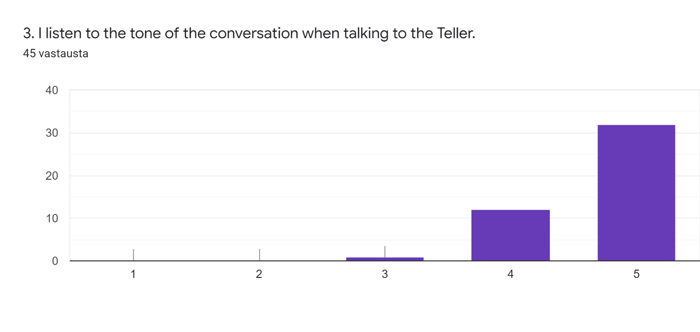
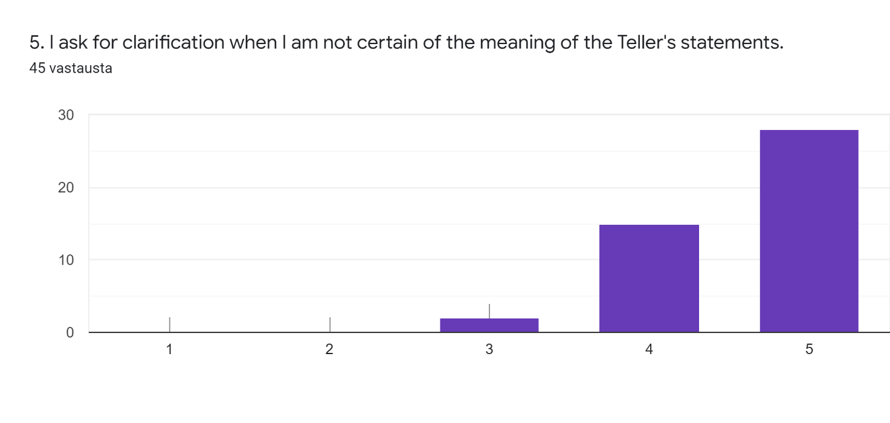
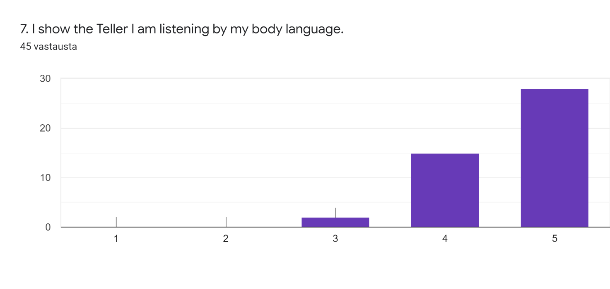
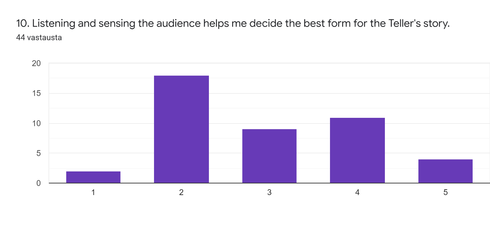
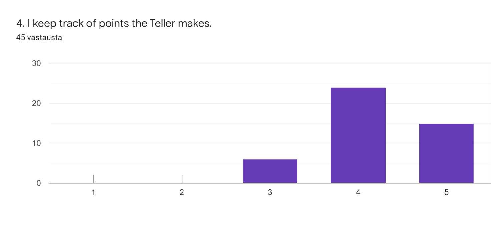
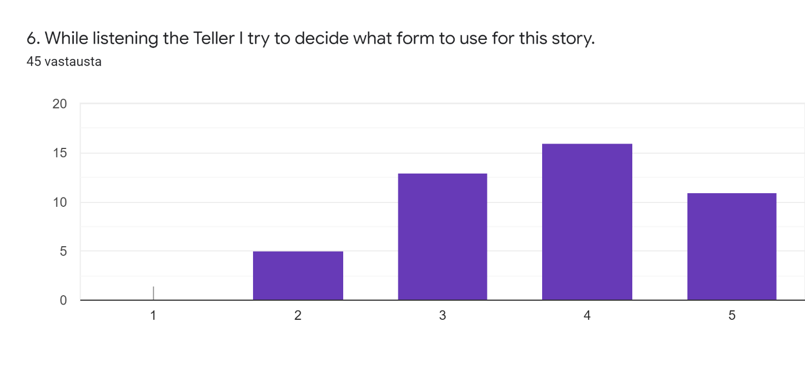
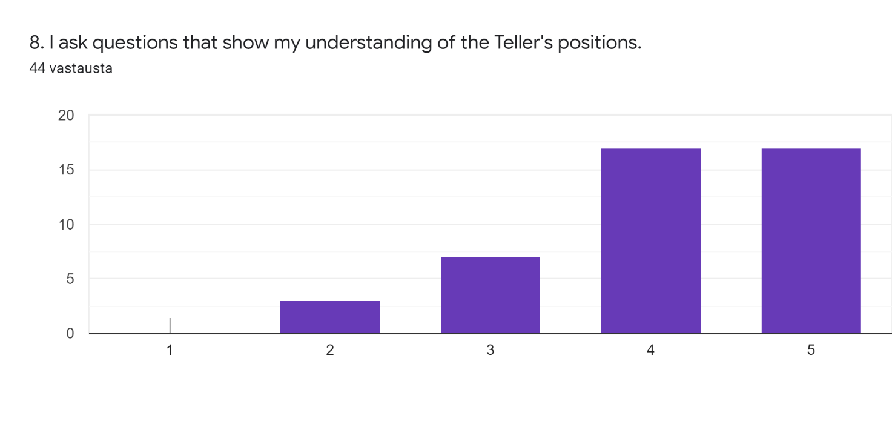
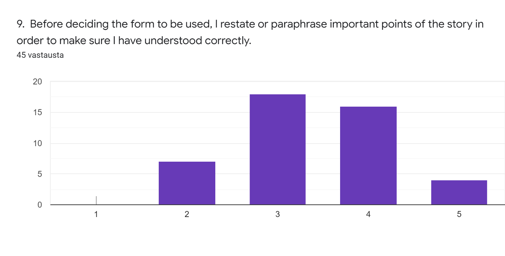

# 一人一故事剧场中的倾听艺术：领航员的视角

萨图-普里蒂宁

TTO 2018-2020

# 简介

在我看来，一人一故事剧场是一种几乎具有无限可能性的艺术形式。它与观众共同创作，以即兴表演为基础，关键是要有一定的结构和套路，使观众在面对眼前的突发事件时有一定的可预见性。演员和领航员在舞台上使用不同的形式来寻找和描绘故事的精髓，也被称为故事的核心。（Pitkänen，PTC-研究，2019 年 3 月；Rahmel，PTC-研究，2019 年 5 月。）它可以被称为一种谦逊的艺术形式，旨在为所有社会成员，尤其是那些被压制或被忽视的人发出声音（Fox, H., 2007 年）。

没有倾听这一关键要素，这一切都不可能实现。倾听可以被视为简单地感知所接收到的声波，但为了理解这些声波，必须对其进行处理，最后领航员和演员通过演绎他们所听到的故事来尽力做出回应。这就要求倾听既要积极主动，又要感同身受。

在这篇论文中，我将从领航员的角度探讨一人一故事剧场中的倾听艺术，并以积极移情倾听（AEL）理论为镜像，该理论包括三个方面：感知、处理和回应（Drollinger, Comer & Warrington, 2006）。

我希望就积极共情的倾听可能强调的不同方面，以及领航员描述他们在演出情境中倾听的方式等问题提供一些答案。

为此，我从积极共情的倾听问卷（Drollinger、Comer 和 Warrington，2006 年）中借鉴了十个 1-5 级的问题，涵盖了上述三个方面。除此之外，还有两（2）个开放式问题，要求用自己的话描述倾听的各个方面，并选择其中最重要的方面。该问卷于 2020 年 5 月在社交媒体平台的一个封闭群组中发布了一（1）周，共收到 45 份回复。

# 1.一人一故事剧场中倾听

Playback Theatre 由乔纳森-福克斯（Jonathan Fox）、乔-萨拉斯（Jo Salas）和他们的公司于 1975 年创立（Rowe, 2007, p.12; Salas, 20.5.2011 TedTalk）。他们的初衷是为社群提供一种新的艺术，并愿意探索未知世界。它已传播到 60 多个国家，并继续在各种背景下建立理解、共鸣、对话和变革。（萨拉斯，2011 年 5 月 20 日，TedTalk）。

简而言之，这一概念由一名听众分享自己生活中的真实故事组成。这个人被称为"讲述者"，讲述时他们坐在舞台一侧（通常是左侧）的一人一故事剧场领航员旁边。舞台上通常有四（4）名演员和至少一（1）名乐师。领航员与讲述者讨论，收集所讲述故事的基本信息。完成后，领航员会为这个故事选择一种形式（结构），然后说"*我们开始吧*"，示意演员和乐师开始表演。演员和乐师共同合作，以艺术的形式将故事演绎出来。(Rowe，2007 年，第 12 页；Salas，2011 年 5 月 20 日，TedTalk；Salas & al.，2013 年）。

重要的是，领航员要倾听讲述者的讲述，保护他们不要讲得太多，换句话说，要牢记这也是一场现场表演。一人一故事剧场旨在为不同群体提供一个安全的倾听空间，尤其是那些可能被压制或被排除在社群公共讨论之外的群体。(拉赫梅尔，PTC-学习，2019 年 9 月和 2020 年 5 月；皮特凯恩，PTC-学习，2019 年 11 月）。每个人都应该有机会发表意见，而不应受到评判或偏见。但这并不意味着可以利用一人一故事剧场表达对某些个人或群体的侮辱、贬低或有害思想。如果出现这种情况，领航员必须停止故事在舞台上的表演。这些为确保每个人都能感到被接纳和包容而建立的道德框架，有时会造成一种错觉，以为一人一故事剧场是政治性的，其实不然（Rahmel，PTC 研究，2020 年 5 月）。

如上所述，倾听是一人一故事剧场的重要组成部分。在一人一故事剧场演出中，同时进行着多层次的倾听。观众在倾听彼此讲述故事，领航员在倾听他们讲述故事，演员和乐师在倾听他们表演故事。乐师可以说是在演奏故事中的情感之流

(萨拉斯，2011 年 5 月 20 日，TedTalk）。倾听必须深入、专注，与讲述者保持一致（Ng & Graydon，2016 年）。

## 1.1 以往研究

一人一故事剧场建立在"倾听的力量"这一概念之上。我猜想，当第一次看到自己的故事在舞台上真挚动情地演绎，仿佛是表演者自己的故事时，类似弗吉尼亚-里德-墨菲的经历是很常见的。她形容自己感受到了一种深刻的联系，感觉到"*我是，因为你是*"这句话栩栩如生。

她认为，一个简单的感同身受的倾听行为就能赋予生命。（墨菲，2019 年 3 月 6 日，TedTalk）。

在近 50 年的发展历程中，一人一故事剧场也曾面临批评和质疑。人们认为它太像治疗，太注重过程，也太艺术化，这取决于批评者的观点。（萨拉斯，2020 年 5 月 20 日，TedTalk。）尽管如此，它仍在不断发展壮大，为世界各地的无数人提供了被倾听的机会，让他们看到自己的故事在舞台上转化为艺术。

关于一人一故事剧场的研究也有很多，一些论文、许多基于项目或案例的研究都已发表在科学文章或书籍中。在此，我只能浅尝辄止，但会尽量介绍其中一些。一人一故事剧场的两位创始人乔纳森-福克斯（Jonathan Fox）和乔-萨拉斯（Jo Salas）撰写和编辑了一些关于一人一故事剧场的书籍。

乔-萨拉斯（Jo Salas）写了几本关于她在一人一故事剧场的经历的书，其中最著名的可能是《*即兴真实人生*--一人一故事剧场中的个人故事》*（1999 年）。在《模拟真实生活》一书中，乔-萨拉斯描述了一人一故事剧场的实践和理念。1999 年，乔纳森-福克斯与海因里希-道伯（Heinrich Dauber）共同编辑了一本名为*"汇聚声音--关于一人一故事剧场的论文集"*的论文集。乔纳森-福克斯最近撰写了《*超越剧场--一人一故事剧场回忆录》*（2015 年），其中他解释了成为一人一故事剧场的愿景背后的事件和想法。他还根据自己以前的文章和全球一人一故事剧场社一些成员的想法，撰写了名为"叙事重构"（*Narrative reticulation）的理论。该理论尚未出版，但可作为工作文件用于教学。（福克斯，2016 年）。

有关一人一故事剧场的研究包括利用一人一故事剧场解决校园欺凌问题（Salas, J., 2005）、探索难民使用一人一故事剧场时的责任感和美感（Dennis, 2008）、加强医学生之间的交流（Salas, R. & al., 2013）等。

Playback Theatre 是一种跨文化对话的方法（Feldhendler，2007 年），PT 中的故事是一种文化生产和倾听伦理（Dennis，2007 年）。它被用作巴勒斯坦被占领土的一种文化抵抗形式（Rivers，2015 年），并在一人一故事剧场中探索移情（Ng & Graydon，2016 年）。

从这些例子中可以看出，大多数有关一人一故事剧场的研究并不关注倾听，而是更关注一人一故事剧场可用于的不同语境。丹尼斯（Dennis，2007 年）最接近于倾听，他将一人一故事剧场视为一种基于社群的艺术形式，延续了人们聚在一起讲故事的悠久传统。他认为，一人一故事剧场是促进道德倾听和反压迫实践的一种方式。我认为倾听是一人一故事剧场不可或缺、不可替代的一部分，因此在研究中仅仅关注倾听并不贴切，也不吸引人。正因为如此，我觉得这很有趣。倾听始终存在，但在反映一人一故事剧场表演时可能被视为理所当然和被忽视，因为作为一名领航员，有许多方面需要考虑，我现在将介绍这些方面。

## 1.2 领航员的多面角色

在一人一故事剧场演出中，领航员必须同时关注多件事情，但在讲述者讲述故事时又要显得非常专注。

这并非易事，需要练习和理解。非常重要的一点是，表演团体和观众要相信领航员能够控制局面，并对任何突发事件保持开放的态度。为了成功做到这一点，领航员必须全身心地投入其中，避免过于自我批评（Rahmel，PTC-研究，2020 年 1 月）。

福克斯（2016 年）的"叙事性复述"（*Narrative reticulation）建立在四个主要类别或方面之上：故事、自发性、氛围和引导。故事包括记忆、秩序和美感。自发性指的是对情境事件的临场感、合作能力和创造力或自我行为。氛围包括在其他人面前作为一个人、对观众的邀请和包容、观众和表演者之间的合一以及萨满教的能量。指导来自仪式、保护讲述者和观众的技能、道德观点知识、确保讲述者的多样性、选择下一位讲述者的方法以及向观众传达控制感。它们彼此之间没有等级关系，而是相互重叠和交织在一起。所有这些都是必要和重要的。

福克斯（Fox，2016 年）在研究不同的一人一故事剧团时发现，与观众建立真正联系的剧团与未能成功建立联系的剧团之间的区别，就在于表演中是否有一条明确的红线。因此，领航员角色的多面性的一个重要因素就是能够成功地将这些不同方面结合起来，并在故事中创造出一种连贯感，而这是无法预测的。

我认为，叙事网状结构为领航员的多面性角色提供了一个思路。在我们学习期间，拉赫梅尔和皮特卡宁还提出了乔-萨拉斯关于一人一故事剧场领航员七个不同方面的观点。这七个方面分别是*仪式大师、艺人、表演者、外交官、治疗师、小丑*和*巫师*。这些方面与上文介绍的叙事网状结构的各个方面有着非常密切的联系。司仪负责维持秩序和气氛；艺人以个人的方式在舞台上展现自己。表演者需要在场；外交官重视所有故事，并寻求增强故事的多样性。治疗师"并不意味着一人一故事剧场就是"治疗"，而是指领航员应始终考虑的职业道德，通常是保护讲述者和观众，避免过于暴露，以及演绎可能造成创伤的故事的方式。小丑能让不同的情绪在表演中流动，并强调幽默的重要性。萨满被视为精神向导。(拉赫梅尔，TTO-研究，2019 年 1 月，摘自萨拉斯，1999 年）。

正如弗吉尼亚-里德-墨菲（Virginia Reed Murphy）（2019）在上文所述，一人一故事剧场领航员的多重角色和不同方面以及之前的研究都建立在倾听的基础上，一种积极的、感同身受的倾听，能够给讲述者带来一种被看到和听到的深刻感受。

# 2.一人一故事剧场中的积极共情的倾听（AEL）

我是最近才发现积极共情的倾听理论的。在我的论文中，我已经决定从领航员的角度来探讨倾听。在不同的模式和理论中，倾听通常被分为三（3）个维度。在 1999 年由 Comer 和 Drollinger 提出的"积极共情的倾听"模型中，这三个维度分别是*感知、*处理*和*回应*。(Drollinger, Comer & Warrington, 2006）。

我将使用 Drollinger、Comer 和 Warrington（2006 年）的文章作为主要资料来源，这篇文章主要关注客户与销售人员之间的互动。这篇文章涵盖了三项独立的研究，试图通过这些研究为 AEL 中使用的量表和问题提供验证。

Drollinger、Comer 和 Warrington（2006 年）希望找到区分销售人员有效倾听和无效倾听的方法。

这绝不是本论文的目标。我只想通过这些方面来探讨 Playback Theatre 中的倾听。我认为，在一人一故事剧场中，无效或肤浅的倾听都是不可取的，倾听必须始终是积极的、移情的。移情需要适应他人的感受，需要专注地倾听（Ng & Graydon，2016）。现在，我将根据 Drollinger、Comer 和 Warrington（2006 年）的解释，结合一人一故事剧场表演的背景，介绍三（3）个维度（此处称为方面）。

## a. 感知

感知是这些方面中的第一个也是最基本的一个方面，顾名思义，它包括听到话语的具体行动。此外，非语言信息和提及但未用语言表达的事物也包括在 AEL 的"感知"中。(Drollinger, Comer & Warrington, 2006）在一人一故事剧场表演中，作为感知的倾听尤其发生在领航员、演员、乐师和讲述者之间。所有表演者都会密切关注讲述者所说的话、肢体语言和台词之间的暗示。在讲述一个较长的故事时，领航员坐在讲述者旁边，通常是讲述者讲述故事时所关注的人。

## b. 加工

处理包括听者的认知操作，大多与感知同时进行。它有四种功能：(1) 理解含义；(2) 解释潜在含义；(3) 评估线索的重要性；(4) 通过更新记忆材料记住信息。(Drollinger, Comer, Warrington, 2006）。

在一人一故事剧场中，领航员（和其他表演者）在倾听故事时要遵循这些步骤。重要的是要理解讲述者的意思，解释和评估所给出的提示，最后不断将信息堆砌到记忆中，以便在演绎故事时使用。这方面还包括在讲述故事时领航员员的提问、陈述和评论。通过这些提问、发言和评论，领航员可以确保理解正确，必要时鼓励讲述者讲述更多的故事，或者在故事似乎变得过于宽泛或冗长时，温和而尊重地引导讲述者结束故事。领航员确保演员和乐师在向讲述者演绎故事时有足够的素材。

## c. 回应

三个方面中的最后一个方面是回应，即听众向讲述者发出信号，表示他们已经听到并理解了讲述者的意思。这些信号可以是口头的，也可以是非口头的。如果被打断提问，倾听者通常会鼓励说话者继续说话。如果不需要澄清，可以简单地点头或提供简短的语言提示。(Drollinger, Comer & Warrington, 2006）。

一人一故事剧场中的回应始于讲述者讲完故事之后。领航员在建立信任、让讲述者感到自己的声音被倾听以及选择故事演绎的形式方面已经承担了很大的责任。在这里，领航员必须考虑表演团体、观众和讲述者的观点。问题的关键不是简单地按照讲述者所讲的故事进行表演，而是以尊重的态度，避免过多的诠释，力求以略加修改的形式提供故事的要点。重要的是，讲述者要认可故事，但最好也能看到他们没有明确讲述的内容。

领航员在实现这一点的过程中起着至关重要的作用，因为有时为故事选择不太理想的形式会限制演员和乐师的潜力。根据我的经验，给初学者水平的演员和乐师过多的自由会导致舞台上的故事冗长而不连贯。因此，领航员必须了解表演团体，并根据他们的技能为他们提供挑战和可能性。领航员能让表演团队大放异彩，取得成功。

如果在演出过程中出现意外情况，重要的是领航员能够公开承认他们在选择故事形式方面的失败。讲述者总是可以对演绎的故事进行评论，并讲述是否有与他们的讲述不一致的地方，或者是否遗漏了重要的内容。如果需要，领航员可以提供重做的机会，这对讲述者和表演团体都很重要。我猜想，当领航员的经验不丰富时，这种情况会更多一些。但我也认为，作为一名一人一故事剧场领航员（或任何表演者），永远不可能准备就绪，承认自己的失误可以建立尊重和信任。

# 3.问题与分析

为了从世界各地的一人一故事剧场领航员那里收集答案，我使用谷歌表格制作了一份简短的调查问卷。问卷包括十（10）个问题，李克特量表从 1 到 5。数值 1 代表从不，数值 5 代表总是。谷歌表单不允许为介于两者之间的数值命名，但它们或多或少代表了 2 很少、3 有时和 4 经常。当然，我不能确定这些就是问卷调查者心中所使用的标签。

我在一个名为"世界各地的一人一故事剧场*"的封闭群组的 Facebook 页面上发布了问卷链接，并附有简短的使用说明（附件 1）。问卷（附件 2）于 2020 年 5 月 24 日发布，截止日期为 2020 年 5 月 31 日。

之所以选择有限的时间，主要是考虑到本论文的篇幅，因为我希望将所有答案都纳入我的分析中，如果数据量较大，就无法做到这一点。

对于我的研究问题，我选择了两（2）个问题。第一个问题是量表问题，第二个问题是开放问题。

问题

1.在一人一故事剧场领航员的回答中，积极共情的倾听的哪些方面得到了强调？
2.领航员自己如何描述他们的倾听以及其中最重要的方面？

在最初的 AEL 问卷中有 21 项陈述。在感觉和处理方面，每个方面都有 8 项陈述，回答方面有 5 项陈述。由于我把这些问题从销售人员和他们的客户的原始背景中抽离出来，我只选择了其中的一些陈述，有些陈述是我修改过的，还有一个陈述是我在原始问题的基础上粗略地自己创造出来的。在我给一人一故事剧场领航员的问卷中，有十（10）个问题，量表为 1-5。其中有三（3）个问题是关于感觉的，三（3）个问题是关于处理的，三（3）个问题是关于反应的，还有一（1）个问题是关于感觉、处理和反应的。

在分析答案时，我首先查看了所使用表格自动提供的图表。在搜索重点时，我关注的是那些回答值为 4 和 5（即经常和总是）最多的问题。在计算这两个数值的答案所占百分比时，我根据最一致的答案进行了排列。在介绍这些结果时，我将从感知、处理和回应这三个方面进行阐述。

# 4.结果

## 4.1 关于一人一故事剧场领航员强调的倾听方面的结果

以下是针对研究问题 1 的结果，这些结果是从带有量表的问题中收集的。结果通过 AEL 中倾听的各个方面呈现。我在此仅介绍部分图表，所有图表可在附件 3 中找到。

###感觉

问卷的前三（3）个问题涉及感知。这三个问题是：意识到暗示但没有说出来的话（问题 1）、感觉到泄密者的感受（问题 2）和倾听与泄密者交谈时的语气（问题 3）。从这些角度出发的感知在答卷人中经常出现。没有人回答价值 1，这表明从来没有，只有"感受出纳员的感受"（Q2）得到了一 (1) 个价值 2 的答案。

问题 3（*我在与出纳员交谈时会倾听谈话的语气）* 在感觉分项和所有 10 个问题的总体比较中，价值 4 和价值 5 所占比例最高（97.8%）。感觉到泄密者的感受（问题 2）有 93.3% 的人回答了 4 分和 5 分，在总体比较中排在第三位。 作为一名一人一故事剧场领航员，意识到泄密者暗示但没有说的话也得到了很高的 4 分和 5 分，共占 84.5%，在总体比较中排在第五位。

在一人一故事剧场表演中，感知似乎经常以这些形式出现。情感倾听（AEL）中的移情倾听、道德倾听以及深度和积极倾听都存在于这些形式中（Drollinger & al.，2006；Dennis，2006；Murphy，2019）。在 Drollinger 等人（2006 年）的研究中，对言语和非言语信息的关注对于有效倾听者来说非常重要。在回答问卷的一人一故事剧场领航员中，这种情况似乎经常发生。

*图 1 Q3 在感知和整体比较方面的最高一致度

这些似乎是合乎逻辑的，因为在与泄密者的讨论中，感受谈话的语气和泄密者的感受是指导领航员的重要因素。在我短暂的一人一故事剧场经验中，一些最成功的故事演绎都发生在讲述者在舞台上发现了一些他们没有用语言表达但仍能识别的东西时。我认为，一人一故事剧场的力量源于这样的时刻，有时发生在讲述者身上，有时发生在观众身上，他们将自己的经历与舞台上呈现的经历进行对比。这是探索未知的时刻（Salas，2011 年 5 月 20 日，TedTalk），是建立共鸣的时刻（Ng & Graydon，2016 年），是创造力和自发性的时刻，是开放、呈现和真实自我的时刻（Fox，2016 年），也是作为讲述者深受感动的时刻（Murphy，2019 年 3 月 6 日，TedTalk）。

###处理

以下三个问题是关于处理的。第 4 个问题是关于记录讲述者的观点，第 5 个问题是在不确定讲述者的意思时请求澄清，第 6 个问题是在倾听讲述者时决定使用的形式。

在回答问卷的一人一故事剧场领航员员中，不确定讲述者陈述的含义时要求澄清（问题 5）的情况非常普遍。95.5%的人给出了 4 或 5 分，在总体比较中位居第二。掌握讲述者的观点（Q4）几乎同样普遍，86.6% 的回答数值为 4 或 5，在总体比较中排名第四。边听泄密者的讲解边决定表格的情况并不常见，只有 60% 的答案数值为 4 或 5，在整体比较中排名第 7。

*图 2 第 5 题 在处理问题上意见最为一致，在总体比较中排名第 2*。

确保正确理解泄密者的陈述不容忽视，因为这很可能导致播放泄密者不认识的内容。因此，一人一故事剧场领航员在这一点上的高度一致是有道理的。在整体比较中，如果比较回答数值 4 或 5 的百分比，这一点共同排在第二位。

对"讲述者"的观点进行跟踪，意味着在选择一种形式并将其交给演员和乐师时，要积极、专注地倾听，并以公正地讲述故事为目标。正如 Drollinger 等人（2006 年）所指出的，"处理"是指理解意义和解释含义，这在"感知"部分非常重要。

在倾听"泄密者"（问题 6）时决定使用哪种形式的普遍性明显下降，这可能是由几个因素造成的。问题 3 得到了 28.9%的回答，问题 2 得到了 11.1%的回答。最明显的答案可能是，深入而积极的倾听通常意味着明确地专注于一件事，在本例中就是倾听讲述者的故事。此外，在决定使用何种形式之前，有必要听完整个故事。必须通过不断更新来记住这个故事

(Drollinger, Comer & Warrington, 2006）。在叙述性复述的故事类别中，福克斯（2016）提到了记忆、顺序和美感，这些都是选择形式的必要条件。答案表明，在讲述者讲述故事的过程中，有时会对形式进行思考，但并不像本文所涉及的听力的其他方面那样频繁。

###应答

回应是问题 7、8 和 9 背后的一个方面。通过肢体语言（问题 7）、提问以表示理解讲述者的立场（问题 8）和重述故事要点以确保正确理解后再选择形式（问题 9）来表现对讲述者的倾听。

通过肢体语言表达自己的倾听在答卷者中非常普遍，95.5% 的答卷者给出了 4 或 5 分，在总分中排名第二。为表示理解而提问的比例仅为 77.2%，数值为 4 和 5，在总体比较中排在第 6 位。在这三个问题中，最不常见的回答形式是在决定形式之前复述或转述故事的重要内容（问题 9），44.5% 的回答者给出了 4 或 5 分，在总体比较中排在第 8 位。

肢体语言（问题 7）在总体比较中位居第二，因为 4 和 5 的比例相加。在重现剧场中，不间断的倾听对于传递被倾听的感觉和寻求理解而不是假设非常重要。用肢体语言表达出领航员在倾听，可以让讲述者继续讲述他们的故事，而且这样做可能会让他们感到安全。通过提问来表示理解的方式也很常用。肢体语言作为一种回应，对应答者来说是最重要的。Drolliinger 等人（2006 年）的研究也指出了肢体语言的重要性。

*图 3 第 7 题 在回答问题上意见最为一致，在整体比较中共同排名第二*。

在决定形式之前重述或转述要点（问题 9），40% 的回答者给出了 3 分。这可能是因为进行一人一故事剧场表演的方式并非只有一种，讲述者也不尽相同，因此这很可能取 决于具体情况，也可能表明讲述者在此之前没有被倾听或理解。也许正因为如此，这种回应讲述者故事的方式并不常用。

作为领航员，在与讲述者讨论的过程中使用好的问题，并相信表演小组的倾听能力，也许可以避免这种需要。我认为，如果讲述者最终讲述了很多不同的主题，或者讲述了一些非常私人和脆弱的事情，就有必要这样做。这属于福克斯（2016 年）的叙事甑皮法的指导范畴，其中包括对讲述者、观众和表演伦理的仪式和保护。这一点在选择形式的回答中体现得淋漓尽致。

第 10 题是我自己的创作，它将感知、处理和回应结合在一起。"*倾听和感知观众帮助我决定讲述者故事的最佳形式"* 这显然是得到 4 和 5 分值最少的问题，只有 34.1%的回答者。该问题排在最后，在答复的整体一致性比较中排在第 9 位。20.5%的回答者给出了第 3 值，40.9%的回答者给出了第 2 值。

*图 4 问题 10 答复者中意见最不一致的人*

现在回想起来，最明显的原因可能是我在问题/陈述中把观众放在了泄密者的前面，似乎倾听观众而不是泄密者的声音有助于选择最佳形式。如下文所述，对许多一人一故事剧场领航员而言，将"讲述者"置于前方和中心位置非常重要。多任务处理、感知和考虑观众也被提及，这一点也很重要，但并没有超越"讲述者"。另一种可能的解释是，这种说法还暗示，只要观众密切关注，他们就会为领航员提供最好的形式。恰恰相反，领航员在做出决定时会考虑到观众和该场演出之前的故事。他们并不总能在短暂的时间内找到最佳的形式，但可以肯定的是，他们都会尽最大努力，为他们所信任的故事尽一份力。

## 4.2 在 PT 领航员的回答中强调的 AEL 的各个方面

上述总体比较显示，听力的三个方面之间有很好的划分，前三个方面都来自不同的方面。然而，如果将听力的三个方面（感觉、处理和反应）的三个问题的百分比结合起来看，感觉在数值 4 或 5 中的平均百分比最高，为 91.86%。其次是处理，4 或 5 分的平均百分比为 80.7%，而回答 4 或 5 分的平均百分比为 72.4%。

这可能是因为如前所述，感知不是一个选项，它必须在一人一故事剧场中进行。处理和回应也是如此，但将它们分成这些小块可能并不公平，而且它们也比"感知"小节下的问题提供了更大的灵活性和多样性空间。

由于这种多样性，我还加入了开放式问题，让回答者有机会用自己的语言描述倾听的不同方面，并选择领航员认为最重要的一个方面。

### 4.2.1 领航员自己对倾听的描述

对开放式问题的分析是以内容分析的形式进行的。我没有将结果照搬到某些类别中，而是根据我在数据中发现的内容为它们创建了自己的类别。首先，我通读了几遍答案。然后，我制作了思维导图，收集答案中使用的不同表达方式。根据这些，我将相似的答案合并在一起，并创建了类别。在对数据进行分类时，我为每个类别使用了不同的颜色，并在属于该类别的词语和表达方式下划了横线。最后，我收集了每个类别的所有不同答案。开放性问题的所有答案见附录 4。

问题 11 要求用自己的语言描述倾听一人一故事剧场表演的不同方面，我收到了 43 份答案。所有答案都有一个流水号以示区分，流水号前的大写字母 R 代表"受访者"。我对这些答案进行了分类，分别是*反思（a）、深入和积极倾听（b）、多任务处理（c）和专注于讲述者（d）*。我根据答案中提供的第一条信息对答案进行分类。只有极少数答案完全符合一个类别，大多数答案至少包含两个类别。在引述答案时，我会标明未归入该类别的部分。

#### a. 反思

在"反思"类别中，有 13 份答案的开头是对领航员工作的反思或评论。有些答案提供了某种指导，如答案（R26、R36 和 R38）。

*"这项工作需要练习，你做得越多，就会做得越好。我希望:)*"（R26）（下划线归类为评论，不列入类别。）
> 

> *"我不仅要倾听故事与讲述者之间的联系，还要倾听故事与之前的故事之间的联系，或者听众希望表达的情感"*（R36）（下划线被归类为多重任务）
> 

> *"Ohjaajan tulee yhtälailla kuunnella kertojaa, **yleisöä ja esiintyjiä。"***（R38）（下划线归类为专注于讲述者，粗体为多任务处理）（译注。领航员应同样倾听讲述者、观众和表演者的声音）
> 

有些回答形式较为简单，如 R41 和 R42，说明了作为一名一人一故事剧场领航员，倾听的重要方面。一位答复者（R43）批评了这些方面的全部用法，指出用心倾听才是他们努力的方向。

*"敏感、开放、觉察"*（R41）
> 

*"对我来说，用一个词来形容就是作为领航员*"（R42）
> 

*"我试着用心倾听--你说的方面是什么意思？"*（R43）（下划线标注为评论，不在类别范围内）
> 

在这些答案中，有来自叙事reticulation（福克斯，2016 年）的 Genuity 指标，也有来自 Playback Theatre 领航员七种角色理论（萨拉斯，1999 年）的 diplomat 指标。外交官指的是理解领航员在为所讲述的故事提供多样性和价值方面的关键作用。从 AEL 理论（Drollinger、Comer 和 Warrington，2006 年）来看，这些答案最接近于处理、处理和寻求理解所收到的信息。我认为这些答案表明了倾听不同方面的责任。尽管一位回答者（R43）明显认为有必要将倾听切成小块。我同意这种做法是人为的，而且可能不会给倾听的重要性带来任何额外的价值。不过，我认为，在重现剧场表演中，停顿一下以反映倾听的复杂性以及影响倾听的所有不同方面，可能会有所裨益。

#### b. 深入和积极倾听

在这一类别中，有 12 个答案的开头被我归类为深度和积极倾听。从这个类别的名称可以看出，它包括了所有三个类别的 AEL（Drollinger、Comer 和 Warrington，2006 年）。许多人都提到了非语言信息，如 R2 的回答。有时甚至更进一步，如在 R10 的答案中，在积极倾听的基础上增加了"倾听"。

*非口头语言与口头语言同等重要，甚至更为重要*（R2）

*Escucha activa, con todo mi ser, con empatía y sin quer agregar nada o refutar nada**, entrando en el mundo y tratando de ver con los ojos del narrador*** (R10)

(积极倾听，用我的全部，用同理心，不想添加任何东西，也不想废除任何东西，进入这个世界，试图用讲述者的眼睛去看这个世界。

*这是一种积极的、强调性的倾听和艺术性倾听的结合*（R34）（下划线部分为思考内容）

*我倾听肢体语言，也倾听没有说出来的话，然后再倾听实际的话......（*R40）

这些术语本来可以在答案中使用，但现在答案中使用这些术语的数量可能受到问卷名称和我的论文的影响。在这些答案中还可以看到叙事网状结构理论（Fox，2016）中的自发性，即完全在场。在领航员的七种角色中（Salas，1999 年），表演者的角色最为接近，因为他们在场并意识到即将开始的表演。

不难看出上述量表问题与本节内容之间的联系。非口头语言的重要性和讲述者提供的暗示。此外，同理心和理解的兴趣也很重要。

#### c. 多重任务

这一类共有 10 个答案。这些答案通常较长。多任务类的答案包括倾听、好奇心和寻求理解等几个方面。有些答案还考虑了听众的观点。在多重任务中，情感体验的所有三个方面（感觉、处理和反应）都有体现。从叙事网状结构理论（福克斯，2016 年）来看，营造气氛与领航员的七种不同角色（萨拉斯，1999 年）最为接近。在不同的方面和展开的事件中，还提到了寻找故事的红线（福克斯，2016）。

*"我们必须倾听感受、故事、故事的红线、观众的热情、全场的安全感、演员和乐师的感受和意识。这确实是一个相当大的难题，因为这一切都发生在一瞬间，你很少有机会在事后思考这些方面。这就是为什么在演出过程中和演出结束后（与演出团队一起）都要检查：我听得对吗？
> 

> *"信息、情感、故事背后的梦想、故事/讲述者对表演整体氛围的影响、将本故事与已讲述的故事连接起来的故事情节、选择形式、必要时复述故事*"（R12）
(下划线部分编码为反映）
> 

> 倾听不同故事之间的对话和相互关系"* (R37)
> 

从本组答案的这些例子中可以看出，他们描述了领航员在演出过程中任务的复杂性。正如 R7 的回答所提到的，在短短的时间内，这是一个相当大的难题。确保气氛，受到故事的影响，甚至故事背后的梦想（R12）。故事之间的相互关系（R37）也可以指领航员的七种角色中的外交官角色，赋予所有故事以价值（Salas，1999），确保所讲述故事的多样性，并引导（Fox，2016）讲述者的多样性。

#### d. 关注讲述者

有 8 个答案以讲述者为中心。这些答案以讲述者为中心，有时只关注讲述者，如答案 R1 和 R2。有时也包括其他类别的要素，如答案 R23 和 R32。让出纳员感到自在，认为自己是促进者，为他们提供空间，感受他们的心情。

*"在讲述故事时，我尽量让讲述者感到舒适和支持*"（R1）
> 

*"倾听是渠道，倾听是促进"*（R3）
> 

*"带着对讲述者的极大尊重，倾听故事的核心是一门特殊的艺术"*（R15）
> 

> *"为讲述者提供一个向观众和我们的一人一故事剧团成员展示其内心世界的空间*"（建议 23）（下划线部分归入多任务处理中）
> 

>*"感受讲述者的心境，深入本质"*（R32）（下划线部分归类为故事的核心）
> 

R15 的答案很紧凑，但包含了两个非常重要的倾听要点，即尊重讲述者和一项需要技巧的挑战，即设法倾听所讲述故事的核心。

在 AEL 的答案中，以讲述者为重点的方面最接近于处理和回应。尤其是收集故事要点的处理。这些描述还涉及到在叙事复述中的指导（福克斯，2016 年），特别是讲述者的保护和仪式的维护，答案中还出现了氛围。确保故事多样性的外交官和保护讲述者的治疗师与领航员的七个角色有关（Salas，1999 年）。找到故事中的精髓、故事的红线以及最终表演的红线的重要性（福克斯，2016 年）。

#### 对这些结果的最后说明

由于许多答案包含了不同类别的部分内容，我创建了一个根据答案开头将其划分为不同类别的系统。这一点并不十分明确，如果答案以评论或旁注开头，我就使用第一个类别，然后是该类别。每个问题只属于一（1）个类别，尽管它也可能包含其他几个类别的一部分。事实证明，在这个问题上，这是一个相当有趣的方法，因为问题是开放式的，有可能以任何内容开头。我认为，这可以说明作为一名一人一故事剧场领航员，他们在倾听过程中最重要或至少最容易记住的因素。

### 4.2.2 倾听的最重要方面

问卷的最后一个问题是第 12 题，要求说出在一人一故事剧场表演中倾听的最重要方面。共有 43 人回答了这一问题。由于问题是关于最重要的方面，这些答案比问题 11 的答案更容易归类。但仍有一些答案包含多个方面，我认为这说明了一人一故事剧场领航员工作的复杂性和多层次性。

我根据这些答案归纳出五（5）个类别。它们分别是*积极倾听和临场感（a）、同理心（b）、开放性和好奇心（c1）、戏剧感（c2）以及真诚和尊重（c3）。其余所有类别各有五（5）个答案，因此我用字母 c 和流水号为它们命名。除此之外，还有一 (1) 个与其说是答案不如说是评论的答案（R43），我决定将其排除在这些类别之外。

问卷中的第 12 个问题是："*您认为在一人一故事剧场演出中倾听最重要的方面是什么*？通过这些答案，我试图回答我的研究问题 2 的最后一部分：领航员们自己如何描述他们的倾听以及倾听中最重要的方面？

#### a. 积极倾听和临场感

这一类共有 14 个答案，所有答案都将倾听或临场作为倾听的最重要方面。关于倾听的答案包括讲述者，如 R16 和 R17，但也包括在场和倾听自己的重要性（R17 和 R21）。在 AEL 中，这一类的答案属于感知和处理（Drollinger, Comer & Warrington, 2006）。

*"一种将安全感传递给讲述者的倾听，也是一种能够将听众带入故事中的倾听"*（R16）
> 

> *"倾听自己和讲述者，这样我就能在真正倾听的同时兼顾听众和团队的需要"*（建议 17）
> 

> 倾听自己。我还有很多话想说，但篇幅有限，而且你只问了一个重要方面。"* （R21）（下划线标注为评论意见）
> 

还有人从平衡的角度来描述倾听，并决定何时发表意见，何时保持沉默（R18）。在提到领导技能时，再次谈到了领航员对讲述者、表演者和观众的责任。

*"积极倾听--表现出你在倾听，并努力在理智与营养之间取得平衡，提出问题并进行引导，换句话说，要表现出主导领导能力"（*R18）
> 

> *"深度倾听，富有同情心的倾听，帮助讲述者清空内心*的倾听"。(R41)
> 

福克斯（Fox，2016 年）提出的叙事复述中的自发性和萨拉斯（Salas，1999 年）提出的表演者在一人一故事剧场领航员中的七种角色中也强调了"在场"的重要性。倾听还需要富有同情心和深度（R41），这就引出了本问题的另一个主要类别--移情。

#### b. 共鸣

乍一看这个问题的答案，就不难发现移情的频率很高。这一类共有 13 个答案，值得注意的是，其中许多答案都很简短，有些只有一个单词，如 R19。同理心是如此重要，似乎不需要任何说明或解释就足以引起共鸣。这在一定程度上也是因为问题要求回答者只说出一个方面。感知"是 AEL 的一个方面（Drollinger, Comer & Warrington, 2006），我会将其与这一类别联系起来。

*"同理心"* (R19)
> 

*"同情和接纳，以及戏剧感。要在这两者之间做出选择真的很难。"* （R6）（"戏剧感"下划线） > *"讲述者感到安全。
> 

*"讲述者在分享时感到安全"*（R23）
> 

*"同情/怜悯、感性、魅力和幽默"* (R28)
> 

保护讲述者和观众需要移情，如在叙事缄默的氛围中（福克斯，2016 年）。建立移情和理解（Salas，2011 年 5 月 20 日，TedTalk）以及移情对讲述者的力量（Murphy，2019 年 3 月 6 日，TedTalk）都支持这一观点，即移情是一人一故事剧场领航员工作的重要组成部分。领航员的七种角色中的治疗师和外交官也支持移情的必要性，保护讲述者不过度分享，同时增强舞台上的多样性（Salas，1999）。

#### c.1 开放性和好奇心

这一类共有 5 个答案。在 AEL 中，对讨论中提供的任何东西的开放性都是关于感知的（Drollinger、Comer & Warrington，2006 年）。福克斯（2016）的《自发性》（Spontaneity）和萨拉斯（1999）的《小丑》（clown）也包含了对表演中发生的不同事件和感受持开放态度的重要性。

> *"一个人必须对周围的所有感受持开放态度：我自己的感受、讲述者的感受、观众的感受、演员的感受。这些感受可以作为倾听的地图。:)"* (R7)
> 

> *"开放"* (R37)
> 

*"对讲述者带来的每一件事都敞开心扉，充满好奇心，永远不要忘记"是谁，如何，何时何地，为什么（但并不总是为什么）"(*R42)
> 

采取不同的视角，表达好奇心，在表演中接受感受（R7 和 R42）。此外，有些答案只有一个词。我认为这一类别与移情和积极倾听密切相关。R42 还提醒我们，也许是因为我才刚刚开始我的一人一故事剧场领航员之旅，所以必须注意结构，而不仅仅是接受所提供的一切。这与叙事网状结构中的故事（福克斯，2016 年）以及下一类答案密切相关。

#### c.2 戏剧感

具有戏剧感是指保持结构和仪式，并牢记故事很快就会被搬上舞台（Fox, 2016）。这一类别也有 5 个答案。要做到这一点，就需要对所讲述的内容进行充分的处理和回应（Drollinger, Comer & Warrington, 2006）。掌握要点并确保一切顺利进行是典礼主持人的职责（Salas, 1999）。

*"*故事的核心"与系统/社会逻辑诗歌的结合"*（R20）
> 

> 转折点。故事的转折点，而这种转折的实质能使讲述者和观众加深理解"*（R27）（下划线标明为共鸣）。
> 

> 重要的是故事的本质。为什么要讲述这个故事？需要表达什么"* (R33)
> 

这些答案反映了上述理论。正如对问题 11 的回答一样，他们强调了找到故事的核心、本质部分的重要性（R20、R33），有些人还提到了转折点（R27）。这几乎就像侦探在工作中的描述，他们时刻牢记即将到来的演出，并努力为演员和乐师找到精髓。

#### c.3 真诚和尊重

问题 12 的最后一类是关于真诚和尊重。这两点在一人一故事剧场表演中都非常需要。这一类共有 5 个答案。感觉（Drollinger, Comer &

Warrington，2006）、Genuity（Fox，2016）和外交官与艺人（Salas，1999）与这一类别相关。感知"是指积极倾听，"创见"是指真实自我，"艺人"是指在舞台上展现自我，"外交家"是指尊重并重视故事的多样性。

*"*真诚"*（建议 3）
> 

*"与讲述者和观众在一起，找到共同的人性。"*（建议 30）
> 

> 不带偏见地倾听，用我所有的感官去倾听，因为不是所有的东西都能用语言表达出来"* (R36)
> 

这些答案反映了所有这些要素。根据不同的感官，R36 的答案再次提出了非语言交流的重要性。在 R3 中，仅仅是真诚，而在 R30 中，以我们的人性为形式的全球互联元素。这与福克斯（2016 年）对氛围的描述密切相关，即在其他人类面前做一个人类。

#### 本题最后说明

这些类别中遗漏的答案是 R43。这位回答者很可能已经表达了用心倾听，并在第 11 题中对倾听的各个方面提出了质疑，但在最后一题的答案中，他明显感到了沮丧。我很感谢这个评论性答案，因为它引发了问题。如果关于倾听的各个方面的问题似乎与这位回答者无关，那又何必费尽心思回答整份问卷，包括开放性问题。量表问题共有 45 个答案，但开放性问题只有 43 个答案，因此有 2 位答卷人没有回答这些问题。也许这位答卷人认为这些文本框是向我提供反馈意见的地方，而不是收集所需主题信息的形式。

> *"倾听就是倾听!!!!没有"方面"！* (R43)
> 

# 5.结论

在总体比较中，很明显，在一人一故事剧场领航员的回答中，感官是他们强调的方面，至少 在这些问题的回答中，他们最认同的形式是感官。在有关感觉的问题中，回答数值 4 或 5 的平均比例为 91.86%。在处理方面，平均比例为 80.7%；在回答方面，平均比例为 72.4%。

在倾听方面，对话的语气最为重要（97.8% 的回答者给出了 4 或 5 分）。尽管有些关于处理和回答的问题没有取得广泛的一致，但有些问题却取得了一致。在处理问题时，在需要时要求澄清与在回答问题时通过肢体语言表达倾听同样得到了广泛的认同，都有 95.5%的人给出了 4 和 5 的答案。

同意率最低的是第 10 个问题，该问题试图将所有三个方面结合起来，即倾听和感知听众有助于决定讲述者故事的最佳形式，只有 34.1%的人同意 4 或 5 项。另一个问题也是关于形式的选择（问题 9），如果在决定形式之前重述重要观点，则只有不到一半（44.5%）的答案是关于 4 和 5 的。

正如我在前面所总结的，我认为这些问题意味着，倾听对话的语气、确保正确理解、使用和阅读肢体语言是一人一故事剧场中至关重要的因素或方面，以至于无论领航员在舞台上是谁，这些都会经常发生。然而，在选择形式或回应故事的方式时，情况却并非如此。我想说的是，在这些方面，领航员的个性更为突出。我的意思并不是说倾听或使用肢体语言可以摆脱领航员的个性，而是说它们在感知方面比以下部分更具普遍性。

处理和回应可能会因国家、文化甚至更具体的演出背景而有所不同，因为所有演出都反映了观众，他们是与观众共同创造的。我认为，在处理和反应过程中，你还可以看到领航员的风格，他们做事的自然节奏。经验也是一个重要因素。经验丰富的一人一故事剧场领航员可能会更相信自己的直觉，在讲述故事时全神贯注，故事讲完后当场决定形式，而不会有任何明显的犹豫或不确定。而初学领航员可能不会这样，因为他们可能会担心无法在故事结束时的短时间内想出一个好的形式，从而认为在讲述者讲述故事时就已经使用了形式。

开放式问题提供了一个用自己的话描述倾听的重要方面并选择其中最重要方面的机会。在答案中，"反思"、"深入倾听"和"多任务处理"都很重要。作为一名领航员，不断反思自己的工作，寻求改进，同时考虑许多不同的事件和过程，这些都得到了体现。只有在全身心投入的情况下，才能专注于讲述者，找到故事的核心。我认为，这些答案展示了一个一人一故事剧场领航员永无止境的道路，需要同时处理多项任务，并保持平衡，不忽略任何一个要素。

用他们自己的话说，倾听的最重要方面通常是深入和积极的倾听以及共鸣。其次是戏剧感、开放性和好奇心、真诚和尊重。作为一种以社群为基础的形式，一人一故事剧场从一开始就在寻求理解（Salas，2011 年 5 月 20 日，TedTalk）、不带偏见地倾听，同时保证观众和讲述者的安全（Fox，2016 年），并以尊重和同理心对待每一个人（Rahmel，PTC-studies，2018 年 9 月）。有趣的是，这些答案来自世界各地，却如此一致。

我将所有答案与 AEL（Drollinger、Comer 和 Warrington，2006 年）、叙事重构（Fox，2016 年）和 PT 领航员的七种角色（Salas，1999 年）进行了对比，并在量表和开放式答案中找到了与这些答案的联系。

# 6.讨论

撰写这篇论文是一个有趣的过程，由于是在特殊的春夏两季完成的，它被推迟了好几次。当我能够更加专注于论文的写作时，论文的篇幅却比我预期的要长。尽管如此，我认为重要的是，我能够使用通过问卷收到的所有答案。现在回想起来，我可能会少用一些答案。对答案的探讨发人深省，我觉得自己学到了很多东西。我非常感谢所有抽出时间回答我问卷的一人一故事剧场领航员。一周内收到 45 份答复，这充分说明了全球一人一故事剧场界的普遍态度，我为自己是一人一故事剧场界的一员而感到荣幸。

我很晚才发现一人一故事剧场。我的半生都在不同的团体中从事业余戏剧表演，也参加过一些即兴表演活动。几经周折，我无意中发现了一个有关一人一故事剧场领航员研究的网页。我立刻被这种形式吸引住了，因为它似乎能将我对戏剧的热爱、身临其境和倾听他人的故事结合起来。第一次亲眼目睹我所珍爱的东西被准确地听到并呈现在舞台上，这同样是一种强烈的体验。

我从小就尽可能地阅读书籍，包括小说和非小说类。我还经常有幸倾听祖父母讲述他们的人生故事。站在别人的角度，通过他们的视角来观察世界，这对我来说是非常重要和宝贵的。

在这种背景下，倾听似乎成了我论文的重点。尽管我是在听了我们培训小组中其他人的选择后才意识到这一点的。他计划侧重于演员的视角，并不介意我侧重于领航员的视角。

芬兰是一个人口较少的国家，其一人一故事剧场社群规模虽小，但十分活跃。由于仅从芬兰的一人一故事剧场领航员那里获得合理数量的答案可能比较困难，我决定用英语撰写我的问卷和论文。这一决定为我提供了一个机会，让我可以通过社交媒体平台了解全球的一人一故事剧场界，并了解他们的不同观点。

从论文一开始，我就一直在纠结一个问题，那就是论文的"中间性"。它不应该是一篇学术论文，也不应该仅仅是思考和反映自己对这一主题的想法。从本作品的结构和标题中可以看出，我无法摆脱熟悉的结构，但我试图加入更多自己的声音，并强调分析、结果和结论。

*局限性

在研究我的结论时，重要的是要记住其明显的局限性。问卷是通过社交媒体平台在一个封闭的 Playback Theatre 小组中分享的，只开放了一周供回答。问卷是用英语撰写的，用词具体而繁多，这可能会限制人们理解问题或回答问题的可能性。让我感到欣喜的是，一些对公开问题的答复是用英语以外的其他语言撰写的。参与者并没有因为英语表达能力有限而不回答，而是用他们觉得最舒服的语言作答。尤其是那些用芬兰语作答的人，他们的回答我一定能听懂。用芬兰语或英语以外的其他语言回答的问题都很简短。因此，现在回想起来，我本可以这样写：用不同的语言回答开放性问题是可能的，也许可以介绍我能够理解的语言，以及当前技术翻译几句话的可能性。

还有一个限制因素是答案的数量，为了得出更复杂的结论，我需要更多的数据。尽管如此，我认为，即使数据多出数倍，试图从一人一故事剧场领航员的角度对听力得出一个强有力的结论也是不明智或不必要的。无论如何，我主要是通过使用李克特量表问题来引导答案，其语句只是在积极共情的倾听的原始问卷基础上稍作修改。此外，据我理解，一人一故事剧场的精髓在于多语种，我认为这既适用于讲述者、演员，也适用于领航员。在一人一故事剧场中，成功的倾听并不只有一种方式，倾听时表达理解、尊重和共鸣的方式也不只有一种。

我希望这篇论文能为一人一故事剧场的领航员、演员和乐师提供的，是领航员在演出中倾听时，探索倾听的多面性和倾听的苛刻但往往有益的平衡的一种方法。

# 参考文献

Dennis, R. (2007).你的故事，我的故事，我们的故事：Playback Theatre, Cultural Production, and an Ethics of Listening.*Storytelling, Self, Society, 3*(3), p. 183. doi:10.1080/15505340701505727

Dennis, R. (2008).Refugee performance：一人一故事剧场中的审美再现与责任。*Research in Drama Education：戏剧教育研究：应用戏剧与表演期刊》：PERFORMANCE AND ASYLUM: EMBODIMENT, ETHICS, 13*(2), pp.

Feldhendler, D. (2007).Playback theatre：A method for intercultural dialogue.*Daniel, Scenario*, (2).

Fox, H. (2007).Playback theatre: Inciting dialogue and building community through personal story.*戏剧评论》*，*51*（4），89-105。

Fox, J., & Dauber, H. (Eds.).(1999).*Gathering voices: essays on playback theatre*.Tusitala.

Fox, J. (2016, unpublished.) Narrative Reticulation：一人一故事剧场的解释性理论》。来源：Rinat Shahaf-BararRinat Shahaf-Barzilay.2018 年地中海聚会上的叙事重构工作坊，工作坊资料

Fox, J. (2015).*超越戏剧：一人一故事剧场回忆录*。Tusitala Publishing.

墨菲，2019 年 3 月 6 日，TedTalk。https://www.youtube.com/watch?v=DJm6zT97FxM Virginia Reed Murphy：一人一故事剧场：和平处方 TedTalk 6.3.2019

Ng, H. C. & Graydon, C. (2016).在一人一故事剧场中寻找共鸣：一项初步研究。*Person-Centered & Experiential Psychotherapies, 15*(2), pp.

Pitkänen, J. 《2018-2020 年一人一故事剧场领航员研究》。

Rahmel, P. Playback Theatre conductor studies in 2018-2020.

Rivers, B. (2015).Narrative power：Rivers, B. (2015).

Rivers, B. (2015).*Research in Drama Education：doi:10.1080/13569783.2015.1022144

Rowe, N. (2007).*Playing the other：一人一故事剧场中的个人叙事戏剧化*。杰西卡-金斯利出版社。

Salas, J. (1999).*Improvising real life：Playback theatre* (3rd ed.).New Paltz (NY): Tusitala Publishing.

Salas, J. (2005).Using Theater to Address Bullying.*Educational Leadership, 63*(1), p. 78.

Salas, 20.5.2011 TedTalk https://www.youtube.com/watch?v=R-UtiROCm6E Jo Salas：每个人都有一个故事 TedTalk 20.5.2011

Salas, R., Steele, K., Lin, A., Loe, C., Gauna, L. & Jafar-Nejad, P. (2013).Playback Theatre as a tool to enhance communication in medical education.*Medical Education Online, 18*(1), .doi:10.3402/meo.v18i0.22622

## 附件

## 附件 1

2020 年 5 月 24 日在全球 Playback Theatre 的 Facebook 页面上发布的问卷描述及其目的。

亲爱的一人一故事剧场领航员

我即将结束在芬兰为期两年的 Playback 戏剧领航员学习，我的导师是该项目组织者和教育者佩维-拉梅尔（Päivi Rahmel）女士和约里-皮特凯宁（Jori Pitkänen）先生。

作为我的毕业论文，我希望从一人一故事剧场领航员的角度探讨演出中倾听的不同方面。

如果您能抽出 5-10 分钟时间回答我的简短问卷，我将不胜感激。所有答案将匿名处理。问卷包括 12 个问题。其中包括根据 Drollinger、Comer 和 Warrington（2006 年）的《积极共情的倾听》问卷修改的语句，以及两个有关倾听的开放性问题。

以下是问卷的链接.https://docs.google.com/forms/d/e/1FAIpQLSdn4x_S1bM1L3ynSHa9-ZDDQSMeEBjbzJpabdGZGz7osv-yiA/viewform?vc=0&c=0&w=1

在本论文中，我只能探究有限的答案，因此**本问卷的有效期仅到 2020 年 5 月 31 日。**在此之前发送的所有答案都将纳入我的论文分析。

如果您想了解更多相关信息，请通过电子邮件 prittinensatu@gmail.com 与我联系。

致以最诚挚的问候、

萨图-普里蒂宁

## 附件 2

**问卷表**

一人一故事剧场中的倾听艺术

用于我的一人一故事剧场领航员研究论文的简短问卷。所有问题都与一人一故事剧场领航员在演出中的视角有关。

1.在演出中，作为一名一人一故事剧场领航员，我知道讲述者暗示了什么但没有说什么。

从不

总是

2.我感觉到讲述者的感受。

从不

总是

3.与出纳员交谈时，我会倾听谈话的语气。

从不

总是

4.我记录出纳员提出的要点。

从不

总是

5.当我不确定泄密者陈述的意思时，我会要求澄清。

从不

总是

6.在听讲述者讲故事时，我尝试决定用什么形式来讲述这个故事。

从不

总是

7.我用肢体语言向讲述者表示我在听。

从不

总是

8.我提出问题，表明我理解泄密者的立场。

从不

总是

9.在决定使用哪种形式之前，我会重述或转述故事的重要内容，以确保我的理解正确无误。

从不

总是

10.倾听和感受听众有助于我决定讲述故事的最佳形式。

从不

总是

11.用您自己的话说，您如何描述在演出情况下作为一人一故事剧场领航员的倾听的不同方面？

您会如何描述在表演情境中作为一人一故事剧场领航员的倾听的不同方面？

Oma vastauksesi

12.您认为在一人一故事剧场演出中倾听最重要的方面是什么？

戏剧表演中倾听最重要的方面是什么？

请选择

选择

## 附录 3

**对问题 1-10.** 的回答

！[img/image7.png](img/image7.png)

## 附件 4

**对问题 11 和 12 的答复***

11.用您自己的话说，您如何描述作为

11. 您如何描述在表演情境中作为一人一故事剧场领航员的倾听的不同方面？

我努力让讲述者在讲述故事时感到舒适和支持。(R1)

非口头语言与口头语言同等重要，甚至更为重要。

倾听是渠道，倾听是促进（R3）

我想借用一句话--不知道是谁说的，也许是乔-萨拉斯（Jo Salas）或汉巴-福克斯（Hanbah Fox）--但我喜欢"全身心倾听"这个概念，注意到自己对所分享内容的身体和情感反应。(R4)

虽然讲述者是我的主要信息来源，但倾听的各个方面都很重要。倾听不仅仅是倾听讲述者的言语，还包括对语调、面部和身体表情以及停顿的感知。需要倾听讲述者所提供的一切。(R5)

许多主题已经在这份调查问卷中出现过。努力倾听故事，努力理解故事对讲述者和广大听众的意义，理解故事的不同层次和故事的核心，同时让讲述者知道他们的故事被倾听和接受。同样重要的是，要引导讲述者讲述故事，倾听他们讲述故事的方式，帮助他们讲述更多的故事或引导他们讲述可以讲述的故事。(R6)

必须倾听感受、故事、故事的红线、观众的热情、全场的安全感、演员和乐师的感受和意识。这确实是一个相当大的难题，因为这一切都发生在一瞬间，你很少有机会在事后思考这些方面。这就是为什么在演出过程中和演出结束后（与观众一起）都要检查：我是否听清楚了？ (R7)

为观众和讲述者创造一个安全、温馨的空间，让他们相信自己的声音会被听到；敞开心扉倾听；提出简明扼要的问题；根据需要表达共鸣；充分倾听；让故事落地；将演员在情感、背景和故事范围方面所需的东西呈现出来/让他们能够获得；一旦形式明确，就立即向演员展示；保持摄入的重点；与讲述者一起呼吸和换气；放松、大方地倾听。(R8)我认为要注意不同层次的倾听。倾听我与故事、我的团队、讲述者、其他听众的关系，以及社会倾听：我们在哪里；国家、城市、社群、邻里、当地最新的一般和/或具体新闻。倾听中的多重性。保持所有不同声音之间的平衡。倾听整个表演。(R9) Escucha activa, con todo mi ser, con empatía y sin querer agregar nada o refutar nada, entrando en el mundo y tratando de ver con los ojos del narrador (R10)

深入理解，好奇倾听，有兴趣了解他人的感受、状态、情况，鼓励他们分享自己觉得舒服的事情，保证讲述者的安全，注意即将开始的表演。(R11)

信息、感受、故事背后的梦想、故事/讲述者对整个表演氛围的影响、将这个故事与已讲述的故事联系起来的故事情节、选择形式、必要时复述故事。(R12)

倾听不仅是倾听讲述者所说的内容，更重要的是倾听没有说出来的内容。我试着去理解这是一个故事，还是另一个故事的隐喻？故事的表面是什么，但故事更深层次的"回声"（乔-萨拉斯）又是什么？在提供标题时，我可能会试着把这些表达出来。

(R13)

除了倾听理解之外，我们还要倾听故事的艺术构造--故事的结构（开头、中间、结尾）及其适合的形式（R14），倾听故事的核心是一门特殊的艺术，要非常尊重讲述者（R15）。

一种是研究分享的社会影响。分享背后的动机。通过肢体和言语感受故事的结尾或开头。看他们在最后一刻添加的内容。倾听故事中的转变。(R16)

作为一名领航员，我试图倾听内心深处的声音，倾听讲述者真正想要讲述的内容。我不是在提问，而是在努力做出陈述，表明我已经听到了。同时，我在倾听的过程中也会反映出听众所听到的内容，这样我就能判断听众什么时候听够了。这也是在身体力行地再次倾听，以便讲述者知道他们听到了。(R17)

多重任务。在同一时间内，以多种方式深入倾听所有事情。这是一种真正深入和积极的倾听（R18）直觉（R19）

我从不同层面倾听：故事的发展、故事的核心、故事的最终转变以及故事中的社会模式或叙事秩序（R20）

我发现很难通过选择一个数字来回答您的许多问题，因为这些问题都很复杂！也许您需要一个更大的文本字段来填写评论:)(R21)

移情倾听、结构倾听，在故事中寻找不同的时刻或平台（场景）（R22）

为讲述者提供一个向观众和我们的一人一故事剧团成员展示其内心世界的空间 (R23)倾听手势、语气和身体的神态。(R24)适应并让自己与讲述者、自己、观众、团队联系在一起，并通过练习在其中一个焦点和整个焦点之间进行切换 (R25) 这项工作需要练习，做得越多就会做得越好。我希望如此。）(R26)

我倾听房间、观众、演员和乐师的声音。讲述者是这一切的一部分。

(有时，我觉得把讲述者的故事更多地带入房间很重要，这样他们会有安全感，这会让我的倾听更全面，而不是个人化。

听众，你必须了解你的听众，"倾听总体情绪"，在开始阶段，通过社会测量法，你有机会"倾听"每个人，以及在开始阶段，当讲述者只提供简短的见解/感受时，当坐在讲述者身边时，最重要的是倾听、感知和保护。用所有感官倾听讲述者、观众和表演者！(R28)

全神贯注地倾听，相信当下和过程，不评判自己（R29） 领航员--连接能量，领航员乐团，防止雷击。(建议 30）倾听自己，倾听感觉和直觉，倾听讲述者，倾听集体认同（建议 31）

感受讲述者的情绪，深入本质（R32）

我倾听讲述者的讲述，同时也知道自己是故事的拥有者，有责任让故事成为现场表演。因此，我也需要从戏剧的角度来考虑，因为观众需要参与到故事中，演员也需要与故事产生联系。因此，从某种意义上说，作为领航员的倾听要求你作为观众、作为演员去倾听，以确保我为讲述者留出了表达他们想要表达的内容的空间（R33）。

这是一种积极的、强调性的倾听与艺术性倾听的结合（R34）

对我来说，领航员应该是一个深入的倾听者，应该是开放的，应该能够倾听房间以及房间内外发生的一切。领航员应该能够倾听讲述者、演员、乐师、灯光、观众和其他一切。领航员应该用所有的感官去倾听，甚至更多。(R35)

我不仅要倾听故事与讲述者之间的联系，还要倾听故事与之前的故事之间的联系，或者倾听观众想要表达的情感。(R36)

倾听不同故事之间的对话和相互关系（第 37 段）

Ohjaajan tulee yhtälailla kuunnella kertojaa, yleisöä ja esiintyjiä。(R38)

1.倾听一个演员可以演绎的故事。2.倾听角色、形象、情感和叙事。3.倾听故事与表演的契合点。4.注意语调、音量和说话方式。5.倾听没有说出来的话。(R39)

我听肢体语言，也听没说的话，然后再听实际的话......（R40）

敏感、开放、觉察。(R41)对我来说，用一个词来形容就是作为领航员在场（R42）

我试着用心倾听--你说的"方面"是什么意思？(R43)

12.您认为在 Playback Theatre 演出中倾听最重要的方面是什么？

43 vastausta

我试着放慢自己的思维，以便更好地理解故事。我想知道讲述者为什么要在此时此刻讲述这个故事。我在倾听时运用我的好奇心和热情（R1） 试图从讲述者那里获得故事语言，而不仅仅是感觉。(R2)

真诚。(R3)

临场感和真实的好奇心 (R4)

与讲述者完全在一起。避免评判，无论是对故事还是我自己的倾听。

倾听更深层次的、未言明的感受。关注讲述者的需求。(R5)

移情和接纳，以及戏剧感。要在这两者之间做出选择真的很难。(R6)

必须对周围的所有感受持开放态度：我自己的感受、讲述者的感受、观众的感受、演员的感受。这些感受可以作为倾听的地图：)(R7)

与人们建立真实的联系，让他们体验到自己是重要的，他们的故事是重要的，他们的倾听是重要的。(R8)放松、觉察、练习、对表演形式和弧线的了解、保持信任和安全空间。不带偏见，强调并用心倾听。(R9)

同情 (R10)

清楚地理解并意识到讲述者的需求和故事的核心。(建议 11）积极倾听，注意自己的感受，随性而为，避免自作聪明，尊重讲述者的底线，富有幽默感。

见证并给讲述者留出脆弱和沟通的空间。(R13)

同理心和有助于形成故事的问题（R14）倾听在表演环境中无法用语言表达的感受（R15）

倾听，将安全感传递给讲述者，同时倾听也能将观众带入故事之中（R16）

关注自己和讲述者，这样我就能真正听到他们的声音，同时兼顾听众和团队的需要。(R17)

积极倾听--表现出你在倾听，并努力在提出问题和领导之间保持平衡，换句话说，就是要表现出主导领导技能（R18）

换位思考（建议 19）

将"故事的核心"与系统/社会逻辑相结合（R20）

倾听自己。我可以说的还有很多，但篇幅有限，而且你只问了一个重要方面......（R21）

感受讲述者，同时保持头脑清醒（R22）

倾诉者有分享的安全感（R23）

倾听人们在节目中谈论的话题。(R24)

如何为我们提供广告指导？

让讲述者感到轻松，从而愿意分享。提出"正确"的问题，这样才能挖掘出故事中有时隐藏的意义。(R26)

转折点。故事发生变化的地方，这种变化的本质可以让讲述者和观众加深理解（建议 27）

同理心/同情心、感性、魅力和幽默（R28）

带入此时此地......并注意新出现的线索（建议 29）与讲述者和观众在一起，找到共同的人性。(R30)要身临其境，不要试图用头脑去理解一切(R31)

移情（R32）

重要的是故事的本质。为什么要讲述这个故事？需要表达什么？(R33)

共鸣 (R34)

对我来说，没有一个重要的方面，领航员就是要深入倾听，同时注意到其他一切。领航员需要同时掌握多种技能，倾听就是其中之一。但是，如果让我选择，我会选择"开放"。(R35)

不带偏见地倾听，用我所有的感官去倾听，因为不是所有的东西都能用语言表达出来（R36）

开放 (R37)

Kysy, älä Oleta (R38)

富有同情心的好奇心(R39)

努力倾听故事的本质，而不是事实 (R40)

深层倾听、富有同情心的倾听、帮助讲述者掏空内心的倾听。(R41) 对讲述者带来的每一件事都敞开心扉，充满好奇心，永远不要忘记"是谁，如何，何时何地，为什么（但并不总是为什么）"(R42)

倾听!!!!没有"方面"！(R43)